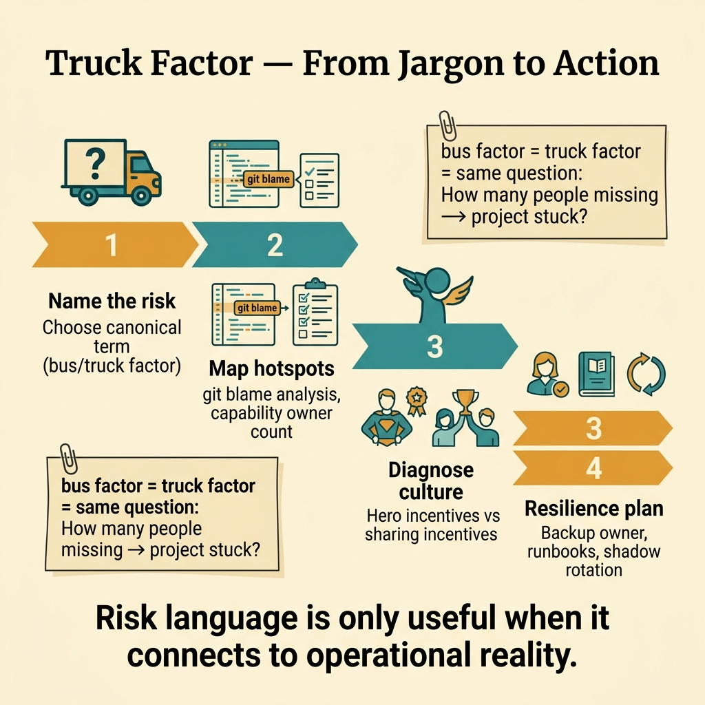
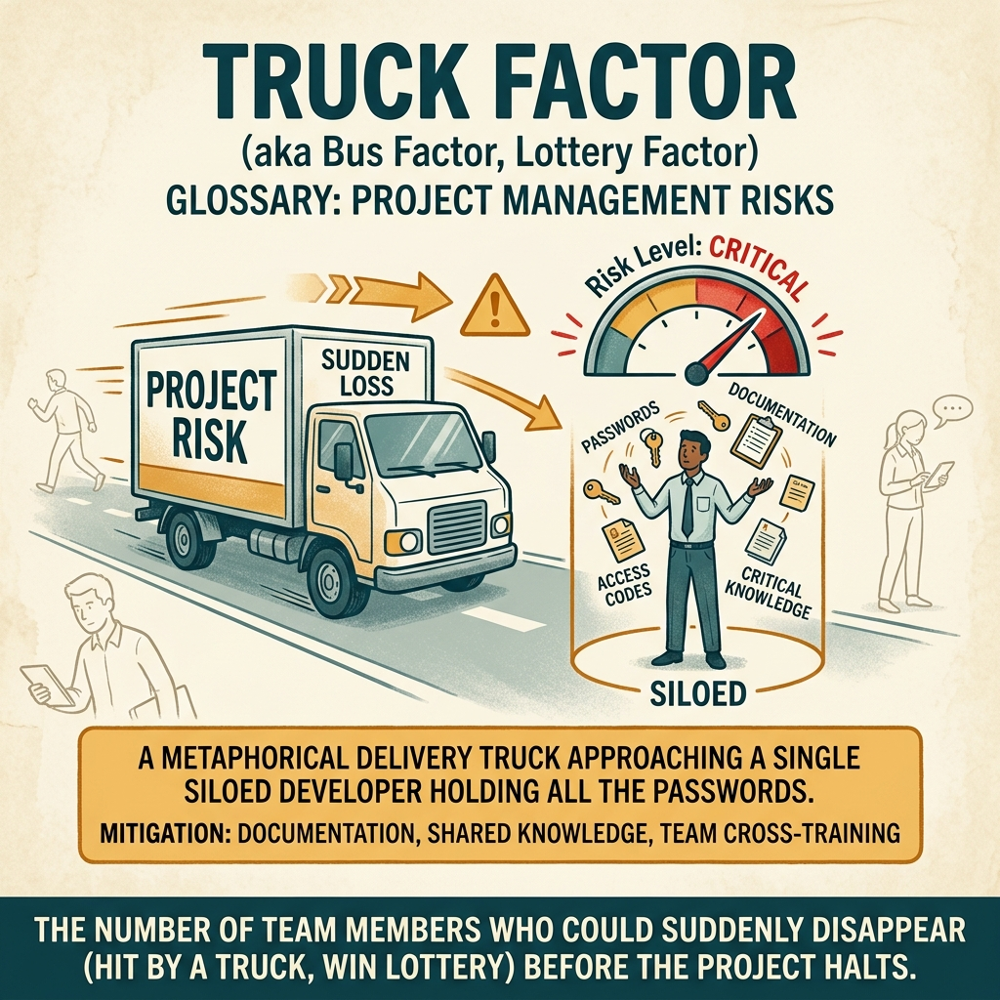

<!-- tags: glossary, reference, developer-cognition-team-dynamics, team-collaboration-dynamics, truck-factor -->
# Truck Factor

> A near-synonym for bus factor, used to measure the dangerous degree of dependency on a small group of individuals.

| Aspect | Detail |
| --- | --- |
| **Concept** | A near-synonym for bus factor, used to measure the dangerous degree of dependency on a small group of individuals. |
| **Audience** | Tech lead, EM |
| **Primary style** | Glossary term |
| **Entry point** | Use when you need to discuss knowledge concentration but the team is more comfortable with "truck factor" than "bus factor." |

📅 Created: 2026-03-30 · 🔄 Updated: 2026-04-04 · ⏱️ 8 min read

---

## 1. DEFINE

Truck factor is typically used interchangeably with bus factor. The essence is the same question: if a very small group of people disappeared from the daily flow, would the system continue to operate and evolve with quality?

**Truck Factor** is a near-synonym for bus factor, used to measure the dangerous degree of dependency on a small group of individuals.

| Variant | Description |
| --- | --- |
| Synonym usage | Simply an alternative name for bus factor in many contexts. |
| Knowledge risk lens | Emphasizes the risk of knowledge and authority concentration. |
| Continuity indicator | Used to discuss the ability to continue operating when key people are lost. |

| Approach | Time | Space | When to choose |
| --- | --- | --- | --- |
| Use consistently with one chosen term | O(n docs/reviews) | O(1) | When the team is mixing bus factor and truck factor, causing ambiguity. |
| Map concentration hotspots | O(n systems) | O(notes) | When you want to apply this term to practice instead of just theory. |
| Pair it with mitigation patterns | O(n improvement plans) | O(plan docs) | When you want the term to lead to action, not just measurement. |

Core insight:

> The value of truck factor is not in its name, but in forcing the team to face a type of risk that is often normalized: too many things depending on too few people.

### 1.1 Invariants & Failure Modes

The invariant when using this term is that the whole team must understand it refers to concentration risk, not a productivity metric. If the term is used vaguely, discussion about mitigation will dilute very quickly.

---

## 2. CONTEXT

**Who uses it**: Tech lead, EM

**When**: Use when you need to discuss knowledge concentration but the team is more comfortable with "truck factor" than "bus factor."

**Purpose**: The value of truck factor is not in its name, but in forcing the team to face a type of risk that is often normalized: too many things depending on too few people.

**In the ecosystem**:
- Truck factor and bus factor are nearly synonymous in most technical discussions.
- What matters is consistency of vocabulary within the same team or repo.
- This is risk vocabulary, not a label for judging people.

---

Similar to bus factor but sanitized is clear. But how do you measure truck factor, analyze git data, and build an action plan?

## 3. EXAMPLES

Truck factor surfaces most visibly when git blame shows 80% of commits from one dev, when code review only has two people with context, or when a key person resigns and the team scrambles for two weeks. The examples below place the pattern into exactly those situations.

### Example 1: Basic — Team is mixing bus factor and truck factor

Some people say bus factor, others say truck factor, and newcomers are unsure whether they differ. At the basic level, the first step is unifying vocabulary so discussion has less noise.

Input is a team with mixed vocabulary. Output is a canonical term choice in docs and review templates. Complexity is low since this is mainly about clarity.

```go
type RiskVocabulary struct {
	PreferredTerm string
	Meaning       string
}
```

**Why?** When the same risk vocabulary is used inconsistently, the team spends attention on semantics instead of real mitigation. Canonical naming helps discussion go straight to the problem.

**Takeaway**: You reduce discussion noise with a clear canonical term.
**Caveat**: Do not spend too much time debating bus vs truck; what matters is consistency.
**Use when**: Documentation and review comments are mixing two terms, confusing newcomers.

### Example 2: Intermediate — Measure risk instead of just mentioning the term

Saying "truck factor is low" sounds right, but without mapping capabilities and owners the term just drifts. At the intermediate level, this term must be tied to specific hotspots.

Input is a system or team with suspected concentration risk. Output is a risk map with actionable next steps. Complexity is moderate since it moves from jargon to practice.



*Figure: Risk language is only useful when it connects to operational reality.*

```go
type ConcentrationHotspot struct {
	Area   string
	Owners int
}
```

**Why?** Risk language is only useful when it connects to operational reality. Otherwise, truck factor is just a professional-sounding word that changes no behavior.

**Takeaway**: You turn the term from a descriptive label into a starting point for real mitigation.
**Caveat**: Counting owners is not enough without considering quality and depth of ownership.
**Use when**: The team has risk intuition but does not know where to start reducing it.

### Example 3: Advanced — Truck factor is low because culture does not encourage sharing

In some places, knowledge is not shared not because anyone is selfish, but because the reward system favors individual speed over redundancy. At the advanced level, this term needs to be connected to culture and incentives.

Input is repeating risk concentration. Output is a hypothesis about the cultural driver behind it. Complexity is high since it touches how the team works.

```go
type CulturalDriver struct {
	HeroIncentive    bool
	SharingIncentive bool
}
```

**Why?** Low truck factor is usually a consequence, not a root cause. If culture rewards "one person doing it really fast" more than "many people understanding together," concentration will always return.

**Takeaway**: You read truck factor as a symptom of culture, not just of documentation or review.
**Caveat**: Not every hotspot is an incentive failure; sometimes it is due to a new domain or rare specialist skills.
**Use when**: Technical mitigation has been done but concentration risk keeps recurring.

### Example 4: Expert — Use truck factor as a trigger for resilience planning

At the expert level, truck factor is not just a discussion tool but a trigger for succession, backup operators, runbooks, and ownership evolution. It becomes part of resilience planning.

Input is a system or capability with clear continuity risk. Output is a plan to reduce risk across short and long horizons. Complexity is high since it involves people planning.

```go
type ResiliencePlan struct {
	BackupOwner    bool
	RunbookReady   bool
	ShadowRotation bool
}
```

**Why?** Continuity risk is not solved by "everyone should share more." It needs a concrete plan: who backs up, which documentation is missing, which rotations must be created.

**Takeaway**: You use truck factor as a switch to activate resilience work before a personnel incident actually happens.
**Caveat**: Over-rotating everything at once can exhaust the team; prioritize by criticality.
**Use when**: The organization wants to turn concentration risk into a formal part of planning.

---

## 4. COMPARE




*Figure: Position of truck factor among bus factor, git analytics, and knowledge distribution.*

Truck factor sounds like bus factor. Same concept: bus factor = original term (Extreme Programming), truck factor = sanitized version. Both measure knowledge concentration risk. Tools like git-truck can analyze from commit history.

### Level 1

```text
few people hold critical knowledge
  -> continuity risk rises
```

*Figure: Level 1 shows truck factor is a lens for viewing continuity risk from concentration.*

### Level 2

```text
same reality
  bus factor
  truck factor

important question
  how many people can safely continue the work?
```

*Figure: Level 2 emphasizes the real issue is the risk model, not which metaphorical name was chosen.*

### Easy to confuse or cross the boundary

| # | Severity | Mistake | Consequence | Fix |
| --- | --- | --- | --- | --- |
| 1 | 🔴 Fatal | Using the term vaguely and inconsistently | Discussion drifts away from real mitigation | Choose a canonical term in the team. |
| 2 | 🟡 Common | Only talking about risk without mapping hotspots | No concrete action | Tie the term to a capability map. |
| 3 | 🟡 Common | Viewing truck factor as purely a docs problem | Missing culture and authority | Audit incentives and decision paths too. |
| 4 | 🔵 Minor | Not connecting this risk to resilience planning | Team knows the risk but does not prepare | Create backup, runbook, and shadow plans. |

### Quick scan

| If you encounter | What to do |
| --- | --- |
| Team uses both bus and truck factor | Choose one canonical term. |
| Only a feeling of person-dependency | Map hotspots. |
| Risk recurs despite writing docs | Examine culture and incentives. |
| Capability is too critical | Connect risk to a resilience plan. |

---

## 5. REF

| Resource | Type | Link | Notes |
| --- | --- | --- | --- |
| Bus factor | Reference | https://en.wikipedia.org/wiki/Bus_factor | Most directly related synonym. |
| Bus Factor | Related term | ./03-bus-factor.md | Canonical article to read side-by-side if the team uses both terms. |
| Collective Code Ownership | Related term | ./08-collective-code-ownership.md | Important mitigation pattern. |

---

## 6. RECOMMEND

Truck factor solves the problem of "measuring knowledge concentration risk with data." The next question: how does rubber duck debugging work, and what about blameless post-mortems?

| Expand to | When | Why | File/Link |
| --- | --- | --- | --- |
| Bus Factor | When you need the fuller canonical term | Two near-synonyms; the other article goes deeper. | [Bus Factor](./03-bus-factor.md) |
| Collective Code Ownership | When you want to reduce concentration risk | This is one mechanism for lowering the factor. | [Collective Code Ownership](./08-collective-code-ownership.md) |
| Team & Collaboration Dynamics | When you need to return to the hub | Keep context of the full topic. | [Team & Collaboration Dynamics](./README.md) |

Back to that git blame showing 80% from one dev from the beginning — high risk. Now you know: analyze commit distribution, review coverage, knowledge overlap. Action: rotate ownership, pair on critical code, document tribal knowledge. Data → insight → action.

**Links**: [← Previous](./03-bus-factor.md) · [→ Next](./05-rubber-duck-debugging.md)
