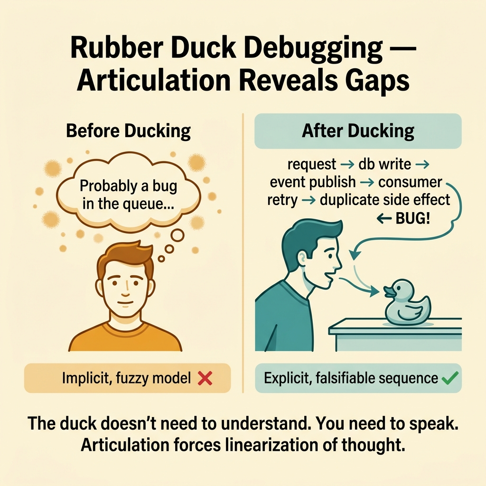
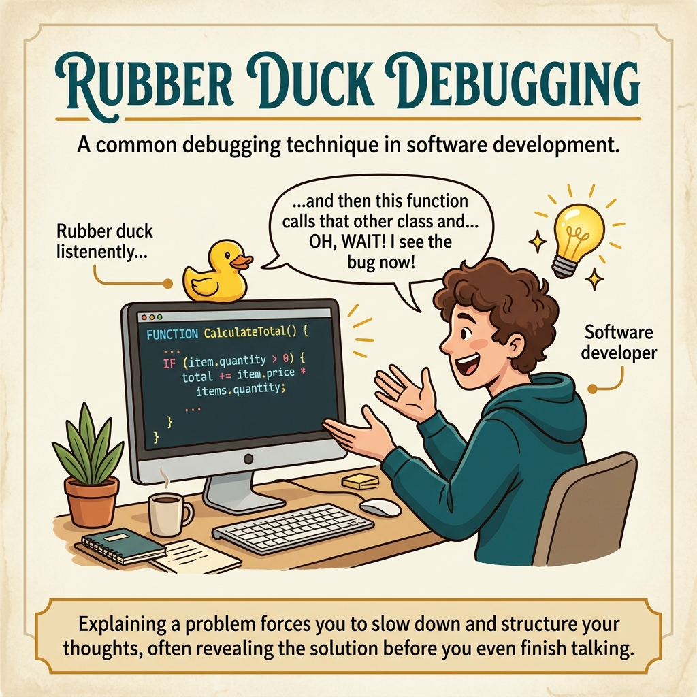

<!-- tags: glossary, reference, developer-cognition-team-dynamics, team-collaboration-dynamics, rubber-duck-debugging -->
# Rubber Duck Debugging

> A technique of explaining a problem step by step to another object to expose wrong assumptions or gaps in reasoning.

| Aspect | Detail |
| --- | --- |
| **Concept** | A technique of explaining a problem step by step to another object to expose wrong assumptions or gaps in reasoning. |
| **Audience** | Developer, reviewer |
| **Primary style** | Glossary term |
| **Entry point** | Use when you have been "staring too long" at a bug and need a mechanism to force yourself to articulate each assumption. |

📅 Created: 2026-03-30 · 🔄 Updated: 2026-04-04 · ⏱️ 8 min read

---

## 1. DEFINE

Picture being certain the bug is in the queue consumer, but when you start explaining the flow to a rubber duck, to a teammate, or simply out loud to yourself, you realize the very first assumption was wrong. Rubber duck debugging is not magical; it simply forces vague thinking to become a sequence of logic that can be heard.

**Rubber Duck Debugging** is a technique of explaining a problem step by step to another object to expose wrong assumptions or gaps in reasoning.

| Variant | Description |
| --- | --- |
| Solo ducking | Speaking out loud or writing out each step by yourself. |
| Peer-assisted ducking | Using a passive listener to force clarity. |
| Written ducking | Writing the debug path as a note or comment before changing code. |

| Approach | Time | Space | When to choose |
| --- | --- | --- | --- |
| Narrate the current mental model | O(n steps) | O(1) | When you suspect you are stuck on a vague assumption. |
| Force explicit step-by-step reasoning | O(n traces) | O(notes) | When the bug has many branches and side effects. |
| Use ducking before escalation | O(1) | O(1) | When you want to reduce the number of times you pull others in too early. |

Core insight:

> Many bugs are not solved by "someone smarter," but by forcing yourself to speak the reasoning chain completely. Ducking works because it turns thought fragments into a narrative that can be checked.

### 1.1 Invariants & Failure Modes

The invariant is that you must be able to tell the bug's path in language specific enough to verify. If you can only say "I think something is wrong here" without being able to articulate each step, the mental model is not yet solid enough to fix.

---

## 2. CONTEXT

**Who uses it**: Developer, reviewer

**When**: Use when you have been "staring too long" at a bug and need a mechanism to force yourself to articulate each assumption.

**Purpose**: Many bugs are not solved by "someone smarter," but by forcing yourself to speak the reasoning chain completely. Ducking works because it turns thought fragments into a narrative that can be checked.

**In the ecosystem**:
- This is not a technique that replaces logs, tests, or traces; it supplements them.
- Ducking is most useful when you have the feeling "I understand the bug already" but keep fixing the wrong spot.
- It is a cognition support technique more than a tooling technique.

---

Explaining to a rubber duck is clear. But why does explaining help debug, when should you use it, and what are the alternatives?

## 3. EXAMPLES

Rubber duck debugging surfaces most visibly when a dev is stuck on a bug for three hours then explains it to a colleague and finds the answer, when writing a Stack Overflow question leads to self-answering, or when a pair programming partner only needs to listen. The examples below place the pattern into exactly those situations.

### Example 1: Basic — You think you understand the bug but cannot tell it step by step

A "clear" bug in your head becomes vague the moment you have to say it as a complete sentence. At the basic level, ducking starts by retelling the path of the request.

Input is a vague hypothesis. Output is a debug narrative in verifiable step-by-step form. Complexity is low since it is mainly about externalizing thought.

```go
type DebugNarrative struct {
	Step        string
	Expectation string
}
```

**Why?** Thoughts in your head can skip gaps very easily. When forced to speak each step, the "jumps" are immediately exposed.

**Takeaway**: You turn the feeling of "I already know" into a hypothesis with sequence.
**Caveat**: Ducking does not replace collecting evidence; after the narrative you still need to verify with logs and tests.
**Use when**: You keep repeating the same fix idea but the bug still is not resolved.

### Example 2: Intermediate — Use ducking to choose the right observation point

A flow has many stages and side effects. Without ducking, you tend to place logs at the most convenient spot instead of the most critical branching point. At the intermediate level, ducking helps choose the right measurement point.

Input is a multi-step bug path. Output is prioritized checkpoints for instrumentation or testing. Complexity is moderate since it ties cognition with observability.



*Figure: The duck does not need to understand. You need to speak. Articulation forces linearization of thought.*

```go
type ObservationPoint struct {
	Step              string
	WhyThisStepMatters string
}
```

**Why?** Ducking is not just for "thinking more clearly"; it also helps identify where, if wrong, it would overturn the entire hypothesis. As a result, evidence collection becomes less costly.

**Takeaway**: You use narrative to place the right measurement points, not just to sound clearer.
**Caveat**: If the flow already has good tracing, ducking is still useful but does not need to replace trace analysis.
**Use when**: You have too many possible spots to log or test and do not know which one best distinguishes between hypotheses.

### Example 3: Advanced — Peer ducking to expose implicit assumptions

A teammate does not need to know the entire domain to help you; they just need to listen and ask "why are you sure this step happens?" At the advanced level, peer ducking borrows another pair of ears to illuminate spots you are implicitly skipping.

Input is bug reasoning that has become complex or circular. Output is an assumption audit through another listener. Complexity is high since it requires light collaboration skill.

```go
type AssumptionCheck struct {
	Statement       string
	EvidencePresent bool
}
```

**Why?** An outside listener is not locked into your old narrative, so they easily question exactly the spots you consider "too obvious." This is especially powerful with bugs where the author is too attached to one hypothesis.

**Takeaway**: You turn debugging from a deadlocked monologue into a mini review of the mental model.
**Caveat**: Peer ducking should not become pulling someone in without having prepared a basic narrative first.
**Use when**: You have been looping many times on one hypothesis and need external friction to expose implicit assumptions.

### Example 4: Expert — Ducking as a debug hygiene habit for the team

A team can save enormous time if everyone is in the habit of externalizing bug paths before opening an incident war-room. At the expert level, ducking can become a lightweight step in the team's debugging culture.

Input is a team wanting to reduce vague escalations. Output is the habit of "narrate before escalate." Complexity is high since it is an organizational norm.

```go
type EscalationPrep struct {
	NarrativeReady    bool
	PrimaryHypothesis string
}
```

**Why?** Escalation without a clear narrative makes the entire group spend time reconstructing context from scratch. Ducking beforehand helps the escalated person receive a sharper problem statement, reducing cognitive tax for the whole team.

**Takeaway**: You elevate ducking from a personal trick into hygiene that helps the whole team debug more effectively.
**Caveat**: Do not bureaucratize this step to the point where urgent incidents still require filling in a long form.
**Use when**: The team frequently escalates bugs with very vague descriptions, wasting time on re-syncing.

---

## 4. COMPARE




*Figure: Position of rubber duck debugging among pair programming, code review, and problem solving.*

Rubber duck sounds like pair programming. Different: pair programming = two devs collaborate, rubber duck = one dev explains to an inanimate object. The point of the duck = forcing articulation, not getting feedback. Articulation often reveals assumption gaps.

### Level 1

```text
implicit thought
  -> verbalized sequence
  -> hidden gap appears
```

*Figure: Level 1 shows ducking is powerful at turning implicit thoughts into a verifiable sequence.*

### Level 2

```text
before ducking
  "probably a bug in the queue"

after ducking
  request -> db write -> event publish -> consumer retry -> duplicate side effect
```

*Figure: Level 2 emphasizes this technique makes the bug path sequential and falsifiable.*

### Easy to confuse or cross the boundary

| # | Severity | Mistake | Consequence | Fix |
| --- | --- | --- | --- | --- |
| 1 | 🔴 Fatal | Thinking ducking replaces evidence | Fix still based on guessing | After narrative, verify with data. |
| 2 | 🟡 Common | Speaking too generally without going step by step | Reasoning gaps remain hidden | Force telling in a specific sequence. |
| 3 | 🟡 Common | Pulling someone in too early | Wasting team bandwidth | Self-duck first, peer-duck second. |
| 4 | 🔵 Minor | Turning ducking into a heavy ritual | Team avoids the step entirely | Keep it light and focused. |

### Quick scan

| If you encounter | What to do |
| --- | --- |
| "Know where the bug is" but fix keeps being wrong | Write or speak a step-by-step narrative. |
| Too many possible spots to add logs | Duck to choose observation points. |
| Hypothesis keeps looping | Ask a peer to duck and audit assumptions. |
| Escalations are often vague | Add a narrate-before-escalate step. |

---

## 5. REF

| Resource | Type | Link | Notes |
| --- | --- | --- | --- |
| Rubber duck debugging | Reference | https://en.wikipedia.org/wiki/Rubber_duck_debugging | Basic concept explanation. |
| Cognitive Load | Related term | ../cognitive-mental-model/01-cognitive-load.md | Ducking helps lower load when reasoning about a bug. |
| Mental Model | Related term | ../cognitive-mental-model/02-mental-model.md | This technique is very powerful at exposing incorrect models. |

---

## 6. RECOMMEND

Rubber duck debugging solves the problem of "stuck on a bug because assumptions are not visible." The next question: how do blameless post-mortems work, and what about psychological safety?

| Expand to | When | Why | File/Link |
| --- | --- | --- | --- |
| Mental Model | When the bug comes from a wrong model of the system | Ducking often exposes exactly this layer of error. | [Mental Model](../cognitive-mental-model/02-mental-model.md) |
| Psychological Safety | When you want peer ducking to be more effective | A safe enough environment is needed to say "I am not sure" or "I guessed wrong." | [Psychological Safety](./07-psychological-safety.md) |
| Team & Collaboration Dynamics | When you need to return to the hub | Keep context of the full topic. | [Team & Collaboration Dynamics](./README.md) |

Back to that three-hour stuck session from the beginning — explained it, saw it immediately. Now you know: explanation forces linearization of thought. The brain holds a fuzzy model; articulation exposes gaps. The duck does not need to understand; you need to speak. Simple, surprisingly effective.

**Links**: [← Previous](./04-truck-factor.md) · [→ Next](./06-blameless-post-mortem.md)
