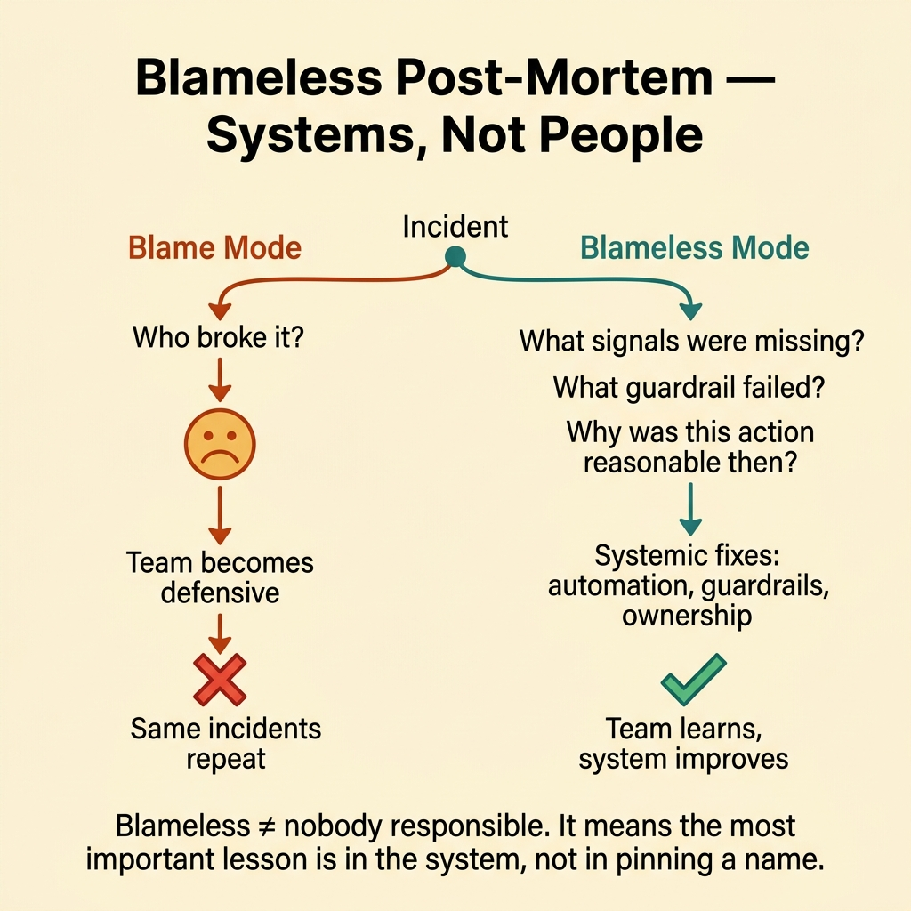
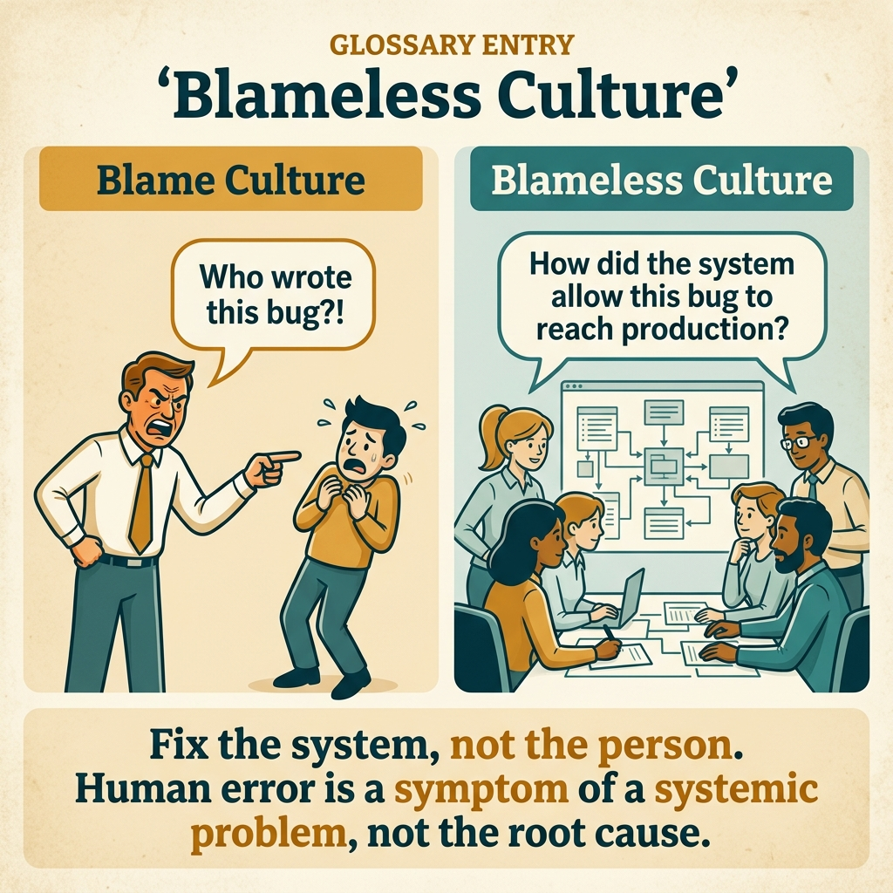

<!-- tags: glossary, reference, developer-cognition-team-dynamics, team-collaboration-dynamics, blameless-post-mortem -->
# Blameless Post-Mortem

> A method of analyzing incidents that focuses on systems, processes, and decision paths instead of blaming individuals.

| Aspect | Detail |
| --- | --- |
| **Concept** | A method of analyzing incidents that focuses on systems, processes, and decision paths instead of blaming individuals. |
| **Audience** | Incident commander, tech lead, EM |
| **Primary style** | Glossary term |
| **Entry point** | Use when the team wants to learn from an incident without pushing everyone into defensive mode. |

📅 Created: 2026-03-30 · 🔄 Updated: 2026-04-04 · ⏱️ 9 min read

---

## 1. DEFINE

Picture after a severe incident, the team has two paths: ask "who did wrong?" or ask "what system allowed that mistake to travel so far?" Blameless post-mortem chooses the second path. It does not deny accountability; it simply refuses the assumption that finding someone to blame is the best way to learn.

**Blameless Post-Mortem** is a method of analyzing incidents that focuses on systems, processes, and decision paths instead of blaming individuals.

| Variant | Description |
| --- | --- |
| System-learning review | Focuses on the system conditions that allowed the error to happen. |
| Decision-path review | Examines the context and signals that those involved actually saw. |
| Improvement-oriented review | Converts results into actions that prevent recurrence. |

| Approach | Time | Space | When to choose |
| --- | --- | --- | --- |
| Reconstruct context before judgment | O(n timeline steps) | O(incident notes) | When the team is heated and tends to jump into blame. |
| Focus on contributing factors | O(n causal threads) | O(action items) | When the error has multiple compounding conditions. |
| Separate accountability from shame | O(n review norms) | O(1) | When the organization fears that "blameless" means nobody is responsible. |

Core insight:

> Blameless does not mean "nobody was wrong." It means the most important lesson usually lies in system conditions, signal quality, guardrails, and decision context — not in pinning one individual's name to the incident.

### 1.1 Invariants & Failure Modes

The invariant is that the review must clarify "why a reasonable decision at that time led to a bad outcome." If it stops at "person A forgot to do X," the team will not patch the condition that made forgetting so expensive.

---

## 2. CONTEXT

**Who uses it**: Incident commander, tech lead, EM

**When**: Use when the team wants to learn from an incident without pushing everyone into defensive mode.

**Purpose**: Blameless does not mean "nobody was wrong." It means the most important lesson usually lies in system conditions, signal quality, guardrails, and decision context — not in pinning one individual's name to the incident.

**In the ecosystem**:
- A blameless review does not remove accountability; it replaces blame with learning-focused accountability.
- This is not an internal PR ceremony; the goal is to create actionable insight.
- It is especially important in complex systems, where many small factors combine into a large incident.

---

Not blaming individuals is clear. But how does blameless truly work when everyone knows who caused it, what about accountability, and action items?

## 3. EXAMPLES

Blameless post-mortem surfaces most visibly when a dev deploys incorrectly but instead of blame the question becomes "why was deploying incorrectly so easy," when a post-mortem becomes a blame session and the team stops reporting incidents, or when blameless but not accountable and nobody does the action items. The examples below place the pattern into exactly those situations.

### Example 1: Basic — Write the timeline before attaching conclusions

Immediately after an incident, emotions are usually very strong. At the basic level, a good post-mortem starts with an event timeline rather than inferring motives.

Input is an incident that just occurred. Output is a fact-based timeline. Complexity is low since this is just the scene reconstruction step.

```go
type IncidentEvent struct {
	Time   string
	Action string
	Signal string
}
```

**Why?** A timeline separates facts from emotions. If you jump straight to conclusions, the team very easily builds a blame story from distorted memory instead of from the real sequence of events.

**Takeaway**: You create the foundation for learning with facts in order, not with immediate judgment.
**Caveat**: A timeline missing important logs or signals can still be distorted; supplement with evidence early.
**Use when**: The team just went through an incident and wants to "finalize the cause" too quickly.

### Example 2: Intermediate — Analyze contributing factors instead of hunting for one culprit

An incident rarely results from a single action. At the intermediate level, you need to see the incident as the intersection of missing guardrails, unclear signals, unusual load, outdated docs, or weak workflows.

Input is an incident with multiple contributing factors. Output is a weighted map of contributing factors. Complexity is moderate since it fights the tendency to find a single false "root cause."



*Figure: Blameless ≠ nobody responsible. The most important lesson is in the system, not in pinning a name.*

```go
type ContributingFactor struct {
	Name   string
	Impact string
}
```

**Why?** "One root cause" is usually a tidy story but informationally poor. Complex systems break because many factors misalign at the same time; good mitigation must see that pattern accurately.

**Takeaway**: You learn more than one lesson and patch more than one hole.
**Caveat**: Listing too many factors without prioritizing will dilute action items.
**Use when**: The incident looks like an individual's fault but in reality many background conditions contributed.

### Example 3: Advanced — Convert learning into system changes

Many post-mortems are very insightful but end with "remind everyone to be more careful." At the advanced level, learning only has value when it becomes a specific guardrail, automation, or ownership change.

Input is findings after an incident. Output is systemic changes, not just reminders. Complexity is high since it involves technical and process prioritization.

```go
type RemediationAction struct {
	Action   string
	Systemic bool
}
```

**Why?** If the main action after a post-mortem is "everyone pay more attention," the team is pushing the lesson back into individual memory instead of into the system. Systemic remediation makes learning more durable and less dependent on each person's goodwill.

**Takeaway**: You turn the post-mortem from a storytelling session into an engine for real system improvement.
**Caveat**: Not every insight needs a tool or automation; sometimes process clarity is also a systemic change.
**Use when**: Many previous post-mortems sounded great but similar incidents keep recurring.

### Example 4: Expert — Blamelessness must become a cultural norm, not a ritual

A blameless post-mortem template is not enough if the daily review culture still punishes those who admit mistakes. At the expert level, blameless post-mortem is only powerful when protected by psychological safety and leadership behavior.

Input is an organization wanting to institutionalize learning from failure. Output is a norm where retelling a mistake does not equate to self-harm. Complexity is high since it is cultural design.

```go
type LearningCultureSignal struct {
	CanAdmitMistake    bool
	CanChallengeSystem bool
}
```

**Why?** A post-mortem is only one slice of culture. If the rest of the system rewards self-protection, every "blameless" session will quickly become a performative ritual.

**Takeaway**: You turn blamelessness from a meeting format into an attribute of the working environment.
**Caveat**: Blameless does not mean avoiding hard truths; the truth still must be spoken fully.
**Use when**: The organization wants to learn from failure sustainably rather than having just a few nice post-mortems.

---

## 4. COMPARE




*Figure: Position of blameless post-mortem among psychological safety, incident management, and learning culture.*

Blameless sounds like "nobody is responsible." Wrong: blameless = do not blame individuals, but still identify systemic issues and assign action items. Accountability at the system level: "why did the system allow this mistake?" not "who caused it?"

### Level 1

```text
incident
  -> reconstruct context
  -> identify contributing factors
  -> create systemic fixes
```

*Figure: Level 1 shows a good post-mortem is a system learning pipeline, not an internal court.*

### Level 2

```text
blame mode
  who broke it?

blameless mode
  what signals were missing?
  what guardrail failed?
  why was this action reasonable then?
```

*Figure: Level 2 emphasizes the difference between blaming and learning from decision context.*

### Easy to confuse or cross the boundary

| # | Severity | Mistake | Consequence | Fix |
| --- | --- | --- | --- | --- |
| 1 | 🔴 Fatal | Using the post-mortem to find someone to punish | Team becomes defensive, learning is minimal | Reconstruct context first, judgment later. |
| 2 | 🟡 Common | Only searching for a single root cause | Missing many contributing factors | Map contributing factors instead of hunting one culprit. |
| 3 | 🟡 Common | Ending with "be more careful" | Old mistakes repeat | Create systemic remediation. |
| 4 | 🔵 Minor | Having a blameless template but unsafe culture | Learning becomes ritualized | Connect with psychological safety and leadership norms. |

### Quick scan

| If you encounter | What to do |
| --- | --- |
| Team wants to finalize "who did wrong" very quickly | Write the timeline first. |
| Incident appears to be one person's fault | Find contributing factors. |
| Action items after post-mortem are all just reminders | Convert to systemic remediation. |
| People avoid truth-telling after incidents | Check psychological safety. |

---

## 5. REF

| Resource | Type | Link | Notes |
| --- | --- | --- | --- |
| How Complex Systems Fail | Essay | https://how.complexsystems.fail/ | Very strong on failure as a systems property. |
| Psychological Safety | Related term | ./07-psychological-safety.md | Cultural foundation for blameless post-mortem to work. |
| Runbook | Related term | /home/mvt/Repositories/Go/go-domain-driven-design/documents/assets/glosaries/observability-operations/12-runbook.md | Often an output or important input of the post-mortem. |

---

## 6. RECOMMEND

Blameless post-mortem solves the problem of "team is afraid to report incidents because of blame." The next question: how does psychological safety work, and what about collective code ownership?

| Expand to | When | Why | File/Link |
| --- | --- | --- | --- |
| Psychological Safety | When you want to understand why many teams do not dare speak truth in post-mortems | Without safety, blamelessness is hard to achieve. | [Psychological Safety](./07-psychological-safety.md) |
| Runbook / Post-Mortem cluster | When you want to connect post-mortem with operations | Learning from incidents and fixing operational processes go hand in hand. | [Runbook](/home/mvt/Repositories/Go/go-domain-driven-design/documents/assets/glosaries/observability-operations/12-runbook.md) |
| Team & Collaboration Dynamics | When you need to return to the hub | Keep context of the full topic. | [Team & Collaboration Dynamics](./README.md) |

Back to that wrong deploy from the beginning — instead of blame, ask "why was deploying incorrectly so easy?" Now you know: focus on systems, not people. People make mistakes; systems prevent mistakes from reaching production. Fix the system, not the person.

**Links**: [← Previous](./05-rubber-duck-debugging.md) · [→ Next](./07-psychological-safety.md)
