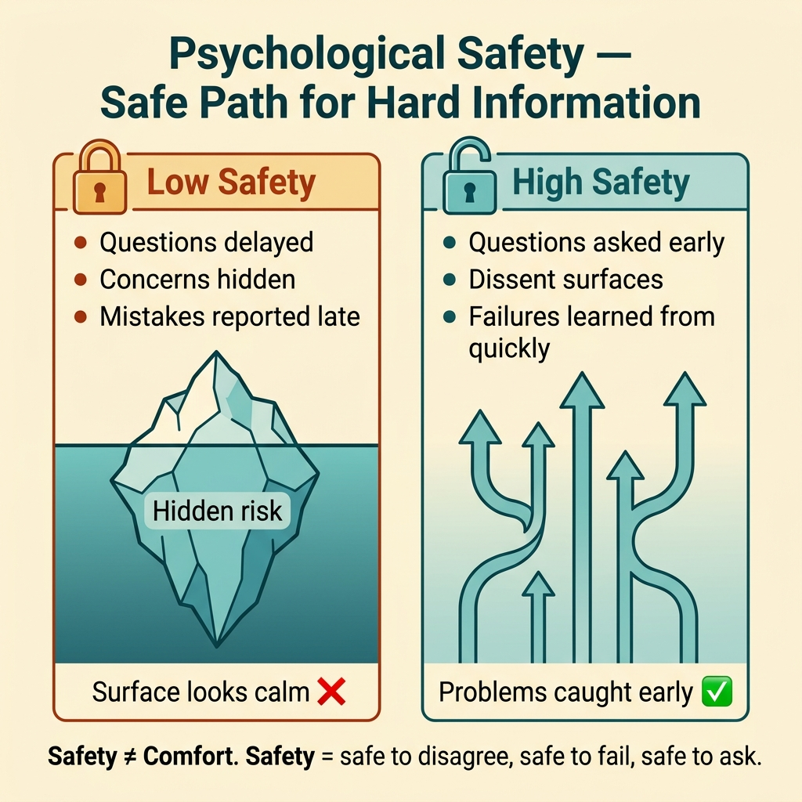
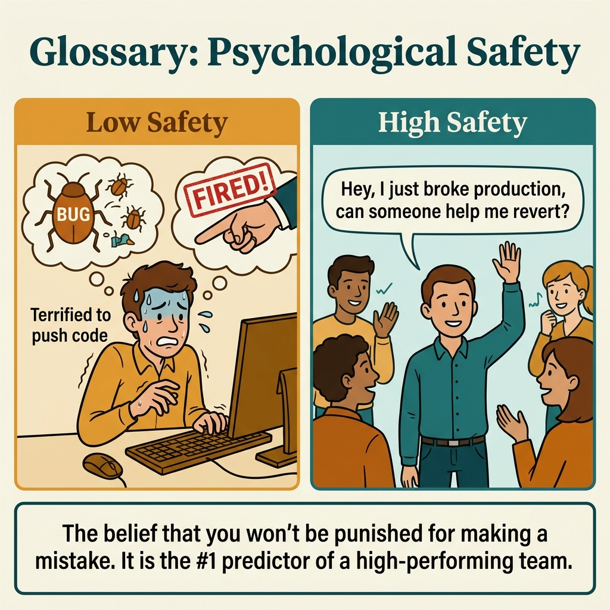

<!-- tags: glossary, reference, developer-cognition-team-dynamics, team-collaboration-dynamics, psychological-safety -->
# Psychological Safety

> The degree to which members feel safe to ask questions, admit mistakes, and voice dissenting opinions within a team.

| Aspect | Detail |
| --- | --- |
| **Concept** | The degree to which members feel safe to ask questions, admit mistakes, and voice dissenting opinions within a team. |
| **Audience** | EM, tech lead, reviewer |
| **Primary style** | Glossary term |
| **Entry point** | Use when the team seems "calm" but few dare to ask, dare to challenge, or dare to admit they do not understand. |

📅 Created: 2026-03-30 · 🔄 Updated: 2026-04-04 · ⏱️ 9 min read

---

## 1. DEFINE

Picture a team that can be very polite but still lacks psychological safety: nobody argues, but nobody dares to say "I do not understand," "I think this direction is risky," or "I just deployed the wrong thing." Psychological safety does not measure surface pleasantness; it measures whether people feel safe enough to bring difficult information into the conversation.

**Psychological Safety** is the degree to which members feel safe to ask questions, admit mistakes, and voice dissenting opinions within a team.

| Variant | Description |
| --- | --- |
| Question safety | Safe to ask basic questions or admit not knowing. |
| Challenge safety | Safe to challenge a decision or an authority figure. |
| Failure safety | Safe to report errors and take responsibility without being humiliated. |

| Approach | Time | Space | When to choose |
| --- | --- | --- | --- |
| Normalize uncertainty in daily work | O(n rituals) | O(1) | When the team rarely asks or rarely challenges. |
| Reward speaking up early | O(n reviews/incidents) | O(1) | When problems only surface very late. |
| Remove humiliation from error handling | O(n management changes) | O(culture work) | When people hide mistakes to self-protect. |

Core insight:

> Psychological safety is not softness. It is the condition for important information to appear early enough. A team without safety will have few bad signals "on the surface," but hidden risk underneath is much higher.

### 1.1 Invariants & Failure Modes

The invariant is that important information must have a safe path to appear. When people fear asking, challenging, or reporting errors, the team loses the signals it needs most at the time it needs them most.

---

## 2. CONTEXT

**Who uses it**: EM, tech lead, reviewer

**When**: Use when the team seems "calm" but few dare to ask, dare to challenge, or dare to admit they do not understand.

**Purpose**: Psychological safety is not softness. It is the condition for important information to appear early enough. A team without safety will have few bad signals "on the surface," but hidden risk underneath is much higher.

**In the ecosystem**:
- Safety is different from comfort; strong disagreement can still exist in a safe environment.
- This is not the concept of "everyone is happy," but "people dare to bring truth into the room."
- It is an enabler for learning, review quality, and incident response.

---

Psychological safety in teams is clear. But how do you build it, how do you measure it, and what about team disagreement?

## 3. EXAMPLES

Psychological safety surfaces most visibly when a junior is afraid to ask because of being judged, when nobody raises concerns in a team meeting despite knowing the plan is wrong, or when a dev does not report a production incident for fear of punishment. The examples below place the pattern into exactly those situations.

### Example 1: Basic — Newcomers do not dare ask basic questions

A junior reads code but does not understand a very important acronym yet is afraid to ask for fear of being judged. At the basic level, safety starts from the ability to say "I do not understand."

Input is a situation with uncertainty being withheld. Output is a ritual or norm encouraging asking early. Complexity is low since it focuses on micro-behavior.

```go
type TeamNorm struct {
	QuestionsWelcome bool
}
```

**Why?** Delayed basic questions are a source of accumulating misunderstandings. High safety makes the cost of asking lower than the cost of pretending to understand.

**Takeaway**: You open a safe path for learning before misunderstanding hardens into a bug or debt.
**Caveat**: Saying "feel free to ask" is not enough if the actual reaction to questions is sarcastic or dismissive.
**Use when**: Newcomers or people outside the domain stay silent too long before revealing they do not understand.

### Example 2: Intermediate — Reviewer does not dare challenge a senior's direction

A design has a flaw but the junior reviewer only comments on small errors because they do not dare touch the senior's main argument. At the intermediate level, psychological safety must cover dissent.

Input is a review culture with a high authority gradient. Output is a norm making challenge more legitimate. Complexity is moderate since it touches power dynamics.



*Figure: Safety ≠ Comfort. Safety = safe to disagree, safe to fail, safe to ask.*

```go
type ReviewCulture struct {
	CanChallengeSenior bool
}
```

**Why?** The stronger the authority gradient in a team, the more easily dissenting information is withheld. This causes decision quality to drop without anyone noticing immediately.

**Takeaway**: You help technical dissent enter the conversation at the right time, not blocked by hierarchy.
**Caveat**: Safety for dissent does not mean undisciplined debate; clear argumentation standards are still needed.
**Use when**: Reviews have many polish comments but few people touch the senior's big decisions.

### Example 3: Advanced — Incident reported late because of fear of blame

An operator sees a strange signal but hesitates to report it because "reporting wrong means being judged." At the advanced level, lack of safety directly makes incidents worse because information is blocked at the entry point.

Input is an environment where errors or suspicions are withheld. Output is a less threatening reporting path and less shaming feedback. Complexity is high since it involves leadership behavior.

```go
type IncidentSignalPolicy struct {
	ReportEarlyEvenIfUnsure bool
}
```

**Why?** In complex systems, early signals are usually very vague. If the culture punishes those who report wrong, everyone will wait until the signal is certain enough — and by then the cost is usually much larger.

**Takeaway**: You use safety to speed up the appearance of bad-but-important information.
**Caveat**: Early reporting needs to come with triage discipline to avoid creating uncontrolled noise.
**Use when**: The team has a pattern of reporting incidents late or raising issues too cautiously.

### Example 4: Expert — Psychological safety is the infrastructure of the learning system

At the expert level, safety is not just a pleasant feeling; it is the infrastructure for review, post-mortem, pairing, and knowledge transfer. If it is weak, every other learning mechanism warps accordingly.

Input is an organization wanting to increase the team's learning rate. Output is leadership norms and feedback loops that protect truth-telling. Complexity is high since it is a system property of culture.

```go
type LearningInfrastructure struct {
	QuestionsSurfaceEarly          bool
	MistakesAnalyzedWithoutShame   bool
}
```

**Why?** Teams learn from real information: from code, bugs, disagreement, and failure. Safety determines whether that real information appears early enough and fully enough. Without it, every other learning process becomes mere formality.

**Takeaway**: You place psychological safety in its proper role: the foundation for organizational learning, not just a soft-skill nice-to-have.
**Caveat**: Do not turn safety into a reason to avoid direct feedback; truth must still be spoken clearly.
**Use when**: The organization wants to improve learning speed, review quality, or post-mortem effectiveness.

---

## 4. COMPARE




*Figure: Position of psychological safety among blameless post-mortem, team performance, and learning culture.*

Psychological safety sounds like "nice culture." Different: Amy Edmondson defines it as "belief that one will not be punished for speaking up." Not nice (avoid conflict), but safe (express concern, disagree, make mistakes without fear). High-performing teams have high safety + high accountability.

### Level 1

```text
uncertainty / concern / mistake
  -> can be spoken safely
  -> team learns earlier
```

*Figure: Level 1 shows psychological safety is mainly a safe exit path for uncomfortable information.*

### Level 2

```text
low safety
  questions delayed
  concerns hidden
  mistakes reported late

healthy safety
  questions asked early
  dissent surfaces
  failures learned from quickly
```

*Figure: Level 2 emphasizes safety directly impacts the timing and quality of information flow.*

### Easy to confuse or cross the boundary

| # | Severity | Mistake | Consequence | Fix |
| --- | --- | --- | --- | --- |
| 1 | 🔴 Fatal | Confusing surface politeness with real safety | Team is silent but hidden risk is high | Observe the actual ability to ask, challenge, and report. |
| 2 | 🟡 Common | Saying "just ask" but actual response is still shaming | Trust degrades quickly | Fix response norms, not just slogans. |
| 3 | 🟡 Common | Treating safety as softness | Dissent gets suppressed | Distinguish safety from lack of standards. |
| 4 | 🔵 Minor | Using safety to avoid hard feedback | Learning quality drops | Keep truthfulness alongside respect. |

### Quick scan

| If you encounter | What to do |
| --- | --- |
| Newcomers do not dare ask | Create a norm for asking early. |
| Junior reviewers do not dare challenge seniors | Reduce authority gradient in reviews. |
| Incidents reported late | Allow reporting early even when uncertain. |
| Want to increase team learning speed | Build safety as learning infrastructure. |

---

## 5. REF

| Resource | Type | Link | Notes |
| --- | --- | --- | --- |
| The Fearless Organization | Book | https://www.thefearlessorganization.com/ | Strong source on psychological safety. |
| Blameless Post-Mortem | Related term | ./06-blameless-post-mortem.md | A ritual that depends heavily on safety. |
| Rubber Duck Debugging | Related term | ./05-rubber-duck-debugging.md | Peer ducking is more effective in a safe environment. |

---

## 6. RECOMMEND

Psychological safety solves the problem of "team is silent when there is a problem." The next question: how does collective code ownership work, and what about Conway's Law?

| Expand to | When | Why | File/Link |
| --- | --- | --- | --- |
| Blameless Post-Mortem | When you want to see safety in failure learning | This is where safety is most clearly revealed. | [Blameless Post-Mortem](./06-blameless-post-mortem.md) |
| Collective Code Ownership | When you want safety to come with the right to fix code | Safety and ownership support each other. | [Collective Code Ownership](./08-collective-code-ownership.md) |
| Team & Collaboration Dynamics | When you need to return to the hub | Keep context of the full topic. | [Team & Collaboration Dynamics](./README.md) |

Back to that silent meeting from the beginning — knew the plan was wrong but said nothing. Now you know: safety ≠ comfort. Safety = safe to disagree, safe to fail, safe to ask. Teams with high safety catch problems early; teams without = problems fester until crisis.

**Links**: [← Previous](./06-blameless-post-mortem.md) · [→ Next](./08-collective-code-ownership.md)
