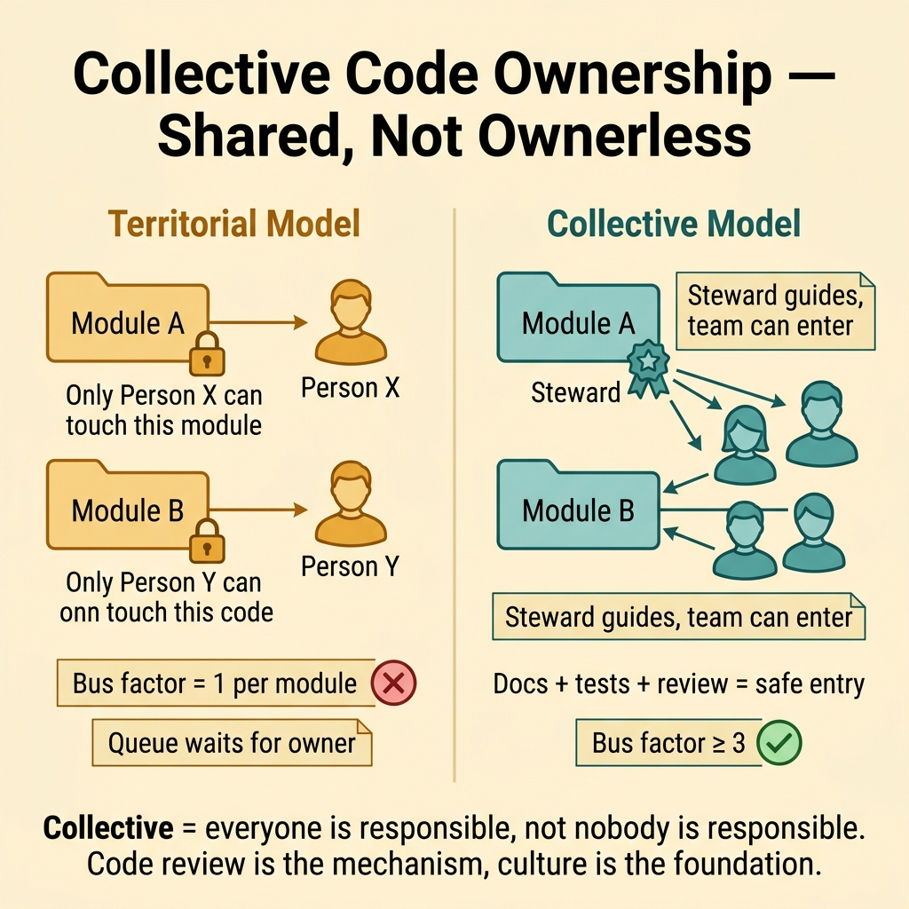
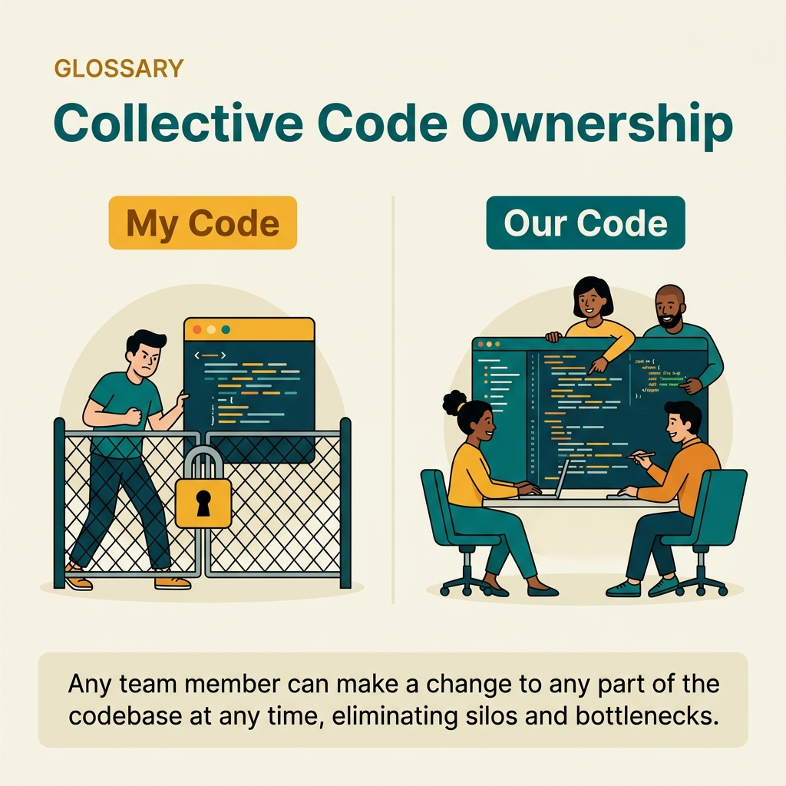

<!-- tags: glossary, reference, developer-cognition-team-dynamics, team-collaboration-dynamics, collective-code-ownership -->
# Collective Code Ownership

> The principle that the entire team shares responsibility and has the right to modify any part of the code when needed.

| Aspect | Detail |
| --- | --- |
| **Concept** | The principle that the entire team shares responsibility and has the right to modify any part of the code when needed. |
| **Audience** | Team lead, engineering team |
| **Primary style** | Glossary term |
| **Entry point** | Use when the repo is divided into "private territory" too rigidly, causing bus factor to increase and bug-fix flow to slow down. |

📅 Created: 2026-03-30 · 🔄 Updated: 2026-04-04 · ⏱️ 9 min read

---

## 1. DEFINE

Picture a bug sitting in a module that only one person is "allowed" to fix. Everyone else understands the problem but hesitates because they fear touching someone's private territory. Collective code ownership opposes that model: it treats code as the team's shared asset, with the expectation that many people can step in to fix when needed.

**Collective Code Ownership** is the principle that the entire team shares responsibility and has the right to modify any part of the code when needed.

| Variant | Description |
| --- | --- |
| Shared modification right | Many people can modify code outside their "familiar zone." |
| Shared responsibility | The team shares responsibility for quality across the whole repo, not just individual slices. |
| Guided collective ownership | Ownership exists but does not become territorial ownership. |

| Approach | Time | Space | When to choose |
| --- | --- | --- | --- |
| Lower entry barriers to unfamiliar code | O(n docs/review changes) | O(doc + pairing time) | When people are afraid to touch code that is not "theirs." |
| Keep review and pairing paths open | O(n team rituals) | O(1) | When modification rights exist on paper but real competence has not spread. |
| Balance shared ownership with clear stewardship | O(n ownership rules) | O(1) | When you want to avoid both silos and abandonment. |

Core insight:

> Collective ownership does not mean "anyone can change anything however they want." It means the barrier to entering code must be low enough that quality, continuity, and speed do not depend on rigid territorial boundaries.

### 1.1 Invariants & Failure Modes

The invariant is that if an important part of code needs to be fixed, the team must have more than one legitimate path to make that fix. When every change must wait for the "code owner," ownership has become a bottleneck.

---

## 2. CONTEXT

**Who uses it**: Team lead, engineering team

**When**: Use when the repo is divided into "private territory" too rigidly, causing bus factor to increase and bug-fix flow to slow down.

**Purpose**: Collective ownership does not mean "anyone can change anything however they want." It means the barrier to entering code must be low enough that quality, continuity, and speed do not depend on rigid territorial boundaries.

**In the ecosystem**:
- Collective ownership is different from "no owner"; stewardship is still very necessary.
- It is strongest when paired with docs, review norms, and psychological safety.
- This is a mechanism for reducing bus factor and reducing queueing for changes.

---

Everyone owns all code is clear. But collective ownership vs code stewardship, what about quality when everyone modifies, and accountability?

## 3. EXAMPLES

Collective code ownership surfaces most visibly when a bug fix does not depend on the "author" being on vacation, when every dev has the right to refactor any module, or when "not my code" becomes an excuse. The examples below place the pattern into exactly those situations.

### Example 1: Basic — Everyone is afraid to fix "someone else's code"

You see a clear bug in a module outside your team's work area, but hesitate because you fear "touching that spot is not your place." At the basic level, collective ownership starts by making the right to fix a legitimate act.

Input is a culture afraid to touch unfamiliar code. Output is a clear norm that fixing and improving shared code is encouraged. Complexity is low since it mainly changes expectations.

```go
type TeamPolicy struct {
	SharedFixRights bool
}
```

**Why?** If the right to fix exists only in name while the social cost of touching unfamiliar code remains high, collective ownership will never become real behavior. A clear policy helps lower the first psychological barrier.

**Takeaway**: You turn fixing code outside your "familiar zone" into a legitimate action rather than an exception open to judgment.
**Caveat**: Legitimate does not mean skipping review or necessary context handoff.
**Use when**: Small bugs are delayed just because "it is not my code."

### Example 2: Intermediate — For many people to be able to fix, you must lower entry cost

You cannot demand collective ownership if the module lacks docs, tests, and review support. At the intermediate level, collective ownership needs to lower the cost for others to enter safely.

Input is a module with concentrated ownership. Output is scaffolding that helps outsiders understand and modify more easily. Complexity is moderate since it requires investment in enablement.



*Figure: Collective = everyone is responsible, not nobody is responsible. Code review is the mechanism, culture is the foundation.*

```go
type OwnershipEnablement struct {
	RunbookExists  bool
	TestsReliable  bool
	ReviewPathOpen bool
}
```

**Why?** The team only truly shares ownership when entering unfamiliar code is not too expensive. If entry cost is high, people will naturally revert to territorial behavior to survive.

**Takeaway**: You build the foundation for collective ownership by making the codebase more accessible.
**Caveat**: Good enablement without actual pairing and review time will still slow adoption.
**Use when**: Everyone agrees in principle but real competence is still concentrated in a few people.

### Example 3: Advanced — Keep stewardship without reverting to "private territory"

Some domains still need a steward to maintain quality and architectural direction. At the advanced level, the challenge is keeping stewardship as a guiding capability, not letting it become a silent veto on all changes.

Input is a team wanting shared ownership but still needing domain stewards. Output is a boundary between stewardship and exclusivity. Complexity is high since it touches power dynamics in code review.

```go
type StewardshipModel struct {
	StewardExists      bool
	ExclusiveWriteRight bool
}
```

**Why?** If you remove all stewardship, code easily becomes abandoned; but if stewardship turns into "only I can touch this," bus factor and queueing rise again. Good collective ownership needs both openness and direction.

**Takeaway**: You balance team autonomy with domain coherence.
**Caveat**: This boundary easily slips; clear review norms are needed to prevent stewards from accidentally becoming gatekeepers.
**Use when**: The team is torn between chaotic abandonment and rigid territorial ownership.

### Example 4: Expert — Collective ownership as a strategy for resilience and speed

At the expert level, collective ownership is not just for "nicer culture." It makes the system more resilient against vacations, resignations, incidents, and increases queue throughput for changes.

Input is an organization wanting to reduce concentration risk and change bottlenecks. Output is an ownership model where redundancy is the default. Complexity is high since it connects to organizational capability building.

```go
type OwnershipOutcome struct {
	BusFactorHigher  bool
	ChangeQueueLower bool
}
```

**Why?** When many people can safely fix things, the team is not only less fragile but also responds faster to bugs and opportunities. Collective ownership is a lever for both resilience and delivery speed.

**Takeaway**: You place collective ownership at its proper scale: a socio-technical strategy, not just an agile slogan.
**Caveat**: Without sufficient standards, review quality, and docs, "everyone fixing everything" can genuinely create chaos.
**Use when**: The team wants to lower bus factor, reduce queueing, and increase adaptability simultaneously.

---

## 4. COMPARE




*Figure: Position of collective code ownership among bus factor, code review, and team collaboration.*

Collective ownership sounds like "no owner." Wrong: collective ownership = everyone is an owner, not no one is an owner. Code review ensures quality; shared standards ensure consistency. Without code review, collective ownership = nobody cares.

### Level 1

```text
shared codebase
  -> many people can understand
  -> many people can change safely
```

*Figure: Level 1 shows collective ownership reduces dependence on the "sole keyholder."*

### Level 2

```text
territorial model
  module A -> only person X touches it

collective model
  steward exists
  but others can enter with docs/review/pairing support
```

*Figure: Level 2 emphasizes collective ownership still has stewardship; it just does not turn stewardship into exclusive editing rights.*

### Easy to confuse or cross the boundary

| # | Severity | Mistake | Consequence | Fix |
| --- | --- | --- | --- | --- |
| 1 | 🔴 Fatal | Understanding collective ownership as ownerless | Quality drift, blurred direction | Keep clear stewardship, just not exclusive. |
| 2 | 🟡 Common | Saying shared ownership but entry cost remains high | Nobody actually enters unfamiliar code | Invest in docs, tests, and review paths. |
| 3 | 🟡 Common | Steward becoming a gatekeeper | Queueing and bus factor rise again | Clarify the boundary between stewardship and exclusivity. |
| 4 | 🔵 Minor | Treating this as only a cultural nice-to-have | Missing resilience and speed benefits | Tie it to capability and risk metrics. |

### Quick scan

| If you encounter | What to do |
| --- | --- |
| Small bug must wait for the "code owner" | Lower the social barrier for shared fixes. |
| Everyone agrees but nobody dares fix unfamiliar code | Reduce entry cost with docs, tests, and review. |
| Steward is becoming a gatekeeper | Separate stewardship from exclusivity. |
| Want to increase resilience and speed | Use collective ownership as a strategy, not just culture. |

---

## 5. REF

| Resource | Type | Link | Notes |
| --- | --- | --- | --- |
| Extreme Programming Explained | Book | https://en.wikipedia.org/wiki/Extreme_Programming_Explained | Popular source for collective ownership in XP. |
| Bus Factor | Related term | ./03-bus-factor.md | Collective ownership is a strong antidote for concentration risk. |
| Psychological Safety | Related term | ./07-psychological-safety.md | People only dare touch unfamiliar code when they feel safe enough. |

---

## 6. RECOMMEND

Collective code ownership solves the problem of "only one person understands module X." The next question: how does bus factor improve, and how does psychological safety support it?

| Expand to | When | Why | File/Link |
| --- | --- | --- | --- |
| Bus Factor | When you want to see the risk that collective ownership is reducing | These two terms connect directly. | [Bus Factor](./03-bus-factor.md) |
| Psychological Safety | When the team still avoids unfamiliar code despite policy allowing it | Safety is the enabler of real ownership. | [Psychological Safety](./07-psychological-safety.md) |
| Team & Collaboration Dynamics | When you need to return to the hub | Keep context of the full topic. | [Team & Collaboration Dynamics](./README.md) |

Back to that "not my code" from the beginning — whose bug to fix? Now you know: everyone can fix, everyone should review, shared standards protect quality. Collective = everyone responsible, not nobody responsible. Code review is the mechanism; culture is the foundation.

**Links**: [← Previous](./07-psychological-safety.md) · [→ Next](./README.md)
