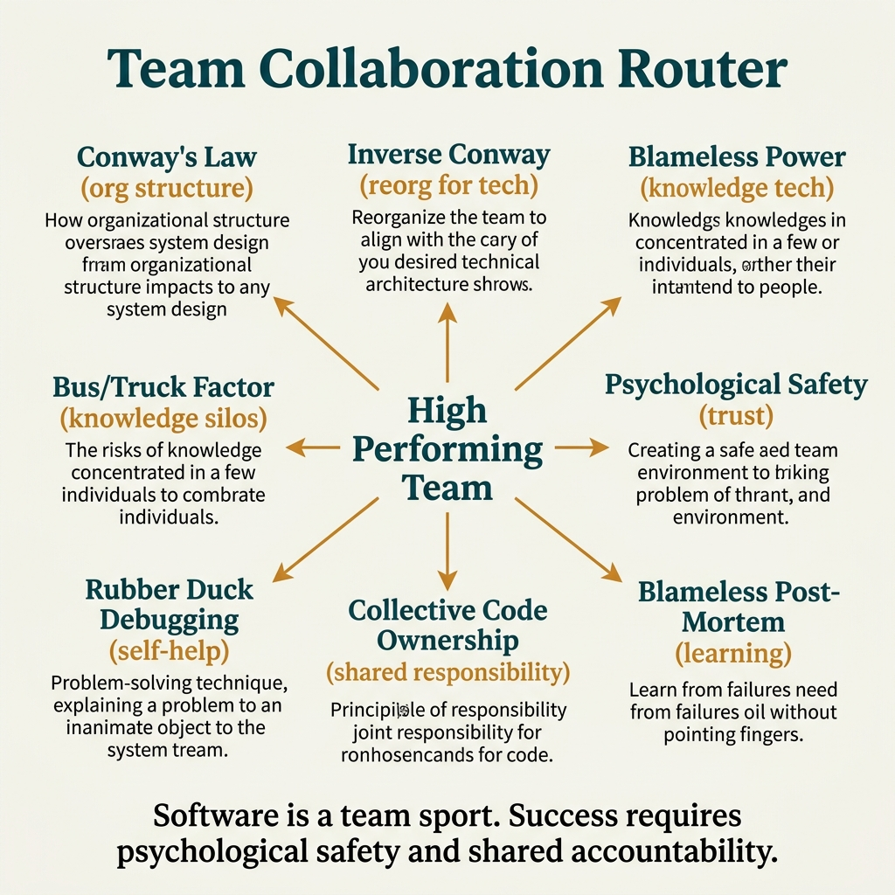

<!-- tags: glossary, reference, developer-cognition-team-dynamics, team-collaboration-dynamics, overview -->
# Team & Collaboration Dynamics

> A cluster of terms naming the interplay between team structure, ownership, safety, and how knowledge is shared in daily collaboration.

| Aspect | Detail |
| --- | --- |
| **Concept** | A cluster of terms naming the interplay between team structure, ownership, safety, and how knowledge is shared in daily collaboration. |
| **Audience** | Tech lead, engineering manager, developer concerned with collaboration debt |
| **Primary style** | Glossary hub router |
| **Entry point** | Open when issues appear at the team level: owner dependency, unsafe feedback, ineffective postmortems, or system shape being dictated by the org chart |

📅 Created: 2026-03-30 · 🔄 Updated: 2026-04-04 · ⏱️ 6 min read

---

## 1. DEFINE

Picture a codebase that can be decomposed into beautifully separated services, but if the team splits misaligned like the org chart, knowledge is concentrated, and feedback is toxic, the system still degrades steadily. This README routes those collaboration symptoms to the right term: Conway, bus factor, blameless post-mortem, psychological safety, and collective ownership.

**Team & Collaboration Dynamics** is a cluster of terms naming the interplay between team structure, ownership, safety, and how knowledge is shared in daily collaboration.

| Variant | Description |
| --- | --- |
| Org-to-system effects | Conway and inverse Conway name how organizational structure shapes the system. |
| Knowledge concentration | Bus factor and truck factor point out the risk when ownership is concentrated. |
| Safety & learning | Rubber duck debugging, blameless post-mortem, psychological safety, and collective ownership describe the capacity for shared learning. |

| Approach | Time | Space | When to choose |
| --- | --- | --- | --- |
| Route by ownership symptom | O(1) route | O(1) | When the system depends on a few individuals or team boundaries are blurry |
| Route by feedback loop quality | O(1) route | O(1) | When postmortems, pairing, and reviews do not produce real learning |
| Learn from structure to culture | O(1) route | O(1) | When you want to go from org effects to sustainable collaboration |

Core insight:

> Team dynamics are part of architecture; if you do not name them, isolated technical optimizations will be continuously undermined by the team's structure and behavior.

### 1.1 Signals & Boundaries

- Conway is a system-shaping force, not just a fun quote in architecture talks.
- Bus/truck factor points out the risk of ownership concentration, not just how many people resign.
- Psychological safety and blameless post-mortem are conditions for knowledge to be truly shared.

### Coverage Map

| Entry | Role | Notes |
| --- | --- | --- |
| [Conway's Law](01-conways-law.md) | Canonical term | Primary entry for this branch |
| [Inverse Conway Maneuver](02-inverse-conway-maneuver.md) | Canonical term | Primary entry for this branch |
| [Bus Factor](03-bus-factor.md) | Canonical term | Primary entry for this branch |
| [Truck Factor](04-truck-factor.md) | Canonical term | Primary entry for this branch |
| [Rubber Duck Debugging](05-rubber-duck-debugging.md) | Canonical term | Primary entry for this branch |
| [Blameless Post-Mortem](06-blameless-post-mortem.md) | Canonical term | Primary entry for this branch |
| [Psychological Safety](07-psychological-safety.md) | Canonical term | Primary entry for this branch |
| [Collective Code Ownership](08-collective-code-ownership.md) | Canonical term | Primary entry for this branch |

---

## 2. VISUAL




*Figure: Router map prioritizing quick scan of lanes, entry points, and reading boundaries before diving into detailed prose below.*

At this point, what is missing is not more definitions but a diagram clear enough to see how the concept clusters sit next to each other.

### Level 1

```text
Org-to-system effects
Knowledge concentration
Safety & learning
```

*Figure: Level 1 divides this hub into major decision lanes so the reader does not have to navigate from a flat list of terms.*

### Level 2

```text
If the phenomenon is...                                    Open which file first
-------------------------------------------------------   ------------------------------------------
System shape resembles org chart in an undesired way       Conway's Law
A few people on leave and the whole flow stalls            Bus Factor
Team reviews an incident but learns nothing                Blameless Post-Mortem
Want to reduce "only team X can fix this code"             Collective Code Ownership
```

*Figure: Level 2 turns the hub into a symptom router: start from a real question, then branch to the specific term.*

---

## 3. CODE

The diagram has just split this group by communication structure, psychological safety level, and how ownership is distributed. From here, use the hub as radar to see which collaboration flow the team is stuck on.

### Problem 1: Basic — Route the right symptom to the right glossary entry

> **Goal**: Do not let every question about **Team & Collaboration Dynamics** be thrown into the same bucket.
> **Approach**: Start from the reader's symptom or question, then open the best-matching first entry.
> **Example**: Input is a review or design question; output is the file to open first, like `./01-conways-law.md`.
> **Complexity**: Basic

```yaml
router:
  - symptom: System shape resembles org chart in an undesired way
    open_first: ./01-conways-law.md
  - symptom: A few people on leave and the whole flow stalls
    open_first: ./03-bus-factor.md
  - symptom: Team reviews an incident but learns nothing
    open_first: ./06-blameless-post-mortem.md
  - symptom: Want to reduce "only team X can fix this code"
    open_first: ./08-collective-code-ownership.md
```

**Why?** In collaboration dynamics, the same symptom of a slow and tired team can come from Conway, truck factor, lack of psychological safety, or unclear ownership. This router helps name the right type of collective friction.

**Takeaway**: The first value of the hub is pointing to exactly which collaboration pattern is degrading the team's quality and speed.

### Problem 2: Intermediate — Use the hub as an intentional learning path

> **Goal**: Read **Team & Collaboration Dynamics** in logical clusters rather than jumping between disconnected files.
> **Approach**: Follow lanes from foundation to heavier variants, then return to compare adjacent concepts when needed.
> **Example**: A reader wants to build a more durable mental model rather than just looking up a single definition.
> **Complexity**: Intermediate

```yaml
learning_path:
  structure:
    - 01-conways-law.md
    - 02-inverse-conway-maneuver.md
  ownership_risk:
    - 03-bus-factor.md
    - 04-truck-factor.md
  learning_safety:
    - 05-rubber-duck-debugging.md
    - 06-blameless-post-mortem.md
    - 07-psychological-safety.md
    - 08-collective-code-ownership.md
```

**Why?** Collaboration terms only truly illuminate when the reader sees them as a system of relationships. The learning path keeps this hub telling the connection from team structure to review behavior and how knowledge is shared.

**Takeaway**: At the intermediate level, this hub guides the reader from team structure to collaboration behavior along a clearer causal thread.

### Problem 3: Advanced — Use the hub as a governance map for shared vocabulary

> **Goal**: Keep reviews, ADRs, runbooks, or postmortems using the same language within **Team & Collaboration Dynamics**.
> **Approach**: Group terms by decision lane, then use that lane as a glossary contract for the team.
> **Example**: When two people are using the same word but actually arguing at two different layers of the system.
> **Complexity**: Advanced

```yaml
governance_map:
  org_to_system_effects:
    - 01-conways-law.md
    - 02-inverse-conway-maneuver.md
  knowledge_concentration:
    - 03-bus-factor.md
    - 04-truck-factor.md
  safety_learning:
    - 05-rubber-duck-debugging.md
    - 06-blameless-post-mortem.md
    - 07-psychological-safety.md
```

**Why?** Shared vocabulary in this cluster is the foundation for organizations to change how they work without assigning blame in the wrong place. The governance map helps the team separate structural issues from behavioral issues and ownership issues.

**Takeaway**: At the advanced level, this hub is a coordination diagram for the team to fix the right organizational joint that is warping the system.

---

## 4. PITFALLS

At this point, the topic cluster has become quite clear. The most common slip for readers is applying the right name at the wrong depth or the wrong boundary.

| # | Severity | Mistake | Consequence | Fix |
| --- | --- | --- | --- | --- |
| 1 | 🔴 Fatal | Mixing multiple concept layers in the same discussion | Team fixes the wrong layer, debate goes off-track | Re-route using the correct lane in the README before opening a specific term |
| 2 | 🟡 Common | Choosing a term by familiar name instead of by symptom | Deep-links to the right file but wrong boundary | Ask the symptom question first, then choose the entry point |
| 3 | 🟡 Common | Reading a term in isolation, skipping the learning path | Fragmented understanding, missing adjacent concepts for comparison | Follow the suggested cluster reading in CODE/RECOMMEND |
| 4 | 🔵 Minor | Not linking back to the parent hub or root hub | Reader has difficulty returning to the taxonomy when lost | Keep the hub as a router; do not turn files into islands |

---

## 5. REF

| Resource | Type | Link | Notes |
| --- | --- | --- | --- |
| Team Topologies | Book | https://teamtopologies.com/ | Very strong for team boundaries and cognitive load |
| Accelerate | Book | https://itrevolution.com/product/accelerate/ | Beautiful connection between culture, learning, and delivery |
| Conway's Law | Reference | https://martinfowler.com/bliki/ConwaysLaw.html | Clear entry point for the impact of org on software |

---

## 6. RECOMMEND

You already know which collaboration flow the friction lies in. Next, go to the term closest to the collective behavior that keeps recurring, so the intervention touches the right structure instead of just reminding people.

| Expand to | When | Why | File/Link |
| --- | --- | --- | --- |
| Conway first | When the symptom is already showing in the system's shape | This is the foundational concept for seeing collaboration as an architectural force | [Conway's Law](./01-conways-law.md) |
| Bus factor next | When ownership concentration is the biggest risk | Need to name it correctly before talking about handover or docs | [Bus Factor](./03-bus-factor.md) |
| Psych safety when shared learning is stuck | When team does not dare speak truth in review/postmortem | Without safety, learning rituals become meaningless | [Psychological Safety](./07-psychological-safety.md) |

---

## 7. QUICK REF

| If you encounter | Open where |
| --- | --- |
| System shape resembles org chart in an undesired way | [Conway's Law](./01-conways-law.md) |
| A few people on leave and the whole flow stalls | [Bus Factor](./03-bus-factor.md) |
| Team reviews an incident but learns nothing | [Blameless Post-Mortem](./06-blameless-post-mortem.md) |
| Want to reduce "only team X can fix this code" | [Collective Code Ownership](./08-collective-code-ownership.md) |
