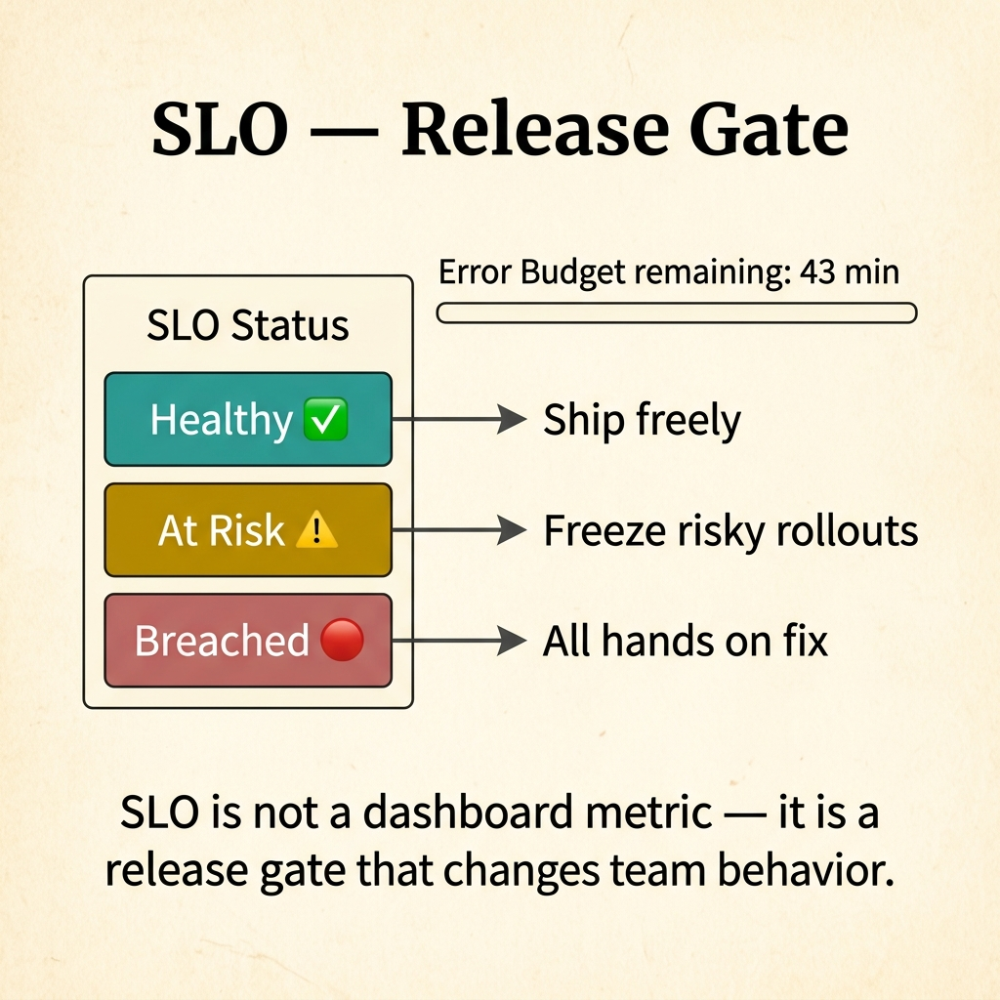
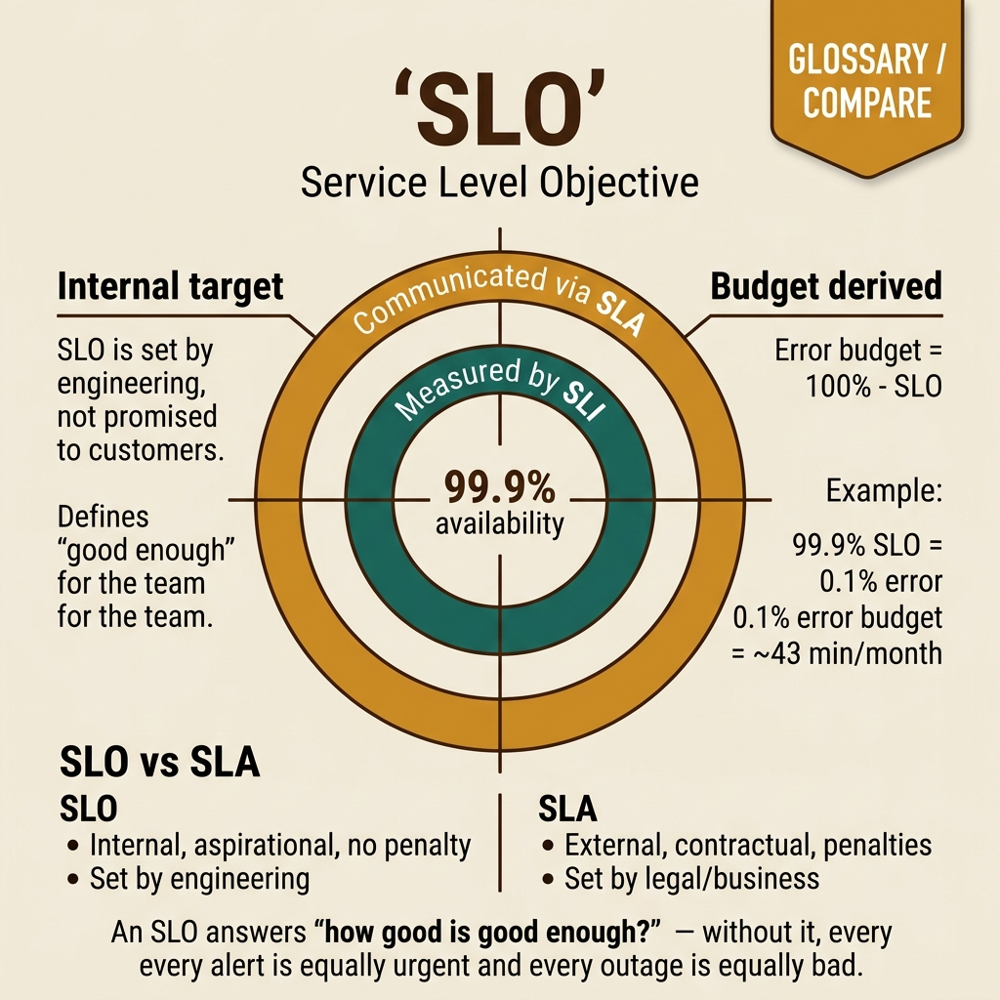

<!-- tags: glossary, reference, observability-operations, slo -->

# SLO

> The internal reliability target a team sets to decide when the system is good enough to keep shipping, and when it must stop to pay down stability debt.

| Aspect            | Detail                                                                                                                                                   |
| ----------------- | -------------------------------------------------------------------------------------------------------------------------------------------------------- |
| **Concept**       | The internal reliability target a team sets to decide when the system is good enough to keep shipping, and when it must stop to pay down stability debt. |
| **Audience**      | SRE, backend engineer, engineering manager                                                                                                               |
| **Primary style** | Glossary term                                                                                                                                            |
| **Entry point**   | Use when the team needs a clear operational target instead of just watching dashboards and reacting on gut feeling.                                      |

📅 Created: 2026-03-30 · 🔄 Updated: 2026-04-16 · ⏱️ 8 min read

---

## 1. DEFINE

Picture a sprint nearing release. The dashboard is not screaming red, but on-call still feels the system is "thin." The problem: nobody in the room shares the same definition of "thin." **SLO** exists to freeze that feeling into a concrete boundary — good enough to keep changing, or bad enough to stop and fix.

**SLO** is an internal reliability or performance target the team commits to itself, defined by a specific target on an SLI within a clear time window.

| Variant          | Description                                                       |
| ---------------- | ----------------------------------------------------------------- |
| Availability SLO | Target for successful request ratio or uptime.                    |
| Latency SLO      | Target for percentile latency or response-time threshold.         |
| Workflow SLO     | Target for a critical user journey rather than a single endpoint. |

| Approach          | Time                | Space | When to choose                                                         |
| ----------------- | ------------------- | ----- | ---------------------------------------------------------------------- |
| Single metric SLO | O(1) metric eval    | O(1)  | When one indicator already represents user pain.                       |
| Composite SLO     | O(n) indicators     | O(n)  | When a workflow has multiple failure points that need a combined view. |
| Tiered SLO        | O(n) by criticality | O(n)  | When workflows carry different business-criticality levels.            |

Core insight:

> SLO is not chart decoration. It is the line where the team makes the trade-off between release velocity and reliability.

### 1.1 Invariants & Failure Modes

An SLO must be challenging enough to be meaningful and realistic enough to be operable. The biggest failure mode is setting the target too easy — so it is always green — or too aggressive — so it is always red. Both kill the team's trust in the SLO.

---

## 2. CONTEXT

**Who uses it**: SRE, backend engineer, engineering manager

**When**: Use when the team needs a clear operational target instead of just watching dashboards and reacting on gut feeling.

**Purpose**: SLO is the line where the team draws the trade-off between release velocity and reliability.

**In the ecosystem**:

- SLO is an internal target — it differs from SLA, which is an external promise.
- SLO must be grounded on an SLI that reflects real user experience.
- SLO should not cover every metric. It should lock in the things users or the business genuinely care about.

---

The service quality target is clear. But how many nines, who sets it, and what harm does an overly ambitious SLO cause?

## 3. EXAMPLES

SLO surfaces most clearly when the team commits to 99.99% but only achieves 99.9%, when the SLO is too loose and users still complain, or when nobody measures the SLO and the number only lives on paper. The examples below place the pattern into exactly those situations.

### Example 1: Basic — Set one target the entire room understands the same way

A team meeting where one person says "stable enough," another pushes back "stable compared to what target?" and on-call just wants to know "should we freeze deployments?" At the basic level, the first SLO solves this by giving everyone a single, measurable agreement.

```text
  SLO anatomy:

  ┌─ Checkout API SLO ─────────────────────────┐
  │                                             │
  │  Indicator:  request_success_rate           │
  │  Target:     99.9%                          │
  │  Window:     30 days (rolling)              │
  │                                             │
  │  Meaning:                                   │
  │  In any 30-day window, at most 0.1% of      │
  │  checkout requests may fail.                │
  │                                             │
  │  Budget:  ~43 minutes of total downtime     │
  │           or ~4,320 failed requests         │
  │           out of 4,320,000 total            │
  └─────────────────────────────────────────────┘
```

_Figure: The SLO freezes "good enough" into a number everyone can verify — 99.9% success over 30 days, leaving about 43 minutes of failure budget._

```yaml
slo:
    service: checkout-api
    indicator: request_success_rate
    target: 99.9%
    window: 30d
```



*Figure: SLO drives a three-tier release gate — Healthy means ship freely, At Risk means freeze risky rollouts, Breached means all hands on fix. The number is not decoration; it changes team behavior.*

**Why?** Without a numeric target, reliability becomes a sentiment-based argument between product, engineering, and on-call. The SLO cuts through that fog.

**Conclusion**: The basic level of SLO is a target the team can agree on and verify.

### Example 2: Intermediate — Use the SLO to influence real decisions

An SLO that turns red while the roadmap keeps running unchanged will soon be ignored. At the intermediate level, the SLO must be wired into release gates and incident priorities so it changes actual behavior.

```text
  SLO-driven release gate:

  ┌─ SLO status check ─────────────────────────┐
  │                                             │
  │  SLO target: 99.9%                          │
  │  Current:    99.85%                         │
  │  Status:     AT RISK ⚠️                     │
  │                                             │
  │  Gate decision:                             │
  │  ┌─────────────────────────────────────┐    │
  │  │  FREEZE risky rollouts              │    │
  │  │  until budget recovers              │    │
  │  │  OR targeted fix lands              │    │
  │  └─────────────────────────────────────┘    │
  │                                             │
  │  SLO healthy → ship freely                  │
  │  SLO at risk → freeze risky changes         │
  │  SLO breached → all hands on fix            │
  └─────────────────────────────────────────────┘
```

_Figure: The SLO drives a three-tier release gate. At risk means freeze risky rollouts. Breached means fix first, ship later._

```yaml
release_gate:
    slo_status: at_risk
    action: freeze_risky_rollouts
    until: budget_recovers_or_fix_lands
```

**Why?** An SLO only carries weight when it changes behavior. If it is red but the roadmap keeps running as usual, the team will soon treat it as wallpaper.

**Conclusion**: At the intermediate level, the SLO must become an input to planning and release decisions.

### Example 3: Advanced — Anchor targets to critical business workflows

A single average SLO for the entire system can mask real user pain. At the advanced level, you split SLOs by workflow criticality so the most important user journeys get the tightest targets.

```text
  Tiered workflow SLOs:

  ┌─ Checkout ─────────────────────────────────┐
  │  Target: 99.95% success rate               │
  │  Priority: CRITICAL                        │
  │  Reason: direct revenue impact             │
  └─────────────────────────────────────────────┘

  ┌─ Product search ───────────────────────────┐
  │  Target: p95 latency < 400ms               │
  │  Priority: HIGH                            │
  │  Reason: conversion funnel entry           │
  └─────────────────────────────────────────────┘

  ┌─ Admin export ─────────────────────────────┐
  │  Target: 99.0% success rate                │
  │  Priority: MEDIUM                          │
  │  Reason: internal tool, tolerates retries  │
  └─────────────────────────────────────────────┘
```

_Figure: Not every workflow deserves the same reliability discipline. Checkout gets the tightest target because it is where the business truly loses sleep if it turns red._

```yaml
workflow_slos:
    checkout_success_rate: 99.95%
    product_search_latency_p95: 400ms
    admin_export_success_rate: 99.0%
```

**Why?** Not every workflow deserves the same reliability discipline. The strongest SLO sits where the business genuinely loses sleep if that term turns red.

**Conclusion**: At the advanced level, SLO should live close to the workflow, not just close to the service.

---

## 4. COMPARE



_Figure: Compare card locks the three jobs of SLO — setting an internal boundary, distinguishing it from adjacent terms, and pulling the target into real release decisions._

SLO only has value when it pulls the conversation away from "seems fine" and forces the team to answer which internal boundary is being touched.

### Level 1

```text
business expectation
  -> pick a user-visible goal
  -> set a target and time window
  -> compare current behavior against that target
```

_Figure: Level 1 shows SLO is the step that turns expectation into a boundary you can measure and compare._

### Level 2

```text
SLI measures current behavior
  -> SLO sets a target for that behavior
  -> the gap eats into error budget
  -> release and incident decisions follow the budget
```

_Figure: Level 2 places SLO inside the real reliability loop, where a metric leads to a decision._

### Easily confused or boundary-slipping

Knowing **SLO** is not enough. The easiest place to slip is where the team thinks a detail is minor but it actually shifts the entire boundary.

| #   | Severity  | Mistake                                                 | Consequence                                  | Fix                                                  |
| --- | --------- | ------------------------------------------------------- | -------------------------------------------- | ---------------------------------------------------- |
| 1   | 🔴 Fatal  | Choosing a metric that does not reflect user experience | SLO is green but users are still hurting     | Anchor SLO to a user-visible workflow or symptom.    |
| 2   | 🟡 Common | Setting the target too easy or too aggressive           | SLO loses its steering power                 | Calibrate against history and business expectation.  |
| 3   | 🟡 Common | Having an SLO not tied to release policy                | The number becomes meaningless in operations | Use SLO as input for planning and incident response. |
| 4   | 🔵 Minor  | Setting too many SLOs for everything                    | Team is overwhelmed by indicators            | Keep the SLO count small and intentional.            |

### Quick scan

| If you face                                    | Action                      |
| ---------------------------------------------- | --------------------------- |
| Need an internal reliability target            | Think SLO.                  |
| Target does not influence releases or planning | SLO is not living yet.      |
| One SLO masks real user pain                   | Split by critical workflow. |

---

## 5. REF

| Resource            | Type      | Link                                           | Note                                                             |
| ------------------- | --------- | ---------------------------------------------- | ---------------------------------------------------------------- |
| Google SRE Workbook | Reference | https://sre.google/workbook/table-of-contents/ | Strong foundation for SLO, error budgets, and incident response. |
| Google SRE Book     | Reference | https://sre.google/sre-book/table-of-contents/ | Canonical source for reliability metrics.                        |
| OpenTelemetry Docs  | Official  | https://opentelemetry.io/docs/                 | Useful when mapping SLO back to telemetry instrumentation.       |

---

## 6. RECOMMEND

After locking the "good enough" boundary, the next step is to see which number feeds that target and how the remaining reliability room is calculated.

| Expand to    | When                                                   | Reason                                                  | File/Link                                 |
| ------------ | ------------------------------------------------------ | ------------------------------------------------------- | ----------------------------------------- |
| SLI          | When you need to know what to measure                  | Without the right indicator, the target is meaningless. | [SLI](./03-sli.md)                        |
| Error Budget | When you want to turn the SLO into a release trade-off | This is the next step from target to action.            | [Error Budget](./04-error-budget.md)      |
| Topic hub    | When you need to return to the broader taxonomy        | Keeps the context of observability & operations.        | [Observability & Operations](./README.md) |

Back to the 99.99% at the start — committed but not achieved. Now you know: an SLO must be grounded in user expectation and engineering capacity. The difference between 99.9% and 99.99% is 10x the effort. Choose the right level, measure continuously, adjust with data.

**Links**: [← Previous](./README.md) · [→ Next](./02-sla.md)
