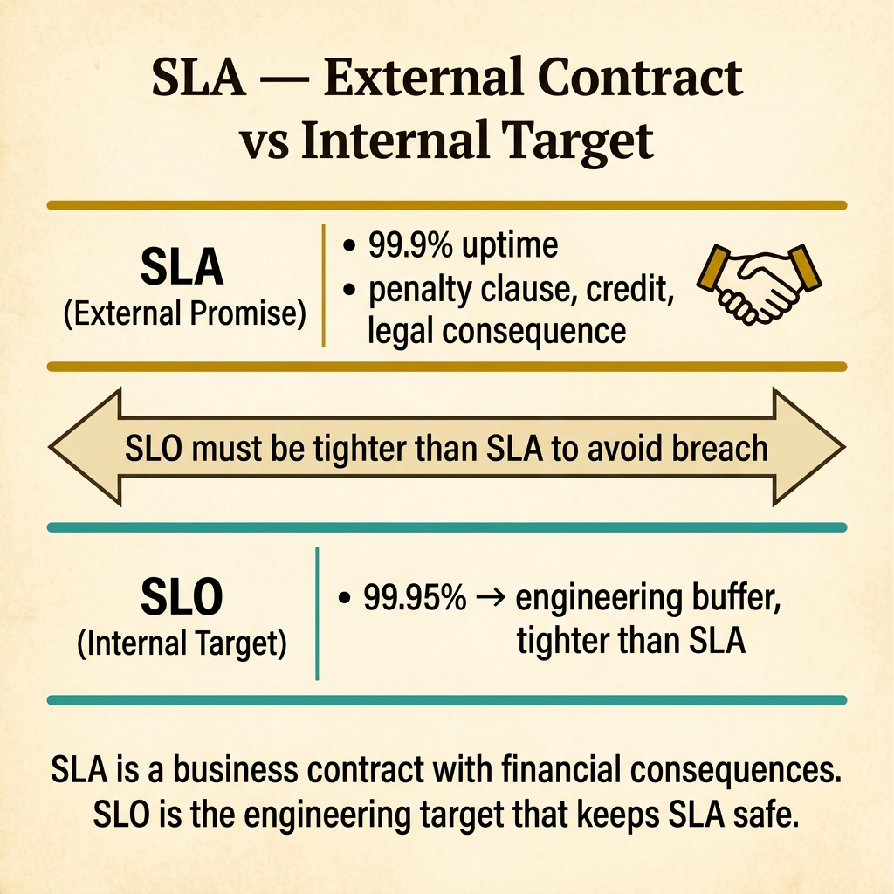
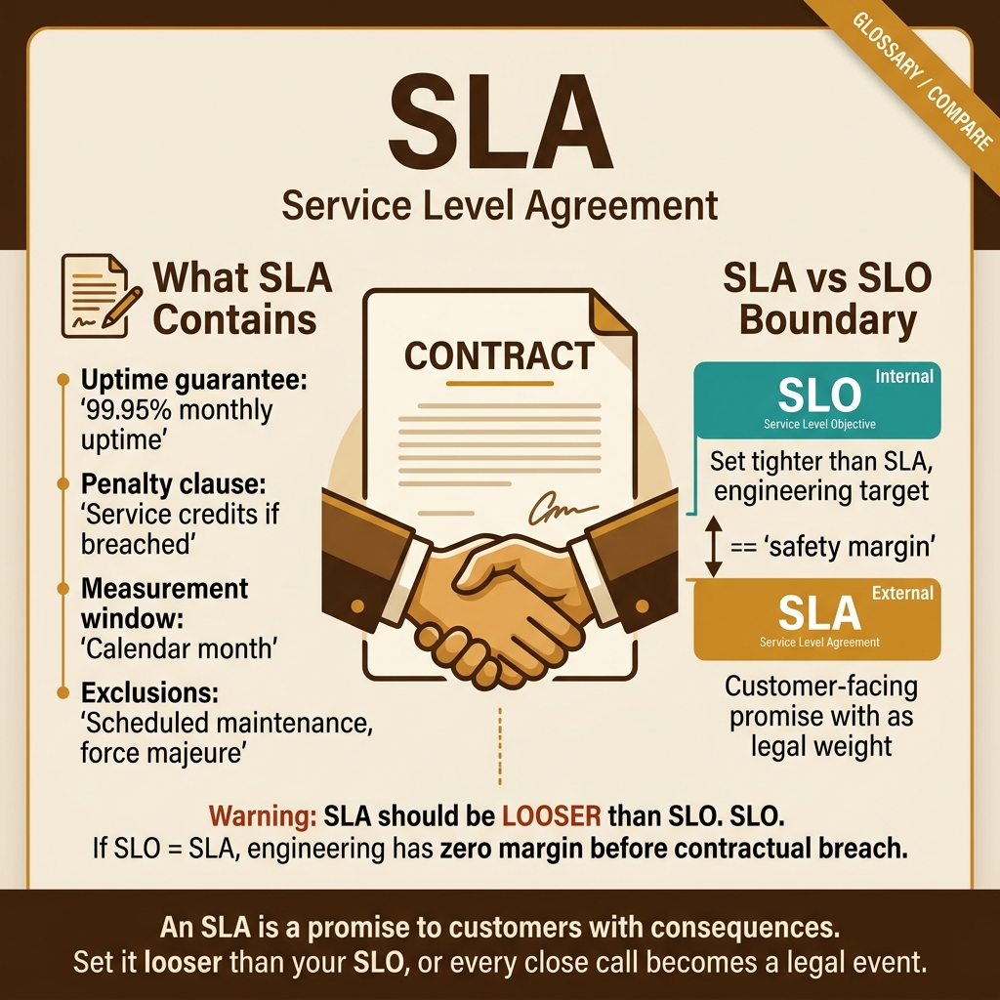

<!-- tags: glossary, reference, observability-operations, sla -->
# SLA (Service Level Agreement)

> A formal contract between a service provider and its customers that specifies the expected level of service, measured by SLOs and SLIs, with defined consequences for breach.

| Aspect | Detail |
| --- | --- |
| **Concept** | A formal contract between a service provider and its customers that specifies the expected level of service, measured by SLOs and SLIs, with defined consequences for breach. |
| **Audience** | Engineering manager, SRE, product manager, legal, sales engineering |
| **Primary style** | Glossary term |
| **Entry point** | Use when the question is "what happens when the service does not meet the reliability target?" |

📅 Created: 2026-03-30 · 🔄 Updated: 2026-04-18 · ⏱️ 7 min read

---

## 1. DEFINE

The customer's payment processing integration has been down for 4 hours. The customer's CEO emails your CEO: "We expected 99.9% uptime. You promised this in the contract. We are requesting service credits." The engineering team scrambles. The PM checks the contract and finds a vague "high availability" clause with no numbers. Both sides argue about what was promised. That missing specificity is the boundary of **SLA**.

**SLA** (Service Level Agreement) is a formal, contractual commitment between a service provider and a customer that defines: the expected level of service (using SLOs as internal targets, SLIs as measurements), the consequences of failing to meet those targets (financial credits, penalty clauses, contract termination rights), and the measurement methodology (time window, exclusions, reporting).

SLA differs from SLO: an SLO is an internal target with no contractual consequence. An SLA is an external contract with real penalties. SLAs should always be looser than internal SLOs — the buffer protects against penalties during normal variance.

| Variant | Description |
| --- | --- |
| Uptime SLA | Guarantees a minimum percentage of time the service is available (e.g., 99.95%). |
| Performance SLA | Guarantees response time thresholds (e.g., 95th percentile latency < 200ms). |
| Resolution SLA | Guarantees response and resolution times for incidents by severity level. |

| Approach | Consequence | When to choose |
| --- | --- | --- |
| No SLA | No contractual obligation; trust-based | Internal services, early-stage products. |
| SLA with credits | Service credits for breach (e.g., 10% of monthly fee per SLO point missed) | SaaS platforms, cloud providers. |
| SLA with penalties | Financial penalties beyond credits | Enterprise contracts, regulated industries. |

Core insight:

> The SLA is a business translation of the SLO. The engineering team sets the SLO (internal target). The legal/sales team sets the SLA (external contract, always looser). The gap between SLA and SLO is the error budget that keeps the team from paying penalties during normal operational variance.

### 1.1 Invariants & Failure Modes

- SLA must be looser than the internal SLO — if SLO is 99.9%, SLA should be 99.5% or lower.
- SLA must define measurement methodology clearly — what counts as downtime, what is excluded.
- SLA consequences must be concrete — vague "high availability" clauses are unenforceable and create disputes.

Failure mode: sales promises 99.99% SLA to win a deal. The internal SLO is 99.9%. The team has no buffer, and the first routine maintenance window triggers a breach. Engineering bears the cost of a commitment they were never consulted on.

---

## 2. CONTEXT

**Who uses it**: Engineering manager, SRE, product manager, legal, sales engineering

**When**: When the question is "what happens when the service does not meet the reliability target?"

**Purpose**: The SLA translates engineering reliability into business commitment. It aligns customer expectations with what the team can realistically deliver.

**In the ecosystem**:
SLA sits at the intersection of engineering and business. SLIs measure the service (technical). SLOs set the target (engineering). SLAs commit to the customer (business). The chain is: SLI feeds SLO, SLO informs SLA, SLA penalizes breach.

---

The contract is clear. But how do you set SLA thresholds that do not bankrupt the company, how do you measure compliance, and how do you prevent sales from over-promising?

## 3. EXAMPLES

SLA surfaces most clearly when a customer demands credits after an outage, when the sales team promises 99.99% to close a deal without consulting engineering, or when the SLA is so vague that both sides interpret it differently. The examples below place the contract into exactly those situations.

### Example 1: Basic — Structure an SLA with SLO buffer

> **Goal**: Define an SLA that protects the business while setting clear customer expectations.
> **Approach**: Set SLA at least one "9" below the internal SLO.
> **Example**: A lending API with internal SLO of 99.9% and SLA of 99.5%.
> **Complexity**: Basic — the foundational buffer structure.

```yaml
sla_structure:
  internal_slo: "99.9% availability (43 min downtime/month allowed)"
  external_sla: "99.5% availability (3.6 hours downtime/month allowed)"
  buffer: "0.4% (3.6h - 43min = ~2.9 hours of buffer)"
  consequence_tiers:
    tier_1: "99.5% - 99.0%: 10% service credit"
    tier_2: "99.0% - 95.0%: 25% service credit"
    tier_3: "below 95.0%: 50% service credit + right to terminate"
  exclusions:
    - "scheduled maintenance (with 72h notice)"
    - "customer-caused issues"
    - "force majeure"
  measurement:
    window: "calendar month"
    method: "automated uptime monitoring (status page)"
```



*Figure: SLA is a business contract with penalty clauses. SLO sits below it as the tighter engineering target. The 0.4% buffer between 99.9% SLA and 99.5% SLO absorbs operational variance without triggering financial consequences.*

**Why?** The 0.4% buffer means the team can breach its internal SLO and still not owe credits. This buffer absorbs normal operational variance — a bad deploy, a cloud provider blip, a traffic spike — without triggering financial consequences.

**Takeaway**: SLAs must have a buffer below the internal SLO. Without it, every near-miss becomes a penalty.

### Example 2: Intermediate — Prevent sales from over-promising SLAs

> **Goal**: Establish a governance process that aligns SLA commitments with engineering capacity.
> **Approach**: Create an SLA approval workflow that includes engineering review.
> **Example**: A sales team negotiating a custom 99.99% SLA for a large enterprise deal.
> **Complexity**: Intermediate — organizational alignment.

```yaml
sla_governance:
  current_problem:
    sales_promise: "99.99% SLA to close $500K deal"
    engineering_slo: "99.9% — cannot deliver 99.99% without $200K infra investment"
    gap: "10x more reliability required, unfunded"
  governance_process:
    step_1: "sales proposes custom SLA during deal negotiation"
    step_2: "engineering reviews and provides cost estimate for meeting SLA"
    step_3: "finance evaluates: SLA cost vs. deal revenue"
    step_4: "joint decision: approve, modify, or reject"
  outcome:
    option_a: "fund $200K infra → offer 99.99% SLA → close deal"
    option_b: "offer 99.95% SLA + priority support → negotiate"
    option_c: "decline 99.99% → lose deal"
  guardrail: "no custom SLA without engineering sign-off"
```

**Why?** Sales over-promising SLAs is the most common way companies create unfunded reliability mandates. The governance process ensures every SLA commitment is backed by engineering capacity and budget.

**Takeaway**: An SLA without engineering review is a check written against an account that engineering did not open.

### Example 3: Advanced — Automate SLA compliance tracking and credit calculation

> **Goal**: Replace manual SLA tracking with automated compliance monitoring.
> **Approach**: Connect SLI monitoring to SLA thresholds with automated credit calculation.
> **Example**: A SaaS platform with 200 customers on different SLA tiers.
> **Complexity**: Advanced — from manual spreadsheets to automated governance.

```yaml
sla_automation:
  data_source: "Prometheus SLI metrics aggregated per customer"
  sla_tiers:
    standard: {threshold: "99.5%", credit_10: "99.0%", credit_25: "95.0%"}
    premium: {threshold: "99.9%", credit_10: "99.5%", credit_25: "99.0%"}
    enterprise: {threshold: "99.95%", credit_10: "99.9%", credit_25: "99.5%"}
  automation:
    daily: "calculate running SLI per customer"
    monthly_close:
      - "compare SLI against customer's SLA tier"
      - "if breached: calculate credit amount"
      - "generate credit memo for finance"
      - "notify customer success team"
    dashboard: "real-time SLA compliance per customer on Grafana"
  alert:
    at_80_percent_budget: "notify SRE team"
    at_50_percent_budget: "notify engineering manager + PM"
    at_breach: "notify VP Engineering + Customer Success"
```

**Why?** With 200 customers on different tiers, manual tracking is impossible and error-prone. Automated compliance ensures breaches are detected, credits are calculated, and stakeholders are notified — without waiting for a customer complaint.

**Takeaway**: Advanced SLA management automatically tracks compliance per-customer, calculates credits, and alerts before breach — not after.

---

## 4. COMPARE



*Figure: SLA positioned among SLO, SLI, and error budget — showing how the internal engineering target translates to external business commitment.*

SLA sounds like "just an SLO with a contract." Close, but the SLA adds consequences, exclusions, measurement methodology, and legal enforceability. The gap between SLO and SLA is the buffer that protects engineering.

### Level 1

```text
SLI: "we measured 99.92% availability this month"
SLO: "our target is 99.9%" → met ✅
SLA: "we promised the customer 99.5%" → met ✅ (buffer saved us)
```
*Figure: Level 1 — SLA is always the loosest target because it carries financial consequences.*

### Level 2

```text
Concept    Owner          Consequence of breach       Visibility
─────────  ─────────────  ───────────────────────     ──────────
SLI        Engineering    None (it's a measurement)   Internal
SLO        Engineering    Error budget burn            Internal
SLA        Business       Financial credits/penalties  External (customer)
```
*Figure: Level 2 — moving from SLI to SLA increases stakes from measurement to money.*

### Easily confused or boundary-slipping

| # | Severity | Mistake | Consequence | Fix |
| --- | --- | --- | --- | --- |
| 1 | 🔴 Fatal | SLA tighter than internal SLO | No buffer; every near-miss triggers penalties | SLA must be at least one "9" below SLO. |
| 2 | 🟡 Common | Sales sets SLA without engineering review | Unfunded reliability mandate | Add engineering sign-off to SLA governance. |
| 3 | 🟡 Common | Vague SLA language ("high availability") | Disputes about what was promised | SLA must specify percentage, time window, and exclusions. |
| 4 | 🔵 Minor | Same SLA for all customers | Over-commitment for low-tier, under-service for high-tier | Tier SLAs by plan level with matching price. |

### Quick scan

| If you face | Action |
| --- | --- |
| Customer claims breach but you disagree | Check SLA measurement methodology and exclusions |
| SLO is breached but SLA is not | Buffer is working — fix the SLO issue without panic |
| Sales wants 99.99% for a new deal | Run cost analysis with engineering before committing |

---

## 5. REF

| Resource | Type | Link | Note |
| --- | --- | --- | --- |
| Google SRE Book — SLA Chapter | Free Book | https://sre.google/sre-book/service-level-objectives/ | How Google thinks about SLAs vs. SLOs. |
| AWS SLA Examples | Reference | https://aws.amazon.com/legal/service-level-agreements/ | Real-world SLA templates from a major cloud provider. |
| Alex Hidalgo — SLOs in Practice | Book | https://www.oreilly.com/library/view/implementing-service-level/9781492076803/ | Practical guide to SLO/SLA implementation. |

---

## 6. RECOMMEND

SLA answers "what happens when the service does not meet the reliability target?" The next question: how do you measure whether the target is met?

| Expand to | When | Reason | File/Link |
| --- | --- | --- | --- |
| Topic hub | When SLA needs broader context | Return to the observability overview | [Observability & Operations](./README.md) |
| Previous concept | When the question is the target, not the contract | SLO is the internal target that SLA translates into business commitment | [SLO](./01-slo.md) |
| Next concept | When the question is measurement, not commitment | SLI is the metric that feeds both SLO and SLA | [SLI](./03-sli.md) |

Back to the 4-hour outage and the CEO email — "you promised high availability." Now you know: an SLA must specify the number (99.5%), the measurement (calendar month, automated monitoring), and the consequence (10% credit). Vague promises create disputes. Specific contracts create alignment.

**Links**: [← Previous](./01-slo.md) · [→ Next](./03-sli.md)
