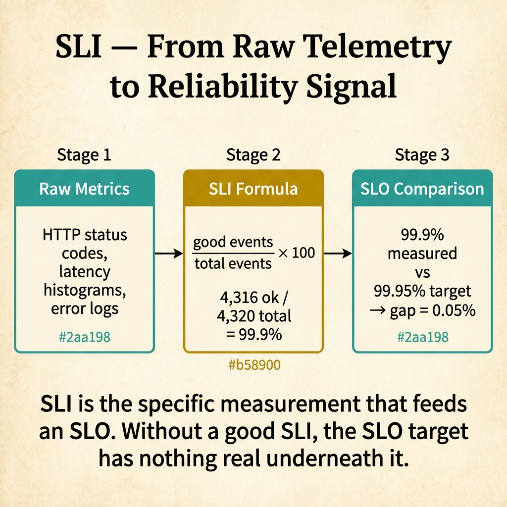
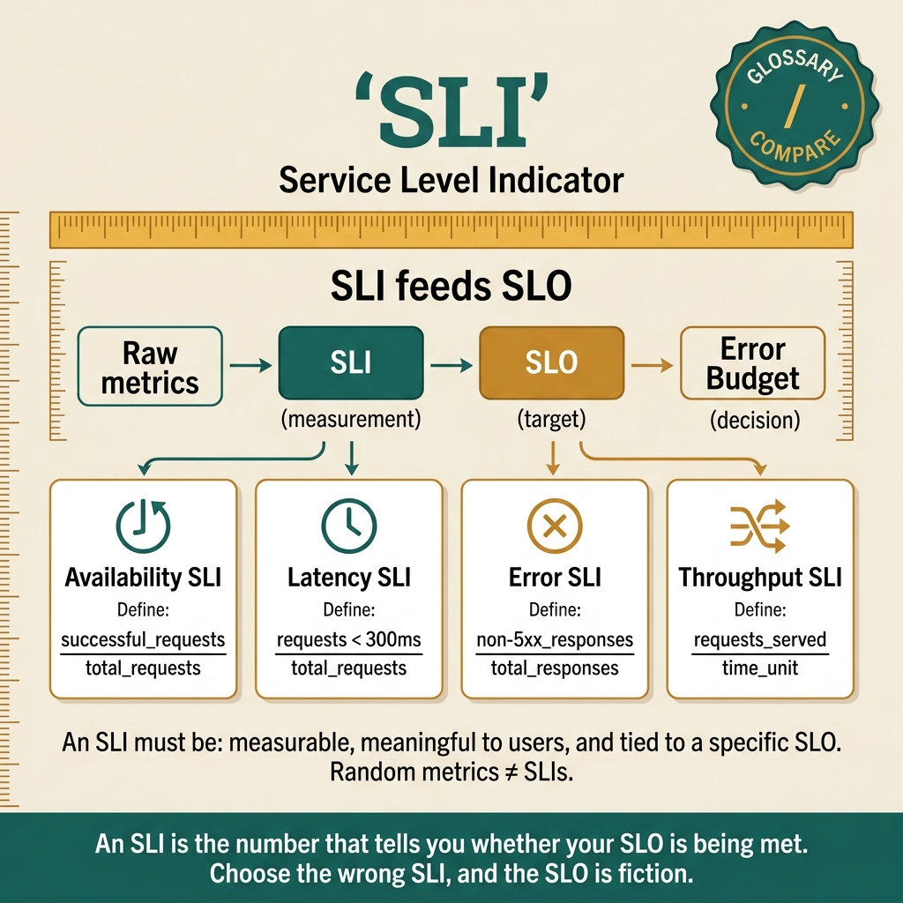

<!-- tags: glossary, reference, observability-operations, sli -->
# SLI (Service Level Indicator)

> A quantitative measurement of a specific aspect of service behavior — the raw signal that feeds SLOs and determines whether the service is meeting its reliability targets.

| Aspect | Detail |
| --- | --- |
| **Concept** | A quantitative measurement of a specific aspect of service behavior — the raw signal that feeds SLOs and determines whether the service is meeting its reliability targets. |
| **Audience** | SRE, backend engineer, platform engineer, observability lead |
| **Primary style** | Glossary term |
| **Entry point** | Use when the question is "what exactly do we measure to know if the service is healthy?" |

📅 Created: 2026-03-30 · 🔄 Updated: 2026-04-18 · ⏱️ 7 min read

---

## 1. DEFINE

The dashboard shows CPU at 40%, memory at 60%, and disk at 25%. Everything looks green. But users are complaining that the checkout flow is broken — 30% of payment requests are timing out. The infrastructure metrics are healthy; the user experience metric is not. The team is measuring the wrong signals. Choosing the right signal is the boundary of **SLI**.

**SLI** (Service Level Indicator) is a quantitative measurement of a specific aspect of service behavior that directly reflects user experience. An SLI is expressed as a ratio: (good events / total events) × 100%. The resulting percentage feeds the SLO.

SLI differs from a metric: all SLIs are metrics, but not all metrics are SLIs. CPU utilization is a metric. "Percentage of requests completing successfully within 500ms" is an SLI — it directly measures what the user experiences.

| Variant | Description |
| --- | --- |
| Availability SLI | Proportion of requests that return a successful response (non-5xx). |
| Latency SLI | Proportion of requests completing within a threshold (e.g., < 500ms). |
| Correctness SLI | Proportion of responses that return the correct result. |
| Freshness SLI | Proportion of data retrievals returning data updated within a threshold. |

| SLI type | Formula | When to use |
| --- | --- | --- |
| Request-based | good_requests / total_requests | Synchronous APIs, web endpoints. |
| Window-based | good_minutes / total_minutes | Background jobs, batch processing. |
| Event-based | good_events / total_events | Streaming systems, message queues. |

Core insight:

> The SLI must measure what the user experiences, not what the server reports. A server that responds with 200 OK in 50ms but returns wrong data has a latency SLI of 100% and an availability SLI of 100% — but a correctness SLI far below target. Choosing the right SLI means choosing the right dimension of user experience.

### 1.1 Invariants & Failure Modes

- SLIs must be measured at the point closest to the user — load balancer or client-side, not application-side.
- SLIs must be a ratio (good/total), not an absolute number (count of errors).
- SLIs must directly correlate with user experience — CPU usage is never an SLI.

Failure mode: the team measures availability at the application server. The load balancer drops requests due to connection limits. Application-side availability shows 99.99%; user-side availability is 98%. The SLI does not detect the real problem.

---

## 2. CONTEXT

**Who uses it**: SRE, backend engineer, platform engineer, observability lead

**When**: When the question is "what exactly do we measure to know if the service is healthy?"

**Purpose**: SLIs are the foundation of the reliability stack: SLI feeds SLO, SLO feeds error budget, error budget governs feature velocity. If the SLI measures the wrong thing, the entire chain is invalid.

**In the ecosystem**:
SLI is the bottom of the reliability pyramid. SLIs produce numbers. SLOs set thresholds on those numbers. SLAs set contracts on those thresholds. Error budgets track the gap. Without correct SLIs, SLOs are guesses.

---

The concept is clear. But which SLIs should you pick for your service, where do you measure them, and how do you avoid the trap of measuring infrastructure instead of experience?

## 3. EXAMPLES

SLI surfaces most clearly when the dashboard is green but users are unhappy, when the team debates whether to track latency at p50 or p99, or when a correctness bug goes undetected because the SLI only measures availability. The examples below place the measurement into exactly those situations.

### Example 1: Basic — Choose SLIs for a lending API based on user journeys

> **Goal**: Select SLIs that directly reflect the user's experience with the lending application flow.
> **Approach**: Map user journeys to measurable service behaviors.
> **Example**: A lending API with three critical user journeys: application submission, status check, and payment processing.
> **Complexity**: Basic — from user journey to SLI.

```yaml
sli_selection:
  journey_1_application_submission:
    sli_type: "availability"
    formula: "successful_submissions / total_submissions"
    measurement_point: "API gateway (closest to user)"
    success_criteria: "HTTP 2xx response"
  journey_2_status_check:
    sli_type: "latency"
    formula: "requests_under_500ms / total_requests"
    measurement_point: "API gateway"
    threshold: "500ms at p95"
  journey_3_payment_processing:
    sli_type: "correctness"
    formula: "correctly_processed_payments / total_payments"
    measurement_point: "payment reconciliation (end-to-end)"
    success_criteria: "payment amount matches, no duplicates"
  anti_pattern:
    wrong_sli: "CPU utilization, pod count, queue depth"
    why_wrong: "infrastructure metrics do not measure user experience"
```



*Figure: SLI transforms raw metrics (HTTP codes, latency histograms) through a formula (good events / total events) into a measured percentage that compares against the SLO target. Without a well-chosen SLI, the SLO has nothing real underneath it.*

**Why?** Each user journey has a different primary SLI. Application submission needs availability (can the user submit?). Status check needs latency (does it load fast?). Payment needs correctness (is the amount right?). A single SLI does not capture all three.

**Takeaway**: SLIs are derived from user journeys, not from infrastructure dashboards. Each critical journey gets its own SLI.

### Example 2: Intermediate — Measure SLIs at the right point in the stack

> **Goal**: Ensure SLI measurements reflect actual user experience, not server-side self-reporting.
> **Approach**: Compare measurement points: application, load balancer, and client-side.
> **Example**: A lending API where the application reports 99.99% availability but users experience 98%.
> **Complexity**: Intermediate — choosing the correct measurement point.

```yaml
sli_measurement_points:
  application_side:
    measurement: "99.99% availability (application health check)"
    blind_spot: "load balancer drops, network timeouts, TLS errors"
    use_case: "debugging, but NOT for SLI"
  load_balancer_side:
    measurement: "99.5% availability (includes dropped connections)"
    catches: "upstream errors, connection limits, timeout"
    use_case: "best default SLI measurement point"
  client_side:
    measurement: "98% availability (includes DNS, CDN, client-side errors)"
    catches: "everything the user actually experiences"
    use_case: "most accurate SLI, but hardest to collect"
  recommendation:
    primary: "load balancer (best coverage-to-complexity ratio)"
    enrichment: "client-side RUM for critical journeys"
    avoid: "application-side only (self-reporting hides real failures)"
```

**Why?** The farther from the user the measurement point, the more failures are invisible. Application-side SLI misses load balancer drops. Load balancer SLI misses DNS issues. Client-side catches everything but adds collection complexity. The load balancer is the pragmatic default.

**Takeaway**: Measure SLIs at the load balancer as the default. Add client-side measurement for the most critical journeys.

### Example 3: Advanced — Build a composite SLI for multi-signal reliability assessment

> **Goal**: Combine availability, latency, and correctness SLIs into a single reliability score for governance.
> **Approach**: Weighted composite SLI that reflects the relative importance of each dimension.
> **Example**: A lending platform where a payment that is correct but slow is better than a payment that is fast but wrong.
> **Complexity**: Advanced — multi-dimensional reliability measurement.

```yaml
composite_sli:
  individual_slis:
    availability: {weight: 0.3, current: "99.5%"}
    latency: {weight: 0.2, current: "95%"}
    correctness: {weight: 0.5, current: "99.99%"}
  formula: "(0.3 × availability) + (0.2 × latency) + (0.5 × correctness)"
  composite_score: "(0.3 × 99.5) + (0.2 × 95) + (0.5 × 99.99) = 98.85 + 19.0 + 49.995 = 98.85%"
  slo_on_composite: "98.5%"
  governance:
    - "composite score feeds the error budget"
    - "individual SLIs are tracked separately for diagnosis"
    - "if composite is healthy but one SLI is degraded, investigate the weak signal"
  warning: "composite SLIs can mask individual failures — always monitor components separately"
```

**Why?** A composite SLI gives leadership a single number for governance while preserving individual SLIs for engineering diagnosis. The weighting reflects business priorities: correctness (0.5) matters more than latency (0.2) for a lending platform.

**Takeaway**: Advanced SLI design combines dimensions with business-weighted scoring but always keeps individual signals visible for debugging.

---

## 4. COMPARE



*Figure: SLI positioned as the measurement foundation feeding SLOs, SLAs, and error budgets.*

SLI sounds like "just a metric." The difference is intention: a metric measures anything. An SLI measures what the user experiences. CPU is a metric. "99.5% of requests successful within 500ms" is an SLI.

### Level 1

```text
Metric: "CPU is at 40%"        → tells you about the server
SLI:    "99.5% requests < 500ms" → tells you about the user experience
```
*Figure: Level 1 — SLI measures user experience, not server health.*

### Level 2

```text
Concept    What it is               Example
─────────  ───────────────────────  ────────────────────────────
Metric     Any measurement          CPU utilization, memory usage
SLI        User-facing measurement  good_requests / total_requests
SLO        Target on an SLI         "availability SLI ≥ 99.9%"
SLA        Contract on an SLO       "99.5% uptime or 10% credit"
```
*Figure: Level 2 — the reliability pyramid from measurement to contract.*

### Easily confused or boundary-slipping

| # | Severity | Mistake | Consequence | Fix |
| --- | --- | --- | --- | --- |
| 1 | 🔴 Fatal | Using CPU/memory as SLIs | Dashboard is green but users are unhappy | SLIs must measure user-facing behavior. |
| 2 | 🟡 Common | Measuring availability only | Slow or incorrect responses go undetected | Add latency and correctness SLIs. |
| 3 | 🟡 Common | Measuring at the application, not the load balancer | Self-reporting hides real failures | Measure closest to the user. |
| 4 | 🔵 Minor | Too many SLIs per service | Team cannot focus; every SLI adds monitoring burden | 2-5 SLIs per service, mapped to critical user journeys. |

### Quick scan

| If you face | Action |
| --- | --- |
| Dashboard green but users complain | SLIs are measuring the wrong thing — switch to user-facing metrics |
| Cannot tell if the service is "healthy" | Define availability + latency + correctness SLIs |
| SLO breached but unclear which dimension failed | Break composite SLI into individual components |

---

## 5. REF

| Resource | Type | Link | Note |
| --- | --- | --- | --- |
| Google SRE Book — SLIs | Free Book | https://sre.google/sre-book/service-level-objectives/ | How Google selects and measures SLIs. |
| The Art of SLOs | Course | https://sre.google/resources/practices-and-processes/art-of-slos/ | Practical workshop on SLI/SLO design. |
| Prometheus Best Practices | Reference | https://prometheus.io/docs/practices/naming/ | Naming conventions for SLI metrics. |

---

## 6. RECOMMEND

SLI answers "what do we measure?" The next question: what happens when the measurement shows we have room to fail?

| Expand to | When | Reason | File/Link |
| --- | --- | --- | --- |
| Topic hub | When SLI needs broader context | Return to the observability overview | [Observability & Operations](./README.md) |
| Previous concept | When the question is the contract, not the measurement | SLA translates SLIs into business commitments | [SLA](./02-sla.md) |
| Next concept | When the question is governance, not measurement | Error budget turns SLI/SLO gap into a decision-making tool | [Error Budget](./04-error-budget.md) |

Back to the green dashboard and unhappy users — CPU 40%, memory 60%, but 30% of payments timing out. Now you know: measure the payment SLI (good_payments / total_payments), not the CPU metric. The SLI tells you what the user sees.

**Links**: [← Previous](./02-sla.md) · [→ Next](./04-error-budget.md)
