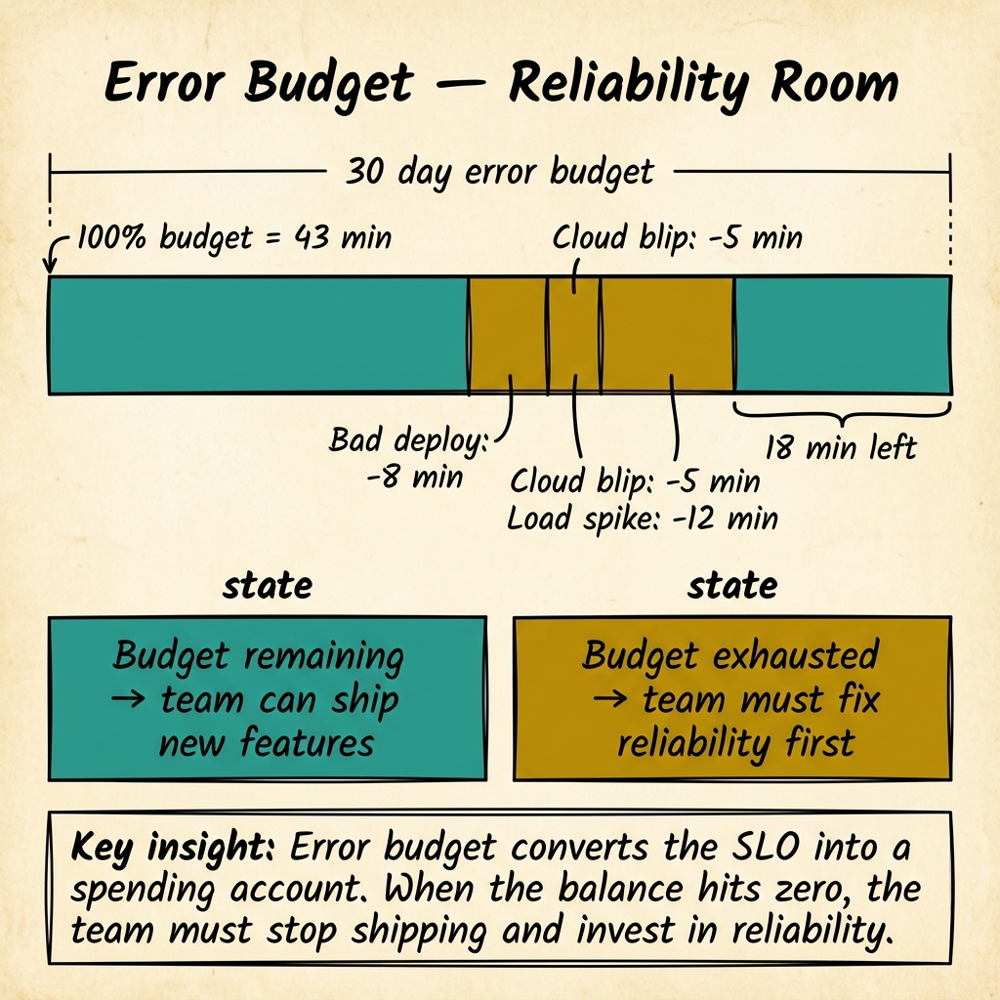
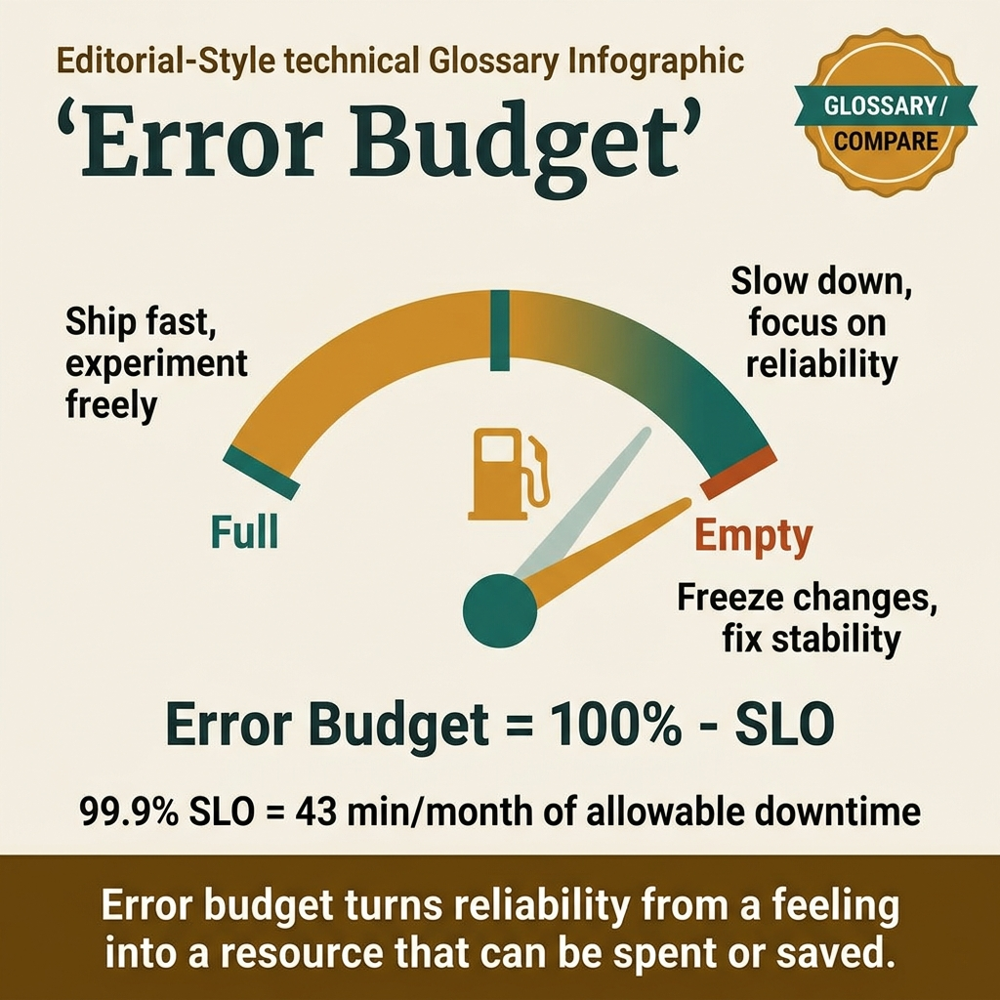

<!-- tags: glossary, reference, observability-operations, error-budget -->
# Error Budget

> The quantified amount of unreliability a service is allowed before the SLO is breached — the difference between perfect reliability (100%) and the SLO target, used as a governance mechanism to balance feature velocity with reliability investment.

| Aspect | Detail |
| --- | --- |
| **Concept** | The quantified amount of unreliability a service is allowed before the SLO is breached — the difference between 100% and the SLO target, used as a governance mechanism. |
| **Audience** | SRE, engineering manager, product manager, tech lead |
| **Primary style** | Glossary term |
| **Entry point** | Use when the question is "how much room do we have to fail before reliability becomes a priority over features?" |

📅 Created: 2026-03-30 · 🔄 Updated: 2026-04-18 · ⏱️ 7 min read

---

## 1. DEFINE

The PM wants to deploy a risky database migration this sprint. The SRE says the service has been unstable — two incidents last week. The PM argues the feature is critical for the quarter. The SRE argues another incident will erode user trust. Both are right. What is missing is a shared number that tells them whether there is room for risk. That number is the boundary of **Error Budget**.

**Error Budget** is the quantified amount of unreliability a service is allowed before its SLO is breached. If the SLO is 99.9% availability, the error budget is 0.1% — roughly 43 minutes of downtime per 30-day rolling window. Every incident, failed deploy, or degradation consumes the budget. When the budget is healthy, ship features freely. When the budget is spent, prioritize reliability.

Error budget is not a target for failure — it is a permission slip. It says: "this much unreliability is acceptable because the cost of perfection exceeds the benefit."

| Variant | Description |
| --- | --- |
| Time-based budget | Measured in minutes of allowed downtime per month (e.g., 43 min for 99.9%). |
| Request-based budget | Measured in number of allowed failed requests per period. |
| Burn-rate budget | Measured by the rate at which the budget is consumed — alerts on fast burn. |

| SLO | Error budget (30 days) | Minutes | Impact |
| --- | --- | --- | --- |
| 99% | 1% | 432 min (~7.2 hours) | Very generous — most services can tolerate this. |
| 99.9% | 0.1% | 43 min | Standard for production APIs. |
| 99.95% | 0.05% | 21.6 min | Tight — limits deploy frequency and risk. |
| 99.99% | 0.01% | 4.3 min | Extremely tight — almost no room for error. |

Core insight:

> Error budget turns the subjective "should we prioritize reliability or features?" into an objective "how much budget remains?" If the budget is healthy, the data says ship. If the budget is spent, the data says stabilize. Neither side argues from opinion.

### 1.1 Invariants & Failure Modes

- Error budget consequences must be real — feature freeze when budget is spent.
- Error budget must be tracked against the same SLI/SLO that defines it.
- Error budget policy must be agreed on before the budget is spent, not during a crisis.

Failure mode: the team tracks the error budget on a dashboard but never enforces consequences. The budget reaches 0%, features keep shipping, incidents keep happening, and the error budget becomes a decorative metric.

---

## 2. CONTEXT

**Who uses it**: SRE, engineering manager, product manager, tech lead

**When**: When the question is "how much room do we have to fail before reliability becomes a priority over features?"

**Purpose**: Error budget turns the reliability-vs-velocity conflict into a data-driven decision. It depersonalizes the trade-off and makes both sides work from the same number.

**In the ecosystem**:
Error budget is the governance layer on top of SLO. SLIs measure. SLOs set targets. Error budgets track the gap. SLAs add business consequences. Without error budgets, SLOs are targets without governance — numbers on a wall with no action.

---

The budget is clear. But how do you track burn rate, what policies do you enforce, and how do you handle the politics of feature freezes?

## 3. EXAMPLES

Error budget surfaces most clearly when the PM asks "can we deploy this risky change?" and the dashboard shows 5% remaining, when a single incident burns 60% of the monthly budget and forces a reliability sprint, or when the team has never enforced an error budget policy and the concept is purely theoretical. The examples below place the governance mechanism into exactly those situations.

### Example 1: Basic — Calculate and track error budget for a lending API

> **Goal**: Make the error budget visible and track consumption against the SLO.
> **Approach**: Calculate budget from SLO, track consumption from SLI measurements.
> **Example**: A lending API with 99.9% availability SLO.
> **Complexity**: Basic — the foundational budget calculation.

```yaml
error_budget_tracking:
  slo: "99.9% availability over 30-day rolling window"
  budget_calculation:
    total_minutes_per_month: 43200  # 30 days × 24 hours × 60 minutes
    allowed_downtime: 43.2  # minutes (0.1% of 43200)
  current_month:
    incidents:
      - {date: "day 5", duration: "12 min", cause: "failed deploy"}
      - {date: "day 12", duration: "8 min", cause: "database connection spike"}
    total_consumed: "20 minutes"
    budget_remaining: "23.2 minutes (53.7%)"
    budget_burn_rate: "1.67 min/day (on track to exhaust by day 19)"
  dashboard:
    - "budget_remaining_percent — primary governance metric"
    - "budget_burn_rate — early warning of accelerating consumption"
    - "forecast_budget_exhaustion_date — when will budget hit 0?"
```



*Figure: Error budget converts the SLO into a spending account. Bad deploys, cloud blips, and load spikes consume the 43-minute budget. When the balance hits zero, the team must stop shipping and invest in reliability.*

**Why?** Without tracking, the error budget is a concept. With tracking, it is a real-time governance tool. The burn rate and forecast give the team advance warning before the budget is spent.

**Takeaway**: Error budgets become governance tools only when they are tracked in real-time with burn rate and exhaustion forecasts.

### Example 2: Intermediate — Define and enforce error budget policies

> **Goal**: Create policies that automatically trigger actions at different budget thresholds.
> **Approach**: Define tiered policies that escalate from review to freeze as the budget depletes.
> **Example**: A lending platform where the PM and SRE disagree on deploy timing.
> **Complexity**: Intermediate — from tracking to governance.

```yaml
error_budget_policy:
  agreed_by: ["VP Engineering", "Product Director", "SRE Lead"]
  tiers:
    healthy:
      threshold: "budget > 50%"
      actions:
        - "deploy normally via CI/CD"
        - "take calculated risks (migrations, refactors)"
    caution:
      threshold: "budget 25%-50%"
      actions:
        - "deploy with extra review (SRE sign-off)"
        - "defer risky changes to next month"
        - "root cause analysis for recent incidents"
    critical:
      threshold: "budget 5%-25%"
      actions:
        - "feature freeze — only reliability and bug fixes"
        - "post-mortem for any incident not yet analyzed"
        - "daily budget review in standup"
    exhausted:
      threshold: "budget < 5%"
      actions:
        - "mandatory reliability sprint"
        - "no deploys without VP approval"
        - "incident review with leadership"
  enforcement: "CI/CD pipeline checks budget before allowing production deploy"
  override: "VP can override, but must document rationale and accept accountability"
```

**Why?** Policies must be agreed on before the budget is spent, not during a crisis. When the budget hits 5%, the policy — already signed by leadership — removes the decision from individual opinion. This is the governance mechanism that makes error budgets operational.

**Takeaway**: Error budget policies are agreements made in peacetime that automate decisions in wartime. Without pre-agreed policies, the budget is advisory, not operational.

### Example 3: Advanced — Alert on burn rate for proactive budget management

> **Goal**: Detect when the error budget is being consumed faster than normal before it is exhausted.
> **Approach**: Use multi-window burn rate alerting to distinguish sustained burns from spikes.
> **Example**: A 30-minute incident burns 70% of the monthly budget — detected in real-time.
> **Complexity**: Advanced — proactive governance through burn rate analysis.

```yaml
burn_rate_alerting:
  concept: "burn rate = actual consumption rate / expected consumption rate"
  normal_burn: "1.0 (budget consumed evenly over 30 days)"
  windows:
    fast_burn:
      window: "1 hour"
      threshold: "burn rate > 14.4x"
      meaning: "budget will exhaust in ~2 days at this rate"
      action: "page SRE immediately"
    medium_burn:
      window: "6 hours"
      threshold: "burn rate > 6x"
      meaning: "budget will exhaust in ~5 days"
      action: "alert SRE + engineering manager"
    slow_burn:
      window: "3 days"
      threshold: "burn rate > 1.5x"
      meaning: "budget will exhaust before month end"
      action: "notify in daily standup"
  multi_window_rule: "alert only when BOTH short AND long window exceed threshold"
  benefit: "catches sustained degradation, not transient spikes"
```

**Why?** Budget remaining alone is a lagging indicator — it tells you the budget is gone after the fact. Burn rate is a leading indicator — it tells you the budget is going fast before it is gone. Multi-window alerting eliminates false alarms from short spikes.

**Takeaway**: Advanced error budget management alerts on burn rate, not budget remaining. Multi-window burn rate catches sustained degradation without alerting on transient noise.

---

## 4. COMPARE



*Figure: Error budget as the governance mechanism connecting SLI measurement to feature velocity policy.*

Error budget sounds like "allowed failures." It is, but the power is in the governance: the budget determines whether the team ships features or fixes reliability. Without governance, it is just a number.

### Level 1

```text
SLO: 99.9% availability
Budget: 0.1% = 43 minutes/month of allowed unreliability
Remaining: 23 minutes (53%) → ship features
Remaining: 2 minutes (5%)  → feature freeze
```
*Figure: Level 1 — the budget is the gap between perfect and target. The remaining budget governs what the team does.*

### Level 2

```text
Budget state     Action                      Who decides
──────────────   ─────────────────────────   ──────────────────
> 50%            Ship freely                 Team (autonomous)
25-50%           Ship with review            Team + SRE sign-off
5-25%            Feature freeze              Engineering manager
< 5%             Reliability sprint          VP (mandatory)
```
*Figure: Level 2 — each budget tier escalates authority and restricts velocity.*

### Easily confused or boundary-slipping

| # | Severity | Mistake | Consequence | Fix |
| --- | --- | --- | --- | --- |
| 1 | 🔴 Fatal | Error budget tracked but never enforced | Budget is decorative; reliability never improves | Pre-agree on policies with leadership sign-off. |
| 2 | 🟡 Common | Alerting on budget remaining instead of burn rate | Learn about the problem after the budget is gone | Multi-window burn rate alerting catches problems early. |
| 3 | 🟡 Common | Setting SLO too tight → budget always exhausted → permanent freeze | Feature velocity drops to zero; team demoralized | Loosen SLO to match what users actually need. |
| 4 | 🔵 Minor | Different teams use different budget windows | Inconsistent governance across services | Standardize on 30-day rolling window. |

### Quick scan

| If you face | Action |
| --- | --- |
| PM and SRE argue about deploy timing | Check error budget — it is the data-driven tiebreaker |
| Budget always spent by mid-month | Either SLO is too tight or reliability needs investment |
| One incident consumes the whole budget | Review incident impact and consider SLO adjustment |

---

## 5. REF

| Resource | Type | Link | Note |
| --- | --- | --- | --- |
| Google SRE Book — Error Budgets | Free Book | https://sre.google/sre-book/embracing-risk/ | How Google uses error budgets to balance risk. |
| Alerting on SLOs (Google) | Reference | https://sre.google/workbook/alerting-on-slos/ | Multi-window, multi-burn-rate alerting methodology. |
| Alex Hidalgo — Implementing SLOs | Book | https://www.oreilly.com/library/view/implementing-service-level/9781492076803/ | Practical error budget policy templates. |

---

## 6. RECOMMEND

Error budget answers "how much room do we have to fail?" The journey through the SLI → SLO → SLA → Error Budget chain is complete.

| Expand to | When | Reason | File/Link |
| --- | --- | --- | --- |
| Topic hub | When error budget needs broader context | Return to the observability overview | [Observability & Operations](./README.md) |
| Previous concept | When the question is measurement, not governance | SLI is the metric that feeds the budget | [SLI](./03-sli.md) |
| Next concept | When the question is recovery time, not budget | MTTR measures how long recovery takes | [MTTR](./05-mttr.md) |

Back to the PM-vs-SRE standoff — "deploy the migration" vs. "stabilize first." Now you know: check the error budget. At 53%, deploy with review. At 5%, feature freeze. The budget is the tiebreaker, not the argument.

**Links**: [← Previous](./03-sli.md) · [→ Next](./05-mttr.md)
