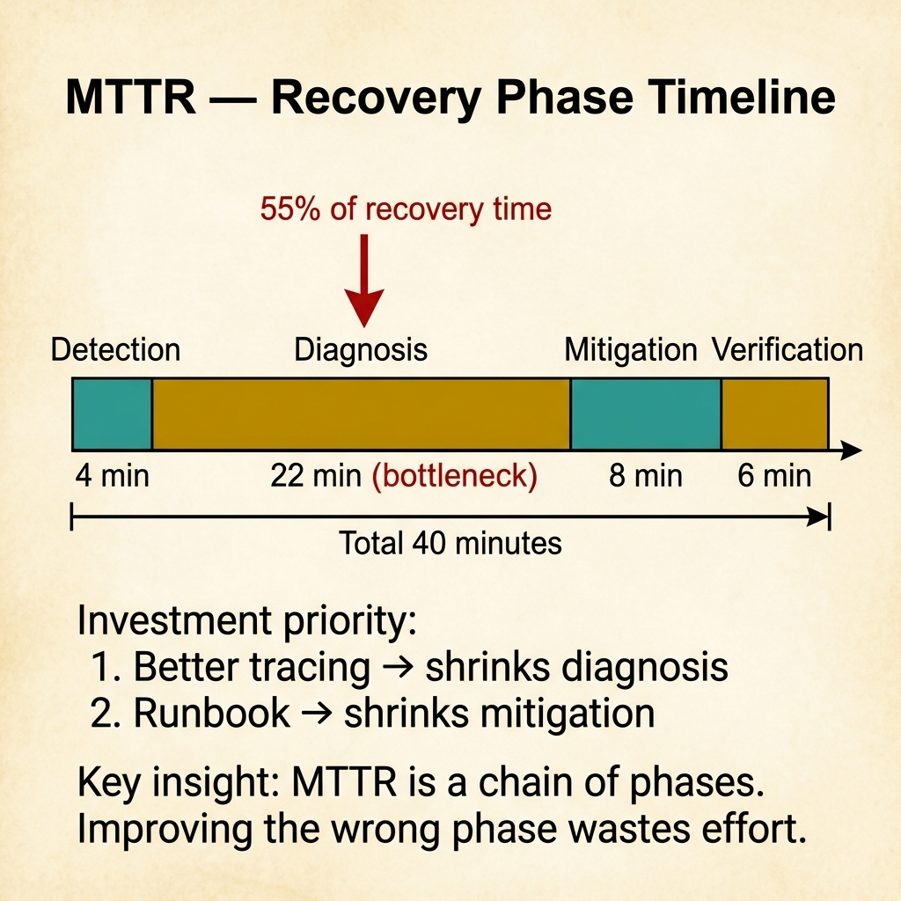
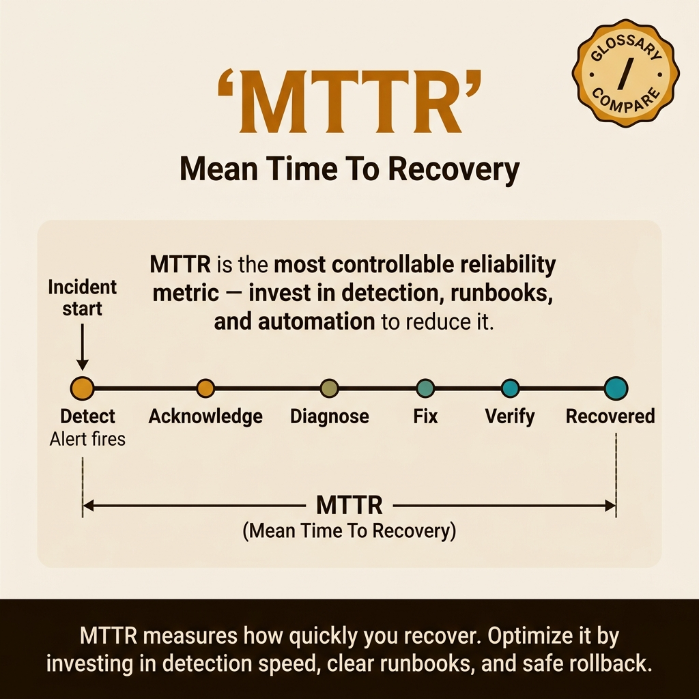

<!-- tags: glossary, reference, observability-operations, mttr -->

# MTTR

> Mean Time To Recovery measures the average time from when an incident causes impact to when the service is restored to an acceptable state.

| Aspect            | Detail                                                                                                                                      |
| ----------------- | ------------------------------------------------------------------------------------------------------------------------------------------- |
| **Concept**       | Mean Time To Recovery measures the average time from when an incident causes impact to when the service is restored to an acceptable state. |
| **Audience**      | SRE, on-call engineer, engineering manager                                                                                                  |
| **Primary style** | Glossary term                                                                                                                               |
| **Entry point**   | Use when the team wants to understand recovery capability after incidents, not just incident frequency.                                     |

📅 Created: 2026-03-30 · 🔄 Updated: 2026-04-16 · ⏱️ 8 min read

---

## 1. DEFINE

Two teams have the same number of incidents per month, but one pulls users out of trouble in 10 minutes while the other takes 2 hours. The difference is not reliability before the incident — it is recovery speed after things break. That is the boundary MTTR operates in.

**MTTR** is the average time from when an incident causes impact to when the service is restored to an acceptable state.

| Variant          | Description                                                  |
| ---------------- | ------------------------------------------------------------ |
| Incident MTTR    | Measures from detection or impact to restored service.       |
| Component MTTR   | Measures recovery capability of a specific component.        |
| Operational MTTR | Includes detection, diagnosis, mitigation, and verification. |

| Approach                  | Time                 | Space | When to choose                                               |
| ------------------------- | -------------------- | ----- | ------------------------------------------------------------ |
| Simple incident averaging | O(n incidents)       | O(n)  | When incident volume is small and definition is consistent.  |
| Phase-based MTTR          | O(n incident phases) | O(n)  | When you want to separate detection, triage, and mitigation. |
| Severity-weighted MTTR    | O(n incidents)       | O(n)  | When impact varies greatly between incidents.                |

Core insight:

> MTTR does not tell you whether the system breaks often. It tells you how fast the team recovers after it breaks.

### 1.1 Invariants & Failure Modes

The most common mistake is measuring MTTR from when the ticket is created rather than when the user is actually impacted. This produces an artificially low number and hides detection latency.

---

## 2. CONTEXT

**Who uses it**: SRE, on-call engineer, engineering manager

**When**: Use when the team wants to understand recovery capability, not just incident frequency.

**Purpose**: MTTR tells you how fast the team recovers after breakage, not whether breakage is frequent.

**In the ecosystem**:

- MTTR differs from MTBF: MTBF looks at gaps between failures, MTTR looks at recovery speed.
- MTTR is meaningless if the definition of "recovered" is vague.
- MTTR does not replace RTO: RTO is a planning target, MTTR is the measured result of what actually happened.

---

The average recovery time is clear. But when does MTTR measurement start, does detection time count, and what should the MTTR target be?

## 3. EXAMPLES

MTTR surfaces most clearly when an incident takes 4 hours but 3 of those are detection and triage, when the team optimizes fix time but ignores detection time, or when MTTR reports 15 minutes but measures from when the fix started, not from when the incident occurred. The examples below place the pattern into exactly those situations.

### Example 1: Basic — Define the correct start and end points of recovery

Do not let MTTR be beautified by convenient timestamps.

```text
  MTTR measurement boundary:

  ❌ Convenient timestamps
  ┌──────────────────────────────────────────────┐
  │  Start: on-call opens Slack (t=12m)         │
  │  End:   PR merged (t=40m)                   │
  │  MTTR: 28 minutes ← looks good             │
  │                                              │
  │  But: user was impacted since t=0            │
  │  Real MTTR: 40 minutes                       │
  │  Hidden: 12 min detection gap               │
  └──────────────────────────────────────────────┘

  ✅ Honest impact window
  ┌──────────────────────────────────────────────┐
  │  Start: error rate spikes (t=0)             │
  │  End:   user-facing behavior restored       │
  │  MTTR: 40 minutes ← reflects reality        │
  └──────────────────────────────────────────────┘
```

_Figure: Starting MTTR from a convenient internal timestamp hides 12 minutes of detection latency. The honest measurement starts from actual user impact._

```yaml
mttr_definition:
    start: user_impact_detected_or_started
    end: service_restored_to_acceptable_state
    exclude: postmortem_documentation_time
```



*Figure: MTTR is not one number — it is a chain of four phases. Diagnosis consumes 55% of recovery time in this example. Improving the wrong phase wastes effort.*

**Why?** MTTR is meaningless if start and end are chosen by whichever internal timestamp is easiest to pull. The team must measure the time the user was actually hurting, not the time convenient for reports.

**Conclusion**: Basic MTTR measurement means locking an honest impact window before computing averages.

### Example 2: Intermediate — Break detection, diagnosis, and mitigation apart to find where recovery is slow

At the intermediate level, the total MTTR number is not enough. You need to know which phase is the bottleneck.

```text
  Incident phase breakdown:

  ┌─ Total MTTR: 40 minutes ──────────────────┐
  │                                            │
  │  Detection:    4m  ████                    │
  │  Diagnosis:   22m  ██████████████████████  │ ← bottleneck
  │  Mitigation:   8m  ████████                │
  │  Verification: 6m  ██████                  │
  │                                            │
  │  Investment priority:                      │
  │    1. Better tracing → shrinks diagnosis   │
  │    2. Runbook → shrinks mitigation         │
  │    3. Alerting → shrinks detection         │
  └────────────────────────────────────────────┘
```

_Figure: Diagnosis consumes 55% of recovery time. Without phase-level data, the team only knows MTTR is bad but not where to invest._

```yaml
incident_phases:
    detection: 4m
    diagnosis: 22m
    mitigation: 8m
    verification: 6m
```

**Why?** MTTR is a total. Without phase separation, the team sees the final score but does not know whether to invest in alert quality, tooling, or rollback capability.

**Conclusion**: Intermediate MTTR work turns the total into actionable phases.

### Example 3: Advanced — Use MTTR data to invest in recovery capability

At the advanced level, MTTR data drives a resilience investment roadmap.

```text
  MTTR → investment mapping:

  ┌─ Pattern: diagnosis always slow ────────────┐
  │  for payment incidents                      │
  │                                             │
  │  Root cause: no trace correlation           │
  │  between gateway → payment → ledger         │
  │                                             │
  │  Interventions:                             │
  │    ┌─────────────────────────────────────┐  │
  │    │ 1. Better tracing across services   │  │
  │    │ 2. Incident runbook for payments    │  │
  │    │ 3. Rollback automation              │  │
  │    └─────────────────────────────────────┘  │
  │                                             │
  │  Expected outcome: diagnosis drops from     │
  │  22 min → < 10 min                          │
  └─────────────────────────────────────────────┘
```

_Figure: MTTR data reveals that diagnosis is consistently the bottleneck for payment incidents due to missing trace correlation. The investment targets the dominant delay._

```yaml
mttr_improvement_plan:
    dominant_delay: diagnosis
    interventions: [better_tracing, incident_runbook, rollback_automation]
    expected_outcome: lower_recovery_time
```

**Why?** MTTR is only worth measuring if it leads to concrete investment: better alerting, clearer runbooks, faster rollback, or deeper telemetry. Otherwise, it is just a pretty retrospective number that does not make the team recover faster.

**Conclusion**: At the advanced level, MTTR should become a backlog for investing in recovery capability.

---

## 4. COMPARE



_Figure: Compare card pulls MTTR into its real recovery-timeline problem — which phase is slow, which phase is worth investing in, and where teams commonly measure wrong to look better._

MTTR is not just "fix fast or slow." This visual emphasizes that recovery is a chain of multiple phases, so improving MTTR requires knowing whether the bottleneck is detection, diagnosis, or mitigation.

### Level 1

```text
incident starts
  -> detection
  -> diagnosis
  -> mitigation
  -> service restored
```

_Figure: Level 1 shows MTTR spans the entire chain from impact to recovery._

### Level 2

```text
slow detection + fast fix
  -> MTTR still bad
fast detection + slow fix
  -> MTTR still bad in a different way
```

_Figure: Level 2 emphasizes that good MTTR requires both detection and mitigation to be fast._

### Easily confused or boundary-slipping

You have seen at which observation or operations layer MTTR belongs. The mistakes below are common misuses where telemetry is plentiful but decisions remain blind.

| #   | Severity  | Mistake                                                               | Consequence                              | Fix                                                          |
| --- | --------- | --------------------------------------------------------------------- | ---------------------------------------- | ------------------------------------------------------------ |
| 1   | 🔴 Fatal  | Measuring from a convenient internal timestamp instead of real impact | Artificially low MTTR                    | Start from impact or the closest detection to impact.        |
| 2   | 🟡 Common | Not breaking recovery into phases                                     | Knowing it is slow but not knowing where | Track detection, diagnosis, and mitigation separately.       |
| 3   | 🟡 Common | Treating MTTR as an individual on-call metric                         | Wrong incentives and blame culture       | Use MTTR to fix the system and process, not to grade people. |
| 4   | 🔵 Minor  | Not defining what "recovered" means                                   | Inconsistent reports                     | Define the end-state clearly by user-facing behavior.        |

### Quick scan

| If you face                               | Action                      |
| ----------------------------------------- | --------------------------- |
| Want to know how fast the team recovers   | Look at MTTR.               |
| MTTR is high but unclear why              | Break incident into phases. |
| Need a recovery target before an incident | Look at RTO.                |

---

## 5. REF

| Resource            | Type      | Link                                           | Note                                                              |
| ------------------- | --------- | ---------------------------------------------- | ----------------------------------------------------------------- |
| Google SRE Workbook | Reference | https://sre.google/workbook/table-of-contents/ | Strong foundation for SLO, error budget, and incident response.   |
| Google SRE Book     | Reference | https://sre.google/sre-book/table-of-contents/ | Canonical source for reliability metrics and operations.          |
| OpenTelemetry Docs  | Official  | https://opentelemetry.io/docs/                 | Standard source for tracing, span, and telemetry instrumentation. |

---

## 6. RECOMMEND

MTTR solves the question "how long did the incident last?" The next question: how does MTBF predict frequency, and what should the RTO target be?

| Expand to              | When                                                          | Reason                                | File/Link                          |
| ---------------------- | ------------------------------------------------------------- | ------------------------------------- | ---------------------------------- |
| Incident document      | When you want to turn learnings into operational guides       | Runbook is the next layer.            | [Runbook](./12-runbook.md)         |
| Post-incident learning | When you need to learn from slow recovery                     | Post-Mortem closes the feedback loop. | [Post-Mortem](./13-post-mortem.md) |
| Planning target        | When you need a pre-incident target, not just historical data | RTO is the closest adjacent concept.  | [RTO](./07-rto.md)                 |

Back to the 4-hour incident at the start — 3 hours were detection and triage. Now you know: MTTR = detect + triage + fix + verify. Optimize the right phase. Detection time is usually the lowest-hanging fruit.

**Links**: [← Previous](./04-error-budget.md) · [→ Next](./06-mtbf.md)
