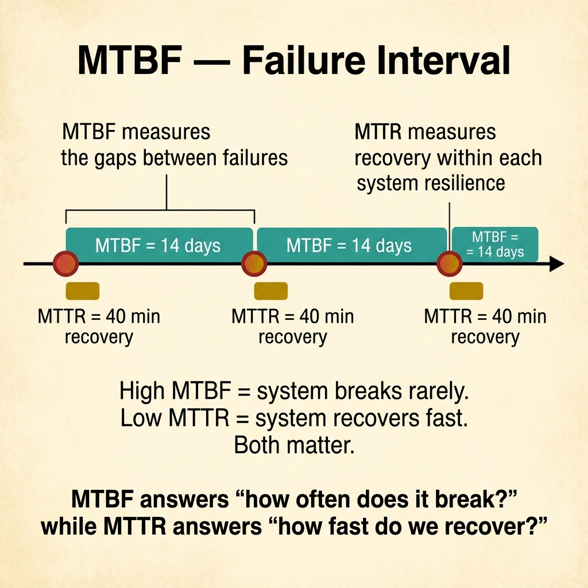
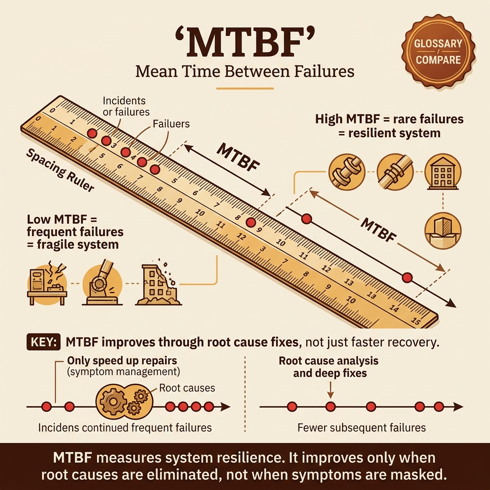

<!-- tags: glossary, reference, observability-operations, mtbf -->

# MTBF

> Mean Time Between Failures measures the average time interval between two significant failures of a system or component.

| Aspect            | Detail                                                                                                                   |
| ----------------- | ------------------------------------------------------------------------------------------------------------------------ |
| **Concept**       | Mean Time Between Failures measures the average time interval between two significant failures of a system or component. |
| **Audience**      | SRE, platform engineer, reliability reviewer                                                                             |
| **Primary style** | Glossary term                                                                                                            |
| **Entry point**   | Use when you need to view stability through the rhythm of recurring failures, not the speed of recovery after each one.  |

📅 Created: 2026-03-30 · 🔄 Updated: 2026-04-16 · ⏱️ 8 min read

---

## 1. DEFINE

A system recovers extremely fast every time it breaks, but every few days it trips over the same type of failure. The problem is no longer recovery muscle — it is the frequency of breakage between cycles. MTBF is the lens that looks at that failure rhythm.

**MTBF** is the average time interval between two significant failures of a system or component.

| Variant                   | Description                                                       |
| ------------------------- | ----------------------------------------------------------------- |
| System MTBF               | Gap between failures at the overall system or workflow level.     |
| Component MTBF            | Gap between failures for a specific service, node, or dependency. |
| Maintenance-informed MTBF | MTBF used to schedule maintenance or component replacement.       |

| Approach                  | Time                          | Space | When to choose                                                    |
| ------------------------- | ----------------------------- | ----- | ----------------------------------------------------------------- |
| Simple interval average   | O(n failures)                 | O(n)  | When failure events are clearly defined.                          |
| Segmented MTBF            | O(n by environment/component) | O(n)  | When you need to split MTBF by cluster, service, or vendor.       |
| Trend-based MTBF analysis | O(n over time)                | O(n)  | When you want to see whether stability is improving or degrading. |

Core insight:

> MTBF looks at the rhythm of recurring failures. It is useful when the question is "how often does it break?" — not "how fast does it recover after breaking?"

### 1.1 Invariants & Failure Modes

The most common mistake is mixing incidents of very different nature into the same MTBF, making the average meaningless and unable to predict anything.

---

## 2. CONTEXT

**Who uses it**: SRE, platform engineer, reliability reviewer

**When**: Use when you need to view stability through recurring failure rhythm, not recovery speed.

**Purpose**: MTBF shows how often things break. It answers "how long between failures?" — not "how fast did we recover?"

**In the ecosystem**:

- MTBF differs from MTTR: one measures the gap between failures, the other measures recovery time.
- MTBF is meaningless if "failure" is not defined consistently.
- MTBF fits best for failure classes that are repeatable or component-level reliability, not every unique one-off outage.

---

The time between failures is clear. But how is MTBF calculated, what predicts reliability, and does high MTBF mean the system is healthy?

## 3. EXAMPLES

MTBF surfaces most clearly when someone claims "the system is stable" without data, when MTBF is 30 days but each incident lasts 4 hours, or when MTBF improves but the severity of each incident also increases. The examples below place the pattern into exactly those situations.

### Example 1: Basic — Define "failure" correctly before computing MTBF

Do not turn MTBF into an average of events that are not the same kind of thing.

```text
  Failure scope — what counts:

  ✅ Same-class failures (count these):
  ┌──────────────────────────────────────────────┐
  │  • Primary DB failover                      │
  │  • Primary DB crash                          │
  │                                              │
  │  These share impact class and root-cause     │
  │  family. MTBF across them is meaningful.     │
  └──────────────────────────────────────────────┘

  ❌ Mixed-class events (exclude these):
  ┌──────────────────────────────────────────────┐
  │  • Minor retry spikes                        │
  │  • Transient client errors                   │
  │                                              │
  │  These are a different severity class.       │
  │  Mixing them deflates MTBF artificially.     │
  └──────────────────────────────────────────────┘
```

_Figure: Only count failures that share the same impact class. Mixing minor retries with catastrophic DB crashes makes the average meaningless._

```yaml
mtbf_scope:
    counted_failures: [primary_db_failover, primary_db_crash]
    excluded_events: [minor_retry_spikes, transient_client_errors]
```



*Figure: MTBF measures the gaps between failures (system resilience), while MTTR measures recovery within each failure. High MTBF = system breaks rarely. Low MTTR = system recovers fast. Both matter.*

**Why?** If the failure set is too mixed, MTBF no longer reflects the failure rhythm of a specific system or component. The team gets a nice-looking number that says nothing.

**Conclusion**: Basic MTBF measurement means locking tight which failure class is being counted.

### Example 2: Intermediate — Segment MTBF by component or environment

Do not let a global average hide local weak spots.

```text
  Segmented MTBF:

  ┌─ Global MTBF: 24 days ─────────────────────┐
  │  Looks healthy.                             │
  └─────────────────────────────────────────────┘

  But segmented:
  ┌─ Cluster A ─┐  ┌─ Cluster B ─┐  ┌─ Staging ──┐
  │  MTBF: 12d  │  │  MTBF: 47d  │  │  MTBF: 5d  │
  │  ⚠️ weak    │  │  ✅ strong  │  │  ❌ noisy  │
  └─────────────┘  └─────────────┘  └────────────┘

  Cluster A is dragging the average down.
  Without segmentation, the team misses the hotspot.
```

_Figure: The global MTBF of 24 days looks acceptable. Segmentation reveals Cluster A fails every 12 days — the real hotspot hidden by the average._

```yaml
segmented_mtbf:
    prod_cluster_a: 12d
    prod_cluster_b: 47d
    staging_cluster: 5d
```

**Why?** A global MTBF often hides hotspots. Segmentation helps the team see which component or environment is actually undermining overall stability and needs investment first.

**Conclusion**: Intermediate MTBF work means peeling back the average to find the truly unstable component.

### Example 3: Advanced — Combine MTBF with MTTR to read reliability posture correctly

Do not interpret MTBF as a standalone number divorced from severity and recovery.

```text
  MTBF × MTTR reliability posture:

  ┌─ Scenario A ────────────────────────────────┐
  │  MTBF: 30 days    (rarely breaks)           │
  │  MTTR: 90 minutes (slow recovery)           │
  │  Impact: catastrophic DB failure            │
  │                                             │
  │  Reading: rare but devastating.             │
  │  Action: invest in resilience.              │
  └─────────────────────────────────────────────┘

  ┌─ Scenario B ────────────────────────────────┐
  │  MTBF: 3 days     (breaks often)            │
  │  MTTR: 2 minutes  (instant recovery)        │
  │  Impact: pod restart, auto-healed           │
  │                                             │
  │  Reading: noisy but harmless.               │
  │  Action: acceptable noise floor.            │
  └─────────────────────────────────────────────┘

  MTBF alone tells the wrong story for both.
```

_Figure: High MTBF with high MTTR means rare but painful failures. Low MTBF with low MTTR means frequent but recoverable noise. MTBF alone misleads in both cases._

```yaml
reliability_review:
    mtbf: 30d
    mttr: 90m
    incident_class: catastrophic_db_failure
    action: resilience_investment
```

**Why?** High MTBF does not automatically mean the system is healthy — if each failure is catastrophic. Conversely, low MTBF with very low MTTR and small impact can be acceptable in some contexts. Reading MTBF alone leads to wrong decisions.

**Conclusion**: At the advanced level, MTBF is only meaningful when read alongside impact and recovery profile.

---

## 4. COMPARE



_Figure: Compare card keeps MTBF in its correct place — recurring failure rhythm, which failure scope is counted, and why the number is meaningless when read apart from MTTR and impact._

MTBF is easily mistaken for an uptime shorthand. This visual deliberately pulls it to its true role: measuring the gap between same-class failures, then placing it next to recovery and severity to avoid misreading reliability posture.

### Level 1

```text
failure #1
  -> stable period
  -> failure #2
  -> stable period
  -> failure #3
```

_Figure: Level 1 shows MTBF measures the gap between failures, not the time during failure._

### Level 2

```text
high MTBF + high MTTR
  -> rare but painful failures
low MTBF + low MTTR
  -> frequent but recoverable issues
```

_Figure: Level 2 shows MTBF must always be read alongside recovery context and severity._

### Easily confused or boundary-slipping

You have seen at which observation or operations layer MTBF belongs. The mistakes below are common misuses where telemetry is plentiful but decisions remain blind.

| #   | Severity  | Mistake                                             | Consequence                    | Fix                                                    |
| --- | --------- | --------------------------------------------------- | ------------------------------ | ------------------------------------------------------ |
| 1   | 🔴 Fatal  | Mixing different failure classes into the same MTBF | Average becomes meaningless    | Lock the failure scope tightly.                        |
| 2   | 🟡 Common | Only looking at system-wide MTBF                    | Missing the unstable component | Segment by component or environment.                   |
| 3   | 🟡 Common | Reading MTBF while ignoring MTTR and severity       | Prioritizing the wrong thing   | Review MTBF alongside impact and recovery.             |
| 4   | 🔵 Minor  | Using MTBF for every ad-hoc incident                | Metric loses predictive value  | Use only for repeatable, well-defined failure classes. |

### Quick scan

| If you face                                   | Action                            |
| --------------------------------------------- | --------------------------------- |
| Want to know how often things break           | Look at MTBF.                     |
| MTBF looks good but outages are still painful | Read alongside MTTR and severity. |
| One cluster drags the average down            | Segment the metric by component.  |

---

## 5. REF

| Resource            | Type      | Link                                           | Note                                                              |
| ------------------- | --------- | ---------------------------------------------- | ----------------------------------------------------------------- |
| Google SRE Workbook | Reference | https://sre.google/workbook/table-of-contents/ | Strong foundation for SLO, error budget, and incident response.   |
| Google SRE Book     | Reference | https://sre.google/sre-book/table-of-contents/ | Canonical source for reliability metrics and operations.          |
| OpenTelemetry Docs  | Official  | https://opentelemetry.io/docs/                 | Standard source for tracing, span, and telemetry instrumentation. |

---

## 6. RECOMMEND

MTBF solves the question "how often does the system fail?" The next question: what should the RTO target be, and how much data loss is acceptable?

| Expand to         | When                                                             | Reason                                  | File/Link                          |
| ----------------- | ---------------------------------------------------------------- | --------------------------------------- | ---------------------------------- |
| Recovery metric   | When you need to pair with recovery speed                        | MTTR is the adjacent metric.            | [MTTR](./05-mttr.md)               |
| Recovery planning | When failure is rare but very severe                             | RTO helps set a recovery target.        | [RTO](./07-rto.md)                 |
| Incident learning | When you want to know why the same failure class keeps returning | Post-Mortem is the next learning layer. | [Post-Mortem](./13-post-mortem.md) |

Back to the "system is stable" claim at the start — no data, just a feeling. Now you know: MTBF measures frequency, MTTR measures duration. You need both to understand real reliability. High MTBF with high MTTR still means every incident hurts.

**Links**: [← Previous](./05-mttr.md) · [→ Next](./07-rto.md)
