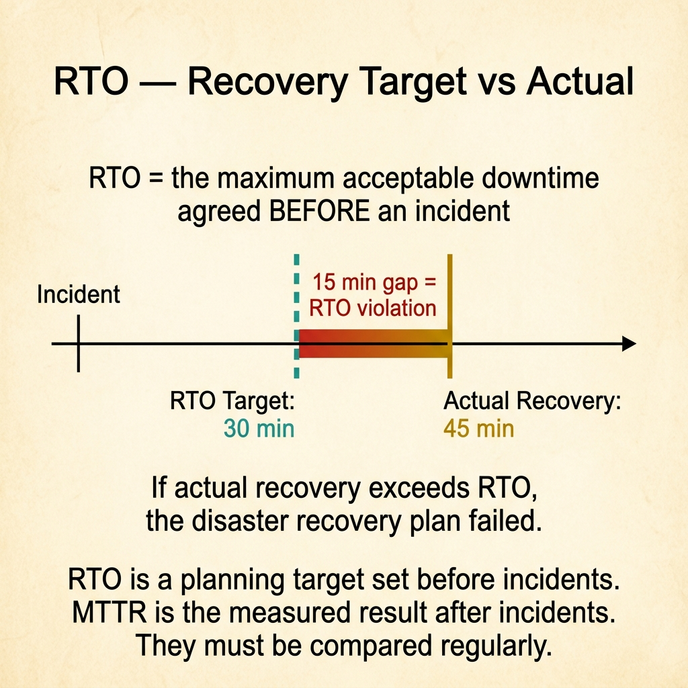
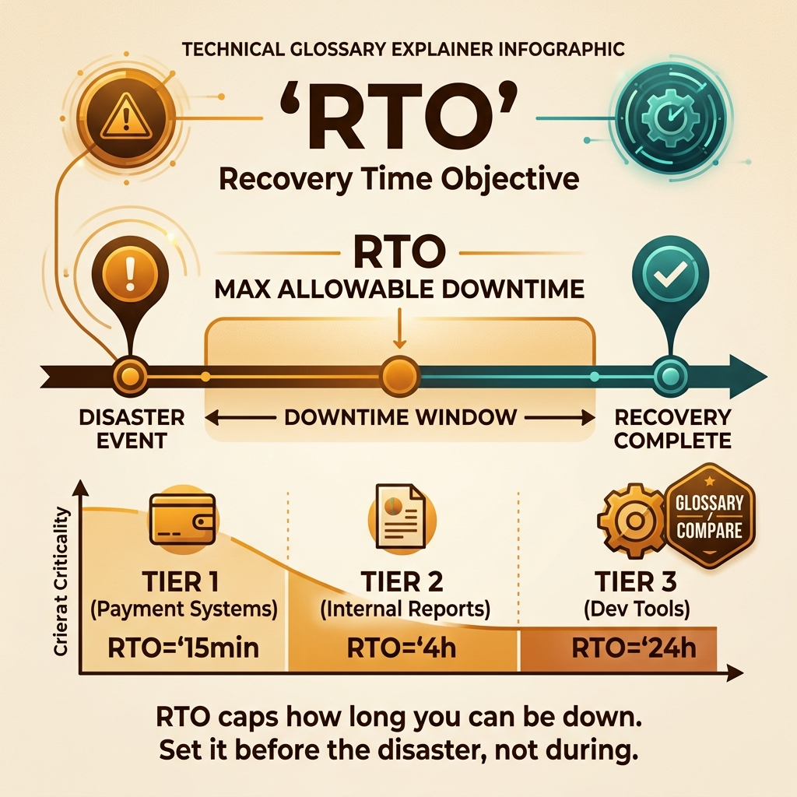

<!-- tags: glossary, reference, observability-operations, rto -->

# RTO

> Recovery Time Objective is the maximum target time to restore a service after an incident or disaster.

| Aspect            | Detail                                                                                                  |
| ----------------- | ------------------------------------------------------------------------------------------------------- |
| **Concept**       | Recovery Time Objective is the maximum target time to restore a service after an incident or disaster.  |
| **Audience**      | SRE, platform engineer, disaster recovery planner                                                       |
| **Primary style** | Glossary term                                                                                           |
| **Entry point**   | Use when you need a planning target for recovery time, not a historical measurement of past recoveries. |

📅 Created: 2026-03-30 · 🔄 Updated: 2026-04-16 · ⏱️ 8 min read

---

## 1. DEFINE

After a major incident, the critical question is not just "how long did recovery take?" but "how long do we accept being down?" RTO answers the second question as a target that must be prepared before the incident happens.

**RTO** is the maximum target time to restore a service after an incident or disaster.

| Variant               | Description                                                   |
| --------------------- | ------------------------------------------------------------- |
| Service RTO           | Recovery target for a specific service or workflow.           |
| Disaster recovery RTO | Recovery target for a site, region, or system-scale disaster. |
| Tiered RTO            | Different targets based on system criticality.                |

| Approach               | Time           | Space | When to choose                                         |
| ---------------------- | -------------- | ----- | ------------------------------------------------------ |
| Single target RTO      | O(1)           | O(1)  | When the service has clear, simple criticality.        |
| Tiered criticality RTO | O(n services)  | O(n)  | When the portfolio has multiple importance levels.     |
| Scenario-based RTO     | O(n scenarios) | O(n)  | When each failure or disaster type has its own target. |

Core insight:

> RTO is a planning target for recovery, not a hindsight measurement. It shapes investment in backup, automation, and runbooks before an incident ever happens.

### 1.1 Invariants & Failure Modes

The most common mistake is setting an ambitious RTO because the business wants peace of mind, but not investing in the automation, backup path, or rehearsal to achieve it. That turns RTO into wishful thinking.

---

## 2. CONTEXT

**Who uses it**: SRE, platform engineer, disaster recovery planner

**When**: Use when you need a planning target for recovery time, not a measured historical outcome.

**Purpose**: RTO shapes investment in backup, automation, and runbooks before the incident happens.

**In the ecosystem**:

- RTO differs from MTTR: RTO is an objective set before the incident; MTTR is the historical result measured after.
- RTO differs from RPO: RTO is about recovery time; RPO is about data loss.
- RTO is meaningless if not tied to a scenario or to the capability that can actually achieve it.

---

The maximum recovery time is clear. But what should each service tier's RTO be, how do you test it, and is RTO zero feasible?

## 3. EXAMPLES

RTO surfaces most clearly when the DR plan says "1 hour" but has never been tested, when the payment service needs a 5-minute RTO but an internal tool tolerates 4 hours, or when RTO zero demands active-active multi-region. The examples below place the pattern into exactly those situations.

### Example 1: Basic — Lock the maximum acceptable recovery time

```text
  RTO as a design constraint:

  ┌─ Checkout workflow ────────────────────────┐
  │                                             │
  │  Scenario: primary region outage            │
  │  RTO target: 30 minutes                     │
  │                                             │
  │  Meaning: if the entire primary region      │
  │  goes down, checkout MUST be restored       │
  │  within 30 minutes.                         │
  │                                             │
  │  Without this number, the team does not     │
  │  know how much to invest in failover.       │
  └─────────────────────────────────────────────┘
```

_Figure: RTO turns "recover as fast as possible" into a concrete number that drives failover and automation investment._

```yaml
rto:
    workflow: checkout
    target_recovery_time: 30m
    scenario: primary_region_outage
```



*Figure: RTO is a planning target set before incidents. When actual recovery exceeds RTO, the disaster recovery plan has failed. The 15-minute gap between target and actual is the signal to invest in faster failover.*

**Why?** Without a specific time threshold, the team does not know how much to invest in failover and automation. RTO turns vague expectations into a target to design systems around.

**Conclusion**: Basic RTO work is turning "must recover fast" into a number that can actually be used.

### Example 2: Intermediate — Tie RTO to specific scenarios instead of a single generic number

```text
  Scenario-based RTO tiers:

  ┌─ Pod-level failure ─────────────────────────┐
  │  RTO: 5 minutes                             │
  │  Mechanism: Kubernetes auto-restart         │
  └─────────────────────────────────────────────┘

  ┌─ Database failover ─────────────────────────┐
  │  RTO: 15 minutes                            │
  │  Mechanism: replica promotion + DNS update  │
  └─────────────────────────────────────────────┘

  ┌─ Full region disaster ──────────────────────┐
  │  RTO: 45 minutes                            │
  │  Mechanism: cross-region failover + traffic │
  │  shift + warm standby activation            │
  └─────────────────────────────────────────────┘
```

_Figure: Different failure classes have different recovery costs and capabilities. A single RTO for all scenarios is either too loose for small failures or unrealistic for major disasters._

```yaml
scenario_rto:
    pod_level_failure: 5m
    database_failover: 15m
    region_disaster: 45m
```

**Why?** Different failure classes have different recovery costs and capabilities. A single RTO for all scenarios is typically either too loose for small errors or unrealistic for large disasters.

**Conclusion**: Intermediate RTO design means setting targets by scenario, not one nice number for every situation.

### Example 3: Advanced — Use RTO to decide investment level in automation and failover

```text
  RTO → capability mapping:

  ┌─ RTO target: 15 minutes ────────────────────┐
  │                                             │
  │  Required capabilities:                     │
  │    ✅ Warm standby replica                  │
  │    ✅ Automated failover promotion          │
  │    ✅ Rehearsed runbook (tested quarterly)  │
  │                                             │
  │  Cannot achieve with:                       │
  │    ❌ Manual restore from cold backup       │
  │    ❌ Untested runbook                      │
  │    ❌ Single-region architecture            │
  │                                             │
  │  Cost reality:                              │
  │  Every minute cut from RTO increases        │
  │  infrastructure and operational cost.       │
  └─────────────────────────────────────────────┘
```

_Figure: A 15-minute RTO demands warm standby, automated failover, and rehearsed runbooks. Without these capabilities, the target is just a slogan._

```yaml
rto_capabilities:
    target: 15m
    requires: [warm_standby, automated_failover, rehearsed_runbook]
    unsupported_if: manual_restore_only
```

**Why?** RTO is a very physical design constraint. Every minute cut from the target usually brings greater architecture and operating cost. If capability does not match, the recovery target is just a slogan.

**Conclusion**: At the advanced level, RTO must be backed by specific capabilities, realistic rehearsals, and clear cost trade-offs.

---

## 4. COMPARE



_Figure: Compare card locks RTO as a planning constraint — target downtime, required capabilities, and common confusions between objective and outcome._

### Level 1

```text
incident or disaster
  -> service unavailable
  -> recovery actions start
  -> must restore before RTO limit
```

_Figure: Level 1 shows RTO is the target time threshold that recovery must beat._

### Level 2

```text
RTO target
  -> drives backup, failover, runbook design
  -> rehearsal proves whether target is realistic
```

_Figure: Level 2 emphasizes RTO is a planning constraint for architecture and operations, not a decorative number._

### Easily confused or boundary-slipping

| #   | Severity  | Mistake                                         | Consequence                                 | Fix                                                      |
| --- | --------- | ----------------------------------------------- | ------------------------------------------- | -------------------------------------------------------- |
| 1   | 🔴 Fatal  | Setting an RTO with no capability to support it | Target is meaningless when disaster strikes | Map RTO to failover, automation, and specific rehearsal. |
| 2   | 🟡 Common | Using one RTO for every failure type            | Planning at the wrong level                 | Split targets by scenario or criticality.                |
| 3   | 🟡 Common | Confusing RTO with MTTR                         | Reporting and planning get mixed up         | Keep objective vs measured outcome clearly separated.    |
| 4   | 🔵 Minor  | Not reviewing RTO when business changes         | Target drifts from current needs            | Periodically reassess RTO by workflow value.             |

### Quick scan

| If you face                              | Action                             |
| ---------------------------------------- | ---------------------------------- |
| Need a pre-incident recovery target      | That is RTO.                       |
| Want to know if the target is achievable | Compare with MTTR.                 |
| Recovery target sounds nice but is vague | Tie it to scenario and capability. |

---

## 5. REF

| Resource            | Type      | Link                                           | Note                                                              |
| ------------------- | --------- | ---------------------------------------------- | ----------------------------------------------------------------- |
| Google SRE Workbook | Reference | https://sre.google/workbook/table-of-contents/ | Strong foundation for SLO, error budget, and incident response.   |
| Google SRE Book     | Reference | https://sre.google/sre-book/table-of-contents/ | Canonical source for reliability metrics and operations.          |
| OpenTelemetry Docs  | Official  | https://opentelemetry.io/docs/                 | Standard source for tracing, span, and telemetry instrumentation. |

---

## 6. RECOMMEND

RTO solves the question "how long can the business tolerate being down?" The next question: how much data loss is acceptable, and how does distributed tracing debug incidents?

| Expand to             | When                                                       | Reason                                 | File/Link                  |
| --------------------- | ---------------------------------------------------------- | -------------------------------------- | -------------------------- |
| Measured recovery     | When you want to compare with actual post-incident outcome | MTTR is the closest pair.              | [MTTR](./05-mttr.md)       |
| Data-loss planning    | When recovery also involves data loss                      | RPO is the mandatory pair.             | [RPO](./08-rpo.md)         |
| Operational execution | When you need capability to achieve the RTO                | Runbook is the next operational layer. | [Runbook](./12-runbook.md) |

Back to the untested DR plan at the start — RTO says 1 hour on paper but reality takes 6. Now you know: RTO is only meaningful when tested regularly. Game days, DR drills, chaos tests — verify the real RTO, not the hoped-for RTO.

**Links**: [← Previous](./06-mtbf.md) · [→ Next](./08-rpo.md)
