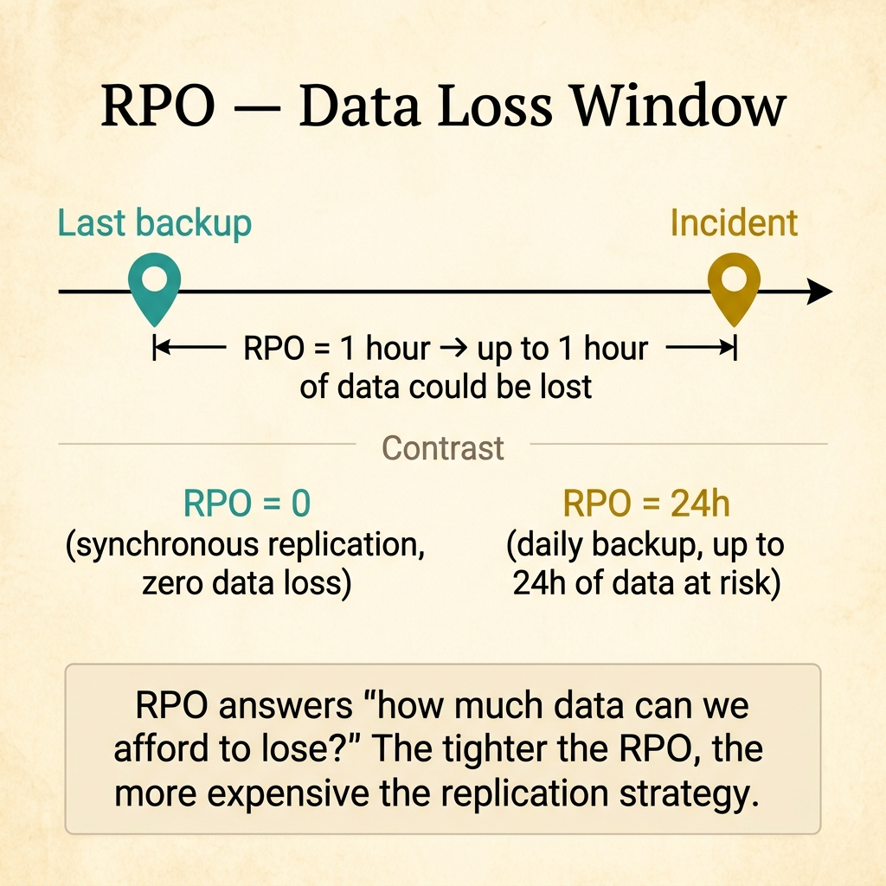
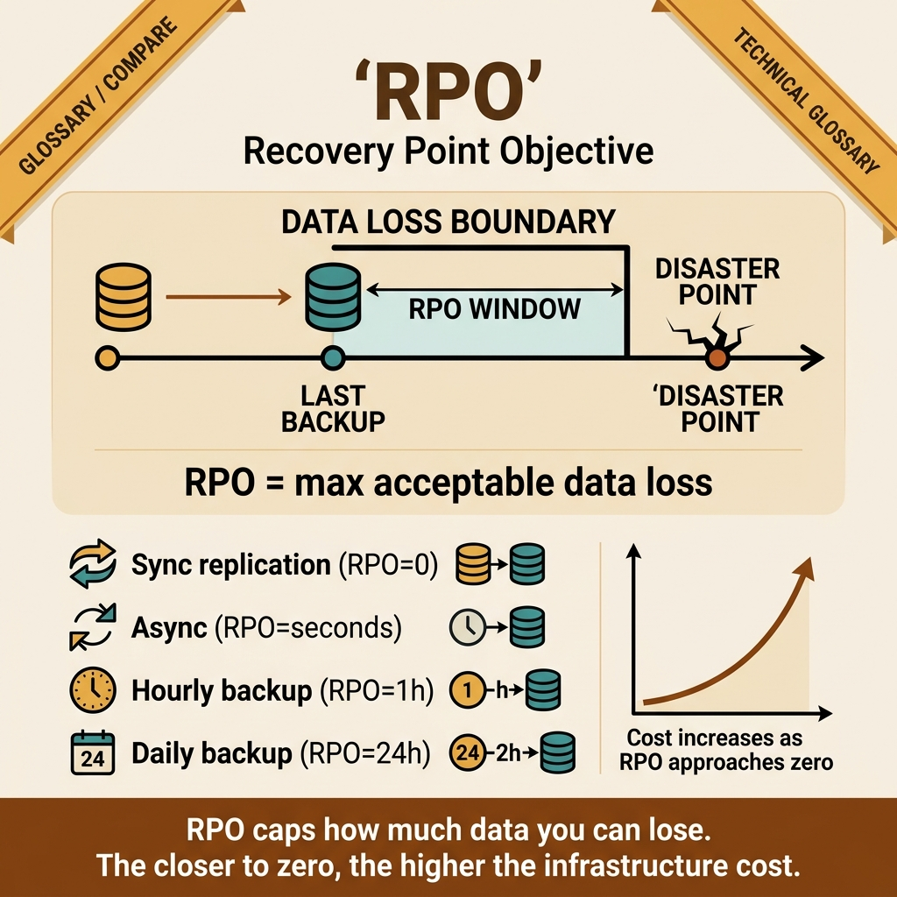

<!-- tags: glossary, reference, observability-operations, rpo -->

# RPO

> Recovery Point Objective is the maximum amount of data that can be acceptably lost when recovering from an incident.

| Aspect            | Detail                                                                                                               |
| ----------------- | -------------------------------------------------------------------------------------------------------------------- |
| **Concept**       | Recovery Point Objective is the maximum amount of data that can be acceptably lost when recovering from an incident. |
| **Audience**      | Platform engineer, database engineer, disaster recovery planner                                                      |
| **Primary style** | Glossary term                                                                                                        |
| **Entry point**   | Use when the disaster recovery discussion needs to specify acceptable data loss, not just recovery time.             |

📅 Created: 2026-03-30 · 🔄 Updated: 2026-04-16 · ⏱️ 8 min read

---

## 1. DEFINE

A system can recover extremely fast but roll back to a state from 2 hours ago — and for many businesses, that is still a disaster. RPO exists to lock the data question: how much history do we accept losing when we rewind after an incident?

**RPO** is the maximum amount of data that can be acceptably lost when recovering from an incident.

| Variant          | Description                                                                  |
| ---------------- | ---------------------------------------------------------------------------- |
| Near-zero RPO    | Data loss approaching zero, usually requiring expensive replication or sync. |
| Minute-level RPO | Accepting the loss of a few minutes of data.                                 |
| Tiered RPO       | Critical workflows get tighter RPO than less important ones.                 |

| Approach                 | Time               | Space             | When to choose                                                    |
| ------------------------ | ------------------ | ----------------- | ----------------------------------------------------------------- |
| Periodic backups         | O(backup interval) | O(backup storage) | When losing data per snapshot interval is acceptable.             |
| Asynchronous replication | O(replication lag) | O(replica state)  | When you need lower RPO than pure backups.                        |
| Synchronous replication  | O(commit latency)  | O(replica state)  | When near-zero data loss is mandatory and the cost is acceptable. |

Core insight:

> RPO does not say how fast the system recovers. It says how far back the data rolls when recovery happens.

### 1.1 Invariants & Failure Modes

The most common mistake is saying "we have backups" and feeling safe, but nobody knows what the backup interval or replication lag actually translates to as an RPO.

---

## 2. CONTEXT

**Who uses it**: Platform engineer, database engineer, disaster recovery planner

**When**: Use when disaster recovery discussions must quantify acceptable data loss, not just recovery time.

**Purpose**: RPO specifies how far back the data rolls after recovery. It drives backup and replication strategy.

**In the ecosystem**:

- RPO differs from RTO: RPO is about data loss, RTO is about downtime.
- RPO cannot be set without looking at the actual backup and replication strategy.
- RPO should be set by business tolerance for data loss, not by vague wishes.

---

How much data loss is acceptable — that is clear. But how much does RPO zero cost, what is backup frequency vs RPO, and how does RPO differ from RTO?

## 3. EXAMPLES

RPO surfaces most clearly when a DB crashes and the last backup is 24 hours old, when RPO zero demands synchronous replication and latency doubles, or when the team confuses RPO with RTO and the restore plan is wrong. The examples below place the pattern into exactly those situations.

### Example 1: Basic — Lock the data-loss level the business can tolerate

```text
  RPO as a data-loss boundary:

  ┌─ Order write path ──────────────────────────┐
  │                                             │
  │  Max data loss: 1 minute                    │
  │  Business reason: financial reconciliation  │
  │                                             │
  │  Meaning: if the system fails, at most      │
  │  1 minute of recorded transactions          │
  │  may be lost on recovery.                   │
  │                                             │
  │  This number drives replication strategy.   │
  └─────────────────────────────────────────────┘
```

_Figure: RPO converts the fear of data loss into a planning number. A 1-minute RPO for the order path drives the choice of replication strategy._

```yaml
rpo:
    workflow: order_write_path
    max_data_loss: 1m
    business_rationale: financial_reconciliation
```



*Figure: RPO defines how much data you can afford to lose. The span between last backup and incident is the data-loss window. RPO = 0 requires synchronous replication; RPO = 24h accepts daily backups. The tighter the RPO, the more expensive the strategy.*

**Why?** If the team does not lock the acceptable data-loss level, backup strategy will be either too expensive or too loose. RPO forces business and engineering to explicitly state their real tolerance for losing recent history.

**Conclusion**: Basic RPO work is turning the fear of data loss into a clear planning number.

### Example 2: Intermediate — Map RPO to the backup or replication model that supports it

```text
  RPO → replication strategy mapping:

  ┌─ RPO target: 5 minutes ─────────────────────┐
  │                                             │
  │  ✅ Can achieve with:                       │
  │    • Frequent WAL shipping (every 1-2 min)  │
  │    • Low-lag async replica                  │
  │                                             │
  │  ❌ Cannot achieve with:                    │
  │    • Nightly backup only (RPO = 24h)        │
  │    • Hourly snapshot (RPO = 1h)             │
  │                                             │
  │  Near-zero RPO requires:                    │
  │    • Synchronous replication                │
  │    • Higher commit latency trade-off        │
  └─────────────────────────────────────────────┘
```

_Figure: A 5-minute RPO needs at least frequent WAL shipping or a low-lag replica. Nightly backups give a 24-hour RPO — a 288x gap from the target._

```yaml
rpo_strategy:
    target: 5m
    options: [frequent_wal_shipping, low_lag_replica]
    not_enough: nightly_backup_only
```

**Why?** RPO does not exist in a vacuum. Every data-loss target pulls very specific requirements on backup cadence, replication lag, and restore mechanics. Without this mapping, RPO is just a management slogan.

**Conclusion**: Intermediate RPO design means connecting the business target to actual storage mechanics.

### Example 3: Advanced — Split RPO by workflow or data class

```text
  Tiered RPO by data class:

  ┌─ Financial ledger ──────────────────────────┐
  │  RPO: near-zero                             │
  │  Strategy: synchronous replication          │
  │  Cost: HIGH (latency + infrastructure)      │
  └─────────────────────────────────────────────┘

  ┌─ Order events ──────────────────────────────┐
  │  RPO: 1 minute                              │
  │  Strategy: async replica + WAL shipping     │
  │  Cost: MEDIUM                               │
  └─────────────────────────────────────────────┘

  ┌─ Analytics pipeline ────────────────────────┐
  │  RPO: 30 minutes                            │
  │  Strategy: periodic snapshot                │
  │  Cost: LOW                                  │
  └─────────────────────────────────────────────┘

  Not all data deserves the same protection cost.
```

_Figure: Financial data demands near-zero RPO with synchronous replication. Analytics data tolerates 30 minutes. Splitting by data class invests the right amount in the right place._

```yaml
data_class_rpo:
    financial_ledger: near_zero
    order_events: 1m
    analytics_pipeline: 30m
```

**Why?** Not all data deserves the same protection cost. Splitting RPO by data class invests correctly in what the business cannot afford to lose and relaxes where acceptable.

**Conclusion**: At the advanced level, RPO should reflect the value of each data class, not a single number for everything.

---

## 4. COMPARE



_Figure: Compare card places RPO on its real data-loss tolerance problem — business target, technical mechanics supporting it, and where teams commonly confuse "having backups" with "having a real RPO."_

### Level 1

```text
failure happens
  -> restore from last valid point
  -> data newer than that point may be lost
```

_Figure: Level 1 shows RPO is the data roll-back distance when restoring from the nearest recovery point._

### Level 2

```text
backup every 15 minutes
  -> worst-case data loss ~= 15 minutes
synchronous replication
  -> worst-case data loss approaches zero
```

_Figure: Level 2 places RPO in direct relationship with backup and replication strategy._

### Easily confused or boundary-slipping

| #   | Severity  | Mistake                                              | Consequence                         | Fix                                                 |
| --- | --------- | ---------------------------------------------------- | ----------------------------------- | --------------------------------------------------- |
| 1   | 🔴 Fatal  | Having backups but not knowing the corresponding RPO | False sense of safety               | Map backup/replication strategy to an explicit RPO. |
| 2   | 🟡 Common | Confusing RPO with recovery time                     | Planning at the wrong layer         | Read RPO alongside RTO but do not mix them.         |
| 3   | 🟡 Common | Using one RPO for all data                           | Cost misdirected or protection gaps | Classify data by criticality.                       |
| 4   | 🔵 Minor  | Not measuring replication lag or backup freshness    | Actual RPO is not verified          | Track freshness and lag as first-class metrics.     |

### Quick scan

| If you face                                    | Action                     |
| ---------------------------------------------- | -------------------------- |
| Need to talk about acceptable data loss        | That is RPO.               |
| Have backups but unsure if they are enough     | Map backup cadence to RPO. |
| Multiple data types with different criticality | Split RPO by data class.   |

---

## 5. REF

| Resource            | Type      | Link                                           | Note                                                              |
| ------------------- | --------- | ---------------------------------------------- | ----------------------------------------------------------------- |
| Google SRE Workbook | Reference | https://sre.google/workbook/table-of-contents/ | Strong foundation for SLO, error budget, and incident response.   |
| Google SRE Book     | Reference | https://sre.google/sre-book/table-of-contents/ | Canonical source for reliability metrics and operations.          |
| OpenTelemetry Docs  | Official  | https://opentelemetry.io/docs/                 | Standard source for tracing, span, and telemetry instrumentation. |

---

## 6. RECOMMEND

RPO solves the question "how much data loss is acceptable?" The next question: how does distributed tracing debug incidents, and what is a span?

| Expand to               | When                                                             | Reason                                          | File/Link                                     |
| ----------------------- | ---------------------------------------------------------------- | ----------------------------------------------- | --------------------------------------------- |
| Recovery time target    | When you need to pair data loss with downtime target             | RTO is the mandatory pair.                      | [RTO](./07-rto.md)                            |
| Data architecture topic | When you need to go deeper into replication and backup mechanics | Data & Database glossary is the adjacent topic. | [Data & Database](../data-database/README.md) |
| Operational execution   | When you need a runbook for restore or failover                  | Runbook is the next action layer.               | [Runbook](./12-runbook.md)                    |

Back to the 24-hour backup at the start — crash, one day of data lost. Now you know: RPO drives the backup and replication strategy. RPO zero = synchronous replication (expensive). RPO 1 hour = hourly backup (cheap). Business decides, engineering implements.

**Links**: [← Previous](./07-rto.md) · [→ Next](./09-distributed-tracing.md)
