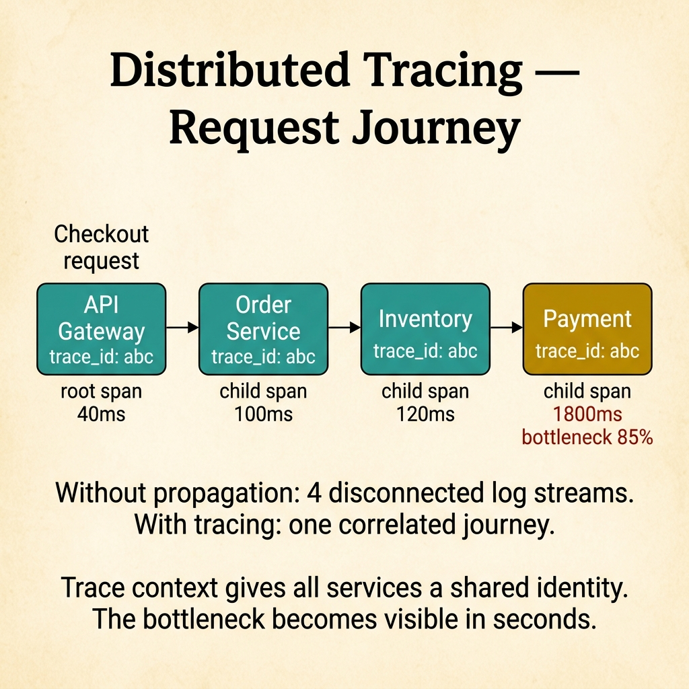
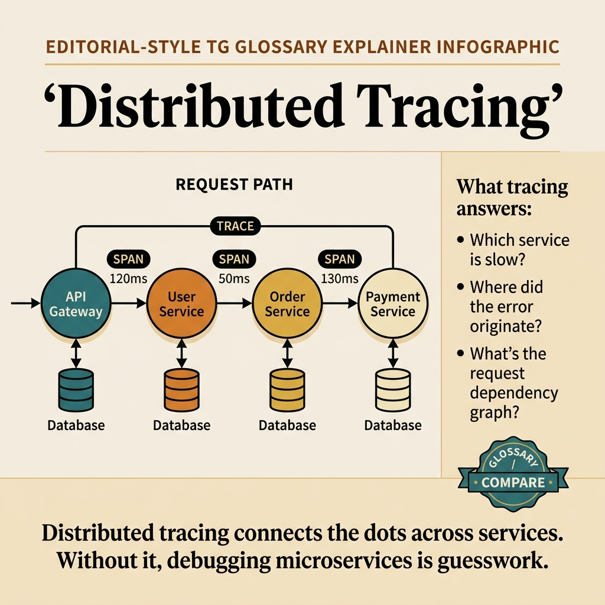

<!-- tags: glossary, reference, observability-operations, distributed-tracing -->

# Distributed Tracing

> Distributed Tracing follows a request across multiple services using a trace ID and a chain of related spans to reconstruct the end-to-end journey.

| Aspect            | Detail                                                                                                                                              |
| ----------------- | --------------------------------------------------------------------------------------------------------------------------------------------------- |
| **Concept**       | Distributed Tracing follows a request across multiple services using a trace ID and a chain of related spans to reconstruct the end-to-end journey. |
| **Audience**      | Backend engineer, SRE, platform engineer                                                                                                            |
| **Primary style** | Glossary term                                                                                                                                       |
| **Entry point**   | Use when logs and metrics are not enough to pinpoint where a specific request is slow inside a distributed system.                                  |

📅 Created: 2026-03-30 · 🔄 Updated: 2026-04-17 · ⏱️ 9 min read

---

## 1. DEFINE

Metrics say checkout is slow. Logs say the payment service has a timeout. But which services the user's specific request passed through, which span was slow, and where it first deviated — neither of those two can fully answer. This is the boundary of distributed tracing.

**Distributed Tracing** is the technique of following a request across multiple services using a trace ID and a chain of related spans to reconstruct the end-to-end journey.

| Variant                | Description                                                    |
| ---------------------- | -------------------------------------------------------------- |
| Request tracing        | Traces across services on the same user request.               |
| Async/message tracing  | Extends the trace through queues, workers, or event pipelines. |
| Sampling-based tracing | Traces only a subset of requests to reduce overhead.           |

| Approach                  | Time             | Space             | When to choose                                                           |
| ------------------------- | ---------------- | ----------------- | ------------------------------------------------------------------------ |
| Header propagation only   | O(1) propagation | O(trace headers)  | When you first need a correlation ID through the service chain.          |
| Full span instrumentation | O(n spans)       | O(trace data)     | When you need detailed latency breakdown by operation.                   |
| Tail-based sampling       | O(n traces)      | O(sampling state) | When you want to keep error and slow traces while reducing storage cost. |

Core insight:

> Distributed tracing does not compete with logs or metrics. It fills exactly the gap of "where did this request go and which span got stuck."

### 1.1 Invariants & Failure Modes

The most common mistake is instrumenting halfway: having a trace ID but not propagating it through a critical hop, or creating spans without semantic names. The result is a trace that looks complete but does not help debugging.

---

## 2. CONTEXT

**Who uses it**: Backend engineer, SRE, platform engineer

**When**: Use when logs and metrics are not enough to pinpoint where a specific request is slow in a distributed system.

**Purpose**: Tracing fills the gap that logs and metrics leave — "where did the request go and which span got stuck."

**In the ecosystem**:

- Distributed tracing differs from plain log correlation: traces carry parent-child structure and timing for each operation.
- Tracing does not replace metrics: metrics are still better for system-level trends and alerting.
- Tracing does not replace logs either: logs are still useful for detailed event inspection within each span.

---

Tracing requests across services is clear. But what sampling rate, how much overhead, and correlation ID vs trace ID?

## 3. EXAMPLES

Distributed tracing surfaces most clearly when a request takes 5 seconds but nobody knows which service is the bottleneck, when 100% sampling causes 30% overhead, or when the trace ID drops when passing through a message queue. The examples below place the pattern into exactly those situations.

### Example 1: Basic — Use a trace to see which hops the request touched

Stop guessing which services the request visited.

```text
  Trace as a request journey:

  ┌─ API Gateway ──┐   ┌─ Order Service ─┐   ┌─ Payment ──────┐
  │  root span     │──▶│  child span     │──▶│  child span    │
  │  trace_id: abc │   │  trace_id: abc  │   │  trace_id: abc │
  └────────────────┘   └─────────────────┘   └────────────────┘
         │
         ▼
  ┌─ Inventory ────┐
  │  child span    │
  │  trace_id: abc │
  └────────────────┘

  All spans share trace_id = abc.
  Parent-child structure shows the call tree.
  Without propagation: four disconnected logs.
```

_Figure: Trace context gives all services a shared identity for the entire request journey. Without propagation, the on-call sees four disconnected log streams._

```yaml
trace_path:
    root: api_gateway
    child_spans: [order_service, payment_service, inventory_service]
    context_propagation: required
```



*Figure: Trace context gives all services a shared identity. The Payment span at 1800ms (85% of total) is immediately visible as the bottleneck. Without propagation, you get 4 disconnected log streams.*

**Why?** When a request crosses multiple hops, correlating by timestamp or log grep quickly becomes ambiguous. Trace context creates a shared identity for the entire journey and makes the parent-child structure visible.

**Conclusion**: Basic tracing starts by not losing request context across critical hops.

### Example 2: Intermediate — Use span timing to locate the specific bottleneck

Knowing the request is slow is step one. Knowing where it is slow is what tracing adds beyond aggregate metrics.

```text
  Span timing breakdown:

  ┌─ checkout (total: 2100ms) ──────────────────┐
  │                                             │
  │  ├─ gateway         40ms  ██                │
  │  ├─ order_validate  100ms ████              │
  │  ├─ inventory_check 120ms █████             │
  │  └─ payment_call   1800ms █████████████████ │ ← bottleneck
  │                              85% of total   │
  │                                             │
  │  Action: investigate payment gateway latency│
  └─────────────────────────────────────────────┘
```

_Figure: The payment call consumes 85% of checkout latency. Without span-level timing, the team only knows checkout is slow but not where._

```yaml
trace_breakdown:
    checkout_total: 2100ms
    payment_call_span: 1800ms
    inventory_span: 120ms
    render_span: 40ms
```

**Why?** Overall latency only confirms there is pain. Span timing reveals where the pain lives in the call chain. This is the point that makes tracing different from aggregate metrics.

**Conclusion**: Intermediate tracing uses span breakdown to turn "slow" into a specific slow location.

### Example 3: Advanced — Control tracing cost with intentional sampling

Keep traces useful without burning storage and CPU recklessly.

```text
  Sampling strategy:

  ┌─ All requests (100%) ───────────────────────┐
  │                                             │
  │  ┌─ Error traces ─────────────────────────┐ │
  │  │  Keep: 100%                            │ │
  │  │  Reason: every error needs visibility  │ │
  │  └────────────────────────────────────────┘ │
  │                                             │
  │  ┌─ Slow traces (p99+) ───────────────────┐ │
  │  │  Keep: 20%                             │ │
  │  │  Reason: tail latency investigation    │ │
  │  └────────────────────────────────────────┘ │
  │                                             │
  │  ┌─ Happy-path traces ────────────────────┐ │
  │  │  Keep: 1%                              │ │
  │  │  Reason: baseline comparison           │ │
  │  └────────────────────────────────────────┘ │
  │                                             │
  │  Strategy: tail-based sampling              │
  │  Effect: ~90% storage reduction             │
  └─────────────────────────────────────────────┘
```

_Figure: Tail sampling keeps the most diagnostically valuable traces — all errors, a fraction of slow requests, and a tiny baseline of happy paths — while cutting storage by about 90%._

```yaml
sampling_policy:
    error_traces: 100%
    slow_traces: 20%
    baseline_happy_path: 1%
    strategy: tail_sampling
```

**Why?** Tracing is information-rich but cost-heavy at full fidelity. Intentional sampling keeps the most diagnostically valuable traces without turning the observation system into a new operational burden.

**Conclusion**: At the advanced level, distributed tracing needs to be managed as a signal economics problem, not just instrumentation.

---

## 4. COMPARE



_Figure: Compare card places tracing where it belongs — following request journeys, complementing logs and metrics, and highlighting three failure modes that destroy diagnostic value._

### Level 1

```text
incoming request
  -> trace id created or continued
  -> service A creates span
  -> service B and C create child spans
```

_Figure: Level 1 shows a trace is a tree of spans sharing one request journey._

### Level 2

```text
latency spike observed
  -> open trace
  -> compare child spans
  -> locate slow dependency or retry loop
```

_Figure: Level 2 shows the primary value of tracing — pinpointing the bottleneck in a specific request's path._

### Easily confused or boundary-slipping

| #   | Severity  | Mistake                                              | Consequence                           | Fix                                                          |
| --- | --------- | ---------------------------------------------------- | ------------------------------------- | ------------------------------------------------------------ |
| 1   | 🔴 Fatal  | Not propagating trace context through a critical hop | Trace breaks, end-to-end view is lost | Standardize propagation at every HTTP/gRPC/message boundary. |
| 2   | 🟡 Common | Vague or overly detailed span naming                 | Traces are hard to read or query      | Name spans by clear operation semantics.                     |
| 3   | 🟡 Common | Enabling 100% tracing unconditionally                | Observation cost spikes               | Use intentional sampling.                                    |
| 4   | 🔵 Minor  | Treating tracing as a replacement for logs           | Missing event detail within each span | Keep traces, logs, and metrics in complementary roles.       |

### Quick scan

| If you face                                    | Action                    |
| ---------------------------------------------- | ------------------------- |
| Metrics say slow but you do not know which hop | Open a trace.             |
| Trace breaks between services                  | Check propagation.        |
| Tracing is too expensive                       | Use intentional sampling. |

---

## 5. REF

| Resource            | Type      | Link                                           | Note                                                              |
| ------------------- | --------- | ---------------------------------------------- | ----------------------------------------------------------------- |
| Google SRE Workbook | Reference | https://sre.google/workbook/table-of-contents/ | Strong foundation for SLO, error budget, and incident response.   |
| Google SRE Book     | Reference | https://sre.google/sre-book/table-of-contents/ | Canonical source for reliability metrics and operations.          |
| OpenTelemetry Docs  | Official  | https://opentelemetry.io/docs/                 | Standard source for tracing, span, and telemetry instrumentation. |

---

## 6. RECOMMEND

Distributed tracing solves the problem of "request is slow but I don't know where the bottleneck is." The next question: what is a span, and what do the golden signals measure?

| Expand to      | When                                                              | Reason                                                | File/Link                                                   |
| -------------- | ----------------------------------------------------------------- | ----------------------------------------------------- | ----------------------------------------------------------- |
| Atomic unit    | When you want to go deeper into the smallest node of a trace      | Span is the next concept.                             | [Span](./10-span.md)                                        |
| Bigger concept | When you want to place tracing inside the three telemetry pillars | Observability is the adjacent hub.                    | [Observability — Logs, Metrics, Traces](./Observability.md) |
| Runbook link   | When tracing is the first diagnostic step in an incident          | Runbook is the operational layer that accompanies it. | [Runbook](./12-runbook.md)                                  |

Back to the 5-second request at the start — nobody knew where the delay lived. Now you know: inject trace context, propagate through every boundary, visualize. Span inside span, the service map appears. Bottleneck visible in seconds.

**Links**: [← Previous](./08-rpo.md) · [→ Next](./10-span.md)
