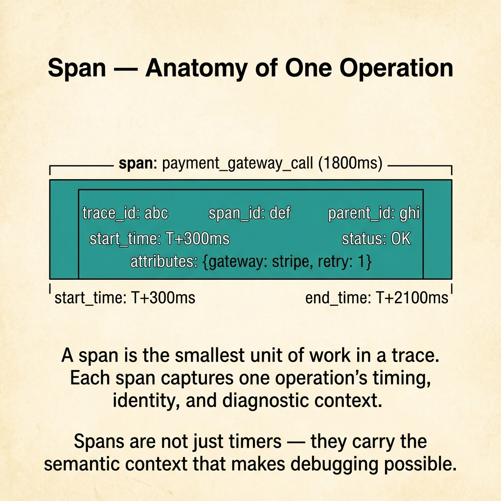
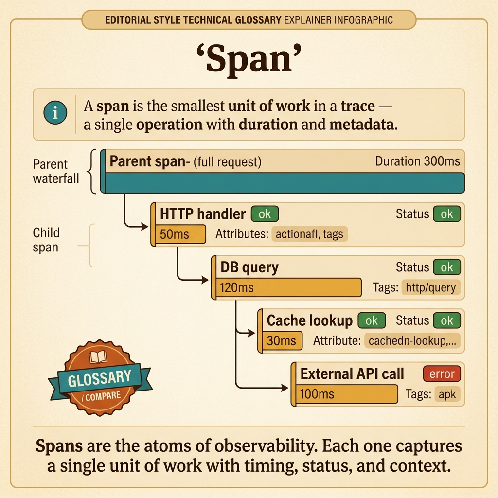

<!-- tags: glossary, reference, observability-operations, span -->

# Span

> A span is the smallest unit in a trace, describing a single operation with its start time, duration, status, and related metadata.

| Aspect            | Detail                                                                                                                             |
| ----------------- | ---------------------------------------------------------------------------------------------------------------------------------- |
| **Concept**       | A span is the smallest unit in a trace, describing a single operation with its start time, duration, status, and related metadata. |
| **Audience**      | Backend engineer, platform engineer, observability reviewer                                                                        |
| **Primary style** | Glossary term                                                                                                                      |
| **Entry point**   | Use when the team needs to say exactly what an operation in a trace is doing, how long it takes, and what context it carries.      |

📅 Created: 2026-03-30 · 🔄 Updated: 2026-04-17 · ⏱️ 8 min read

---

## 1. DEFINE

A trace is only useful because it is composed of named operations with durations and parent-child relationships. If the trace is the journey, each span is a single footstep along that journey. Without understanding spans, tracing is just a pretty diagram.

**Span** is the smallest unit in a trace, describing a single operation with its start time, duration, status, and related metadata.

| Variant       | Description                                             |
| ------------- | ------------------------------------------------------- |
| Root span     | Represents the entire request or originating operation. |
| Child span    | A downstream call or internal processing step.          |
| Internal span | A local operation that is not an outbound dependency.   |

| Approach              | Time                | Space            | When to choose                                                      |
| --------------------- | ------------------- | ---------------- | ------------------------------------------------------------------- |
| Minimal spans         | O(critical ops)     | O(span metadata) | When just starting to instrument and wanting to keep signals clear. |
| Rich semantic spans   | O(n operations)     | O(n attributes)  | When you need deep debugging and better trace queries.              |
| Event-annotated spans | O(n spans + events) | O(n events)      | When a span needs to tell the story of its important milestones.    |

Core insight:

> A span is where timing and context meet. Without proper spans, a trace cannot show which operation truly consumed time or where the error lives.

### 1.1 Invariants & Failure Modes

The most common mistake is creating too few spans — making the trace useless — or too many micro-spans — making the trace noisy. Balancing granularity is the hard part of good instrumentation.

---

## 2. CONTEXT

**Who uses it**: Backend engineer, platform engineer, observability reviewer

**When**: Use when the team needs to state exactly what an operation in a trace is doing, how long it takes, and what context it carries.

**Purpose**: A span is where timing and context meet. Without it, the trace cannot pinpoint which operation is slow or broken.

**In the ecosystem**:

- Span differs from trace: a trace is the full journey; a span is one node in that journey.
- Span differs from a log line: a span has duration and position in a relationship tree; a log line does not.
- Span attributes should be intentional. Not every debug field deserves to be attached to a span.

---

A segment in a trace is clear. But how granular should spans be, what custom attributes to add, and how much overhead do too many spans cause?

## 3. EXAMPLES

Span surfaces most clearly when a trace has one big span for the entire service and the slow DB query is invisible, when too many spans add 50ms overhead per request, or when span attributes are missing and debugging still requires log grep. The examples below place the pattern into exactly those situations.

### Example 1: Basic — Create spans at operations with clear boundaries

Do not leave the trace with only an empty root span.

```text
  Span tree structure:

  ┌─ checkout_request (root span) ─────────────┐
  │  duration: 2100ms                           │
  │                                             │
  │  ├─ db_query (child span)                   │
  │  │  duration: 120ms                         │
  │  │  operation: SELECT orders                │
  │  │                                          │
  │  └─ payment_provider_call (child span)      │
  │     duration: 1800ms                        │
  │     operation: POST /charge                 │
  │     status: OK                              │
  └─────────────────────────────────────────────┘

  Without child spans: "checkout is 2.1s" — useless.
  With child spans: "payment call is 1.8s" — actionable.
```

_Figure: A root span without children tells you the total is 2.1 seconds but nothing about where the time went. Child spans reveal the payment call consumes 85% of it._

```yaml
span_model:
    root_span: checkout_request
    child_spans: [db_query, payment_provider_call]
```



*Figure: A span captures timing (start/end), identity (trace_id, span_id, parent_id), status, and custom attributes. Spans are not just timers — they carry the semantic context that makes bottleneck debugging possible.*

**Why?** If the entire request has only one total span, tracing does not offer much more than a metric duration. The value of spans appears when operations are split at important boundaries — enough to read the bottleneck.

**Conclusion**: Basic span design means creating the right number of spans where they have decision value.

### Example 2: Intermediate — Attach attributes that make spans queryable and explainable

Do not let traces look pretty but lack analysis context.

```text
  Span with semantic attributes:

  ┌─ db_query span ────────────────────────────┐
  │                                             │
  │  service.name:   order-service              │
  │  db.system:      postgresql                 │
  │  db.operation:   SELECT                     │
  │  db.statement:   SELECT * FROM orders...    │
  │  error:          true                       │
  │  error.message:  "connection timeout"       │
  │                                             │
  │  Without attributes:                        │
  │    "span is 120ms, error" — what query?     │
  │  With attributes:                           │
  │    "postgresql SELECT on orders timed out"  │
  └─────────────────────────────────────────────┘
```

_Figure: A span with only duration and error status forces the investigator to grep logs. Semantic attributes make the span self-describing and queryable._

```yaml
span_attributes:
    service.name: order-service
    db.system: postgresql
    db.operation: SELECT
    error: true
```

**Why?** A long span duration without semantics is very hard to query and group. The right attributes help the team find repeating error patterns or slow dependencies by operation type.

**Conclusion**: Intermediate span practice turns the span into an observable unit that can be queried and compared, not just a duration bar.

### Example 3: Advanced — Choose span granularity just right so the trace stays readable

Do not instrument too little or too much.

```text
  Span granularity policy:

  ✅ Worth instrumenting:
  ┌──────────────────────────────────────────────┐
  │  • Network calls (HTTP, gRPC)               │
  │  • Database queries                          │
  │  • Retry loops                               │
  │  • Queue handoffs                            │
  │  • Cache miss paths                          │
  │                                              │
  │  Reason: these are diagnostic boundaries     │
  │  where latency and errors hide.              │
  └──────────────────────────────────────────────┘

  ❌ Not worth instrumenting:
  ┌──────────────────────────────────────────────┐
  │  • Tiny helper functions (< 1ms)             │
  │  • Trivial value mapping                     │
  │  • Pure computation steps                    │
  │                                              │
  │  Reason: these add noise and overhead        │
  │  without diagnostic value.                   │
  └──────────────────────────────────────────────┘
```

_Figure: Instrument at diagnostic boundaries where latency and errors actually hide. Skip micro-helpers that add noise without decision value._

```yaml
span_granularity_policy:
    keep: [network_calls, db_queries, retries, queue_handoffs]
    avoid: [tiny_helper_functions, trivial_value_mapping]
```

**Why?** Too-coarse granularity makes the trace non-actionable. Too-fine granularity makes it noisy and expensive. A good span is one that makes a real investigation faster.

**Conclusion**: At the advanced level, span design is a signal design problem, not just instrumentation coverage.

---

## 4. COMPARE



_Figure: Compare card places Span on its diagnostic job — the smallest trace unit, granularity just right to find bottlenecks, and which metadata makes traces queryable._

### Level 1

```text
trace
  -> root span
    -> child span A
    -> child span B
```

_Figure: Level 1 shows spans are the nodes that compose the trace tree._

### Level 2

```text
one slow request
  -> inspect span durations
  -> identify longest child span
  -> correlate status and attributes
```

_Figure: Level 2 emphasizes the span is the unit for reading timing and context of each operation._

### Easily confused or boundary-slipping

| #   | Severity  | Mistake                                                     | Consequence                           | Fix                                        |
| --- | --------- | ----------------------------------------------------------- | ------------------------------------- | ------------------------------------------ |
| 1   | 🔴 Fatal  | Only a root span, no meaningful child spans                 | Trace does not help find bottlenecks  | Create spans at diagnostic boundaries.     |
| 2   | 🟡 Common | Stuffing too many temporary debug attributes                | Trace becomes heavy and hard to query | Keep attributes with clear semantic value. |
| 3   | 🟡 Common | Creating spans for every tiny helper                        | Trace turns noisy and expensive       | Choose granularity by diagnostic value.    |
| 4   | 🔵 Minor  | Naming spans in ways that do not reflect the real operation | Trace review becomes confusing        | Name spans by clear action and domain.     |

### Quick scan

| If you face                             | Action                   |
| --------------------------------------- | ------------------------ |
| Want to know what a trace is made of    | Look at spans.           |
| Trace looks pretty but is hard to query | Review span attributes.  |
| Trace is very cluttered                 | Adjust span granularity. |

---

## 5. REF

| Resource            | Type      | Link                                           | Note                                                              |
| ------------------- | --------- | ---------------------------------------------- | ----------------------------------------------------------------- |
| Google SRE Workbook | Reference | https://sre.google/workbook/table-of-contents/ | Strong foundation for SLO, error budget, and incident response.   |
| Google SRE Book     | Reference | https://sre.google/sre-book/table-of-contents/ | Canonical source for reliability metrics and operations.          |
| OpenTelemetry Docs  | Official  | https://opentelemetry.io/docs/                 | Standard source for tracing, span, and telemetry instrumentation. |

---

## 6. RECOMMEND

Span solves the problem of "knowing the request is slow but not which segment is slow." The next question: what do the golden signals measure overall, and how does a runbook handle incidents?

| Expand to      | When                                                 | Reason                                                 | File/Link                                                   |
| -------------- | ---------------------------------------------------- | ------------------------------------------------------ | ----------------------------------------------------------- |
| Parent concept | When you want to return to the larger journey        | Distributed Tracing is the layer directly above spans. | [Distributed Tracing](./09-distributed-tracing.md)          |
| Telemetry hub  | When you want to connect spans with logs and metrics | Observability is the bigger picture.                   | [Observability — Logs, Metrics, Traces](./Observability.md) |
| Incident work  | When tracing is the primary debug step in an outage  | Runbook is the next operational layer.                 | [Runbook](./12-runbook.md)                                  |

Back to the single big span at the start — knew the service was slow but not which segment. Now you know: instrument key operations — DB query, external call, business logic. Each span = one answer to "how long did this part take?"

**Links**: [← Previous](./09-distributed-tracing.md) · [→ Next](./11-golden-signals.md)
