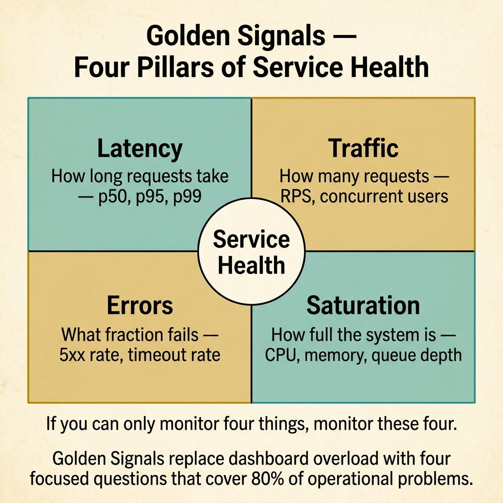
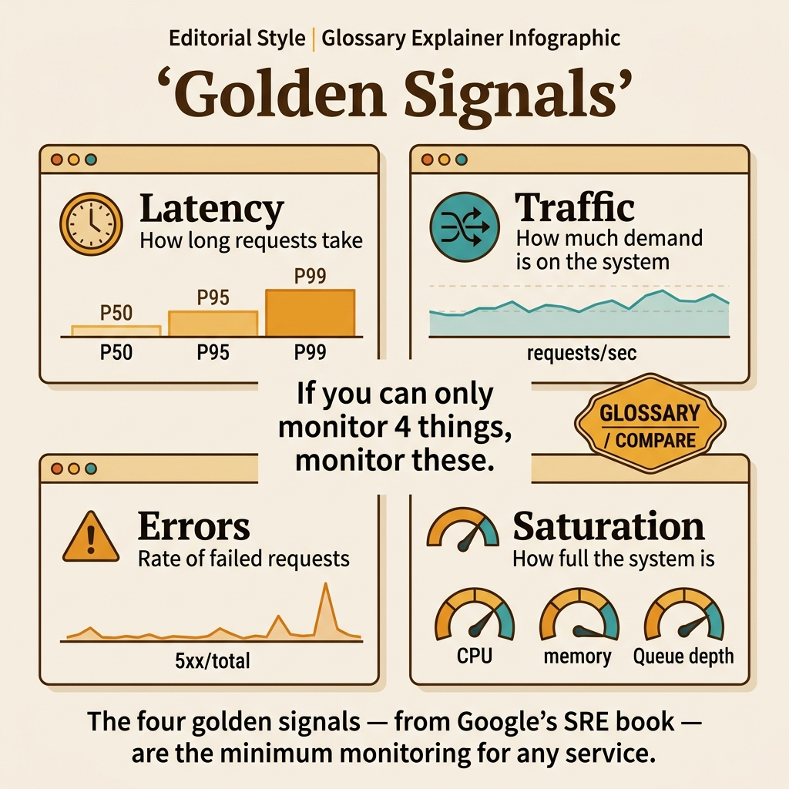

<!-- tags: glossary, reference, observability-operations, golden-signals -->
# Golden Signals

> The four key metrics — latency, traffic, errors, and saturation — that provide the minimum viable monitoring for any service, as defined by Google SRE.

| Aspect | Detail |
| --- | --- |
| **Concept** | The four key metrics — latency, traffic, errors, and saturation — that provide the minimum viable monitoring for any service, as defined by Google SRE. |
| **Audience** | SRE, backend engineer, platform engineer, observability lead |
| **Primary style** | Glossary term |
| **Entry point** | Use when the question is "what is the minimum set of metrics I need to monitor for a service I know nothing about?" |

📅 Created: 2026-03-30 · 🔄 Updated: 2026-04-18 · ⏱️ 7 min read

---

## 1. DEFINE

The new service has 47 Grafana panels: CPU, memory, disk IOPS, network packets, Go goroutine count, GC pause times, thread count, file descriptors, context switches. The on-call engineer is paged at 3 AM. They open the dashboard and see 47 lines — some green, some yellow, some red. They have no idea which one matters. The four that always matter — regardless of the service, the stack, or the language — are the boundary of **Golden Signals**.

**Golden Signals** are four metrics defined by Google SRE as the minimum viable monitoring for any service:

1. **Latency** — how long it takes to serve a request (distinguish successful vs. failed requests).
2. **Traffic** — how much demand is being placed on the system (requests/second, transactions/second).
3. **Errors** — the rate of requests that fail (explicit errors like 5xx, implicit errors like wrong content).
4. **Saturation** — how full the system is, focusing on the most constrained resource (CPU, memory, connections).

The four signals are sufficient to detect most service problems. Additional metrics refine the diagnosis, but the Golden Signals detect it.

| Signal | What it answers | Example metric |
| --- | --- | --- |
| Latency | "Is the service fast?" | request_duration_seconds (p50, p95, p99) |
| Traffic | "Is the service in use?" | http_requests_total / second |
| Errors | "Is the service correct?" | http_responses_5xx / http_responses_total |
| Saturation | "Is the service at capacity?" | connection_pool_active / connection_pool_max |

| Approach | Metric count | Detection coverage | When to choose |
| --- | --- | --- | --- |
| Golden Signals only | 4 | ~80% of problems | Minimum viable monitoring for any service. |
| Golden + USE (Utilization, Saturation, Errors) | 7-10 | ~90% of problems | When infrastructure resource analysis is needed. |
| Golden + RED (Rate, Errors, Duration) | 4-6 | ~85% of problems | When focused on request-centric services. |
| Full observability | 20+ | ~95% of problems | When debugging specific subsystems. |

Core insight:

> Golden Signals answer the on-call engineer's first four questions at 3 AM: "Is the service slow? Is it busy? Is it failing? Is it full?" If these four questions have clear answers on the dashboard, triage takes seconds. If they are buried in 47 panels, triage takes hours.

### 1.1 Invariants & Failure Modes

- Latency must distinguish successful vs. failed requests (a fast 500 error does not mean "fast service").
- Traffic must be measured in business-meaningful units (requests/sec, not bytes/sec).
- Saturation must focus on the most constrained resource, which changes over time.

Failure mode: the team monitors CPU saturation but ignores connection pool saturation. CPU is at 20%, but all 10 database connections are in use and requests queue indefinitely. The dashboard is green but the service is degraded.

---

## 2. CONTEXT

**Who uses it**: SRE, backend engineer, platform engineer, observability lead

**When**: When the question is "what is the minimum set of metrics I need to monitor for a service I know nothing about?"

**Purpose**: Golden Signals provide the minimum-cost, maximum-coverage monitoring framework. They are the foundation that every service should have before adding custom metrics.

**In the ecosystem**:
Golden Signals are the operational counterpart to SLIs. SLIs feed SLOs (reliability governance). Golden Signals feed dashboards and alerts (operational triage). They often overlap — an availability SLI is a Golden Signal error rate. A latency SLI is a Golden Signal latency metric.

---

The four signals are clear. But how do you instrument them in practice, what thresholds do you set, and how do you build a dashboard that an on-call engineer can triage in 30 seconds?

## 3. EXAMPLES

Golden Signals surface most clearly when the on-call engineer opens a dashboard and immediately knows the answer to "is it slow, busy, failing, or full?", when a service has 47 panels and the on-call cannot find the one that matters, or when a new service launches with zero monitoring and needs a starting point. The examples below place the framework into exactly those situations.

### Example 1: Basic — Instrument the four Golden Signals for a Go API

> **Goal**: Add the minimum viable monitoring to a new service.
> **Approach**: Instrument each Golden Signal with Prometheus metrics.
> **Example**: A lending API in Go with HTTP endpoints.
> **Complexity**: Basic — the foundational four metrics.

```yaml
golden_signals_instrumentation:
  latency:
    metric: "http_request_duration_seconds"
    type: "histogram"
    labels: ["method", "path", "status_code"]
    buckets: [0.01, 0.05, 0.1, 0.25, 0.5, 1.0, 2.5, 5.0]
    note: "separate successful (2xx) from failed (5xx) latency"
  traffic:
    metric: "http_requests_total"
    type: "counter"
    labels: ["method", "path", "status_code"]
    dashboard: "rate(http_requests_total[5m])"
  errors:
    metric: "derived from http_requests_total"
    formula: "rate(http_requests_total{status=~'5..'}[5m]) / rate(http_requests_total[5m])"
    threshold: "alert if error_rate > 1% for 5 minutes"
  saturation:
    metrics:
      - "db_pool_active_connections / db_pool_max_connections"
      - "goroutine_count"
      - "memory_usage_bytes / memory_limit_bytes"
    primary_constraint: "database connection pool (most common bottleneck)"
```



*Figure: Latency, Traffic, Errors, Saturation — four focused questions that replace dashboard overload and cover 80% of operational detection. If you can only monitor four things, monitor these four.*

**Why?** These four metrics take 30 minutes to instrument and provide 80% of the detection coverage the service needs. Everything else is refinement on this foundation.

**Takeaway**: Start with four metrics. Add more only when the four cannot explain a specific incident type.

### Example 2: Intermediate — Build a 30-second triage dashboard

> **Goal**: Design a dashboard that an on-call engineer can triage in 30 seconds at 3 AM.
> **Approach**: One row per Golden Signal, clear thresholds, color-coded status.
> **Example**: A Grafana dashboard for the lending API.
> **Complexity**: Intermediate — from metrics to actionable dashboard.

```yaml
triage_dashboard:
  layout: "4 rows, single page, no scrolling"
  row_1_latency:
    panel: "request latency percentiles over time"
    visualization: "time series with p50 (green), p95 (yellow), p99 (red)"
    threshold: "p99 > 500ms = red"
    triage: "is the service slow? → check database, downstream dependencies"
  row_2_traffic:
    panel: "requests per second over time"
    visualization: "time series with current vs. 1-week-ago overlay"
    threshold: "traffic drop > 50% = red (user-impacting outage)"
    triage: "is traffic normal? → sudden drop may mean upstream failure"
  row_3_errors:
    panel: "error rate percentage over time"
    visualization: "time series with 1% warning (yellow), 5% critical (red) lines"
    threshold: "error_rate > 1% for 5min = page"
    triage: "is the service failing? → check error logs, status codes"
  row_4_saturation:
    panel: "resource saturation gauges"
    visualization: "gauge per resource (DB pool, CPU, memory)"
    threshold: "any resource > 80% = yellow, > 95% = red"
    triage: "is the service at capacity? → check which resource is bottleneck"
  design_rules:
    - "no scrolling — everything visible on one screen"
    - "color coding: green (healthy), yellow (warning), red (critical)"
    - "each row answers one question in 5 seconds"
```

**Why?** A dashboard with 47 panels requires expertise to triage. A dashboard with 4 rows — one per Golden Signal — answers the four critical questions at a glance. The on-call engineer identifies the problem domain (slow? busy? failing? full?) in 30 seconds and drills down from there.

**Takeaway**: The triage dashboard is not a monitoring dashboard — it is a decision tool. One screen, four questions, 30 seconds.

### Example 3: Advanced — Configure multi-signal alerting to reduce noise

> **Goal**: Alert only on conditions that require human intervention, not on transient noise.
> **Approach**: Combine Golden Signals into composite alert rules with tiered severity.
> **Example**: Alert when error rate AND latency spike simultaneously (correlated degradation) but not when only one spikes briefly.
> **Complexity**: Advanced — from individual alerts to correlated alerting.

```yaml
multi_signal_alerting:
  correlated_alert:
    name: "service_degradation"
    condition: "error_rate > 1% AND p99_latency > 1s for > 5 minutes"
    severity: "critical"
    action: "page on-call SRE"
    rationale: "errors + latency together indicate real degradation, not noise"
  single_signal_alerts:
    high_error_rate:
      condition: "error_rate > 5% for > 2 minutes"
      severity: "critical"
      rationale: "5% errors is user-impacting regardless of latency"
    traffic_anomaly:
      condition: "traffic < 20% of same-time-last-week for > 10 minutes"
      severity: "warning"
      rationale: "sudden traffic drop may indicate upstream failure"
    saturation_warning:
      condition: "db_pool_utilization > 90% for > 5 minutes"
      severity: "warning"
      rationale: "approaching exhaustion — take preemptive action"
  noise_reduction:
    - "use 'for > N minutes' to filter transient spikes"
    - "correlate signals to reduce false positives"
    - "never alert on single data points"
```

**Why?** Individual signal alerts create noise — a brief latency spike at deploy time is expected, not an incident. Correlated alerts (errors + latency together) have a much higher signal-to-noise ratio because real degradation affects multiple dimensions simultaneously.

**Takeaway**: Advanced alerting correlates Golden Signals to distinguish real degradation from transient noise, reducing alert fatigue.

---

## 4. COMPARE



*Figure: The four Golden Signals mapped to the four triage questions every on-call engineer asks.*

Golden Signals sounds like "just four metrics." It is, but the power is in the constraint — four signals are enough to detect 80% of problems. Adding more does not improve detection; it increases noise.

### Level 1

```text
3 AM page → open dashboard → 4 questions in 30 seconds:
  Latency:    Is it slow?     → p99: 45ms ✅
  Traffic:    Is it busy?     → 500 RPS (normal) ✅
  Errors:     Is it failing?  → 3.2% error rate ❌
  Saturation: Is it full?     → DB pool 55% ✅
Answer: it is failing, not slow/busy/full → check error logs
```
*Figure: Level 1 — Golden Signals answer four questions. The one with the red answer is where you look first.*

### Level 2

```text
Framework      Signals                          Perspective
──────────     ──────────────────────────────   ──────────────────
Golden (SRE)   Latency, Traffic, Errors, Sat.   Service health
USE            Utilization, Saturation, Errors   Resource health
RED            Rate, Errors, Duration            Request health
```
*Figure: Level 2 — Golden Signals (service), USE (resource), RED (request) are complementary, not competing.*

### Easily confused or boundary-slipping

| # | Severity | Mistake | Consequence | Fix |
| --- | --- | --- | --- | --- |
| 1 | 🔴 Fatal | Monitoring CPU/memory without Golden Signals | Infrastructure green, service degraded, no detection | Instrument Golden Signals first, infrastructure second. |
| 2 | 🟡 Common | Not separating successful vs. failed request latency | Fast 500 errors make average latency look "healthy" | Track latency by status code. |
| 3 | 🟡 Common | 47-panel dashboard without clear triage path | On-call engineer cannot triage in <30 seconds | Build a 4-row triage dashboard as the landing page. |
| 4 | 🔵 Minor | Alerting on every metric independently | Alert fatigue from transient spikes | Correlate signals and use time-based filters. |

### Quick scan

| If you face | Action |
| --- | --- |
| New service with no monitoring | Instrument the four Golden Signals first |
| Dashboard has too many panels | Build a 4-row triage dashboard as the landing page |
| Too many alerts, most are noise | Correlate signals and add time-based dampening |

---

## 5. REF

| Resource | Type | Link | Note |
| --- | --- | --- | --- |
| Google SRE Book — Monitoring | Free Book | https://sre.google/sre-book/monitoring-distributed-systems/ | Original Golden Signals definition. |
| Brendan Gregg — USE Method | Reference | https://www.brendangregg.com/usemethod.html | Complementary framework for resource-level monitoring. |
| Tom Wilkie — RED Method | Blog | https://grafana.com/blog/2018/08/02/the-red-method-how-to-instrument-your-services/ | Request-centric monitoring approach. |

---

## 6. RECOMMEND

Golden Signals answer "what four metrics does every service need?" The foundation of operational monitoring is complete.

| Expand to | When | Reason | File/Link |
| --- | --- | --- | --- |
| Topic hub | When Golden Signals need broader context | Return to the observability overview | [Observability & Operations](./README.md) |
| Previous concept | When you need to trace a request across services | Distributed tracing follows a single request | [Span](./10-span.md) |
| Next concept | When an incident needs a structured response document | Runbooks guide the operational response | [Runbook](./12-runbook.md) |

Back to the 47-panel dashboard at 3 AM — the on-call engineer staring at lines and guessing. Now you know: four rows, four questions, 30 seconds. Slow? Busy? Failing? Full? The answer determines where to look next.

**Links**: [← Previous](./10-span.md) · [→ Next](./12-runbook.md)
