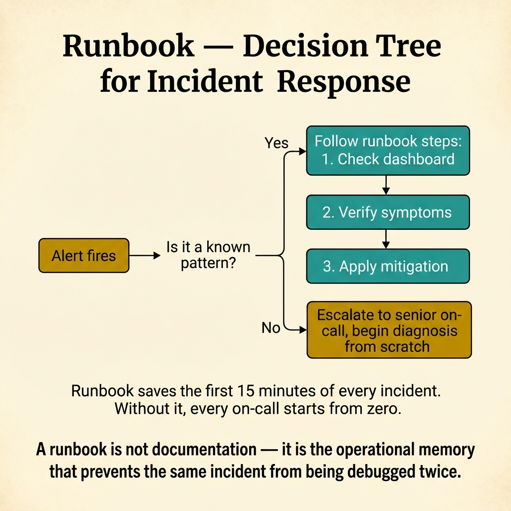
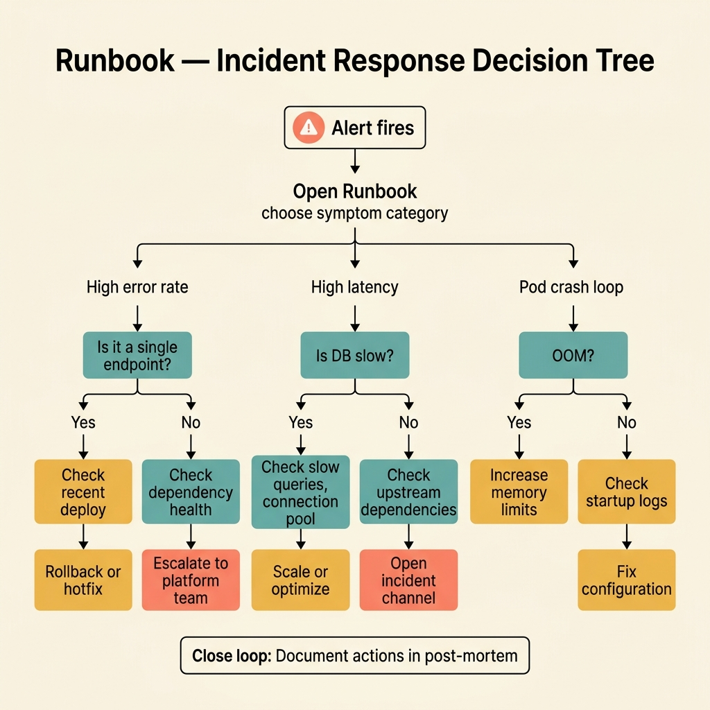

<!-- tags: glossary, reference, observability-operations, runbook -->

# Runbook

> A runbook is a step-by-step operational document that helps on-call or operators handle a specific class of incident or repeating operational task.

| Aspect            | Detail                                                                                                                                              |
| ----------------- | --------------------------------------------------------------------------------------------------------------------------------------------------- |
| **Concept**       | A runbook is a step-by-step operational document that helps on-call or operators handle a specific class of incident or repeating operational task. |
| **Audience**      | On-call engineer, SRE, platform engineer                                                                                                            |
| **Primary style** | Glossary term                                                                                                                                       |
| **Entry point**   | Use when the team needs to turn incident-handling knowledge into a repeatable process, independent of individual memory.                            |

📅 Created: 2026-03-30 · 🔄 Updated: 2026-04-17 · ⏱️ 8 min read

---

## 1. DEFINE

An incident at 2 AM is not the right time to start reasoning from scratch about which dashboard to open, which command to run, and when to rollback. A runbook exists to turn the team's reflexes into an artifact that can be repeated under pressure.

**Runbook** is a step-by-step operational document that helps on-call or operators handle a specific class of incident or repeating operational task.

| Variant             | Description                                                    |
| ------------------- | -------------------------------------------------------------- |
| Incident runbook    | For outages, degradation, or specific alert classes.           |
| Operational runbook | For periodic tasks like key rotation, failover, or reindexing. |
| Escalation runbook  | Focused on handoff conditions, contacts, and decision gates.   |

| Approach              | Time                   | Space               | When to choose                                          |
| --------------------- | ---------------------- | ------------------- | ------------------------------------------------------- |
| Checklist runbook     | O(n steps)             | O(n)                | When the task is short and decisions have few branches. |
| Decision-tree runbook | O(n branches)          | O(n)                | When triage needs to branch by symptom or threshold.    |
| Automated runbook     | O(automation workflow) | O(automation state) | When many steps can be self-served or auto-remediated.  |

Core insight:

> A runbook is not a place to dump all system knowledge. It is a tool to reduce re-thinking time under pressure by locking repeatable investigation and action steps.

### 1.1 Invariants & Failure Modes

The most common failure is a runbook that is just a long explanatory essay, not a concrete list of actions. When a real incident hits, on-call still has to reason almost from scratch.

---

## 2. CONTEXT

**Who uses it**: On-call engineer, SRE, platform engineer

**When**: Use when the team needs to turn incident handling knowledge into a repeatable process, independent of individual memory.

**Purpose**: A runbook reduces re-thinking time under pressure by locking repeatable steps.

**In the ecosystem**:

- Runbook differs from post-mortem: a runbook serves action during an incident; a post-mortem serves learning after the incident.
- A runbook does not replace system understanding, but it reduces dependence on memory when stress is high.
- A good runbook must have clear stop conditions, escalation conditions, and rollback conditions.

---

The incident handling guide is clear. But who is the audience, when to update, and runbook vs automation?

## 3. EXAMPLES

Runbook surfaces most clearly when the on-call engineer at 3 AM does not know where to start, when a runbook written 6 months ago has dead links everywhere, or when every incident ends with "escalate to senior." The examples below place the pattern into exactly those situations.

### Example 1: Basic — Turn repeating triage into a clear checklist

```text
  High-latency alert runbook:

  ┌─ Step 1: Verify alert scope ────────────────┐
  │  Which service? Which region?               │
  │  Is it widespread or isolated?              │
  └──────────────┬──────────────────────────────┘
                 ▼
  ┌─ Step 2: Inspect signals ───────────────────┐
  │  Check: golden signals dashboard            │
  │  Check: recent error rate trend             │
  │  Check: latest trace for slow requests      │
  └──────────────┬──────────────────────────────┘
                 ▼
  ┌─ Step 3: Check recent deploys ──────────────┐
  │  Any deploy in last 2 hours?                │
  │  Is there a rollback candidate?             │
  └──────────────┬──────────────────────────────┘
                 ▼
  ┌─ Step 4: Decide ────────────────────────────┐
  │  Clear cause → mitigate                     │
  │  Unclear → escalate after 10 min            │
  └─────────────────────────────────────────────┘
```

_Figure: Under pressure, people easily skip obvious steps or jump out of order. A checklist reduces cognitive load and keeps triage consistent across different on-call shifts._

```yaml
runbook_steps:
    1: check_alert_scope
    2: inspect_latency_and_error_signals
    3: inspect_recent_deploys
    4: decide_mitigate_or_escalate
```



*Figure: A runbook is not documentation — it is the operational memory that saves the first 15 minutes of every incident. Known patterns follow structured steps; unknown patterns escalate with clear context.*

**Why?** Under pressure, humans easily skip obvious steps or execute in the wrong order. A checklist reduces cognitive load and increases consistency between different on-call shifts.

**Conclusion**: A basic runbook is an action checklist, not an explanatory essay.

### Example 2: Intermediate — Add decision points and escalation boundaries

Real incidents have branches. A happy-path-only runbook breaks immediately.

```text
  Decision-tree runbook:

  ┌─ Symptom: error rate spike ─────────────────┐
  │                                             │
  │  Branch A:                                  │
  │    IF error_rate > 20%                      │
  │    AND recent deploy exists                 │
  │    THEN → rollback immediately              │
  │                                             │
  │  Branch B:                                  │
  │    IF no clear root cause after 10 min      │
  │    THEN → escalate to platform team         │
  │                                             │
  │  Branch C:                                  │
  │    IF error_rate < 5%                       │
  │    AND trending down                        │
  │    THEN → monitor, no action needed         │
  └─────────────────────────────────────────────┘
```

_Figure: A single happy-path runbook breaks the moment the incident deviates. Decision gates tell on-call when to rollback, when to escalate, and when to keep watching._

```yaml
decision_gates:
    - if: error_rate_gt_20_and_recent_deploy_exists
      then: rollback
    - if: no_clear_root_cause_after_10m
      then: escalate_to_platform
```

**Why?** Incident response is not a simple linear script. The runbook needs to show when to keep digging, when to rollback, and when to call for help instead of hesitating.

**Conclusion**: Intermediate runbook is a checklist with decision branches and escalation guardrails.

### Example 3: Advanced — Use the runbook as an interface between humans and automation

```text
  Human + automation boundary:

  ┌─ Automated (safe to script  ) ──────────────┐
  │  ✅ Health snapshot collection              │
  │  ✅ Dependency verification                 │
  │  ✅ Pre-promotion readiness checks          │
  │                                             │
  │  These run automatically on trigger.        │
  └──────────────┬──────────────────────────────┘
                 │
  ┌──────────────▼──────────────────────────────┐
  │  🔒 Manual approval gate: TRAFFIC SWITCH    │
  │                                             │
  │  Human reviews automated results,           │
  │  then approves or aborts the switch.        │
  └──────────────┬──────────────────────────────┘
                 │
  ┌──────────────▼──────────────────────────────┐
  │  ✅ Post-action validation (automated)      │
  │  Verify health after switch completed.      │
  └─────────────────────────────────────────────┘
```

_Figure: Automation handles the repeatable, safe steps. The human approval gate sits at the risky decision point. This boundary is where the runbook adds the most value._

```yaml
automation_ready_runbook:
    automated_checks: [health_snapshot, dependency_verification]
    manual_approval_gate: traffic_switch
    post_action_validation: mandatory
```

**Why?** Automation is strongest when it reduces repeating steps, not when it eliminates all human judgment. A good runbook specifies exactly what should be automated and what requires human judgment.

**Conclusion**: At the advanced level, a runbook is a clear contract between manual action, automation, and decision ownership.

---

## 4. COMPARE



_Figure: Compare card emphasizes the runbook as an action artifact under pressure — checklist, escalation gates, and which automation is allowed to touch the incident._

### Level 1

```text
alert fires
  -> open runbook
  -> follow diagnosis steps
  -> mitigate or escalate
```

_Figure: Level 1 shows the runbook is the bridge from alert to structured action._

### Level 2

```text
symptom observed
  -> check signal A
  -> if threshold X then action Y
  -> else continue diagnosis or escalate
```

_Figure: Level 2 emphasizes that a good runbook usually has decision points, not just prose._

### Easily confused or boundary-slipping

| #   | Severity  | Mistake                                              | Consequence                              | Fix                                                           |
| --- | --------- | ---------------------------------------------------- | ---------------------------------------- | ------------------------------------------------------------- |
| 1   | 🔴 Fatal  | Runbook is only prose, no concrete action steps      | On-call still has to reason from scratch | Convert to checklist with actionable steps.                   |
| 2   | 🟡 Common | No escalation or rollback gate                       | Incident drags because of hesitation     | Add clear escalate and rollback conditions.                   |
| 3   | 🟡 Common | Runbook is never rehearsed                           | Stale document, wrong commands           | Periodically drill and update.                                |
| 4   | 🔵 Minor  | Stuffing too much background theory into the runbook | Hard to use in an emergency              | Keep background in a separate doc; runbook focuses on action. |

### Quick scan

| If you face                                        | Action                                 |
| -------------------------------------------------- | -------------------------------------- |
| Need repeatable action steps during an incident    | Write a runbook.                       |
| Runbook is too long and hard to use in emergencies | Keep checklist + decision gates.       |
| Want to reduce MTTR                                | Rehearse and automate the right parts. |

---

## 5. REF

| Resource            | Type      | Link                                           | Note                                                              |
| ------------------- | --------- | ---------------------------------------------- | ----------------------------------------------------------------- |
| Google SRE Workbook | Reference | https://sre.google/workbook/table-of-contents/ | Strong foundation for SLO, error budget, and incident response.   |
| Google SRE Book     | Reference | https://sre.google/sre-book/table-of-contents/ | Canonical source for reliability metrics and operations.          |
| OpenTelemetry Docs  | Official  | https://opentelemetry.io/docs/                 | Standard source for tracing, span, and telemetry instrumentation. |

---

## 6. RECOMMEND

Runbook solves the problem of "on-call does not know what to do when an incident hits." The next question: how to learn after an incident, and how does the broader observability stack fit together?

| Expand to        | When                                                        | Reason                                  | File/Link                                |
| ---------------- | ----------------------------------------------------------- | --------------------------------------- | ---------------------------------------- |
| Incident metric  | When you want to measure whether the runbook helps recovery | MTTR is the adjacent metric.            | [MTTR](./05-mttr.md)                     |
| Learning loop    | When you want to update the runbook after an incident       | Post-Mortem is the next step.           | [Post-Mortem](./13-post-mortem.md)       |
| Signal shortlist | When the first triage step needs to focus on key metrics    | Golden Signals is the adjacent concept. | [Golden Signals](./11-golden-signals.md) |

Back to the 3 AM alert at the start — ringing, nobody knows where to begin. Now you know: every alert needs a runbook link. Step 1: verify. Step 2: triage. Step 3: mitigate. Write for the worst case: the reader was just woken up and has not had coffee yet.

**Links**: [← Previous](./11-golden-signals.md) · [→ Next](./13-post-mortem.md)
