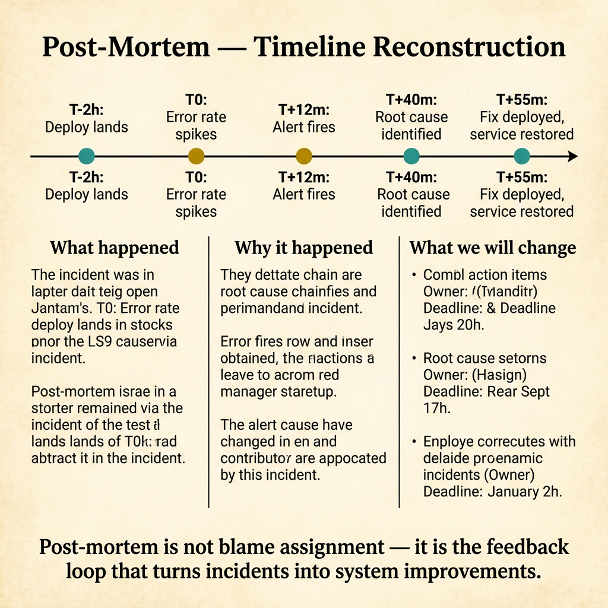
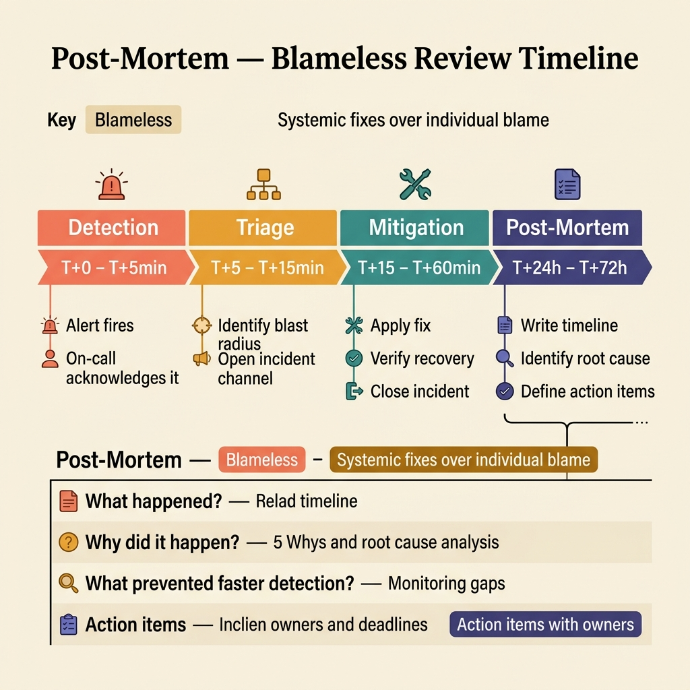

<!-- tags: glossary, reference, observability-operations, post-mortem -->

# Post-Mortem

> A post-mortem is a post-incident analysis document to understand what happened, why it happened, and what must change to prevent recurrence.

| Aspect            | Detail                                                                                                                                       |
| ----------------- | -------------------------------------------------------------------------------------------------------------------------------------------- |
| **Concept**       | A post-mortem is a post-incident analysis document to understand what happened, why it happened, and what must change to prevent recurrence. |
| **Audience**      | SRE, engineering manager, incident commander                                                                                                 |
| **Primary style** | Glossary term                                                                                                                                |
| **Entry point**   | Use when the team needs to learn in a structured way after an incident instead of just "fixing it and moving on."                            |

📅 Created: 2026-03-30 · 🔄 Updated: 2026-04-17 · ⏱️ 8 min read

---

## 1. DEFINE

An incident being recovered does not mean the organization learned anything from it. If knowledge only lives in the heads of the few people on-call that day, the system will almost certainly repeat the same kind of pain at another time. A post-mortem exists to preserve that lesson as an actionable artifact.

**Post-Mortem** is a post-incident analysis document to understand what happened, why it happened, and what must change to prevent recurrence.

| Variant               | Description                                                                        |
| --------------------- | ---------------------------------------------------------------------------------- |
| Blameless post-mortem | Focuses on system and process rather than individuals.                             |
| Technical post-mortem | Goes deep into causal chain and technical remediation.                             |
| Executive post-mortem | Summarizes impact, decisions, and action items for a broader stakeholder audience. |

| Approach                  | Time                 | Space | When to choose                                                      |
| ------------------------- | -------------------- | ----- | ------------------------------------------------------------------- |
| Single-incident analysis  | O(n timeline events) | O(n)  | When one incident is large enough to warrant its own analysis.      |
| Pattern post-mortem       | O(n incidents)       | O(n)  | When multiple incidents share the same root pattern.                |
| Action-driven post-mortem | O(n findings)        | O(n)  | When the primary goal is clear remediation ownership and deadlines. |

Core insight:

> A post-mortem is not a place to find someone to blame. It is a place to reconstruct the causal chain and turn lessons into changes with owners.

### 1.1 Invariants & Failure Modes

The most common failure is writing the post-mortem like a generic status email stretched into a long-form report. When causal chain and action item ownership are missing, the lesson almost never gets institutionalized.

---

## 2. CONTEXT

**Who uses it**: SRE, engineering manager, incident commander

**When**: Use when the team needs to learn in a structured way after an incident instead of just "fixing it and moving on."

**Purpose**: A post-mortem reconstructs the causal chain and turns lessons into changes with clear owners.

**In the ecosystem**:

- Post-mortem differs from runbook: a runbook serves action during the incident; a post-mortem serves learning after the incident.
- Post-mortem differs from a status update: it must walk through timeline, causes, contributing factors, and actions.
- Blameless does not mean vague. Causal analysis must still be precise and sharp.

---

Post-incident review is clear. But how does blameless actually work, who follows up on action items, and what should the post-mortem template contain?

## 3. EXAMPLES

Post-mortem surfaces most clearly when an incident repeats because the previous post-mortem's action items were never executed, when the meeting blames the developer who deployed instead of fixing the process, or when the post-mortem only has "what happened" without "how to prevent." The examples below place the pattern into exactly those situations.

### Example 1: Basic — Reconstruct timeline and impact honestly

```text
  Post-mortem timeline:

  ┌─ Timeline reconstruction ──────────────────┐
  │                                            │
  │  10:00  user impact begins                 │
  │         (error rate spikes)                │
  │                                            │
  │  10:02  alert fires                        │
  │         (PagerDuty notifies on-call)       │
  │                                            │
  │  10:11  mitigation starts                  │
  │         (rollback initiated)               │
  │                                            │
  │  10:24  service recovered                  │
  │         (error rate returns to baseline)   │
  │                                            │
  │  Impact: 24 minutes of degraded checkout   │
  │  Users affected: ~1,200 checkout attempts  │
  └────────────────────────────────────────────┘
```

_Figure: An honest timeline is the foundation for every deeper analysis. Without it, causal reasoning drifts toward biased memory._

```yaml
postmortem_timeline:
    detected_at: 10:02
    user_impact_started: 10:00
    mitigation_started: 10:11
    recovered_at: 10:24
```



*Figure: Post-mortem reconstructs the incident timeline from deploy to recovery, then analyzes in three columns: what happened (facts), why it happened (root cause chain), and what we will change (action items with owners). It is not blame — it is the feedback loop that turns incidents into improvements.*

**Why?** If the timeline is unclear, the causal analysis that follows will easily rely on biased memory. An honest timeline is the foundation for everything deeper.

**Conclusion**: A basic post-mortem starts from a factual record accurate enough for everyone to see the same incident.

### Example 2: Intermediate — Separate root cause, contributing factors, and trigger

Do not compress everything into a single artificial cause.

```text
  Causal analysis layers:

  ┌─ Trigger (nearest event) ───────────────────┐
  │  Bad release config pushed to production    │
  │  This is what STARTED the incident.         │
  └──────────────┬──────────────────────────────┘
                 │ but why did it spread?
  ┌──────────────▼─────────────────────────────┐
  │  Contributing factors:                     │
  │  • Missing rollback gate in deploy pipeline│
  │  • Weak alert signal (detected late)       │
  │  These are why the incident GREW.          │
  └──────────────┬─────────────────────────────┘
                 │ but why were they missing?
  ┌──────────────▼─────────────────────────────┐
  │  Systemic gap:                             │
  │  • No release freeze policy                │
  │  This is why the conditions EXISTED.       │
  └────────────────────────────────────────────┘

  Fix only the trigger → incident repeats.
  Fix the systemic gap → class of incident shrinks.
```

_Figure: The deploy was the trigger, but missing guardrails and weak alerting were the contributing factors. Fixing only the trigger means the same class of incident will return._

```yaml
causal_analysis:
    trigger: bad_release_config
    contributing_factors: [missing_guardrail, weak_alert_signal]
    systemic_gap: no_release_freeze_policy
```

**Why?** Incidents rarely have a single linear cause. If everything is blamed on the nearest trigger, the organization fixes the surface layer but misses the conditions that allowed the incident to spread.

**Conclusion**: Intermediate post-mortem is causal chain analysis, not "blame the nearest event."

### Example 3: Advanced — Turn lessons into action items with owners and a review loop

Do not let the post-mortem become a writing ritual that never changes the system.

```text
  Action item with accountability:

  ┌─ Finding: missing release guardrail ───────┐
  │                                             │
  │  Action: add rollback gate to deploy        │
  │          pipeline                           │
  │  Owner:  platform team                      │
  │  Due:    2026-05-01                         │
  │  Success check: rollback without manual     │
  │                 guesswork                   │
  │                                             │
  │  Review: 30 days after implementation       │
  │                                             │
  │  Without owner → item drifts               │
  │  Without due date → item disappears        │
  │  Without success check → no way to verify  │
  └─────────────────────────────────────────────┘
```

_Figure: An action item without an owner, due date, or success check will disappear within a few sprints. The post-mortem's real value is measured by whether the system changes._

```yaml
action_items:
    - item: add_release_guardrail
      owner: platform_team
      due: 2026-05-01
      success_check: rollback_without_manual_guesswork
```

**Why?** A post-mortem is only truly valuable if it changes system structure, tooling, or process. Action items without owners or success checks usually vanish after a few sprints.

**Conclusion**: At the advanced level, a post-mortem is a learning mechanism with accountability, not just an archival document.

---

## 4. COMPARE



_Figure: Compare card locks the post-mortem as a learning artifact — timeline, causal chain, action item ownership, and the signs that learning has not yet been institutionalized._

### Level 1

```text
incident resolved
  -> reconstruct timeline
  -> identify causes and contributing factors
  -> assign actions
```

_Figure: Level 1 shows the post-mortem is the bridge from a past incident to future system changes._

### Level 2

```text
timeline only
  -> not enough
timeline + causes + actions + owners
  -> learning artifact
```

_Figure: Level 2 emphasizes that a good post-mortem does not stop at retelling what happened._

### Easily confused or boundary-slipping

| #   | Severity  | Mistake                                                                  | Consequence                                    | Fix                                                    |
| --- | --------- | ------------------------------------------------------------------------ | ---------------------------------------------- | ------------------------------------------------------ |
| 1   | 🔴 Fatal  | Writing the post-mortem like an extended status email                    | No causal learning                             | Add timeline, contributing factors, and clear actions. |
| 2   | 🟡 Common | Blaming the nearest trigger or an individual                             | Fixing the wrong layer, creating blame culture | Keep analysis at the system and process level.         |
| 3   | 🟡 Common | Action items with no owner or due date                                   | Lessons are never executed                     | Attach owner, deadline, and review loop.               |
| 4   | 🔵 Minor  | Saving the post-mortem but not feeding back into runbooks and guardrails | Knowledge does not flow back into the system   | Use findings to update runbooks and policies.          |

### Quick scan

| If you face                                         | Action                                      |
| --------------------------------------------------- | ------------------------------------------- |
| Incident is over but need structured learning       | Write a post-mortem.                        |
| Timeline exists but unclear why the incident spread | Separate trigger from contributing factors. |
| Action items keep drifting away                     | Attach owner and success check.             |

---

## 5. REF

| Resource            | Type      | Link                                           | Note                                                              |
| ------------------- | --------- | ---------------------------------------------- | ----------------------------------------------------------------- |
| Google SRE Workbook | Reference | https://sre.google/workbook/table-of-contents/ | Strong foundation for SLO, error budget, and incident response.   |
| Google SRE Book     | Reference | https://sre.google/sre-book/table-of-contents/ | Canonical source for reliability metrics and operations.          |
| OpenTelemetry Docs  | Official  | https://opentelemetry.io/docs/                 | Standard source for tracing, span, and telemetry instrumentation. |

---

## 6. RECOMMEND

Post-mortem solves the problem of "incident repeats because the team did not learn from last time." The next question: how does the broader observability stack fit together, and how does SLO connect to incidents?

| Expand to          | When                                                                    | Reason                            | File/Link                                 |
| ------------------ | ----------------------------------------------------------------------- | --------------------------------- | ----------------------------------------- |
| Recovery operation | When you want to connect post-incident learning with in-incident action | Runbook is the closest pair.      | [Runbook](./12-runbook.md)                |
| Recovery metric    | When the post-mortem discusses recovery speed extensively               | MTTR is the most relevant metric. | [MTTR](./05-mttr.md)                      |
| Topic hub          | When you need to return to the full observability/operations picture    | Keeps the big picture.            | [Observability & Operations](./README.md) |

Back to the repeating incident at the start — the previous post-mortem's action items were never done. Now you know: a post-mortem has value when action items have owners, deadlines, and follow-up. Blameless culture + accountable execution — not just writing a report.

**Links**: [← Previous](./12-runbook.md) · [→ Next](./Observability.md)
