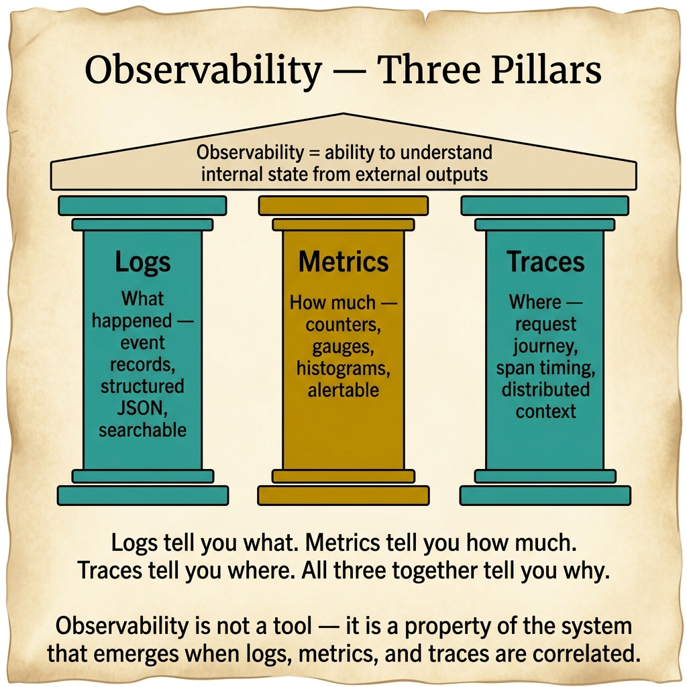
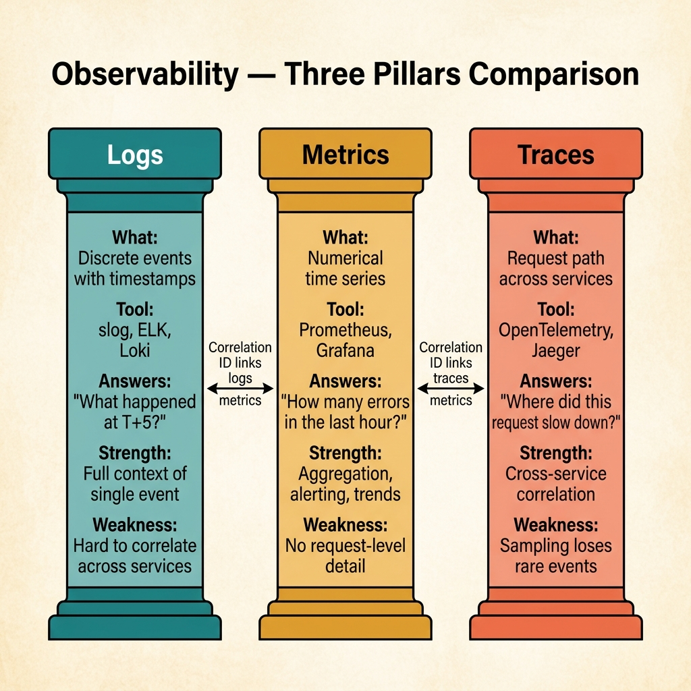

<!-- tags: glossary, reference, observability-operations, observability -->

# Observability — Logs, Metrics, Traces

> Observability is the ability to infer the internal state of a system from logs, metrics, traces, and related signals when the system exhibits unexpected behavior.

| Aspect            | Detail                                                                                                                                                             |
| ----------------- | ------------------------------------------------------------------------------------------------------------------------------------------------------------------ |
| **Concept**       | Observability is the ability to infer the internal state of a system from logs, metrics, traces, and related signals when the system exhibits unexpected behavior. |
| **Audience**      | Backend engineer, SRE, platform engineer                                                                                                                           |
| **Primary style** | Glossary term                                                                                                                                                      |
| **Entry point**   | Use when basic monitoring is no longer enough to answer why the system is deviating or degrading in unknown ways.                                                  |

📅 Created: 2026-03-30 · 🔄 Updated: 2026-04-17 · ⏱️ 10 min read

---

## 1. DEFINE

Traditional monitoring excels at answering "something is wrong." But when a distributed system starts misbehaving in ways nobody wrote rules for, what the team needs is not just a red light. They need the ability to ask new questions from signals already collected. That is the boundary of observability.

**Observability — Logs, Metrics, Traces** is the ability to infer the internal state of a system from logs, metrics, traces, and related signals when the system exhibits unexpected behavior.

| Variant                    | Description                                                                   |
| -------------------------- | ----------------------------------------------------------------------------- |
| Metrics-led observability  | Starts from trends and aggregate signals to detect anomalies.                 |
| Trace-led observability    | Starts from a specific request or path to find bottlenecks and causal chains. |
| Correlated telemetry model | Combines logs, metrics, and traces through shared context like trace ID.      |

| Approach                      | Time                             | Space          | When to choose                                                       |
| ----------------------------- | -------------------------------- | -------------- | -------------------------------------------------------------------- |
| Three pillars baseline        | O(n telemetry streams)           | O(n)           | When the team is building a pragmatic observability foundation.      |
| Correlated telemetry          | O(n telemetry + correlation ids) | O(n)           | When investigation needs to cross multiple signal types.             |
| Question-driven observability | O(dynamic queries)               | O(query state) | When the system is complex and failure modes are unknown in advance. |

Core insight:

> Observability is powerful because it lets the team ask new questions about the system without redeploying instrumentation for every known failure mode.

### 1.1 Invariants & Failure Modes

The most common mistake is collecting all three pillars but having no correlation or good signal design. The team then has enormous amounts of data but still cannot answer "why did this request fail."

---

## 2. CONTEXT

**Who uses it**: Backend engineer, SRE, platform engineer

**When**: Use when basic monitoring is no longer enough to answer why the system is deviating or degrading in unknown ways.

**Purpose**: Observability lets the team ask new questions from existing signals, without redeploying instrumentation for each known failure mode.

**In the ecosystem**:

- Observability differs from pure monitoring: monitoring excels at detecting known failures; observability excels at investigating unknown failures.
- Observability is not just buying a tool. The value lies in the quality of signals and the ability to connect them.
- Logs, metrics, and traces complement each other. Missing any layer means investigation hits a dead end somewhere.

---

The three pillars of observability are clear. But where do logs, metrics, and traces intersect, unified platform or separate, and how does observability differ from monitoring?

## 3. EXAMPLES

Observability surfaces most clearly when production breaks but logs lack context, metrics are not granular, and traces miss sampling; when the team has three tools but cannot correlate them; or when "we need more monitoring" is said but the real problem is missing observability. The examples below place the pattern into exactly those situations.

### Example 1: Basic — Separate observability from plain monitoring

Do not confuse knowing something is wrong with understanding why.

```text
  Monitoring vs Observability:

  ┌─ Monitoring ────────────────────────────────┐
  │                                             │
  │  Alert: latency > 500ms   ⚠️                │
  │  Dashboard: error rate spike                │
  │                                             │
  │  Answers: "something is wrong"              │
  │  Does NOT answer: "why is it wrong?"        │
  └─────────────────────────────────────────────┘

  ┌─ Observability ─────────────────────────────┐
  │                                             │
  │  Metrics: latency p99 spiked at 14:32       │
  │     ↓ pivot on trace ID                     │
  │  Trace: payment_call span = 1.8s            │
  │     ↓ pivot on span attributes              │
  │  Logs: "timeout connecting to payment-gw"   │
  │                                             │
  │  Answers: "payment gateway is the cause"    │
  └─────────────────────────────────────────────┘
```

_Figure: Monitoring stops at detection. Observability starts at the ability to investigate deeper from collected signals. The difference is between "seeing red" and "knowing why it is red."_

```yaml
telemetry_layers:
    metrics: detect_spike
    traces: locate_path
    logs: inspect_event_detail
```



*Figure: Logs tell you what happened. Metrics tell you how much. Traces tell you where. All three together tell you why. Observability is not a tool — it is a property of the system that emerges when all three are correlated.*

**Why?** Monitoring typically stops at detection. Observability begins at the ability to investigate further from the signals already collected. This is the core difference between "seeing red" and "knowing why it is red."

**Conclusion**: Basic observability means having enough signal layers to keep going after the alert fires.

### Example 2: Intermediate — Correlate logs, metrics, and traces around the same request or issue

Having three signal types living in three separate silos does not make observability. The power comes when they pivot into each other.

```text
  Correlated telemetry:

  ┌─ Step 1: Alert fires ─────────────────────┐
  │  Metric: checkout error rate > 2%         │
  └──────────────┬────────────────────────────┘
                 │ filter by trace_id
  ┌──────────────▼────────────────────────────┐
  │  Step 2: Open slow trace                  │
  │  Trace ID: abc-123                        │
  │  Spans: gateway → order → payment (slow)  │
  └──────────────┬────────────────────────────┘
                 │ search logs by trace_id
  ┌──────────────▼────────────────────────────┐
  │  Step 3: Read log events                  │
  │  Log: "connection timeout to payment-gw"  │
  │  Log: "retry 3/3 failed"                  │
  └───────────────────────────────────────────┘

  Without correlation: three silos, manual guess.
  With correlation: one investigation thread.
```

_Figure: Correlation via trace ID turns three separate data silos into a single investigation thread. Without it, on-call guesses by eye and timestamp._

```yaml
correlation_model:
    trace_id_in_logs: true
    request_labels_in_metrics: constrained
    pivot_key: trace_or_request_id
```

**Why?** Having all three pillars but without correlation means on-call still guesses by eye and timestamp. Correlation is what turns many disconnected signals into real investigative capability.

**Conclusion**: Intermediate observability means connecting signals around the same investigative question.

### Example 3: Advanced — Design signal economics for sustainable production observability

Observability grows expensive fast if signal collection has no governance. At the advanced level, the challenge is balancing diagnostic value with cost, privacy, and operational overhead.

```text
  Signal economics:

  ┌─ Traces ───────────────────────────────────┐
  │  Strategy: tail-based sampling             │
  │  Keep: 100% errors, 20% slow, 1% happy     │
  │  Effect: 90% storage reduction             │
  └────────────────────────────────────────────┘

  ┌─ Metrics ──────────────────────────────────┐
  │  Policy: low-cardinality labels only       │
  │  Avoid: user_id, request_id as labels      │
  │  Effect: predictable cost, fast queries    │
  └────────────────────────────────────────────┘

  ┌─ Logs ─────────────────────────────────────┐
  │  Retention: tiered by severity             │
  │  PII: mandatory redaction                  │
  │  Effect: compliant, cost-controlled        │
  └────────────────────────────────────────────┘
```

_Figure: Without governance, observability cost grows unchecked. Sampling, cardinality control, and tiered retention keep diagnostic value high while cost stays predictable._

```yaml
observability_governance:
    trace_sampling: tail_based
    metric_label_policy: low_cardinality
    log_retention: tiered
    pii_redaction: mandatory
```

**Why?** The more powerful observability gets, the easier it is to spend money and create noise if signals are not governed. Good design must balance diagnostic value with cost, privacy, and real operating conditions.

**Conclusion**: At the advanced level, observability is a signal design and governance problem, not just an instrumentation coverage problem.

---

## 4. COMPARE



_Figure: Compare card pulls observability to its core capability — correlating logs, metrics, and traces to answer new questions when the system deviates in unpredicted ways._

Observability is not powerful because it has three signal types. It is powerful when those three types can pivot into each other fast enough to produce a causal explanation. This visual locks that focus.

### Level 1

```text
metrics show trend
  + logs show events
  + traces show path
  -> together explain why system behaves oddly
```

_Figure: Level 1 shows observability is a combined capability across multiple signals, not a single tool._

### Level 2

```text
unknown incident
  -> start with alert or signal spike
  -> pivot across metrics, traces, logs
  -> converge on causal explanation
```

_Figure: Level 2 illustrates the typical investigation loop in a system with good observability._

### Easily confused or boundary-slipping

| #   | Severity  | Mistake                                                      | Consequence                                           | Fix                                                                                  |
| --- | --------- | ------------------------------------------------------------ | ----------------------------------------------------- | ------------------------------------------------------------------------------------ |
| 1   | 🔴 Fatal  | Having telemetry but not correlating across signal layers    | Incident investigation remains blind                  | Thread trace/request context through logs and traces; be careful with metric labels. |
| 2   | 🟡 Common | Treating observability as a synonym for monitoring           | Missing the dimension to investigate unknown failures | Keep detection vs investigation clearly separated.                                   |
| 3   | 🟡 Common | Collecting too many signals without governance               | High cost, high noise                                 | Design sampling, retention, and label policy.                                        |
| 4   | 🔵 Minor  | Each team using different semantics for the same signal type | Cross-service analysis becomes painful                | Standardize naming and observability conventions.                                    |

### Quick scan

| If you face                                            | Action                               |
| ------------------------------------------------------ | ------------------------------------ |
| Alert is red but you do not know why                   | That is an observability problem.    |
| Have logs, metrics, and traces but still hard to debug | Check correlation and signal design. |
| Telemetry cost growing too fast                        | Design governance for signals.       |

---

## 5. REF

| Resource            | Type      | Link                                           | Note                                                              |
| ------------------- | --------- | ---------------------------------------------- | ----------------------------------------------------------------- |
| Google SRE Workbook | Reference | https://sre.google/workbook/table-of-contents/ | Strong foundation for SLO, error budget, and incident response.   |
| Google SRE Book     | Reference | https://sre.google/sre-book/table-of-contents/ | Canonical source for reliability metrics and operations.          |
| OpenTelemetry Docs  | Official  | https://opentelemetry.io/docs/                 | Standard source for tracing, span, and telemetry instrumentation. |

---

## 6. RECOMMEND

Observability solves the problem of "knowing there is an error but not why." The next question: how deep does tracing go, and what do the golden signals measure?

| Expand to            | When                                               | Reason                                          | File/Link                                          |
| -------------------- | -------------------------------------------------- | ----------------------------------------------- | -------------------------------------------------- |
| Tracing detail       | When you want to go deep into one important pillar | Distributed Tracing is the closest article.     | [Distributed Tracing](./09-distributed-tracing.md) |
| Signal shortlist     | When you want a leaner dashboard entry point       | Golden Signals is a practical adjacent concept. | [Golden Signals](./11-golden-signals.md)           |
| Operational response | When observability serves incident workflows       | Runbook is the next operational layer.          | [Runbook](./12-runbook.md)                         |

Back to the production error at the start — logs lacked context, metrics were not granular, traces missed sampling. Now you know: logs for detail, metrics for trend, traces for journey. Correlate all three by trace ID. Unified = powerful. Separated = friction.

**Links**: [← Previous](./13-post-mortem.md) · [→ Next](./README.md)
