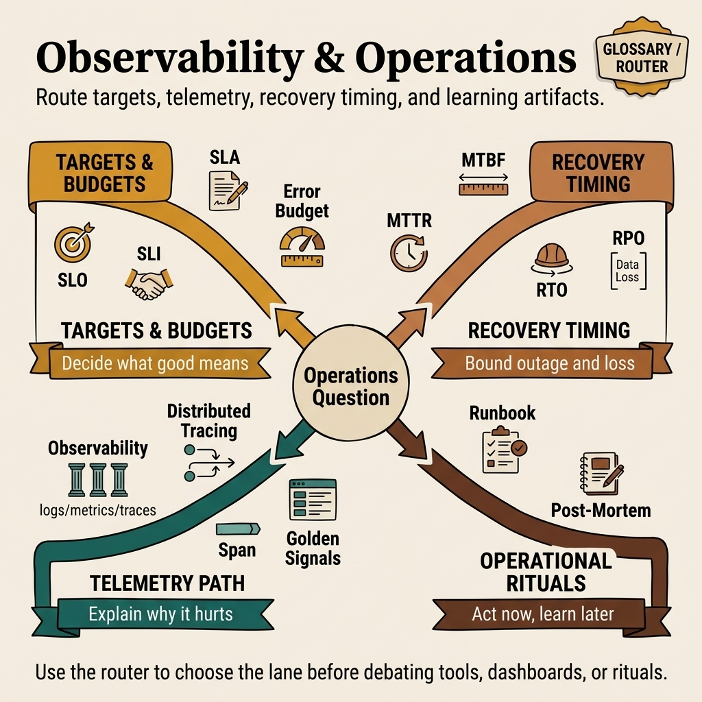

<!-- tags: glossary, hub, observability-operations -->
# Observability & Operations

> A topic hub covering the reliability contracts, recovery metrics, tracing infrastructure, and operational practices that keep distributed systems observable and recoverable under real-world failure conditions.

| Aspect | Detail |
| --- | --- |
| **Domain** | Observability & Operations |
| **Audience** | SRE, backend engineer, platform engineer, engineering manager |
| **Primary style** | Topic hub (glossary index) |
| **Purpose** | Route the reader from an operational symptom to the right concept and practice |

📅 Created: 2026-03-30 · 🔄 Updated: 2026-04-18 · ⏱️ 5 min read

---

## Why this topic matters

A distributed system will fail. The question is not "will it fail?" but "how quickly can we detect, diagnose, and recover?" This domain covers the engineering contracts (SLOs, SLAs), the measurement foundations (SLIs, error budgets), the recovery metrics (MTTR, MTBF, RTO, RPO), the tracing infrastructure (distributed tracing, spans), the monitoring framework (Golden Signals), and the operational practices (runbooks, post-mortems) that transform failures from catastrophes into routine recoveries.

---

## Symptom Router

Use this table to route a symptom to the right article.

*Figure: Symptom-to-article routing map for the Observability & Operations domain.*

| Symptom | Likely cause | Start here |
| --- | --- | --- |
| "What reliability target should we set?" | Need a formal internal reliability target | [SLO](./01-slo.md) |
| "What happens if we breach our reliability target?" | Need a formal external commitment with consequences | [SLA](./02-sla.md) |
| "What do we actually measure to know if it's healthy?" | Need the right user-facing metrics | [SLI](./03-sli.md) |
| "How much room do we have before reliability becomes a priority?" | Need a governance mechanism for velocity vs. reliability | [Error Budget](./04-error-budget.md) |
| "How long does it take us to recover from incidents?" | Need to measure and reduce recovery time | [MTTR](./05-mttr.md) |
| "How often do we have failures?" | Need to measure and increase time between failures | [MTBF](./06-mtbf.md) |
| "How long can we be down before business impact?" | Need a recovery time objective for disaster planning | [RTO](./07-rto.md) |
| "How much data can we afford to lose?" | Need a recovery point objective for backup strategy | [RPO](./08-rpo.md) |
| "I can't find where a request fails across services" | Need to trace requests through the distributed system | [Distributed Tracing](./09-distributed-tracing.md) |
| "What is each unit of work inside a trace?" | Need to understand span-level instrumentation | [Span](./10-span.md) |
| "What are the minimum metrics every service needs?" | Need a starting monitoring framework | [Golden Signals](./11-golden-signals.md) |
| "How do we respond to incidents consistently?" | Need a structured response document | [Runbook](./12-runbook.md) |
| "How do we learn from incidents without blame?" | Need a structured retrospective process | [Post-Mortem](./13-post-mortem.md) |

---

## Learning path

### Layer 1: Reliability Contracts

The SLI → SLO → SLA → Error Budget chain defines how reliability is measured, targeted, contracted, and governed.

| # | Article | One-liner | Prerequisite |
| --- | --- | --- | --- |
| 01 | [SLO](./01-slo.md) | Internal reliability target set by engineering | — |
| 02 | [SLA](./02-sla.md) | External reliability contract with customers | 01 |
| 03 | [SLI](./03-sli.md) | The metric that feeds SLOs and SLAs | 01, 02 |
| 04 | [Error Budget](./04-error-budget.md) | The failure allowance that governs feature velocity | 01, 03 |

### Layer 2: Recovery Metrics

How long to recover, how often failures occur, and what the business tolerates.

| # | Article | One-liner | Prerequisite |
| --- | --- | --- | --- |
| 05 | [MTTR](./05-mttr.md) | Mean time to recover from an incident | 01 |
| 06 | [MTBF](./06-mtbf.md) | Mean time between failures | 05 |
| 07 | [RTO](./07-rto.md) | Maximum acceptable recovery time | 05 |
| 08 | [RPO](./08-rpo.md) | Maximum acceptable data loss | 07 |

### Layer 3: Tracing & Monitoring

How to observe the system and build actionable monitoring.

| # | Article | One-liner | Prerequisite |
| --- | --- | --- | --- |
| 09 | [Distributed Tracing](./09-distributed-tracing.md) | Following requests across service boundaries | — |
| 10 | [Span](./10-span.md) | The unit of work inside a trace | 09 |
| 11 | [Golden Signals](./11-golden-signals.md) | The four metrics every service needs | — |

### Layer 4: Operational Practices

How to respond and learn.

| # | Article | One-liner | Prerequisite |
| --- | --- | --- | --- |
| 12 | [Runbook](./12-runbook.md) | Structured incident response procedure | 11 |
| 13 | [Post-Mortem](./13-post-mortem.md) | Structured incident retrospective | 12 |
| — | [Observability Overview](./Observability.md) | Broader observability philosophy | — |

---

## How to read this hub

1. **I have a symptom** → use the Symptom Router table above.
2. **I want to learn in order** → follow the Learning Path from Layer 1 to Layer 4.
3. **I need a specific concept** → jump directly to the article.

Each article follows the Glossary profile: `DEFINE → CONTEXT → EXAMPLES → COMPARE → REF → RECOMMEND`.

---

## Cross-domain connections

| Related domain | When to visit | Link |
| --- | --- | --- |
| Process & Delivery | When the observability problem connects to deploy cadence or SRE practices | [Process & Delivery](../process-delivery/README.md) |
| Performance & Caching | When the performance problem is about latency, caching, or database tuning | [Performance & Caching](../performance-caching/README.md) |
| Concurrency & Async | When the problem is goroutine coordination, race conditions, or deadlocks | [Concurrency & Async](../concurrency-async/README.md) |
