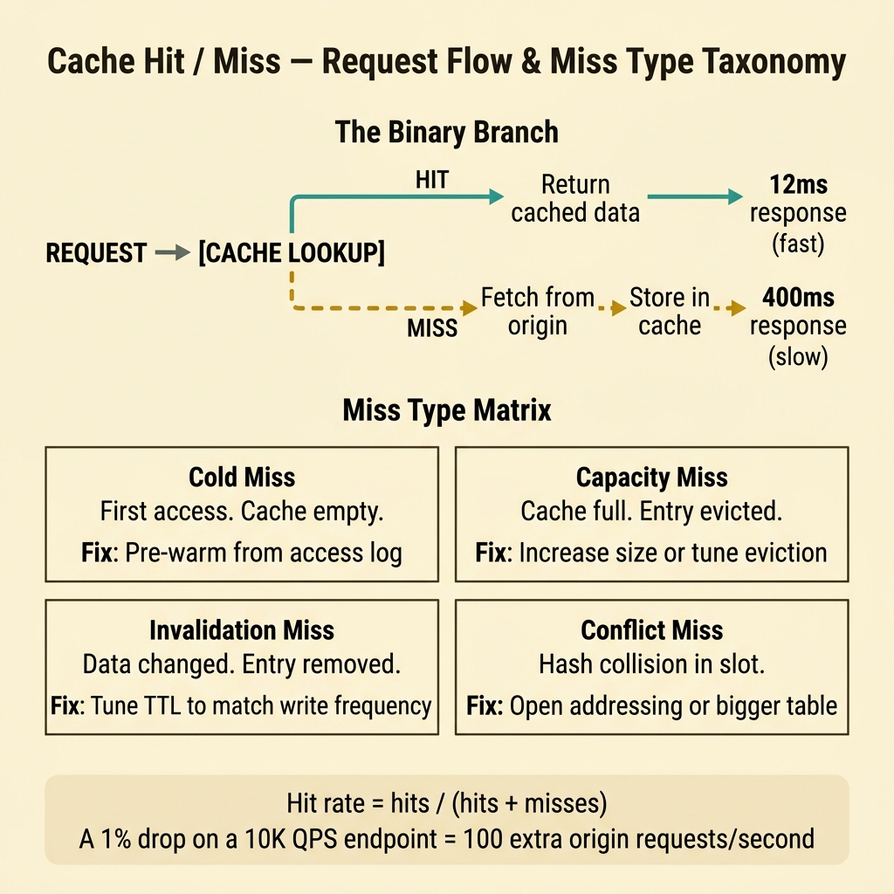
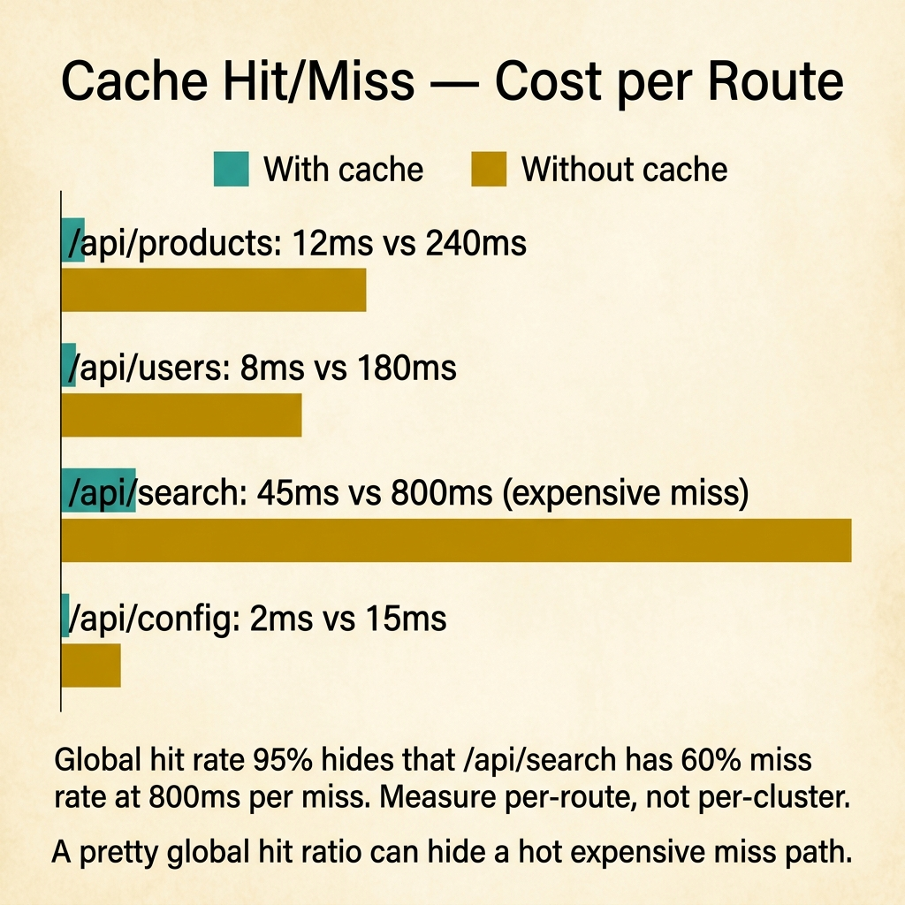

<!-- tags: glossary, reference, performance-caching, cache-hit-miss -->
# Cache Hit / Cache Miss

> The binary outcome of every cache lookup: a hit returns data instantly from fast storage, a miss forces a slower fetch from the origin and decides what happens next.

| Aspect | Detail |
| --- | --- |
| **Concept** | The binary outcome of every cache lookup: a hit returns data instantly from fast storage, a miss forces a slower fetch from the origin and decides what happens next. |
| **Audience** | Backend engineer, performance analyst, SRE, developer reviewing latency issues |
| **Primary style** | Glossary term |
| **Entry point** | Use when diagnosing response time variance, sizing cache layers, or explaining why the same endpoint behaves differently under cold vs. warm traffic |

📅 Created: 2026-03-30 · 🔄 Updated: 2026-04-18 · ⏱️ 7 min read

---

## 1. DEFINE

A user refreshes a product page. The first load takes 400ms; every subsequent load takes 12ms. Nothing changed in the code. The difference is entirely about whether the answer was already sitting in cache. That single lookup — found or not found — is the boundary of **Cache Hit / Cache Miss**.

**Cache Hit** means the requested data was found in the cache layer and returned without touching the origin store. **Cache Miss** means the data was absent, forcing a round-trip to the slower origin. The ratio between the two — hit rate — is the single most important metric for cache effectiveness.

A cache hit avoids redundant computation or I/O. A cache miss triggers a fetch that may also populate the cache for future requests. The engineering question is never "should we cache?" but "what is the cost of a miss and how do we keep hit rate high enough?"

| Variant | Description |
| --- | --- |
| Cold miss | Cache has never seen this key — first access after startup or eviction. |
| Capacity miss | Cache evicted the entry because it ran out of space. |
| Conflict miss | Specific to set-associative caches — the slot was taken by another key mapping to the same set. |
| Invalidation miss | Entry existed but was explicitly removed due to a write or TTL expiry. |

| Approach | Time | Space | When to choose |
| --- | --- | --- | --- |
| In-process map | O(1) lookup | O(entries) | When data fits in a single instance's memory and consistency is per-process. |
| Distributed cache (Redis/Memcached) | O(1) + network hop | O(cluster) | When multiple instances must share a warm cache. |
| CDN edge cache | O(1) + edge latency | O(edge capacity) | When content is static or semi-static and users are geographically distributed. |

Core insight:

> Hit rate is not a vanity metric. A 1% drop in hit rate on a high-QPS endpoint can double origin load. The engineering discipline is keeping misses predictable and their cost bounded.

### 1.1 Invariants & Failure Modes

A good cache system must hold:
- every miss has a bounded cost (timeout + fallback);
- hit rate is monitored, not assumed;
- cache invalidation strategy matches the write pattern of the origin.

Failure mode: the team caches aggressively but never measures hit rate. When the cache silently degrades (TTL too short, key space too large), origin load spikes with no warning.

---

## 2. CONTEXT

**Who uses it**: Backend engineer, performance analyst, SRE, developer reviewing latency issues

**When**: Diagnosing response time variance, sizing cache layers, or explaining why the same endpoint behaves differently under cold vs. warm traffic.

**Purpose**: Hit rate is not a vanity metric. A 1% drop in hit rate on a high-QPS endpoint can double origin load. The engineering discipline is keeping misses predictable and their cost bounded.

**In the ecosystem**:
Cache hit/miss is the foundation for every caching decision. Before discussing eviction policy, write-through vs. write-behind, or cache-aside pattern, the team must first understand how hit rate behaves under their actual traffic shape.

---

The binary outcome is clear. But what causes a miss, how do you measure hit rate accurately, and when does caching make things worse?

## 3. EXAMPLES

Cache hit/miss surfaces most clearly when p50 latency is 10ms but p99 is 800ms, when a deploy causes a latency spike that slowly recovers, or when the team adds a cache but response time does not improve. The examples below place the concept into exactly those situations.

### Example 1: Basic — Identify whether a latency problem is a cache problem

> **Goal**: Confirm that inconsistent response times trace back to cache misses, not slow queries.
> **Approach**: Instrument the cache layer to report hit/miss per key prefix.
> **Example**: A product API has bimodal latency — most requests fast, some extremely slow.
> **Complexity**: Basic — route the symptom to the right layer.



*Figure: Every cache lookup branches into a fast hit path (12ms) or a slow miss path (400ms). The four miss types — cold, capacity, invalidation, conflict — each require a different fix. Treating all misses the same wastes engineering effort.*

```yaml
cache_diagnosis:
  symptom: "bimodal latency — p50=12ms, p99=400ms"
  hypothesis: "p99 requests are cache misses hitting the database"
  verification:
    - "add hit/miss counter per key prefix"
    - "correlate miss spikes with p99 latency spikes"
    - "check if miss keys follow a pattern (new users, cold segments)"
  result: "80% of p99 latency came from cache misses on user-profile keys"
```

**Why?** Without separating hit latency from miss latency, the team optimizes the wrong layer. A slow query is a database problem. A cache miss that triggers a slow query is a cache sizing or warming problem.

**Takeaway**: Basic cache diagnosis means measuring hit rate per key prefix, not just aggregate hit rate.

### Example 2: Intermediate — Size the cache to keep hit rate above a target threshold

> **Goal**: Set a cache size and TTL that maintains a target hit rate under production traffic.
> **Approach**: Analyze the working set size and access frequency distribution.
> **Example**: A catalog service has 500K products but only 20K are accessed in any 15-minute window.
> **Complexity**: Intermediate — trade-offs between memory cost and hit rate.

```yaml
cache_sizing:
  total_keys: 500000
  active_working_set: 20000
  target_hit_rate: "95%"
  sizing_decision:
    cache_capacity: 25000   # 25% buffer above working set
    ttl: "15m"              # matches access window
    eviction: "LRU"         # least-recently-used fits access skew
  monitoring:
    - "hit_rate gauge per 5m window"
    - "eviction_count rate"
    - "miss_latency histogram"
```

**Why?** Cache sizing is not "make it as big as possible." Over-sized caches waste memory and slow eviction scans. Under-sized caches produce misses that defeat the purpose. The working set analysis closes the gap.

**Takeaway**: Intermediate cache engineering means sizing by working set, not by total data volume.

### Example 3: Advanced — Warm the cache proactively to eliminate cold-start miss storms

> **Goal**: Prevent cold-start miss storms after deploy or cache flush.
> **Approach**: Pre-populate the cache from the origin before routing live traffic.
> **Example**: Every deploy flushes the local cache, causing a 30-second latency spike.
> **Complexity**: Advanced — from reactive caching to proactive warming.

```yaml
cache_warming:
  trigger: "deploy event or cache node restart"
  strategy:
    - "query top-N keys from access log (last 1h)"
    - "pre-fetch from origin in background goroutines"
    - "only route live traffic after warm threshold (80% of working set loaded)"
  guardrails:
    - "warming must not exceed origin's capacity headroom"
    - "slow-start traffic ramp if warming is incomplete"
    - "monitor hit rate during first 60s post-deploy"
```

**Why?** Cold-start miss storms are predictable failures. If every deploy causes a latency spike, the cache layer is transferring risk to the user instead of absorbing it. Proactive warming is the fix.

**Takeaway**: Advanced cache engineering treats warming as a deployment step, not an afterthought.

---

## 4. COMPARE



*Figure: Global 95% hit rate hides that /api/search has 60% miss rate at 800ms per miss. Measure per-route cost, not per-cluster average.*

*Figure: Cache hit/miss positioned among eviction, invalidation, and warm-up strategies.*

Cache hit sounds like "fast." Not exactly: a hit is fast only if the cached data is still valid. A stale hit can be worse than a miss if it returns outdated data to the user. The real metric is not just hit rate but **fresh hit rate**.

### Level 1

```text
Request → cache lookup
  → HIT  → return cached data (fast path)
  → MISS → fetch from origin → store in cache → return (slow path)
```
*Figure: Level 1 — the fundamental branching point of every cache interaction.*

### Level 2

```text
Miss type            Cause                        Fix
─────────────────    ─────────────────────        ──────────────────────────
Cold miss            First access after start     Pre-warm from access log
Capacity miss        Cache too small              Increase size or improve eviction
Invalidation miss    TTL expired or write flush   Tune TTL to match update frequency
Conflict miss        Hash collision in slots      Use open-addressing or bigger table
```
*Figure: Level 2 — different miss types require different engineering responses.*

### Easily confused or boundary-slipping

| # | Severity | Mistake | Consequence | Fix |
| --- | --- | --- | --- | --- |
| 1 | 🔴 Fatal | Treating hit rate as a single global number | Hides hot-key hits masking cold-key misses | Measure hit rate per key prefix or segment. |
| 2 | 🟡 Common | Setting TTL too short "to stay safe" | Hit rate drops, origin sees full load | Analyze actual update frequency; TTL should match it. |
| 3 | 🟡 Common | Caching everything without working-set analysis | Memory wasted on rarely-accessed keys | Size cache to working set, not total data. |
| 4 | 🔵 Minor | Never measuring miss latency separately | Cannot distinguish slow origin from slow cache | Add miss-latency histogram alongside hit-rate gauge. |

### Quick scan

| If you face | Action |
| --- | --- |
| Bimodal latency (fast p50, slow p99) | Instrument hit/miss per key prefix to isolate miss-driven tail latency |
| Post-deploy latency spike that recovers | Implement cache warming as a deploy step |
| Hit rate looks fine but users complain about stale data | Check freshness — high hit rate with stale data is worse than a clean miss |

---

## 5. REF

| Resource | Type | Link | Note |
| --- | --- | --- | --- |
| Redis Documentation | Official | https://redis.io/docs/ | Authoritative reference for distributed cache patterns and commands. |
| AWS ElastiCache Best Practices | Reference | https://docs.aws.amazon.com/AmazonElastiCache/latest/red-ug/BestPractices.html | Practical guide for cache sizing, warming, and monitoring. |
| Martin Kleppmann — Designing Data-Intensive Applications | Book | https://dataintensive.net/ | Deep coverage of caching trade-offs in distributed systems. |

---

## 6. RECOMMEND

Cache hit/miss answers "why is the same endpoint sometimes fast and sometimes slow?" The next question: what happens when the cache is full and must decide what to keep?

| Expand to | When | Reason | File/Link |
| --- | --- | --- | --- |
| Topic hub | When cache hit/miss needs broader context | Return to the caching strategy overview | [Performance & Caching](./README.md) |
| Next concept | When the cache is full and eviction begins | Eviction policy determines which entries survive | [Cache Eviction](./02-cache-eviction.md) |
| Cache stampede | When many misses arrive simultaneously on the same key | Stampede is the failure mode of concurrent misses | [Cache Stampede](./03-cache-stampede.md) |

Back to the bimodal latency at the start — p50 at 12ms, p99 at 400ms. Now you know: the 12ms requests hit the cache, the 400ms requests missed. Fix the miss pattern, and p99 drops to p50.

**Links**: [← Previous](./README.md) · [→ Next](./02-cache-eviction.md)
