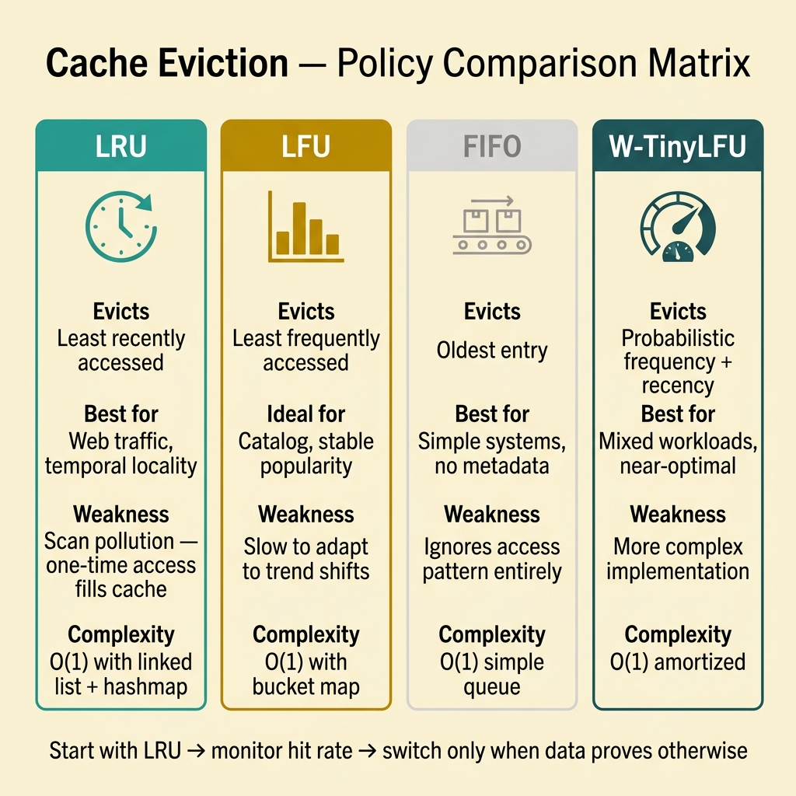
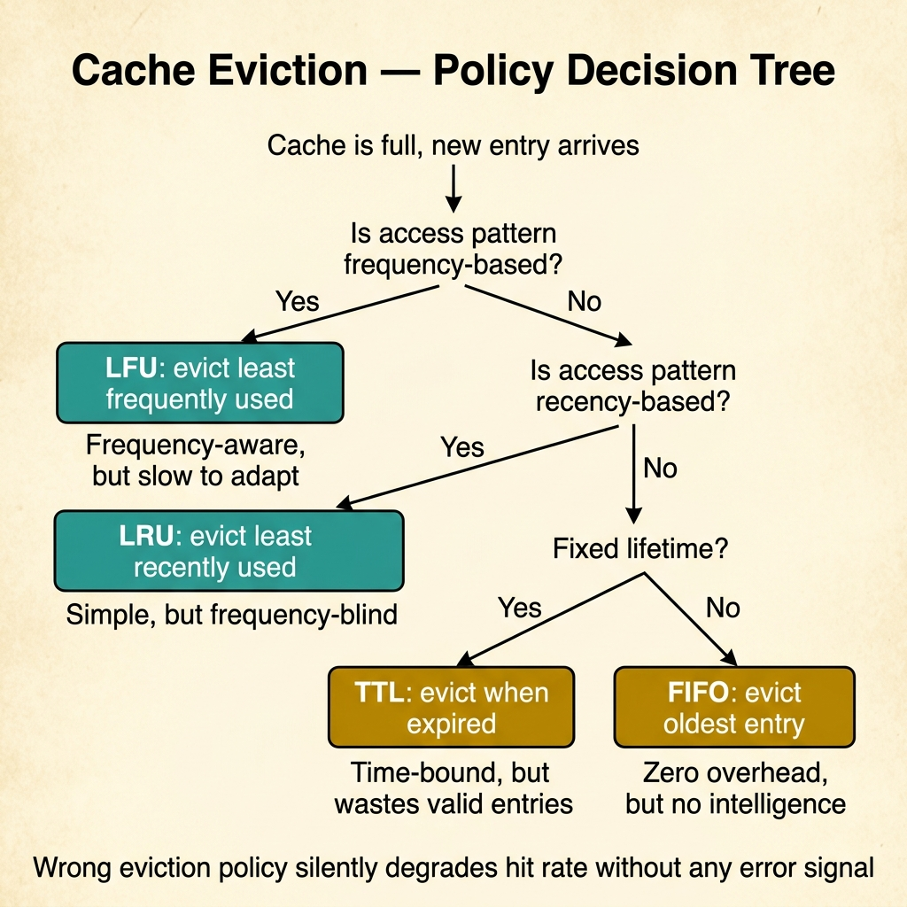

<!-- tags: glossary, reference, performance-caching, cache-eviction -->
# Cache Eviction

> The policy that decides which cached entries to remove when the cache reaches its capacity limit, directly controlling hit rate and memory efficiency.

| Aspect | Detail |
| --- | --- |
| **Concept** | The policy that decides which cached entries to remove when the cache reaches its capacity limit, directly controlling hit rate and memory efficiency. |
| **Audience** | Backend engineer, SRE, performance tuner, system designer |
| **Primary style** | Glossary term |
| **Entry point** | Use when cache memory is bounded and the team must decide which entries survive and which are dropped |

📅 Created: 2026-03-30 · 🔄 Updated: 2026-04-18 · ⏱️ 7 min read

---

## 1. DEFINE

The cache is full. A new entry arrives. Something must go. The question is not whether to evict — it is which entry to sacrifice. Pick wrong, and you evict the entry that will be requested 5ms later, turning a potential hit into a guaranteed miss. That choice is the boundary of **Cache Eviction**.

**Cache Eviction** is the policy that decides which cached entries to remove when the cache reaches its capacity limit. The right eviction policy maximizes hit rate for the actual access pattern; the wrong one wastes memory on entries nobody asks for.

Eviction is not cache invalidation. Invalidation removes entries because the data changed. Eviction removes entries because the cache is full. Mixing them up leads to policies that are correct for freshness but wrong for capacity, or vice versa.

| Variant | Description |
| --- | --- |
| LRU (Least Recently Used) | Evicts the entry that has not been accessed for the longest time. |
| LFU (Least Frequently Used) | Evicts the entry with the fewest accesses over its lifetime. |
| FIFO (First In, First Out) | Evicts the oldest entry regardless of access pattern. |
| TTL-based | Entries expire after a fixed duration, regardless of access. |
| W-TinyLFU | Combines recency and frequency with a probabilistic filter for near-optimal hit rate. |

| Approach | Time | Space | When to choose |
| --- | --- | --- | --- |
| LRU | O(1) with doubly-linked list + hashmap | O(n) | When access recency is a strong predictor of future access. |
| LFU | O(log n) naive, O(1) with bucket map | O(n) | When some keys are consistently popular and must survive. |
| TTL-only | O(1) per check | O(n) | When freshness matters more than capacity optimization. |

Core insight:

> The best eviction policy is the one that matches your access distribution. LRU works for most web workloads. LFU works for catalog-style access. If you have not profiled your access pattern, LRU is a safe default.

### 1.1 Invariants & Failure Modes

- Eviction must never remove an entry that is being actively read (race-safe eviction).
- Eviction rate should be monitored — high eviction rate means the cache is too small or the policy is wrong.
- TTL and capacity eviction can interact: an entry may be evicted by capacity before its TTL expires.

Failure mode: using FIFO because it is simple, but the access pattern is heavily skewed. The most popular entries keep getting evicted and re-fetched, producing a cache that churns without helping.

---

## 2. CONTEXT

**Who uses it**: Backend engineer, SRE, performance tuner, system designer

**When**: When cache memory is bounded and the team must decide which entries survive and which are dropped.

**Purpose**: The best eviction policy is the one that matches your access distribution. Choosing wrong means the cache works against you — evicting the entries you need most.

**In the ecosystem**:
Eviction sits between cache sizing (how much memory) and cache invalidation (when data changes). It answers a different question: not "when is data stale?" but "when is space gone?"

---

The cache is full. But which eviction policy fits your workload, and when does the wrong policy make caching worse than no cache at all?

## 3. EXAMPLES

Cache eviction surfaces most clearly when hit rate drops despite the cache being full (wrong entries surviving), when a popular product page suddenly slows down because its cache entry was evicted, or when the team debates LRU vs. LFU without examining their access distribution. The examples below place the concept into exactly those situations.

### Example 1: Basic — Choose a default eviction policy for a new cache layer

> **Goal**: Select an eviction policy for a product catalog cache with bounded memory.
> **Approach**: Match the access pattern to the eviction algorithm's strength.
> **Example**: An e-commerce catalog has 500K products; 5K are accessed in any given minute.
> **Complexity**: Basic — first eviction decision before production traffic.



*Figure: Four eviction policies compared across eviction logic, best-fit workload, weakness, and complexity. LRU is the safe default for web traffic; LFU wins for stable catalogs; W-TinyLFU is near-optimal but more complex. Start with LRU and change only when access data warrants it.*

```yaml
eviction_decision:
  workload: "e-commerce product catalog"
  access_pattern: "heavily skewed — top 1% of products get 60% of traffic"
  cache_capacity: "10K entries"
  policy_choice: "LRU"
  reasoning:
    - "recency correlates with popularity for browsing patterns"
    - "LRU is O(1) and well-supported by Redis and in-process caches"
    - "FIFO would evict popular items if they entered early"
```

**Why?** The default choice matters more than the team thinks. Most web workloads have temporal locality — what was accessed recently is likely accessed again. LRU captures this. FIFO does not.

**Takeaway**: For most web workloads, LRU is the correct starting default. Change it only when access data proves otherwise.

### Example 2: Intermediate — Detect that eviction policy is hurting hit rate

> **Goal**: Diagnose a hit rate regression caused by a policy mismatch.
> **Approach**: Compare eviction rate with access frequency distribution.
> **Example**: Hit rate dropped from 92% to 78% after the team switched from LRU to FIFO.
> **Complexity**: Intermediate — tracing a performance regression to the eviction layer.

```yaml
eviction_diagnosis:
  symptom: "hit rate dropped from 92% to 78%"
  timeline: "started after config change from LRU to FIFO"
  analysis:
    eviction_rate: "3x higher than before"
    key_pattern: "popular products evicted early, re-fetched repeatedly"
    access_distribution: "zipf-like — top 100 keys get 40% of traffic"
  fix:
    - "revert to LRU — recency predicts access for this workload"
    - "consider W-TinyLFU if frequency matters (e.g., Caffeine in Java)"
```

**Why?** FIFO treats all entries equally — first in, first out. But access patterns are rarely uniform. When the team ignores the skew, eviction becomes a source of misses instead of a memory manager.

**Takeaway**: When hit rate drops after an eviction policy change, compare eviction rate against access frequency before tuning anything else.

### Example 3: Advanced — Combine TTL and capacity eviction without conflicts

> **Goal**: Design a cache that handles both freshness (TTL) and space (capacity) eviction.
> **Approach**: Layer TTL for correctness and LRU for capacity management.
> **Example**: A session cache needs data to expire after 30 minutes but also cannot exceed 50K entries.
> **Complexity**: Advanced — two eviction dimensions interacting.

```yaml
dual_eviction:
  cache: "user session store"
  ttl_policy:
    purpose: "correctness — sessions must not outlive their validity"
    ttl: "30m"
  capacity_policy:
    purpose: "memory safety — node cannot exceed 50K entries"
    algorithm: "LRU"
    max_entries: 50000
  interaction_rules:
    - "TTL takes priority — expired entries are evicted even if cache is not full"
    - "capacity eviction only fires when cache is full AND entry is not expired"
    - "monitor: ttl_evictions vs capacity_evictions ratio"
  risk:
    - "if TTL is too aggressive, capacity eviction never fires but hit rate drops"
    - "if capacity is too tight, valid sessions get evicted before TTL"
```

**Why?** TTL and capacity eviction answer different questions. TTL says "is this data still valid?" Capacity says "is there room?" Layering them correctly prevents stale data from surviving and valid data from being dropped too early.

**Takeaway**: Advanced eviction design treats TTL and capacity as orthogonal concerns, monitors both, and alerts when one overwhelms the other.

---

## 4. COMPARE



*Figure: Choose eviction policy by access pattern — LFU for frequency, LRU for recency, TTL for fixed lifetime, FIFO for zero-overhead. Wrong policy silently degrades hit rate without any error signal.*

*Figure: Cache eviction positioned among hit/miss, invalidation, and sizing strategies.*

Eviction sounds like invalidation. It is not: invalidation removes data because it changed. Eviction removes data because there is no room. A well-invalidated cache can still evict useful entries if undersized.

### Level 1

```text
Cache full → new entry arrives → eviction policy selects victim → victim removed → new entry stored
```
*Figure: Level 1 — eviction is triggered by capacity, not by data staleness.*

### Level 2

```text
Policy         Best for                         Weakness
──────────     ──────────────────────            ──────────────────────────
LRU            Temporal locality (web)           Scan resistance (one-time access fills cache)
LFU            Stable popularity (catalog)       Slow to adapt to trend shifts
FIFO           Simple, no metadata overhead      Ignores access pattern entirely
W-TinyLFU      Near-optimal for mixed patterns   More complex implementation
TTL            Freshness guarantee               Not a capacity manager
```
*Figure: Level 2 — each policy trades simplicity for accuracy in a different dimension.*

### Easily confused or boundary-slipping

| # | Severity | Mistake | Consequence | Fix |
| --- | --- | --- | --- | --- |
| 1 | 🔴 Fatal | Confusing eviction with invalidation | Policies fight each other — stale data survives, fresh data gets evicted | Treat them as separate layers with clear ownership. |
| 2 | 🟡 Common | Using FIFO for skewed workloads | Popular entries repeatedly evicted and re-fetched | Switch to LRU or LFU based on access analysis. |
| 3 | 🟡 Common | Never monitoring eviction rate | Cannot tell if cache is too small or policy is wrong | Add eviction counters per policy type. |
| 4 | 🔵 Minor | Over-engineering eviction before profiling access | Complexity without data to justify it | Start with LRU; switch only when access data warrants it. |

### Quick scan

| If you face | Action |
| --- | --- |
| Hit rate fine but memory usage keeps growing | TTL may be too long — entries accumulate but are rarely accessed |
| Hit rate dropped after config change | Compare eviction rate before/after; likely policy mismatch |
| Cache full but most entries are stale | TTL eviction is not firing or is too generous |

---

## 5. REF

| Resource | Type | Link | Note |
| --- | --- | --- | --- |
| Redis Eviction Policies | Official | https://redis.io/docs/reference/eviction/ | Complete reference for Redis eviction algorithms. |
| Caffeine (W-TinyLFU) | Open Source | https://github.com/ben-manes/caffeine | State-of-the-art eviction for JVM with near-optimal hit rate. |
| Martin Kleppmann — DDIA | Book | https://dataintensive.net/ | Caching trade-offs in distributed systems context. |

---

## 6. RECOMMEND

Cache eviction answers "the cache is full — what gets dropped?" The next question: what happens when many requests miss on the same key at the exact same moment?

| Expand to | When | Reason | File/Link |
| --- | --- | --- | --- |
| Topic hub | When eviction needs broader context | Return to the caching strategy overview | [Performance & Caching](./README.md) |
| Previous concept | When the problem is hit rate, not eviction policy | Hit/miss is the foundation before eviction matters | [Cache Hit / Miss](./01-cache-hit-miss.md) |
| Next concept | When concurrent misses overwhelm the origin | Cache stampede is the failure mode of simultaneous misses | [Cache Stampede](./03-cache-stampede.md) |

Back to the full cache at the start — a new entry arrives and something must go. Now you know: LRU for recency-driven traffic, LFU for popularity-driven catalogs, and always monitor eviction rate alongside hit rate.

**Links**: [← Previous](./01-cache-hit-miss.md) · [→ Next](./03-cache-stampede.md)
