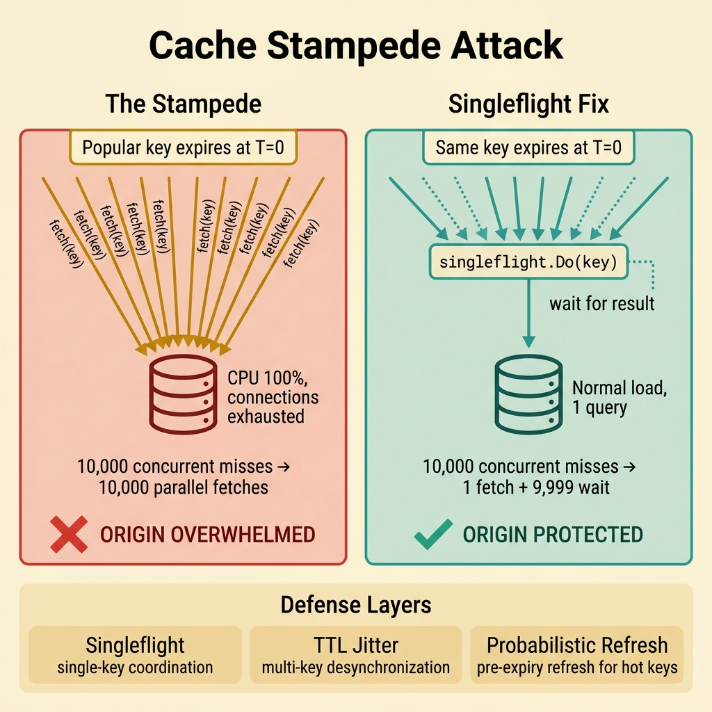
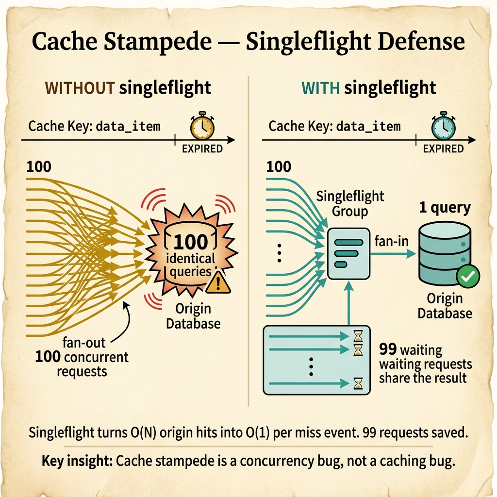

<!-- tags: glossary, reference, performance-caching, cache-stampede -->
# Cache Stampede

> A failure pattern where many concurrent requests miss the cache on the same key simultaneously, all triggering parallel fetches to the origin and potentially overwhelming it.

| Aspect | Detail |
| --- | --- |
| **Concept** | A failure pattern where many concurrent requests miss the cache on the same key simultaneously, all triggering parallel fetches to the origin and potentially overwhelming it. |
| **Audience** | Backend engineer, SRE, system designer, incident responder |
| **Primary style** | Glossary term |
| **Entry point** | Use when a popular key expires under high concurrency and the origin buckles under duplicate requests |

📅 Created: 2026-03-30 · 🔄 Updated: 2026-04-18 · ⏱️ 7 min read

---

## 1. DEFINE

A flash sale starts at 09:00. At 09:00:01, the product detail cache entry expires. 10,000 requests arrive within the same second, all miss the cache, all hit the database, and the database connection pool is exhausted. The cache was supposed to protect the database. Instead, the expiry pattern turned the cache into a synchronized attack vector. That is the boundary of **Cache Stampede**.

**Cache Stampede** (also called thundering herd on cache, cache dogpile, or cache avalanche for multi-key variants) is a failure pattern where many concurrent requests miss the cache on the same key simultaneously, all triggering parallel fetches to the origin.

Cache stampede differs from thundering herd in scope: thundering herd is a broader concurrency pattern (e.g., many goroutines waking on the same signal), while cache stampede is specifically about cache miss amplification.

| Variant | Description |
| --- | --- |
| Single-key stampede | One popular key expires; N requests all miss and fetch concurrently. |
| Multi-key avalanche | Many keys share the same TTL and expire at the same time, creating a wall of misses. |
| Cold-start stampede | Service restart or new cache node joins with an empty cache under full traffic. |

| Approach | Time | Space | When to choose |
| --- | --- | --- | --- |
| Request coalescing (singleflight) | O(1) coordination | O(pending keys) | When the origin fetch is idempotent and results are shareable. |
| Probabilistic early expiry | O(1) per check | O(1) extra per key | When you want to spread recomputation across time. |
| Lock-and-wait (mutex per key) | O(1) + wait | O(active keys) | When only one request should fetch and others should wait. |

Core insight:

> Cache stampede is a concurrency bug, not a caching bug. The cache layer works correctly — entries expire as configured. The failure is that N requests race to fill the same gap instead of coordinating.

### 1.1 Invariants & Failure Modes

- Only one request should fetch from origin per cache key per miss event.
- TTL values for popular keys should be jittered, not synchronized.
- The origin must have capacity headroom for the miss rate, not just the hit rate.

Failure mode: the team sizes the database for steady-state load (mostly cache hits) but ignores the burst load from cache misses. When a popular key expires, the origin sees 100x its normal load for a few seconds.

---

## 2. CONTEXT

**Who uses it**: Backend engineer, SRE, system designer, incident responder

**When**: When a popular key expires under high concurrency and the origin buckles under duplicate requests.

**Purpose**: Cache stampede is a concurrency bug, not a caching bug. The fix is coordination — singleflight, locking, or probabilistic refresh — not more cache memory.

**In the ecosystem**:
Stampede is the failure mode that cache-aside pattern creates if not paired with request coalescing. It sits between cache eviction (capacity management) and cache invalidation (data freshness), triggered when both happen under high concurrency.

---

The expiry is scheduled. But how do you prevent 10,000 requests from stampeding the origin at the exact same moment?



*Figure: When a popular key expires, uncoordinated misses overwhelm the origin. Singleflight collapses 10,000 parallel fetches into 1 fetch + 9,999 waits. Defense layers stack: singleflight for single-key, TTL jitter for multi-key, probabilistic refresh for hot keys.*

## 3. EXAMPLES

Cache stampede surfaces most clearly when a flash sale page goes down at the start of the sale (not during), when database CPU spikes to 100% for exactly the TTL duration, or when the team adds "retry on miss" and makes the stampede worse. The examples below place the concept into exactly those situations.

### Example 1: Basic — Recognize stampede vs. normal miss pattern

> **Goal**: Distinguish a cache stampede from ordinary cache misses.
> **Approach**: Look for concurrent miss spikes on the same key correlated with origin overload.
> **Example**: Database connection pool exhausted at exactly the time a popular key's TTL expired.
> **Complexity**: Basic — routing the symptom to the right failure class.

```yaml
stampede_diagnosis:
  symptom: "database connection pool exhausted at 09:00:01"
  cache_state: "product-detail:hot-sku expired at 09:00:00"
  concurrent_misses: "~10,000 requests in 1 second"
  origin_impact: "all 10,000 hit the database simultaneously"
  distinction:
    normal_miss: "occasional miss, one fetch, cache refilled"
    stampede: "mass concurrent miss, N parallel fetches, origin overwhelmed"
```

**Why?** The team might blame the database, add more replicas, or increase the connection pool. But the root cause is not database capacity — it is uncoordinated concurrent cache misses. Fix the coordination, and the database load returns to normal.

**Takeaway**: If origin overload correlates with a popular key's TTL expiry, the problem is stampede, not capacity.

### Example 2: Intermediate — Implement singleflight to collapse concurrent fetches

> **Goal**: Ensure only one goroutine fetches from origin per cache key per miss event.
> **Approach**: Use Go's `singleflight` package to deduplicate concurrent requests.
> **Example**: Product detail endpoint with 10K QPS on a key that expires every 5 minutes.
> **Complexity**: Intermediate — adding coordination without changing the cache or origin.

```yaml
singleflight_setup:
  pattern: "cache-aside with singleflight wrapper"
  mechanism:
    - "request arrives, cache miss detected"
    - "singleflight.Do(key, fetchFn) called"
    - "first caller executes fetchFn; concurrent callers wait"
    - "all callers receive the same result"
  result:
    before: "10,000 concurrent misses → 10,000 database queries"
    after: "10,000 concurrent misses → 1 database query + 9,999 wait"
  trade_off:
    - "all waiters share the same latency as the fetcher"
    - "if fetchFn fails, all waiters get the same error"
```

**Why?** Singleflight turns O(N) origin hits into O(1) per miss event. The trade-off is that all waiting requests share the fetcher's latency and error. For idempotent reads, this is almost always the right choice.

**Takeaway**: `singleflight.Do` is the simplest and most effective stampede prevention for read-heavy cache-aside patterns.

### Example 3: Advanced — Prevent multi-key avalanche with TTL jitter and probabilistic refresh

> **Goal**: Prevent mass cache expiry when many keys share the same TTL.
> **Approach**: Add random jitter to TTL and implement probabilistic early refresh.
> **Example**: 50K product keys all set with TTL=5m at the same time; they all expire together.
> **Complexity**: Advanced — from single-key coordination to system-wide miss distribution.

```yaml
avalanche_prevention:
  problem: "50K keys expire within the same 1-second window"
  solutions:
    ttl_jitter:
      base_ttl: "5m"
      jitter_range: "±30s"
      effect: "expirations spread over 60-second window instead of 1-second spike"
    probabilistic_refresh:
      algorithm: "XFetch — refresh probability increases as TTL approaches 0"
      effect: "popular keys refreshed slightly before expiry, preventing miss entirely"
    combination:
      - "jitter prevents synchronized expiry"
      - "probabilistic refresh prevents miss on the hottest keys"
      - "singleflight catches any remaining concurrent misses"
  monitoring:
    - "miss rate distribution over time (should be flat, not spiky)"
    - "origin QPS correlation with cache expiry events"
```

**Why?** Single-key singleflight solves one key at a time. Multi-key avalanche needs a different approach: spreading expirations over time (jitter) and refreshing before expiry (probabilistic). The combination makes miss rate smooth instead of spiky.

**Takeaway**: Advanced stampede prevention makes miss rate a flat line, not a periodic spike.

---

## 4. COMPARE



*Figure: Without singleflight, 100 concurrent misses fan out into 100 identical queries. With singleflight, 1 request fetches while 99 share the result — O(N) becomes O(1).*

*Figure: Cache stampede positioned among thundering herd, cache avalanche, and singleflight coordination.*

Cache stampede sounds like thundering herd. Close: thundering herd is the general concurrency pattern (many waiters wake at once). Cache stampede is the specific instance where the wakeup event is a cache miss. The fix is the same principle — coordinate — but the implementation differs.

### Level 1

```text
Key expires → N requests arrive → all miss → all fetch from origin → origin overwhelmed
Fix: only 1 fetches, N-1 wait for the result
```
*Figure: Level 1 — stampede is the failure mode of uncoordinated concurrent misses.*

### Level 2

```text
Defense layer     What it solves                     Limitation
──────────────    ──────────────────────              ──────────────────────────
Singleflight      Concurrent miss on same key         Single process only
Distributed lock  Cross-instance coordination         Adds latency + lock management
TTL jitter         Multi-key synchronized expiry       Does not help single hot key
Probabilistic      Hot key refresh before expiry       Adds complexity per key
Warm-up            Cold-start stampede                 Requires access log or prediction
```
*Figure: Level 2 — each defense layer addresses a different stampede variant.*

### Easily confused or boundary-slipping

| # | Severity | Mistake | Consequence | Fix |
| --- | --- | --- | --- | --- |
| 1 | 🔴 Fatal | Adding "retry on miss" without singleflight | Retries amplify the stampede | Use singleflight before any retry logic. |
| 2 | 🟡 Common | Sizing origin for steady-state only | Origin survives normal load but crashes on miss burst | Size origin for peak miss rate, not average load. |
| 3 | 🟡 Common | All keys share exact same TTL | Synchronized expiry creates periodic avalanches | Add jitter to every TTL assignment. |
| 4 | 🔵 Minor | Using distributed lock for a single-instance cache | Over-engineering when singleflight suffices | Match the coordination scope to the deployment topology. |

### Quick scan

| If you face | Action |
| --- | --- |
| Origin overload correlates with TTL expiry | Stampede confirmed — add singleflight. |
| Periodic latency spikes at regular intervals | Check if TTL is uniform — add jitter. |
| Post-deploy miss storm | Cold-start stampede — implement cache warming. |

---

## 5. REF

| Resource | Type | Link | Note |
| --- | --- | --- | --- |
| Go singleflight package | Official | https://pkg.go.dev/golang.org/x/sync/singleflight | Standard Go solution for request deduplication. |
| XFetch Algorithm | Paper | https://cseweb.ucsd.edu/~avattani/papers/cache_stampede.pdf | Probabilistic early refresh to prevent stampede. |
| AWS Builders Library | Reference | https://aws.amazon.com/builders-library/ | Practical patterns for thundering herd and cache coordination. |

---

## 6. RECOMMEND

Cache stampede answers "why did the database crash when the cache was supposed to protect it?" The next question: how should the application populate the cache in the first place?

| Expand to | When | Reason | File/Link |
| --- | --- | --- | --- |
| Topic hub | When stampede needs broader caching context | Return to the overview | [Performance & Caching](./README.md) |
| Previous concept | When the problem is eviction, not concurrency | Eviction decides who stays; stampede is about who fetches | [Cache Eviction](./02-cache-eviction.md) |
| Next concept | When you need to decide the cache population strategy | Cache-aside is the most common pattern and stampede's natural host | [Cache-Aside](./04-cache-aside.md) |

Back to the flash sale at 09:00 — the cache expired, 10,000 requests stampeded the database, and the sale page went down. Now you know: one line of `singleflight.Do` turns 10,000 parallel fetches into 1. The cache was fine. The coordination was missing.

**Links**: [← Previous](./02-cache-eviction.md) · [→ Next](./04-cache-aside.md)
