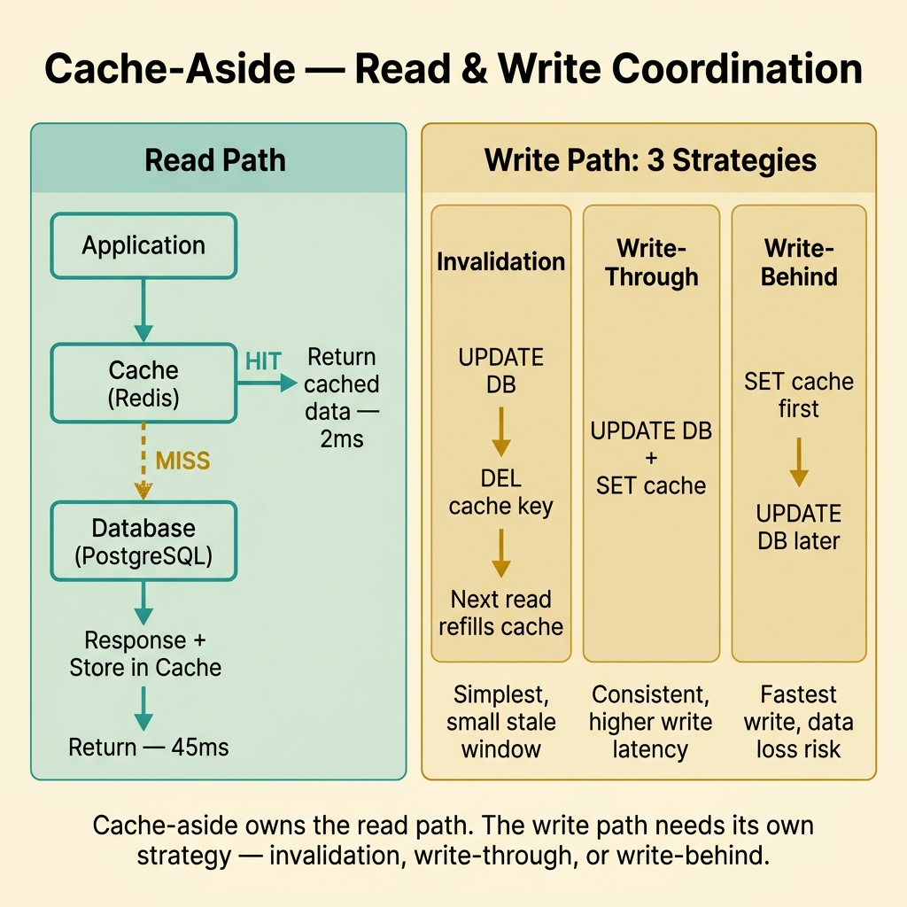
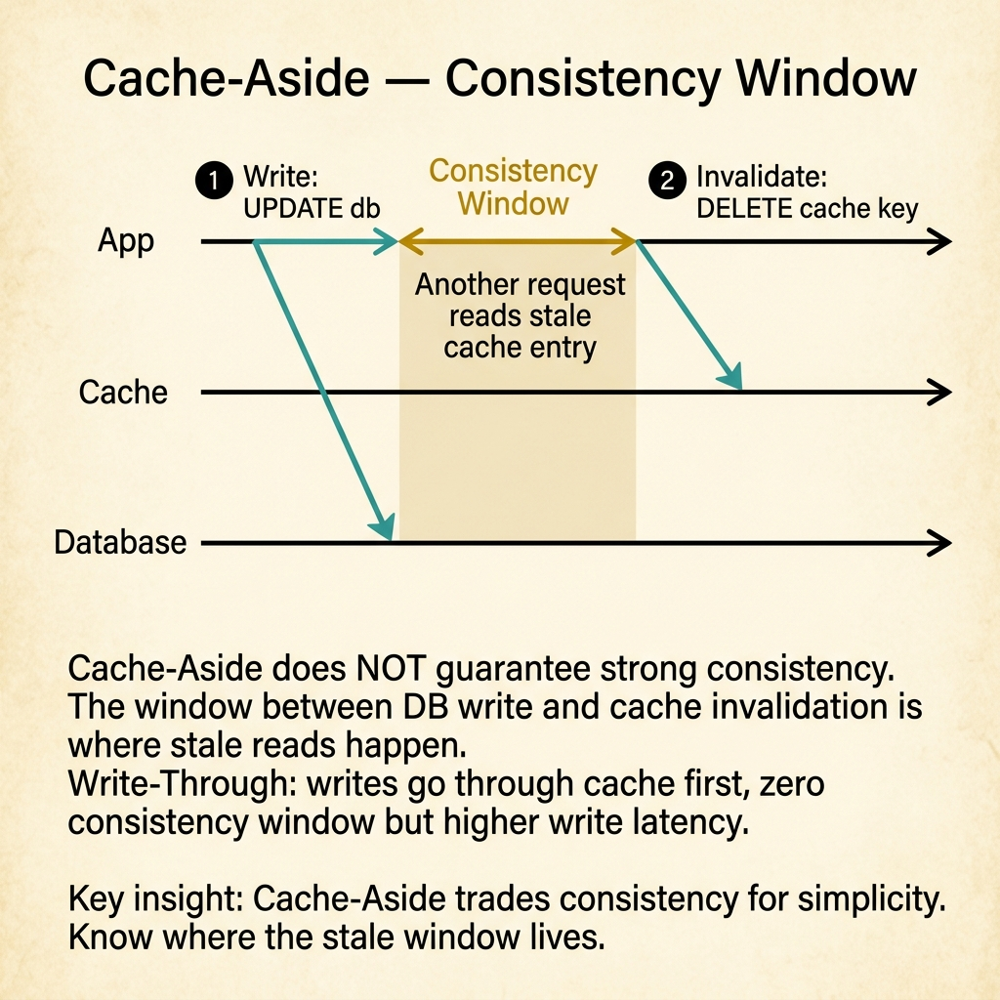

<!-- tags: glossary, reference, performance-caching, cache-aside -->
# Cache-Aside (Lazy Loading)

> A caching pattern where the application is responsible for reading from and writing to the cache explicitly, treating the cache as a side resource rather than an inline layer.

| Aspect | Detail |
| --- | --- |
| **Concept** | A caching pattern where the application is responsible for reading from and writing to the cache explicitly, treating the cache as a side resource rather than an inline layer. |
| **Audience** | Backend engineer, system designer, performance tuner, Go/Node.js developer |
| **Primary style** | Glossary term |
| **Entry point** | Use when deciding how the application populates and manages its cache layer |

📅 Created: 2026-03-30 · 🔄 Updated: 2026-04-18 · ⏱️ 7 min read

---

## 1. DEFINE

The product page loads in 12ms when the cache is warm. A new product is added, but the cache still shows the old catalog for 5 minutes. The team debates: should the cache update itself, or should the application control what goes in and when? That decision — application-managed cache — is the boundary of **Cache-Aside**.

**Cache-Aside** (also called Lazy Loading) is a caching pattern where the application checks the cache first, fetches from the origin on a miss, and then stores the result in the cache. The cache never talks to the database directly; the application mediates every interaction.

Cache-aside differs from read-through in that the application owns the cache population logic. In read-through, the cache itself fetches from the origin on a miss. Cache-aside gives the application full control but adds responsibility for consistency.

| Variant | Description |
| --- | --- |
| Pure cache-aside | Application reads cache → misses → fetches origin → writes cache. |
| Cache-aside with TTL | Same flow but entries expire after a fixed duration for freshness. |
| Cache-aside with invalidation | Write operations explicitly delete or update cache entries alongside database writes. |

| Approach | Time | Space | When to choose |
| --- | --- | --- | --- |
| Cache-aside | O(1) hit, O(origin) miss | O(working set) | When the application needs explicit control over what is cached and when. |
| Read-through | O(1) hit, O(origin) miss | O(working set) | When the cache layer should handle origin fetching transparently. |
| Write-through | O(origin + cache) write | O(all writes) | When write consistency between cache and origin is critical. |

Core insight:

> Cache-aside is the simplest pattern to implement and the easiest to reason about. Its weakness is that every cache miss is a cold path, and the application must handle invalidation explicitly. If the team does not invalidate on writes, users see stale data.

### 1.1 Invariants & Failure Modes

- Every write to the origin must be paired with a cache invalidation or update strategy.
- The application must handle the cold-miss path gracefully (origin may be slow or down).
- Cache-aside is vulnerable to stampede on popular keys — pair with singleflight.

Failure mode: the team implements cache-aside for reads but forgets to invalidate on writes. The cache returns stale data until TTL expires, and users report "changes don't appear."

---

## 2. CONTEXT

**Who uses it**: Backend engineer, system designer, performance tuner, Go/Node.js developer

**When**: When deciding how the application populates and manages its cache layer.

**Purpose**: Cache-aside is the simplest pattern to implement and the easiest to reason about. Its weakness is that every cache miss is a cold path, and the application must handle invalidation explicitly.

**In the ecosystem**:
Cache-aside is the default caching pattern in most web applications. It is the natural first choice because:
- the application already knows what it needs;
- no special cache infrastructure is required;
- invalidation logic lives in the same codebase as the write logic.

---

The pattern is simple: check cache, miss, fetch, store. But who invalidates on writes, what happens during a stampede, and when should you move to read-through instead?

## 3. EXAMPLES

Cache-aside surfaces most clearly when a dashboard loads slowly on the first request but instantly on the second, when a product update does not appear until the TTL expires, or when the team adds a cache but forgets to invalidate on writes. The examples below place the pattern into exactly those situations.

### Example 1: Basic — Implement the core cache-aside read path

> **Goal**: Show the canonical cache-aside flow for a product lookup.
> **Approach**: Check cache → miss → fetch from database → store in cache → return.
> **Example**: A product detail endpoint backed by PostgreSQL with Redis as cache.
> **Complexity**: Basic — the foundational pattern before any optimization.



*Figure: Cache-aside splits into a read path (application-mediated) and a write path with three strategies — invalidation, write-through, and write-behind. The application owns every interaction between cache and database.*

```yaml
cache_aside_read:
  step_1: "check Redis for key product:{id}"
  step_2_hit: "return cached JSON directly"
  step_2_miss:
    - "query PostgreSQL for product row"
    - "serialize to JSON"
    - "SET product:{id} in Redis with TTL 5m"
    - "return JSON to caller"
  latency:
    hit: "2ms (Redis round-trip)"
    miss: "45ms (PostgreSQL query + Redis write + serialization)"
```

**Why?** Cache-aside is explicit: the application knows exactly what it cached, when, and why. There is no magic — every cache entry has a clear provenance. This transparency makes debugging straightforward.

**Takeaway**: The basic cache-aside pattern is three lines of logic: check, fetch on miss, store. The discipline is in what comes next — invalidation.

### Example 2: Intermediate — Add write-through invalidation to prevent stale reads

> **Goal**: Ensure cache entries are invalidated when the underlying data changes.
> **Approach**: Delete the cache entry in the same transaction or operation that updates the database.
> **Example**: Admin updates a product price; the cached product detail must reflect the change immediately.
> **Complexity**: Intermediate — coordinating read and write paths.

```yaml
cache_aside_invalidation:
  write_path:
    step_1: "UPDATE product SET price = $new WHERE id = $id"
    step_2: "DEL product:{id} from Redis"
    step_3: "next read will miss, fetch fresh data, re-populate cache"
  ordering_risk:
    problem: "if DEL happens before UPDATE commits, a concurrent read re-caches stale data"
    fix: "DEL after transaction commit, or use a short delay before DEL"
  alternative:
    strategy: "write-through — update cache in the same operation as database"
    trade_off: "adds latency to every write but eliminates stale window"
```

**Why?** Cache-aside without invalidation is a time bomb. The team ships fast reads but accumulates stale data. The invalidation strategy — delete vs. update, before vs. after commit — determines the freshness guarantee.

**Takeaway**: Intermediate cache-aside means the write path is as important as the read path. Every UPDATE must answer: "what happens to the cache?"

### Example 3: Advanced — Combine cache-aside with singleflight for stampede protection

> **Goal**: Prevent cache stampede on popular keys while keeping cache-aside simplicity.
> **Approach**: Wrap the origin fetch in singleflight so concurrent misses produce one fetch.
> **Example**: Flash sale product with 10K QPS and 5-minute TTL.
> **Complexity**: Advanced — layering concurrency control onto the caching pattern.

```yaml
cache_aside_with_singleflight:
  read_path:
    step_1: "check Redis for product:{id}"
    step_2_miss:
      - "singleflight.Do(product:{id}, fetchFn)"
      - "only first caller hits PostgreSQL"
      - "result shared with all concurrent waiters"
      - "winner stores result in Redis with TTL 5m + jitter"
  benefits:
    - "O(1) origin hits per miss event instead of O(N)"
    - "cache-aside simplicity preserved — no infrastructure change"
    - "jitter prevents synchronized TTL expiry"
  monitoring:
    - "singleflight_shared_count — how many requests were deduplicated"
    - "miss_fetch_latency — how long the origin fetch took"
```

**Why?** Cache-aside alone does not coordinate concurrent misses. Singleflight closes that gap with one line of code. The combination gives the team cache-aside's simplicity with stampede protection's safety.

**Takeaway**: Advanced cache-aside layers singleflight and TTL jitter onto the basic pattern — no architecture change, just coordination.

---

## 4. COMPARE



*Figure: The window between DB write and cache invalidation is where stale reads happen. Cache-Aside trades consistency for simplicity — know where the stale window lives.*

*Figure: Cache-aside positioned among read-through, write-through, and write-behind patterns.*

Cache-aside sounds like read-through. Close, but the boundary matters: in cache-aside, the application fetches from the origin. In read-through, the cache fetches. The difference determines where the fetch logic lives and who is responsible for origin errors.

### Level 1

```text
Application → Cache? → HIT: return
                     → MISS: fetch origin → store in cache → return
```
*Figure: Level 1 — cache-aside is application-driven. The cache never contacts the origin directly.*

### Level 2

```text
Pattern            Who fetches on miss?    Who invalidates?     Complexity
──────────────     ─────────────────────   ──────────────────   ──────────
Cache-aside        Application             Application          Low
Read-through       Cache layer             Cache layer           Medium
Write-through      N/A (write path)        Inline with write    Medium
Write-behind       N/A (write path)        Async after write    High
```
*Figure: Level 2 — cache-aside gives the application full control at the cost of full responsibility.*

### Easily confused or boundary-slipping

| # | Severity | Mistake | Consequence | Fix |
| --- | --- | --- | --- | --- |
| 1 | 🔴 Fatal | Implementing cache-aside reads without invalidation on writes | Stale data served until TTL expires | Add DEL to every write path that touches cached data. |
| 2 | 🟡 Common | Invalidating before the database transaction commits | Concurrent read re-caches stale data during commit window | Invalidate after commit confirmation. |
| 3 | 🟡 Common | Using cache-aside without singleflight on hot keys | Stampede on TTL expiry | Wrap origin fetch in singleflight. |
| 4 | 🔵 Minor | Using read-through when cache-aside suffices | Added infrastructure complexity without benefit | Cache-aside is simpler; switch only when cache should own fetching. |

### Quick scan

| If you face | Action |
| --- | --- |
| Changes not appearing after update | Check if the write path invalidates the cache entry |
| First request slow, subsequent fast | Cache-aside working correctly — cold miss on first request |
| Database overloaded on TTL expiry | Add singleflight to the miss path |

---

## 5. REF

| Resource | Type | Link | Note |
| --- | --- | --- | --- |
| Microsoft Cache-Aside Pattern | Official | https://learn.microsoft.com/en-us/azure/architecture/patterns/cache-aside | Canonical reference for the pattern with Azure examples. |
| Redis Caching Best Practices | Reference | https://redis.io/docs/manual/patterns/ | Practical implementation patterns for Redis as a cache-aside store. |
| Martin Kleppmann — DDIA | Book | https://dataintensive.net/ | Deep coverage of caching trade-offs in distributed systems. |

---

## 6. RECOMMEND

Cache-aside answers "how does the application populate the cache?" The next question: what if the cache should update on writes, not just reads?

| Expand to | When | Reason | File/Link |
| --- | --- | --- | --- |
| Topic hub | When cache-aside needs broader context | Return to the caching strategy overview | [Performance & Caching](./README.md) |
| Previous concept | When the problem is concurrent misses, not the pattern itself | Stampede is cache-aside's primary failure mode | [Cache Stampede](./03-cache-stampede.md) |
| Next concept | When writes must also update the cache | Write-through and write-behind handle the write path | [Write-Through / Write-Behind](./05-write-through-write-behind.md) |

Back to the product update that did not appear — the team had cache-aside reads but no invalidation on writes. Now you know: cache-aside is a read pattern. The write path needs its own cache strategy.

**Links**: [← Previous](./03-cache-stampede.md) · [→ Next](./05-write-through-write-behind.md)
