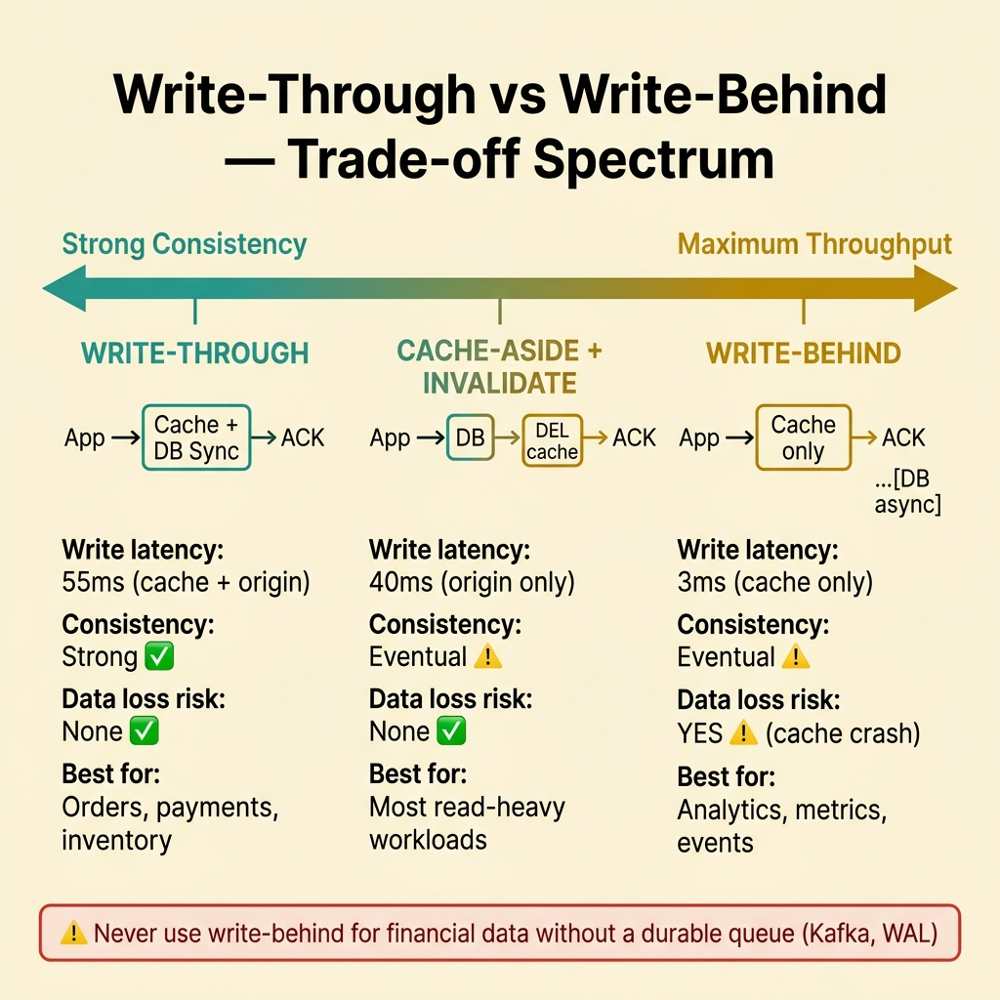
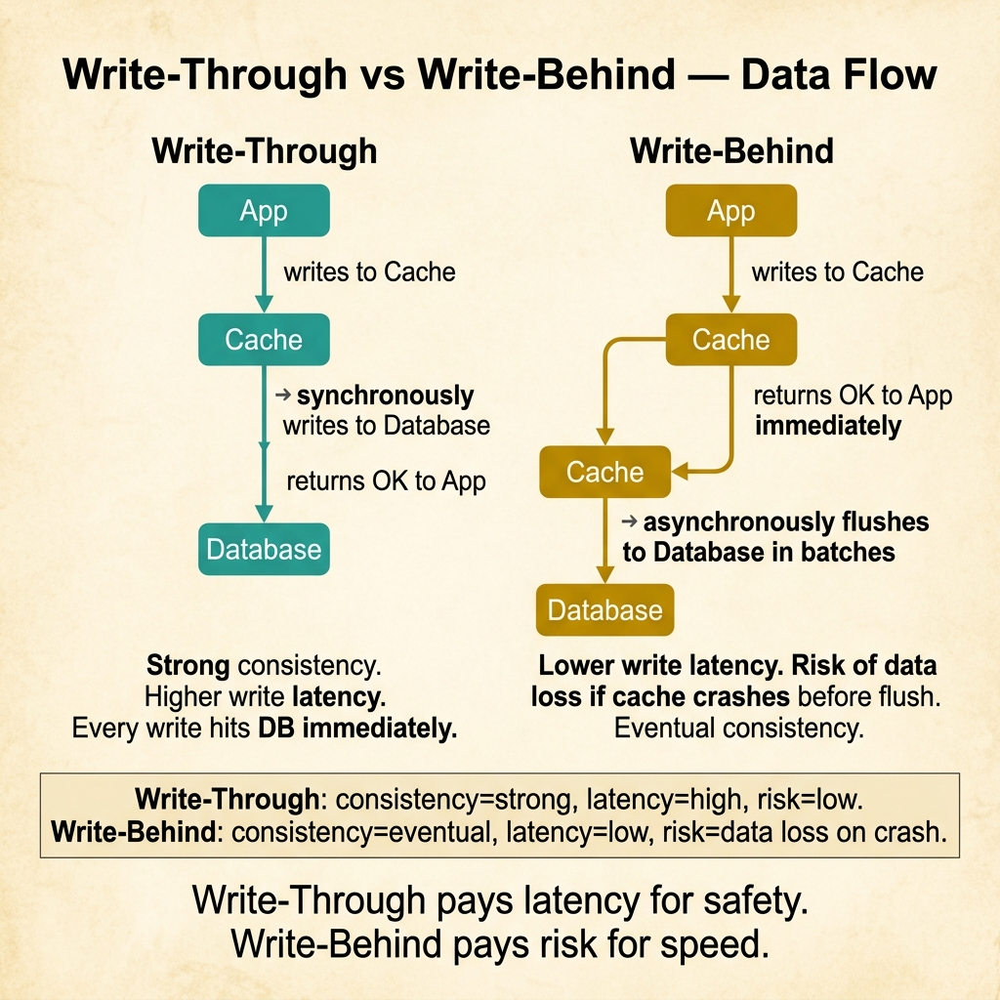

<!-- tags: glossary, reference, performance-caching, write-through, write-behind -->
# Write-Through / Write-Behind

> Two complementary caching patterns that handle the write path: write-through updates cache and origin synchronously, write-behind updates the origin asynchronously after the cache.

| Aspect | Detail |
| --- | --- |
| **Concept** | Two complementary caching patterns that handle the write path: write-through updates cache and origin synchronously, write-behind updates the origin asynchronously after the cache. |
| **Audience** | Backend engineer, system designer, database architect, SRE |
| **Primary style** | Glossary term |
| **Entry point** | Use when the team needs the cache to stay consistent with the origin on writes, not just reads |

📅 Created: 2026-03-30 · 🔄 Updated: 2026-04-18 · ⏱️ 8 min read

---

## 1. DEFINE

The admin updates a product price. With cache-aside, the cached entry must be explicitly deleted. With write-through, the cache entry is updated in the same operation as the database. With write-behind, the cache is updated first and the database is updated asynchronously. Each choice trades latency against consistency in a different direction. That trade-off is the boundary of **Write-Through / Write-Behind**.

**Write-Through** is a caching pattern where every write updates both the cache and the origin store synchronously, in the same operation. The write is not considered complete until both stores confirm.

**Write-Behind** (also called write-back) is a caching pattern where writes update the cache immediately and the origin store is updated asynchronously, in a background process. The write is considered complete once the cache confirms.

| Variant | Description |
| --- | --- |
| Synchronous write-through | Cache and origin updated in the same request path. Write latency = cache + origin. |
| Batched write-behind | Cache updated immediately; origin updated in periodic batches for throughput. |
| Event-driven write-behind | Cache write emits an event; a consumer updates the origin asynchronously. |

| Approach | Write latency | Consistency | Data loss risk | When to choose |
| --- | --- | --- | --- | --- |
| Write-through | Higher (cache + origin) | Strong — both updated synchronously | None | When consistency is more important than write latency. |
| Write-behind | Lower (cache only) | Eventual — origin lags behind cache | Yes — cache crash before flush loses data | When write throughput matters more than immediate consistency. |
| Cache-aside + invalidation | Origin only | Eventual — stale until TTL or invalidation | None | When reads dominate and write path simplicity is preferred. |

Core insight:

> Write-through guarantees consistency at the cost of write latency. Write-behind guarantees speed at the risk of data loss. The team must choose based on how much inconsistency and risk they can tolerate, not based on which sounds simpler.

### 1.1 Invariants & Failure Modes

Write-through invariants:
- write is not acknowledged until both cache and origin confirm;
- if either fails, the write must be retried or rolled back.

Write-behind invariants:
- the async flush must be durable (queue or WAL) to prevent data loss;
- the origin must eventually converge with the cache;
- monitoring must alert on flush lag.

Failure mode: the team uses write-behind for financial data without a durable queue. A cache node crashes, and unsynced writes are permanently lost.

---

## 2. CONTEXT

**Who uses it**: Backend engineer, system designer, database architect, SRE

**When**: When the team needs the cache to stay consistent with the origin on writes, not just reads.

**Purpose**: Write-through guarantees that the cache always reflects the latest write. Write-behind trades that guarantee for lower write latency. The choice depends on the domain's tolerance for inconsistency and data loss.

**In the ecosystem**:
Write-through and write-behind complete the caching picture that cache-aside starts. Cache-aside handles reads; write-through and write-behind handle writes. Most production systems use a combination — cache-aside for reads, write-through or invalidation for writes.

---

The patterns are clear. But when is write-through's latency penalty worth it, and when does write-behind's risk become unacceptable?

## 3. EXAMPLES

Write-through and write-behind surface most clearly when an admin updates inventory and the storefront must reflect it immediately (write-through), when a high-throughput metrics pipeline writes 10K events per second and cannot wait for database round-trips (write-behind), or when the team mixes both patterns incorrectly and gets neither consistency nor speed. The examples below place the patterns into exactly those situations.

### Example 1: Basic — Implement write-through for inventory updates

> **Goal**: Ensure that inventory changes are immediately visible in both cache and database.
> **Approach**: Update cache and database in the same synchronous operation.
> **Example**: An e-commerce admin reduces stock by 1 after a purchase.
> **Complexity**: Basic — the foundational write-through pattern.



*Figure: Three write strategies positioned on a consistency-to-throughput spectrum. Write-through guarantees strong consistency for critical data. Write-behind maximizes throughput for loss-tolerant workloads. Cache-aside + invalidate sits in the middle.*

```yaml
write_through_inventory:
  operation: "decrement stock for product:{id}"
  flow:
    step_1: "BEGIN transaction"
    step_2: "UPDATE inventory SET stock = stock - 1 WHERE product_id = $id"
    step_3: "SET product:{id}:stock in Redis to new value"
    step_4: "COMMIT transaction"
  latency: "55ms (PostgreSQL 40ms + Redis 5ms + overhead 10ms)"
  consistency: "strong — both stores updated before response"
  failure_handling:
    db_fails: "rollback — cache not updated"
    cache_fails: "log warning, invalidate cache entry, next read will re-populate"
```

**Why?** For inventory, overselling is worse than slower writes. Write-through pays the latency cost to guarantee that the cache never shows a stock count that the database does not agree with.

**Takeaway**: Write-through is the right choice when a stale cache entry leads to business-level errors, not just user confusion.

### Example 2: Intermediate — Implement write-behind for high-throughput event ingestion

> **Goal**: Absorb a burst of 10K writes per second without overwhelming the database.
> **Approach**: Write to cache immediately, flush to database in batches.
> **Example**: A real-time analytics pipeline recording page view events.
> **Complexity**: Intermediate — async durability and batch optimization.

```yaml
write_behind_events:
  operation: "record page view event"
  flow:
    step_1: "LPUSH event:{topic} to Redis list"
    step_2: "return 200 to caller (write complete from client perspective)"
    step_3_async:
      - "background worker polls Redis list every 500ms"
      - "batches up to 1000 events per flush"
      - "INSERT INTO events (...) VALUES (...) in single batch"
  latency: "3ms (Redis LPUSH only)"
  consistency: "eventual — database lags by up to 500ms"
  data_loss_risk:
    scenario: "Redis crashes before flush"
    mitigation: "Redis AOF persistence + consumer acknowledgment"
    acceptable_loss: "analytics events are tolerant of small loss"
```

**Why?** Page view events do not need strong consistency. The database cannot handle 10K individual INSERTs per second, but it handles 20 batch INSERTs of 500 rows easily. Write-behind absorbs the burst and flattens the database load.

**Takeaway**: Write-behind is powerful for high-throughput, loss-tolerant workloads. The key is making the async path durable enough for the domain's requirements.

### Example 3: Advanced — Combine write-through and write-behind in the same service

> **Goal**: Use write-through for critical data (orders) and write-behind for non-critical data (analytics) in the same system.
> **Approach**: Route writes through a policy layer that selects the caching strategy by data classification.
> **Example**: An order service that processes payments (critical) and tracks user behavior (non-critical).
> **Complexity**: Advanced — policy-based routing between write strategies.

```yaml
hybrid_write_policy:
  critical_writes:
    data: "order, payment, inventory"
    strategy: "write-through"
    consistency: "strong"
    latency: "higher, acceptable for correctness"
  non_critical_writes:
    data: "page views, click events, session data"
    strategy: "write-behind"
    consistency: "eventual"
    latency: "low, optimized for throughput"
  policy_router:
    classification: "based on data_type tag in write request"
    enforcement: "middleware layer inspects tag before routing to cache strategy"
  monitoring:
    - "write_through_latency_p99 — must stay under 100ms"
    - "write_behind_flush_lag — must stay under 2s"
    - "write_behind_queue_depth — alert if growing continuously"
```

**Why?** Most production systems have both critical and non-critical data. Using a single strategy for everything either over-engineers the non-critical path (write-through for analytics) or under-protects the critical path (write-behind for payments). A policy-based router gives each data type the strategy it needs.

**Takeaway**: Advanced caching design classifies data by consistency requirements and routes writes to the appropriate strategy — not one pattern for everything.

---

## 4. COMPARE



*Figure: Write-Through writes synchronously through cache to DB (strong consistency, higher latency). Write-Behind returns immediately and flushes async (low latency, risk of data loss on crash).*

*Figure: Write-through and write-behind positioned among cache-aside and hybrid strategies.*

Write-through sounds like "just update both." It is, but the synchronous guarantee means every write is slower. Write-behind sounds like "update cache first." It is, but the async gap means data can be lost. Neither is wrong — the choice is about the domain.

### Level 1

```text
Write-through:  App → [Cache + Origin simultaneously] → ACK
Write-behind:   App → [Cache only] → ACK ... [Origin later, async]
```
*Figure: Level 1 — write-through pays latency for consistency. Write-behind pays risk for speed.*

### Level 2

```text
Strategy        Write ack waits for    Read consistency    Data loss risk
──────────────  ─────────────────────  ──────────────────  ──────────────
Write-through   Cache + Origin         Strong              None
Write-behind    Cache only             Eventual            Yes (cache crash)
Cache-aside     Origin only            Eventual (TTL)      None
Refresh-ahead   Origin (async)         Near-strong         None
```
*Figure: Level 2 — four write strategies across latency, consistency, and risk dimensions.*

### Easily confused or boundary-slipping

| # | Severity | Mistake | Consequence | Fix |
| --- | --- | --- | --- | --- |
| 1 | 🔴 Fatal | Using write-behind for financial transactions | Data loss on cache crash means lost transactions | Write-through for anything that cannot be re-derived. |
| 2 | 🟡 Common | Using write-through for analytics events | Unnecessary latency on non-critical data | Use write-behind with durable queue for loss tolerance. |
| 3 | 🟡 Common | Write-behind without durable queue | If Redis crashes, all queued writes are lost | Use AOF, Kafka, or WAL as the async buffer. |
| 4 | 🔵 Minor | Treating write-through as a replacement for cache-aside reads | Write-through handles writes; reads still need a pattern | Combine write-through with cache-aside for reads. |

### Quick scan

| If you face | Action |
| --- | --- |
| Stale data after writes despite using cache | Need write-through or invalidation on the write path |
| Database cannot keep up with write throughput | Write-behind with batching flattens the load |
| Data loss after cache node restart | Write-behind queue must be durable — add AOF or external queue |

---

## 5. REF

| Resource | Type | Link | Note |
| --- | --- | --- | --- |
| Microsoft Caching Patterns | Official | https://learn.microsoft.com/en-us/azure/architecture/patterns/ | Comprehensive reference for cache-aside, write-through, write-behind. |
| Redis Persistence | Official | https://redis.io/docs/management/persistence/ | AOF and RDB strategies for write-behind durability. |
| Martin Kleppmann — DDIA | Book | https://dataintensive.net/ | Deep treatment of write-ahead logs and caching trade-offs. |

---

## 6. RECOMMEND

Write-through and write-behind answer "how should the cache stay in sync on writes?" The next question: how does caching work when the content is distributed across geographic edges?

| Expand to | When | Reason | File/Link |
| --- | --- | --- | --- |
| Topic hub | When write strategies need broader context | Return to the caching overview | [Performance & Caching](./README.md) |
| Previous concept | When the problem is the read path, not the write path | Cache-aside handles reads; these patterns handle writes | [Cache-Aside](./04-cache-aside.md) |
| Next concept | When content must be cached at the network edge | CDN is caching at the infrastructure level | [CDN](./06-cdn.md) |

Back to the inventory update — the admin changed the price but the storefront showed the old value. Now you know: cache-aside requires explicit invalidation. Write-through eliminates that gap. Write-behind eliminates latency but adds risk. Choose by asking: "can I tolerate losing this write?"

**Links**: [← Previous](./04-cache-aside.md) · [→ Next](./06-cdn.md)
