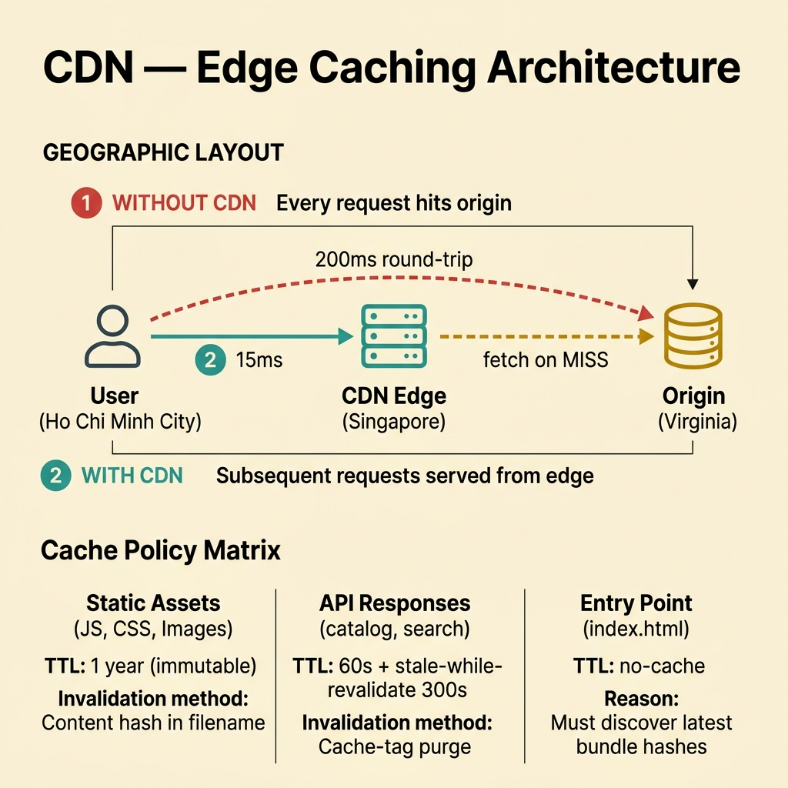
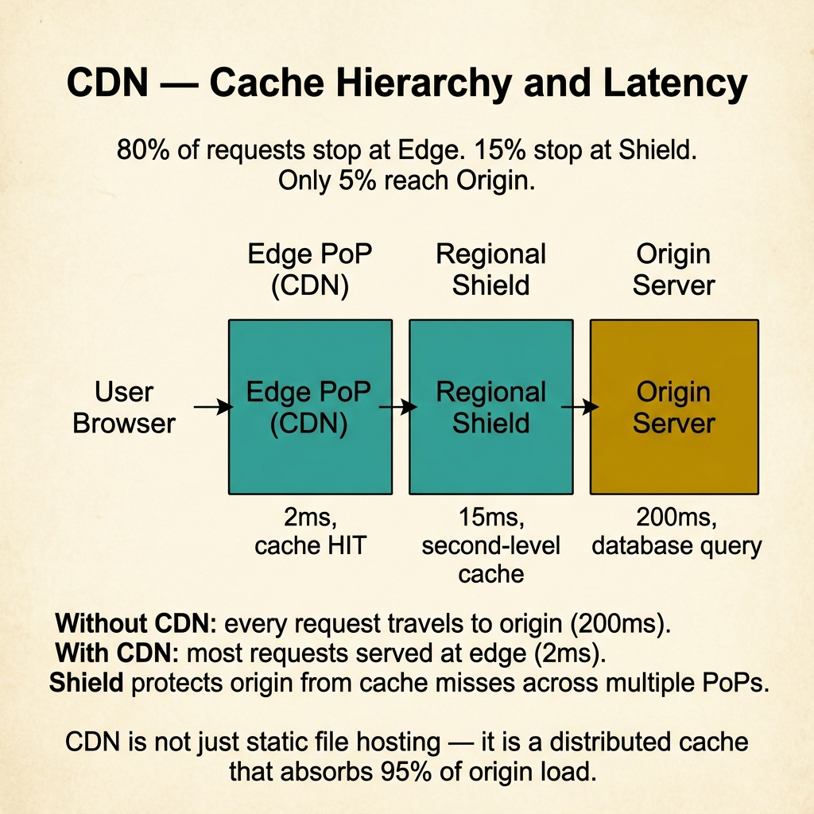

<!-- tags: glossary, reference, performance-caching, cdn -->
# CDN (Content Delivery Network)

> A geographically distributed network of edge servers that caches and serves content close to users, reducing latency, offloading origin traffic, and improving availability.

| Aspect | Detail |
| --- | --- |
| **Concept** | A geographically distributed network of edge servers that caches and serves content close to users, reducing latency, offloading origin traffic, and improving availability. |
| **Audience** | Frontend engineer, backend engineer, SRE, platform architect |
| **Primary style** | Glossary term |
| **Entry point** | Use when static or semi-static content needs to be served with low latency to users across multiple geographic regions |

📅 Created: 2026-03-30 · 🔄 Updated: 2026-04-18 · ⏱️ 8 min read

---

## 1. DEFINE

A user in Ho Chi Minh City loads a product image hosted on a server in Virginia. The round-trip latency is 200ms. With a CDN, the same image is served from a Singapore edge node at 15ms. The image did not move — a copy was placed closer. That placement strategy is the boundary of **CDN**.

**CDN** (Content Delivery Network) is a geographically distributed network of edge servers that caches and serves content close to users. The origin server handles the first request; subsequent requests are served from the nearest edge node until the cache expires.

CDN is not just a cache — it is a cache deployed at the network edge. This distinction matters because CDN adds geographic distribution, anycast routing, and DDoS protection on top of basic caching semantics.

| Variant | Description |
| --- | --- |
| Static CDN | Caches static assets: images, CSS, JS, fonts. Simplest and most common. |
| Dynamic CDN | Caches API responses or HTML pages with short TTL and stale-while-revalidate. |
| Edge compute CDN | Runs application logic at the edge (Cloudflare Workers, Lambda@Edge). |

| Approach | Latency | Freshness | Complexity | When to choose |
| --- | --- | --- | --- | --- |
| Static CDN | Lowest for assets | High (long TTL) | Low | When images, scripts, and stylesheets dominate traffic. |
| Dynamic CDN | Low for cached responses | Configurable (short TTL) | Medium | When API responses vary by route but not per-user. |
| Edge compute | Lowest for personalized | Real-time | High | When personalization must happen close to the user. |

Core insight:

> CDN is the cheapest way to reduce latency for content that does not change per-request. The engineering discipline is setting the right cache policy per content type — aggressive TTL for assets, conservative TTL for API responses, no-cache for personalized content.

### 1.1 Invariants & Failure Modes

- Every CDN-cached resource must have a clear invalidation or versioning strategy.
- Cache-Control headers are the contract between origin and CDN — misconfigurations propagate globally.
- CDN cannot fix slow dynamic content; it only accelerates content that can be cached.

Failure mode: the team deploys a new version but the CDN serves stale JavaScript for hours because cache-busting hashes were not applied. Users see broken UI because old JS references new API endpoints.

---

## 2. CONTEXT

**Who uses it**: Frontend engineer, backend engineer, SRE, platform architect

**When**: When static or semi-static content needs to be served with low latency to users across multiple geographic regions.

**Purpose**: CDN is the cheapest way to reduce latency for content that does not change per-request. It offloads origin traffic and adds geographic resilience.

**In the ecosystem**:
CDN sits at the outermost layer of the caching stack. While Redis caches at the application level and the operating system caches at the kernel level, CDN caches at the network edge — closest to the user and farthest from the origin.

---

Edge caching is clear. But how do you invalidate globally, how do you handle personalized content, and when does a CDN make latency worse?

## 3. EXAMPLES

CDN surfaces most clearly when a product page loads in 200ms from origin but 15ms from edge, when a deploy ships new JavaScript but users see the old version for 24 hours, or when the team puts an API behind a CDN and starts serving stale user-specific data to the wrong users. The examples below place the concept into exactly those situations.

### Example 1: Basic — Configure CDN for static assets with cache-busting

> **Goal**: Serve images, CSS, and JS from the CDN edge with long TTL and reliable invalidation.
> **Approach**: Use content-hash filenames for cache-busting and aggressive TTL.
> **Example**: A React SPA with Webpack-generated bundle hashes.
> **Complexity**: Basic — the foundational CDN configuration.



*Figure: CDN edge caching reduces latency from 200ms (origin in Virginia) to 15ms (edge in Singapore). Cache policy varies by content type: immutable hashes for assets, stale-while-revalidate for APIs, no-cache for entry points.*

```yaml
cdn_static_config:
  assets:
    - type: "JS bundles"
      pattern: "main.[hash].js"
      cache_control: "public, max-age=31536000, immutable"
      invalidation: "hash changes on every build — no explicit purge needed"
    - type: "images"
      pattern: "/images/*"
      cache_control: "public, max-age=86400"
      invalidation: "versioned URLs or Cache-Tag purge"
    - type: "index.html"
      cache_control: "no-cache"
      reason: "entry point must always fetch latest to discover new bundle hashes"
```

**Why?** Static assets with content hashes can be cached indefinitely — the hash is the version. The only risk is `index.html`: if it is cached aggressively, users cannot discover new bundles. Setting `no-cache` on the entry point solves this.

**Takeaway**: CDN for static assets is set-and-forget once hash-based filenames are in place. The discipline is never caching the entry point aggressively.

### Example 2: Intermediate — Cache API responses with stale-while-revalidate

> **Goal**: Reduce API latency by caching responses at the CDN edge without serving stale data for too long.
> **Approach**: Use `stale-while-revalidate` to serve cached responses while fetching fresh data in the background.
> **Example**: A product catalog API where prices change infrequently.
> **Complexity**: Intermediate — balancing freshness and latency.

```yaml
cdn_api_config:
  endpoint: "GET /api/products/{id}"
  cache_control: "public, max-age=60, stale-while-revalidate=300"
  behavior:
    t0_to_60s: "serve cached response directly — fast"
    t60_to_360s: "serve stale response + revalidate in background — still fast"
    after_360s: "cache expired, fetch from origin — slow once"
  vary_header: "Vary: Accept-Language"
  excluded_endpoints:
    - "POST /api/orders — never cache writes"
    - "GET /api/me — user-specific, never cache at CDN"
```

**Why?** `stale-while-revalidate` gives the best of both worlds: users always get a fast response (cached or stale), and the CDN refreshes in the background. The staleness window is bounded and configurable.

**Takeaway**: Intermediate CDN usage means caching API responses selectively — public data with SWR, never user-specific data.

### Example 3: Advanced — Implement edge-side personalization without origin round-trips

> **Goal**: Personalize content at the CDN edge without falling back to the origin.
> **Approach**: Use edge compute (Cloudflare Workers, Lambda@Edge) to customize cached content per user segment.
> **Example**: A homepage banner that varies by country but not by individual user.
> **Complexity**: Advanced — running application logic at the edge.

```yaml
edge_personalization:
  use_case: "homepage banner by country"
  strategy:
    - "CDN caches 5 variants of the banner (US, EU, APAC, LATAM, DEFAULT)"
    - "edge worker reads geo header from CDN"
    - "selects cached variant — no origin round-trip"
  implementation:
    edge_runtime: "Cloudflare Workers"
    cache_key: "banner:{country_group}"
    cache_control: "public, max-age=3600"
  guardrails:
    - "never personalize by individual user at the edge — cache fragmentation"
    - "limit variants to bounded segments (country, language, device)"
    - "monitor cache hit rate per variant — low hit rate means too many variants"
```

**Why?** True per-user personalization at the edge fragments the cache into millions of entries, destroying hit rate. Segment-based personalization keeps variants bounded and hit rate high while still delivering a customized experience.

**Takeaway**: Advanced CDN design personalizes by segment, not by individual. Bounded variants keep edge caching effective.

---

## 4. COMPARE



*Figure: 80% of requests stop at Edge (2ms), 15% at Shield (15ms), only 5% reach Origin (200ms). CDN is not just static hosting — it is a distributed cache absorbing 95% of origin load.*

*Figure: CDN positioned among application cache, origin cache, and edge compute strategies.*

CDN sounds like "just a cache in front of the server." It is, but with geographic distribution, anycast routing, and DDoS protection. A Redis cache is application-level; a CDN is network-level. They solve different latency problems.

### Level 1

```text
User → [Nearest CDN Edge] → HIT: return (15ms)
                           → MISS: fetch from Origin (200ms) → cache at edge → return
```
*Figure: Level 1 — CDN moves the cache closer to the user instead of closer to the database.*

### Level 2

```text
Cache layer        Distance from user    Best for                    Invalidation
──────────────     ──────────────────    ──────────────────          ──────────────────
CDN edge           Closest (ms)          Static assets, public API   TTL, purge API, hash
Application cache  Same datacenter       Per-user data, sessions     TTL, invalidation
Database cache     Same host             Query results               TTL, advisory locks
```
*Figure: Level 2 — each cache layer serves a different distance-from-user and data-type profile.*

### Easily confused or boundary-slipping

| # | Severity | Mistake | Consequence | Fix |
| --- | --- | --- | --- | --- |
| 1 | 🔴 Fatal | Caching user-specific data at CDN without Vary headers | User A sees User B's data | Use Vary headers or exclude personalized endpoints. |
| 2 | 🟡 Common | Aggressive TTL on index.html | Users cannot see new deploys for hours | Set `no-cache` on entry points; hash-based names for assets. |
| 3 | 🟡 Common | No purge strategy for urgent content updates | Outdated content served globally until TTL expires | Implement cache-tag purge or instant purge API integration. |
| 4 | 🔵 Minor | CDN for internal-only APIs | No geographic benefit, adds latency via extra hop | CDN is for user-facing traffic; internal APIs use application cache. |

### Quick scan

| If you face | Action |
| --- | --- |
| High latency for users in remote regions | CDN edge nodes reduce geographic latency |
| Origin overwhelmed by asset requests | CDN offloads static traffic completely |
| Users see old version after deploy | Check cache-busting (content hashes) and index.html cache policy |

---

## 5. REF

| Resource | Type | Link | Note |
| --- | --- | --- | --- |
| Cloudflare Learning Center | Reference | https://www.cloudflare.com/learning/cdn/what-is-a-cdn/ | Clear, practical explanation of CDN mechanics. |
| AWS CloudFront Documentation | Official | https://docs.aws.amazon.com/AmazonCloudFront/latest/DeveloperGuide/ | Full reference for CDN configuration and cache behaviors. |
| web.dev Caching Best Practices | Reference | https://web.dev/http-cache/ | Comprehensive guide to Cache-Control headers and CDN interaction. |

---

## 6. RECOMMEND

CDN answers "how do we serve content close to the user?" The next question: what about connection management between the application and its databases?

| Expand to | When | Reason | File/Link |
| --- | --- | --- | --- |
| Topic hub | When CDN needs broader context | Return to the caching strategy overview | [Performance & Caching](./README.md) |
| Previous concept | When the problem is write consistency, not delivery | Write-through and write-behind handle the write path | [Write-Through / Write-Behind](./05-write-through-write-behind.md) |
| Next concept | When the bottleneck is database connectivity, not content delivery | Connection pooling manages a different kind of resource | [Connection Pooling](./07-connection-pooling.md) |

Back to the user in Ho Chi Minh City — 200ms from Virginia, 15ms from Singapore. Now you know: CDN is caching at the network edge. The discipline is per-content cache policy: immutable hashes for assets, SWR for API responses, no-cache for entry points.

**Links**: [← Previous](./05-write-through-write-behind.md) · [→ Next](./07-connection-pooling.md)
