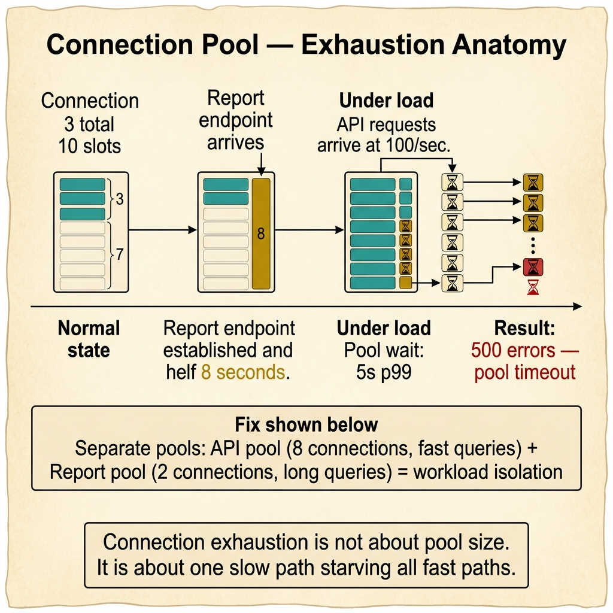
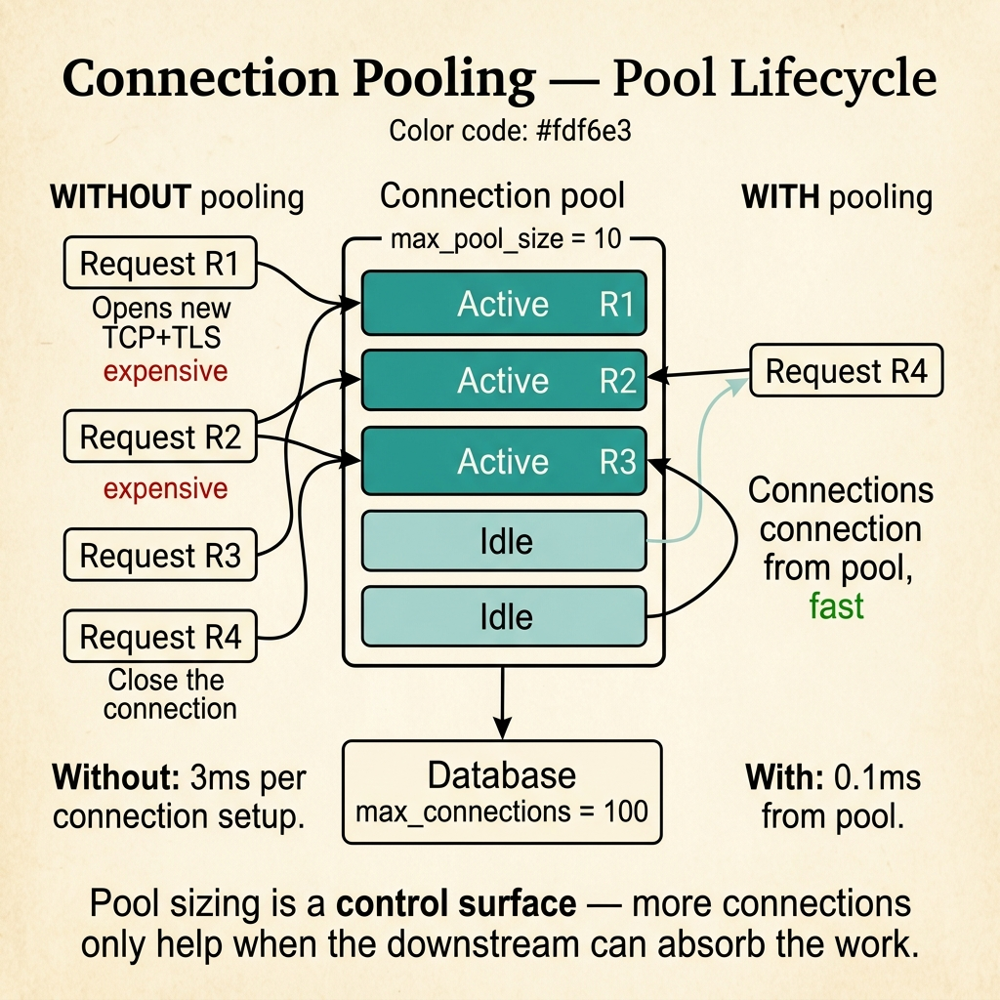

<!-- tags: glossary, reference, performance-caching, connection-pooling -->
# Connection Pooling

> A resource management pattern that maintains a reusable pool of database connections, eliminating the overhead of creating and destroying connections for every request.

| Aspect | Detail |
| --- | --- |
| **Concept** | A resource management pattern that maintains a reusable pool of database connections, eliminating the overhead of creating and destroying connections for every request. |
| **Audience** | Backend engineer, DBA, SRE, Go/Node.js developer |
| **Primary style** | Glossary term |
| **Entry point** | Use when diagnosing connection exhaustion, tuning database performance, or configuring resource limits between application and database |

📅 Created: 2026-03-30 · 🔄 Updated: 2026-04-18 · ⏱️ 7 min read

---

## 1. DEFINE

The service works fine under low load. At 500 concurrent requests, response times spike. The database logs show "too many connections." Each request opens a new connection, runs a query, and closes it — creating 500 TCP handshakes per second plus TLS negotiation. The fix is not more database capacity. The fix is reusing connections. That reuse strategy is the boundary of **Connection Pooling**.

**Connection Pooling** is a resource management pattern that maintains a pool of pre-established database connections. When the application needs a connection, it borrows one from the pool. When done, it returns it instead of closing it. The pool manages creation, reuse, health checking, and limits.

Connection pooling differs from connection multiplexing. Pooling reuses connections sequentially — one request at a time per connection. Multiplexing shares a single connection across concurrent requests (e.g., HTTP/2). Most database protocols require pooling because they do not support multiplexing.

| Variant | Description |
| --- | --- |
| Application-level pool | Pool managed by the ORM or driver (GORM, pgx, Prisma). |
| External pooler | Standalone proxy (PgBouncer, ProxySQL) that pools connections between application and database. |
| Serverless pooler | Pool designed for short-lived functions (Supabase Pooler, RDS Proxy). |

| Approach | Max connections | Overhead per request | When to choose |
| --- | --- | --- | --- |
| No pooling | Unbounded | High (TCP + TLS per request) | Never in production. |
| Application pool | Configurable | Near-zero (borrow from pool) | When a single application connects to the database. |
| External pooler | Configurable | ~1ms proxy hop | When multiple applications or serverless functions share one database. |

Core insight:

> Connection pooling is not optional in production. The question is not "should we pool?" but "what are the right pool size, idle timeout, and health check settings for our workload?"

### 1.1 Invariants & Failure Modes

- Pool size must be smaller than the database's `max_connections`.
- Idle connections must be recycled to prevent resource leaks and stale connections.
- The application must return connections promptly — holding a connection during non-DB work starves the pool.

Failure mode: the pool size is set to 100, but long-running transactions hold connections for 30 seconds. Under load, all 100 connections are checked out and new requests queue indefinitely.

---

## 2. CONTEXT

**Who uses it**: Backend engineer, DBA, SRE, Go/Node.js developer

**When**: When diagnosing connection exhaustion, tuning database performance, or configuring resource limits between application and database.

**Purpose**: Connection pooling eliminates per-request connection overhead and bounds the number of connections to the database. Without it, the database becomes the bottleneck long before compute or memory are saturated.

**In the ecosystem**:
Connection pooling sits between the application and the database. It is invisible to business logic but critical to reliability. Every production application uses pooling — the question is whether it is configured correctly.

---

Pooling is table stakes. But how do you size the pool, what happens when it is exhausted, and when do you need an external pooler?



*Figure: One slow report path holds connections for 8 seconds, starving all fast API paths. Fix: separate pools for different workloads. Connection exhaustion is not about pool size — it is about workload isolation.*

## 3. EXAMPLES

Connection pooling surfaces most clearly when a service under load throws "too many connections," when cold-start latency spikes because the pool is empty, or when a long-running migration holds connections and starves the API. The examples below place the concept into exactly those situations.

### Example 1: Basic — Configure pool size based on workload analysis

> **Goal**: Set a pool size that balances connection reuse with database capacity.
> **Approach**: Use the formula: pool size = (number of cores × 2) + spinning disk count, adjusted for workload.
> **Example**: A Go API with 4 CPU cores connecting to PostgreSQL.
> **Complexity**: Basic — the foundational pool configuration.

```yaml
pool_config:
  driver: "pgx (Go)"
  settings:
    max_open_connections: 10    # 4 cores × 2 + 2 buffer
    max_idle_connections: 5     # half of max to reduce idle resource waste
    connection_max_lifetime: "5m"  # recycle to prevent stale connections
    connection_max_idle_time: "1m" # close idle connections after 1 minute
  database_limit: "max_connections = 100"
  instances: 3
  total_pool: "3 × 10 = 30 connections (well under 100 limit)"
```

**Why?** Over-sizing the pool wastes database memory and file descriptors. Under-sizing creates queuing under load. The formula gives a starting point; monitoring refines it.

**Takeaway**: Pool sizing starts with a formula, adjusts with monitoring, and must account for all application instances sharing the same database.

### Example 2: Intermediate — Diagnose and fix connection exhaustion under load

> **Goal**: Identify why the pool runs out of connections during traffic spikes.
> **Approach**: Monitor pool metrics: active, idle, wait count, and wait duration.
> **Example**: API returns 500 errors with "connection pool exhausted" during peak hours.
> **Complexity**: Intermediate — tracing the exhaustion to a specific code path.

```yaml
pool_exhaustion_diagnosis:
  symptom: "500 errors with pool timeout during 3pm-5pm"
  metrics:
    pool_active: 10   # all connections in use
    pool_idle: 0       # no connections available
    pool_wait_count: "150/sec during peak"
    pool_wait_duration_p99: "5s"
  root_cause:
    - "report endpoint holds connection for 8 seconds (long query)"
    - "during peak, report requests consume all pool connections"
    - "API requests queue and timeout"
  fix:
    immediate: "increase pool size to 20 for headroom"
    structural: "move report queries to read replica with separate pool"
    monitoring: "alert when pool_wait_duration_p99 > 500ms"
```

**Why?** Connection exhaustion is not always about pool size. A single long-running query path can starve the entire pool. The fix is separating workloads, not just increasing the limit.

**Takeaway**: When the pool is exhausted, trace which code path is holding connections longest before increasing the pool size.

### Example 3: Advanced — Deploy PgBouncer for multi-service connection management

> **Goal**: Share a bounded set of database connections across multiple services and serverless functions.
> **Approach**: Use an external pooler (PgBouncer) to multiplex connections.
> **Example**: 5 microservices + Lambda functions connecting to a single PostgreSQL instance with max_connections = 100.
> **Complexity**: Advanced — infrastructure-level connection management.

```yaml
pgbouncer_config:
  mode: "transaction"  # connection returned after each transaction
  max_client_connections: 500  # clients connecting to PgBouncer
  default_pool_size: 20        # actual connections to PostgreSQL
  reserve_pool_size: 5         # overflow for burst
  server_lifetime: "3600"      # recycle backends hourly
  topology:
    services: ["api", "worker", "reports", "auth", "notifications"]
    serverless: ["lambda-webhook", "lambda-scheduler"]
    total_clients: "~200 concurrent at peak"
    actual_db_connections: "20 (PgBouncer → PostgreSQL)"
  benefit: "200 concurrent clients share 20 real connections"
```

**Why?** Without PgBouncer, each service maintains its own pool: 5 services × 20 connections = 100 connections, leaving none for maintenance, monitoring, or serverless. PgBouncer reduces real connections to 20 while supporting 200+ clients.

**Takeaway**: External poolers are essential when multiple services or serverless functions share one database. Transaction-mode pooling gives the best connection reuse.

---

## 4. COMPARE



*Figure: Pool reuses connections (0.1ms) instead of opening new TCP+TLS (3ms). Active slots serve requests; idle slots wait. Pool sizing is a control surface — more connections only help when the downstream can absorb the work.*

*Figure: Connection pooling positioned among no-pooling, application pool, and external pooler strategies.*

Connection pooling sounds like "just reuse connections." It is, but the implementation details — pool size, idle timeout, health checks, transaction vs. session mode — determine whether the pool helps or creates new problems.

### Level 1

```text
Without pool: Request → TCP connect → TLS → Auth → Query → Close (50ms overhead per request)
With pool:    Request → Borrow from pool → Query → Return to pool (0ms overhead)
```
*Figure: Level 1 — pooling eliminates per-request connection overhead.*

### Level 2

```text
Pool type         Connection ownership     Best for
──────────────    ─────────────────────    ─────────────────────────────
Application pool  Per-instance             Single service, direct connection
PgBouncer         Shared across services   Multi-service, serverless
RDS Proxy         Managed by cloud         AWS serverless, managed database
```
*Figure: Level 2 — pool type depends on deployment topology and service count.*

### Easily confused or boundary-slipping

| # | Severity | Mistake | Consequence | Fix |
| --- | --- | --- | --- | --- |
| 1 | 🔴 Fatal | Pool size larger than database max_connections | Database rejects connections; cascading failures | Sum all pools across instances; keep under max_connections - 10. |
| 2 | 🟡 Common | Holding connections during non-DB work | Pool starved; other requests queue | Return connection immediately after query completes. |
| 3 | 🟡 Common | No idle timeout | Stale connections accumulate; database memory wasted | Set max_idle_time to 1-5 minutes. |
| 4 | 🔵 Minor | Using session-mode PgBouncer for short transactions | Poor connection reuse | Use transaction mode for stateless query patterns. |

### Quick scan

| If you face | Action |
| --- | --- |
| "too many connections" errors | Check total pool size across all instances vs. max_connections |
| High latency under load but database CPU is low | Pool exhaustion — check pool_wait_duration metric |
| Serverless functions creating hundreds of connections | Deploy PgBouncer or RDS Proxy as external pooler |

---

## 5. REF

| Resource | Type | Link | Note |
| --- | --- | --- | --- |
| PgBouncer Documentation | Official | https://www.pgbouncer.org/ | Reference for the most widely used PostgreSQL connection pooler. |
| PostgreSQL Connection Management | Official | https://www.postgresql.org/docs/current/runtime-config-connection.html | Database-side configuration for connection limits. |
| pgx Connection Pool Guide | Reference | https://github.com/jackc/pgx | Go's most performant PostgreSQL driver with built-in pooling. |

---

## 6. RECOMMEND

Connection pooling answers "how do we manage database connections efficiently?" The next question: what happens when the query itself is inefficient?

| Expand to | When | Reason | File/Link |
| --- | --- | --- | --- |
| Topic hub | When pooling needs broader context | Return to the performance overview | [Performance & Caching](./README.md) |
| Previous concept | When the issue is content delivery, not database connections | CDN handles geographic latency | [CDN](./06-cdn.md) |
| Next concept | When the database is slow despite pooling | N+1 queries are the most common query-level performance bug | [N+1 Problem](./08-n-plus-one-problem.md) |

Back to the 500 concurrent requests — TCP handshakes, TLS negotiation, connection refused. Now you know: pool 10 connections, reuse them, and return them fast. The database handles 500 requests through 10 connections instead of 500.

**Links**: [← Previous](./06-cdn.md) · [→ Next](./08-n-plus-one-problem.md)
