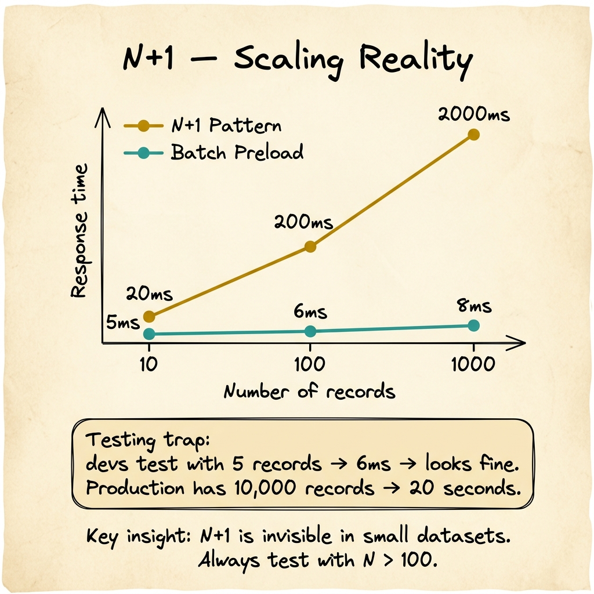
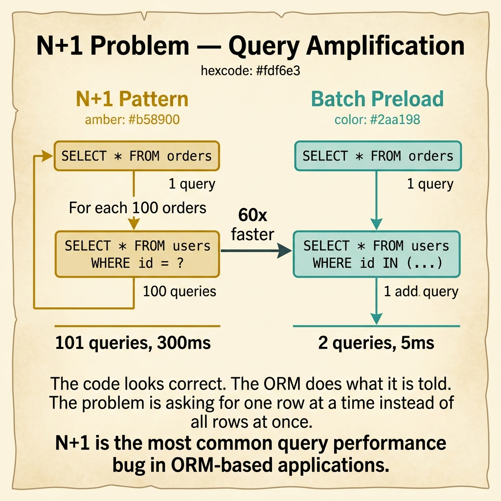

<!-- tags: glossary, reference, performance-caching, n-plus-one-problem -->
# N+1 Problem

> A query performance anti-pattern where fetching a list of N parent entities triggers N additional individual queries to fetch their related children, producing N+1 total queries instead of 1 or 2.

| Aspect | Detail |
| --- | --- |
| **Concept** | A query performance anti-pattern where fetching a list of N parent entities triggers N additional individual queries to fetch their related children, producing N+1 total queries instead of 1 or 2. |
| **Audience** | Backend engineer, DBA, ORM user, performance reviewer |
| **Primary style** | Glossary term |
| **Entry point** | Use when database query count grows linearly with result set size, or when a simple list endpoint is unexpectedly slow |

📅 Created: 2026-03-30 · 🔄 Updated: 2026-04-18 · ⏱️ 7 min read

---

## 1. DEFINE

The orders list endpoint takes 200ms for 10 orders, 2 seconds for 100 orders, and 20 seconds for 1,000 orders. The relationship is linear — every additional order adds one more database round-trip. The code looks clean: `for each order, fetch customer`. But that single loop hides 1,001 queries where 2 would suffice. That hidden multiplier is the boundary of **N+1 Problem**.

**N+1 Problem** is a query performance anti-pattern where fetching a list of N parent entities triggers N additional individual queries to fetch their related children. The "1" is the initial query for the parent list. The "N" is one query per parent to load the related entity.

N+1 is not a database problem — it is an application-level data access problem. The database executes each query correctly and quickly. The cost is in the aggregate: N network round-trips, N query parsings, N result serializations.

| Variant | Description |
| --- | --- |
| ORM lazy-loading N+1 | ORM loads relationships on access; iterating triggers individual queries. |
| GraphQL resolver N+1 | Each field resolver fetches independently, multiplied by parent count. |
| API composition N+1 | Microservice fetches related entities one-by-one from another service. |

| Fix approach | Query count | Implementation | When to choose |
| --- | --- | --- | --- |
| Eager loading (JOIN) | 1 query | SQL JOIN or ORM `Preload` | When related data is always needed. |
| Batch loading | 2 queries | WHERE id IN (...) for children | When JOINs would produce cartesian explosion. |
| DataLoader pattern | 1 batch per type | Coalesce N individual loads into 1 batch | When using GraphQL or resolver-based architectures. |

Core insight:

> N+1 is invisible in code review if reviewers only look at logic correctness. The loop looks fine. The query looks fine. The problem only appears when you measure query count against result set size.

### 1.1 Invariants & Failure Modes

- Query count must remain constant or logarithmic as result set grows, never linear.
- Every `for` loop that accesses a relationship must be audited for N+1.
- ORM lazy-loading is the most common source — it should be explicitly preloaded or batch-loaded.

Failure mode: the team tests with 5 records in staging and sees no problem. Production has 10,000 records and the endpoint takes 30 seconds.

---

## 2. CONTEXT

**Who uses it**: Backend engineer, DBA, ORM user, performance reviewer

**When**: When database query count grows linearly with result set size, or when a simple list endpoint is unexpectedly slow.

**Purpose**: N+1 is invisible in code review if reviewers only look at logic correctness. The fix is measuring query count against result set size — if they grow together, N+1 is present.

**In the ecosystem**:
N+1 is the most common query performance bug in web applications using ORMs. It sits at the intersection of application logic and database interaction. Connection pooling mitigates the overhead per query, but the fix is reducing query count.

---

The anti-pattern is clear. But how do you detect it before production, which fix matches your architecture, and how do you prevent it from recurring?



*Figure: N+1 response time grows linearly — 20ms at 10 records, 2000ms at 1000. Batch preload stays flat at ~5ms regardless of cardinality. The testing trap: devs test with 5 records and see no problem.*

## 3. EXAMPLES

N+1 surfaces most clearly when an endpoint slows down linearly with data volume, when database monitoring shows thousands of identical queries per request, or when switching from lazy to eager loading cuts response time by 10x. The examples below place the anti-pattern into exactly those situations.

### Example 1: Basic — Detect N+1 in an ORM loop

> **Goal**: Identify the N+1 pattern in a standard ORM data access loop.
> **Approach**: Count queries generated by a list endpoint under different cardinalities.
> **Example**: A Go API using GORM to list orders with customer names.
> **Complexity**: Basic — recognizing the pattern before fixing it.

```yaml
n_plus_one_detection:
  code_pattern: |
    orders := db.Find(&orders)           # 1 query: SELECT * FROM orders
    for _, order := range orders {
      db.First(&customer, order.UserID)  # N queries: SELECT * FROM users WHERE id = ?
    }
  query_count:
    n_10: "11 queries"
    n_100: "101 queries"
    n_1000: "1001 queries"
  symptom: "response time grows linearly with order count"
  detection:
    - "enable query logging and count queries per request"
    - "check if query count = result_count + 1"
    - "look for repeated identical query patterns with different parameters"
```

**Why?** The code looks correct and the ORM does what it is told. The problem is that the developer is telling it to do the wrong thing — one query per iteration instead of one batch query for all iterations.

**Takeaway**: Any `for` loop that accesses a database relationship is a candidate for N+1. Count queries, not code lines.

### Example 2: Intermediate — Fix N+1 with eager loading and batch queries

> **Goal**: Reduce N+1 to 1 or 2 queries using ORM preloading.
> **Approach**: Use `Preload` (GORM) or `Include` (Prisma) to load relationships in advance.
> **Example**: Same orders+customers endpoint, fixed with batch loading.
> **Complexity**: Intermediate — choosing between JOIN and batch load.

```yaml
n_plus_one_fix:
  option_a:
    strategy: "eager JOIN"
    code: "db.Joins('User').Find(&orders)"
    queries: 1
    trade_off: "may produce wide result set with many columns"
  option_b:
    strategy: "batch preload"
    code: "db.Preload('User').Find(&orders)"
    queries: 2  # SELECT * FROM orders; SELECT * FROM users WHERE id IN (...)
    trade_off: "two simple queries, no cartesian product"
  recommendation: "batch preload for most cases; JOIN only when filtering on the related table"
  result:
    before: "1001 queries, 8 seconds"
    after: "2 queries, 45ms"
```

**Why?** Batch preload is the safer default because JOINs can produce cartesian explosions when the relationship is one-to-many. Preload keeps queries simple and predictable.

**Takeaway**: Batch preload (WHERE IN) is the most reliable N+1 fix. Use JOINs only when you need to filter or sort by the related entity.

### Example 3: Advanced — Prevent N+1 from recurring with architectural guardrails

> **Goal**: Make N+1 impossible to reintroduce without detection.
> **Approach**: Add query-count assertions to integration tests and CI.
> **Example**: The test suite ensures no endpoint exceeds a query-count threshold.
> **Complexity**: Advanced — from fix to prevention.

```yaml
n_plus_one_prevention:
  test_guardrail:
    strategy: "query count assertion per endpoint"
    implementation:
      - "wrap test DB connection with a counter middleware"
      - "assert: query_count < max_expected_queries"
      - "fail CI if any endpoint exceeds threshold"
    example:
      endpoint: "GET /api/orders"
      max_queries: 5
      actual_queries: 2
      result: "PASS"
  review_checklist:
    - "does any loop access a relationship?"
    - "is Preload/Include used for all relationships in list endpoints?"
    - "has the endpoint been tested with N > 100?"
  monitoring:
    - "query_count_per_request histogram in production"
    - "alert if p95 query count exceeds baseline by 2x"
```

**Why?** N+1 keeps recurring because new developers write the natural loop pattern. A test-level guardrail catches it before merge. Production monitoring catches it after deploy. Both layers are needed.

**Takeaway**: Advanced N+1 prevention means query-count assertions in CI and query-count monitoring in production.

---

## 4. COMPARE



*Figure: N+1 sends 101 queries (300ms). Batch preload sends 2 queries (5ms) — 60x faster. The ORM does what it is told; the problem is asking one row at a time instead of all at once.*

*Figure: N+1 problem positioned among eager loading, batch loading, and DataLoader patterns.*

N+1 sounds like a "slow query" problem. It is not: each query is fast. The problem is doing N queries where 1 or 2 would suffice. The fix is not query optimization — it is query reduction.

### Level 1

```text
N+1:   SELECT * FROM orders;  →  for each: SELECT * FROM users WHERE id = ?  (N+1 queries)
Fixed: SELECT * FROM orders;  →  SELECT * FROM users WHERE id IN (?, ?, ...)  (2 queries)
```
*Figure: Level 1 — the fix replaces N individual queries with 1 batch query.*

### Level 2

```text
Pattern         Queries    When to use                            Risk
──────────────  ─────────  ─────────────────────────              ─────────────────
Lazy loading    N+1        Never for list endpoints               Linear scaling
Eager JOIN      1          When filtering/sorting on relation     Cartesian explosion
Batch preload   2          Most list endpoints                    Memory for large sets
DataLoader      1 batch    GraphQL/resolver architecture          Added complexity
```
*Figure: Level 2 — each fix strategy trades query count against different risks.*

### Easily confused or boundary-slipping

| # | Severity | Mistake | Consequence | Fix |
| --- | --- | --- | --- | --- |
| 1 | 🔴 Fatal | Testing with 5 records, deploying to 10K | N+1 invisible in dev, catastrophic in prod | Test with realistic cardinality (N > 100). |
| 2 | 🟡 Common | Using JOIN for one-to-many relationships | Cartesian explosion — result set multiplied | Use batch preload (WHERE IN) for one-to-many. |
| 3 | 🟡 Common | Fixing one N+1 but not checking related endpoints | Pattern recurs in other endpoints | Add query-count assertions to all list endpoints. |
| 4 | 🔵 Minor | Over-preloading relationships not needed by the response | Wasted database and memory work | Preload only what the API response actually uses. |

### Quick scan

| If you face | Action |
| --- | --- |
| Endpoint slows linearly with result count | Count queries — likely N+1 |
| Database shows thousands of identical queries | Classic N+1 — add Preload/Include |
| GraphQL resolver slow on nested lists | Add DataLoader for batched resolution |

---

## 5. REF

| Resource | Type | Link | Note |
| --- | --- | --- | --- |
| GORM Preloading | Official | https://gorm.io/docs/preload.html | GORM's approach to eager loading relationships. |
| graphql/dataloader | Open Source | https://github.com/graphql/dataloader | Reference implementation for batched data loading. |
| Use The Index, Luke | Reference | https://use-the-index-luke.com/ | Deep guide to SQL performance and query optimization. |

---

## 6. RECOMMEND

N+1 answers "why does my list endpoint slow down as data grows?" The next question: how do you efficiently return large result sets without loading everything into memory?

| Expand to | When | Reason | File/Link |
| --- | --- | --- | --- |
| Topic hub | When N+1 needs broader context | Return to the performance overview | [Performance & Caching](./README.md) |
| Previous concept | When the bottleneck is connection reuse, not query count | Connection pooling manages the connection layer | [Connection Pooling](./07-connection-pooling.md) |
| Next concept | When the result set is too large to return in one response | Pagination divides large results into manageable pages | [Pagination](./09-pagination.md) |

Back to the orders list — 1,001 queries for 1,000 orders. Now you know: add `Preload("User")` and the count drops to 2. Response time drops from 20 seconds to 45ms. Same code, same database, 500x fewer round-trips.

**Links**: [← Previous](./07-connection-pooling.md) · [→ Next](./09-pagination.md)
