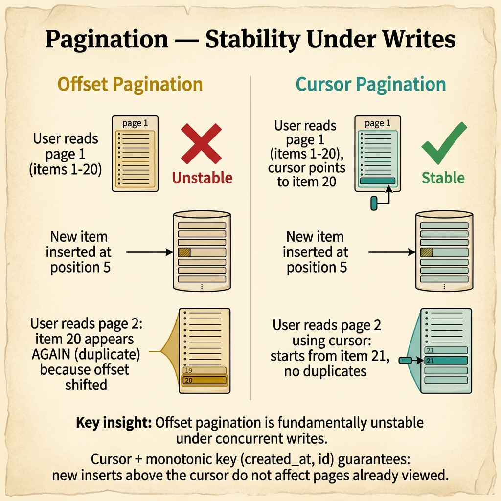
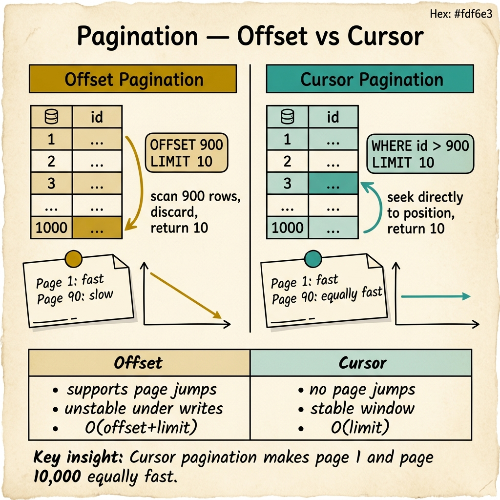

<!-- tags: glossary, reference, performance-caching, pagination -->
# Pagination

> A data retrieval strategy that divides large result sets into discrete pages, controlling memory usage, response size, and user experience by returning a bounded subset per request.

| Aspect | Detail |
| --- | --- |
| **Concept** | A data retrieval strategy that divides large result sets into discrete pages, controlling memory usage, response size, and user experience by returning a bounded subset per request. |
| **Audience** | Backend engineer, frontend engineer, API designer, DBA |
| **Primary style** | Glossary term |
| **Entry point** | Use when an endpoint returns more data than the client needs in a single response, or when fetching the full result set is too expensive |

📅 Created: 2026-03-30 · 🔄 Updated: 2026-04-18 · ⏱️ 7 min read

---

## 1. DEFINE

The products endpoint returns 50,000 rows. The response is 12MB. The database query takes 3 seconds. The frontend renders the first 20 items and ignores the rest. Transferring 49,980 unused products wastes database time, network bandwidth, and client memory. The fix is returning 20 products per request and letting the client ask for more. That bounded retrieval is the boundary of **Pagination**.

**Pagination** is a data retrieval strategy that divides large result sets into discrete pages. Each API call returns a bounded subset (a "page") with metadata indicating how to retrieve the next page. The client navigates pages sequentially or jumps to a specific page.

Pagination is not just a UI concern — it is a database and API performance strategy. Without it, every list endpoint becomes a full table scan that grows more expensive as data accumulates.

| Variant | Description |
| --- | --- |
| Offset-based | Uses `LIMIT` and `OFFSET` to skip rows. Simple but slow for deep pages. |
| Cursor-based (keyset) | Uses the last item's ID or timestamp as a cursor. Consistent performance regardless of page position. |
| Seek-based | Similar to cursor but uses composite keys for precise positioning. |

| Approach | Time complexity | Deep page cost | When to choose |
| --- | --- | --- | --- |
| Offset-based | O(offset + limit) | High — database scans skipped rows | When total count and page jumps are needed (admin UIs). |
| Cursor-based | O(limit) | Constant — index seek from cursor | When performance must be consistent (public APIs, feeds). |
| Seek-based | O(limit) | Constant | When cursor-based with composite ordering is needed. |

Core insight:

> Offset pagination is simple but breaks at scale. Cursor pagination is performant but removes page jumps. The right choice depends on whether the API is for humans (offset) or machines (cursor).

### 1.1 Invariants & Failure Modes

- Every list endpoint must be paginated — unbounded result sets are a performance and security risk.
- Page size must have a maximum enforced server-side, never trust client-provided limits.
- Cursor values must be opaque to the client to prevent injection or manipulation.

Failure mode: the team uses offset pagination for a feed with millions of rows. Page 1 is fast (OFFSET 0). Page 10,000 takes 30 seconds because the database scans and discards 200,000 rows to find the 20 the client wants.

---

## 2. CONTEXT

**Who uses it**: Backend engineer, frontend engineer, API designer, DBA

**When**: When an endpoint returns more data than the client needs in a single response, or when fetching the full result set is too expensive.

**Purpose**: Pagination bounds response size, memory usage, and query cost. Without it, list endpoints degrade as data grows.

**In the ecosystem**:
Pagination works with every other performance optimization in this domain. Cached responses are paginated. Connection pool capacity is preserved because paginated queries return quickly. N+1 is reduced because the batch size is bounded by page size.

---

The concept is simple. But offset or cursor, how do you handle concurrent inserts, and what does the API response look like?



*Figure: Offset pagination duplicates items when new rows are inserted mid-browse. Cursor pagination with monotonic keys provides a stable window — new inserts above the cursor do not affect pages already viewed.*

## 3. EXAMPLES

Pagination surfaces most clearly when the "load more" button takes 10 seconds on page 500, when items appear twice or disappear during browsing because new data shifts offsets, or when the API response is 50MB because there is no default page size. The examples below place the concept into exactly those situations.

### Example 1: Basic — Implement offset pagination for an admin panel

> **Goal**: Show a paginated product list with total count and page navigation.
> **Approach**: Use SQL LIMIT/OFFSET with a total count query.
> **Example**: Admin panel listing all products with 20 per page.
> **Complexity**: Basic — the most common pagination implementation.

```yaml
offset_pagination:
  request: "GET /api/products?page=3&page_size=20"
  sql:
    data: "SELECT * FROM products ORDER BY id LIMIT 20 OFFSET 40"
    count: "SELECT COUNT(*) FROM products"
  response:
    data: "[...20 products...]"
    meta:
      page: 3
      page_size: 20
      total_count: 5000
      total_pages: 250
  server_guardrails:
    max_page_size: 100  # reject page_size > 100
    default_page_size: 20
```

**Why?** Offset pagination is the simplest to implement and supports page jumps (go to page 150). For admin panels with moderate data and low page depth, it works well. It breaks at deep pages or high concurrency.

**Takeaway**: Offset pagination is fine for admin UIs with moderate data. Always enforce a maximum page size server-side.

### Example 2: Intermediate — Implement cursor pagination for a public API

> **Goal**: Provide consistent pagination performance regardless of page depth.
> **Approach**: Use the last item's ID as a cursor for the next page.
> **Example**: Public product feed API consumed by mobile clients.
> **Complexity**: Intermediate — trading page jumps for consistent performance.

```yaml
cursor_pagination:
  request_page_1: "GET /api/feed?limit=20"
  request_page_2: "GET /api/feed?limit=20&after=cursor_abc123"
  sql: "SELECT * FROM feed WHERE id > $cursor ORDER BY id LIMIT 20"
  response:
    data: "[...20 items...]"
    meta:
      has_next: true
      next_cursor: "cursor_xyz789"  # opaque, base64-encoded
  performance:
    page_1: "2ms"
    page_1000: "2ms"  # same — index seek, no scan
  trade_off:
    - "no page jumps — client can only go forward"
    - "no total count (requires separate COUNT query if needed)"
    - "cursor must be opaque — clients cannot construct or guess cursors"
```

**Why?** Cursor pagination always seeks from an indexed position. There is no "scan and discard" like offset. This makes page 1 and page 10,000 equally fast, which is critical for public APIs consumed by mobile clients or third-party integrations.

**Takeaway**: Cursor pagination is the correct choice for public APIs, feeds, and any endpoint where clients paginate deep into the result set.

### Example 3: Advanced — Handle concurrent writes with stable cursor pagination

> **Goal**: Prevent items from appearing twice or disappearing when new data is inserted during pagination.
> **Approach**: Use a monotonically increasing cursor (created_at + id) with consistent ordering.
> **Example**: A notifications feed where new notifications arrive while the user is browsing.
> **Complexity**: Advanced — pagination stability under concurrent writes.

```yaml
stable_cursor:
  problem: "user scrolls page 1 (items 1-20), new item inserted, page 2 shows item 20 again"
  root_cause: "offset shifts when new rows are inserted"
  cursor_fix:
    cursor_field: "(created_at, id)"  # composite, monotonically unique
    sql: "SELECT * FROM notifications WHERE (created_at, id) < ($cursor_ts, $cursor_id) ORDER BY created_at DESC, id DESC LIMIT 20"
    guarantee: "new inserts above the cursor do not affect pages below"
  edge_cases:
    - "deletions: skipped naturally (cursor points to surviving rows)"
    - "same timestamp: id breaks the tie"
    - "clock skew: use database-generated timestamps, not application"
  monitoring:
    - "cursor_hit_rate: percentage of requests using cursor vs. first-page"
    - "deep_pagination_count: requests beyond page 100"
```

**Why?** Offset pagination is fundamentally unstable under concurrent writes. Cursor pagination with a composite key (timestamp + id) provides a stable window: new inserts above the cursor do not affect pages already viewed. This is critical for real-time feeds.

**Takeaway**: Stable pagination under concurrent writes requires cursor-based navigation with a monotonically unique compound key.

---

## 4. COMPARE



*Figure: Offset scans and discards rows — O(offset+limit), slow at depth. Cursor seeks directly — O(limit), equally fast at any page. Cursor also provides a stable window under concurrent writes.*

*Figure: Offset vs. cursor pagination positioned by performance at depth and feature support.*

Pagination sounds like "just add LIMIT." It is more: offset adds LIMIT and OFFSET (scans skipped rows); cursor adds LIMIT and WHERE (seeks from index). The database behavior is fundamentally different.

### Level 1

```text
Offset: SELECT * FROM items LIMIT 20 OFFSET 10000   → scans 10020 rows, returns 20
Cursor: SELECT * FROM items WHERE id > 10000 LIMIT 20 → seeks to id 10001, returns 20
```
*Figure: Level 1 — offset scans; cursor seeks. The cost model diverges at depth.*

### Level 2

```text
Feature              Offset         Cursor
───────────────      ──────────     ──────────
Page jumps           ✅ Yes         ❌ No
Total count          ✅ Yes         ⚠️ Separate query
Deep page perf       ❌ Degrades    ✅ Constant
Concurrent writes    ❌ Unstable    ✅ Stable
Implementation       Simple         Moderate
```
*Figure: Level 2 — offset wins on features; cursor wins on performance and stability.*

### Easily confused or boundary-slipping

| # | Severity | Mistake | Consequence | Fix |
| --- | --- | --- | --- | --- |
| 1 | 🔴 Fatal | No pagination on a list endpoint | Unbounded response; crashes client or server at scale | Every list endpoint must have a default and max page size. |
| 2 | 🟡 Common | Using offset for a public API feed | Deep pages get progressively slower | Switch to cursor for feeds and public APIs. |
| 3 | 🟡 Common | Trusting client-provided page_size without max | Client requests page_size=100000 and crashes the database | Enforce max_page_size server-side. |
| 4 | 🔵 Minor | Using sequential integer cursors | Clients can guess and enumerate all resources | Use opaque cursors (base64-encoded composite keys). |

### Quick scan

| If you face | Action |
| --- | --- |
| "Load more" is slow on deep pages | Switch from offset to cursor pagination |
| Items appear twice during browsing | Offset instability — use cursor with monotonic key |
| API response is huge | Add default pagination; enforce max page size |

---

## 5. REF

| Resource | Type | Link | Note |
| --- | --- | --- | --- |
| Slack Engineering — Paginating Requests | Blog | https://slack.engineering/ | Practical cursor pagination at scale. |
| Use The Index, Luke — Pagination | Reference | https://use-the-index-luke.com/sql/partial-results/fetch-next-page | Deep guide to pagination query performance. |
| GraphQL Connections Spec | Specification | https://relay.dev/graphql/connections.htm | Relay cursor connection specification for GraphQL APIs. |

---

## 6. RECOMMEND

Pagination answers "how do we return large result sets efficiently?" You have now covered the full performance and caching domain.

| Expand to | When | Reason | File/Link |
| --- | --- | --- | --- |
| Topic hub | When pagination needs broader performance context | Return to the overview | [Performance & Caching](./README.md) |
| Previous concept | When the query itself is the bottleneck, not result size | N+1 reduces query count | [N+1 Problem](./08-n-plus-one-problem.md) |
| Cache hit/miss | When paginated results should be cached | Start of the caching branch | [Cache Hit / Miss](./01-cache-hit-miss.md) |

Back to the 50,000-row response — 12MB, 3 seconds, 49,980 unused items. Now you know: add `LIMIT 20`, return a cursor, and let the client navigate. Same data, 99.96% less bandwidth, constant response time.

**Links**: [← Previous](./08-n-plus-one-problem.md) · [→ Next](./README.md)
