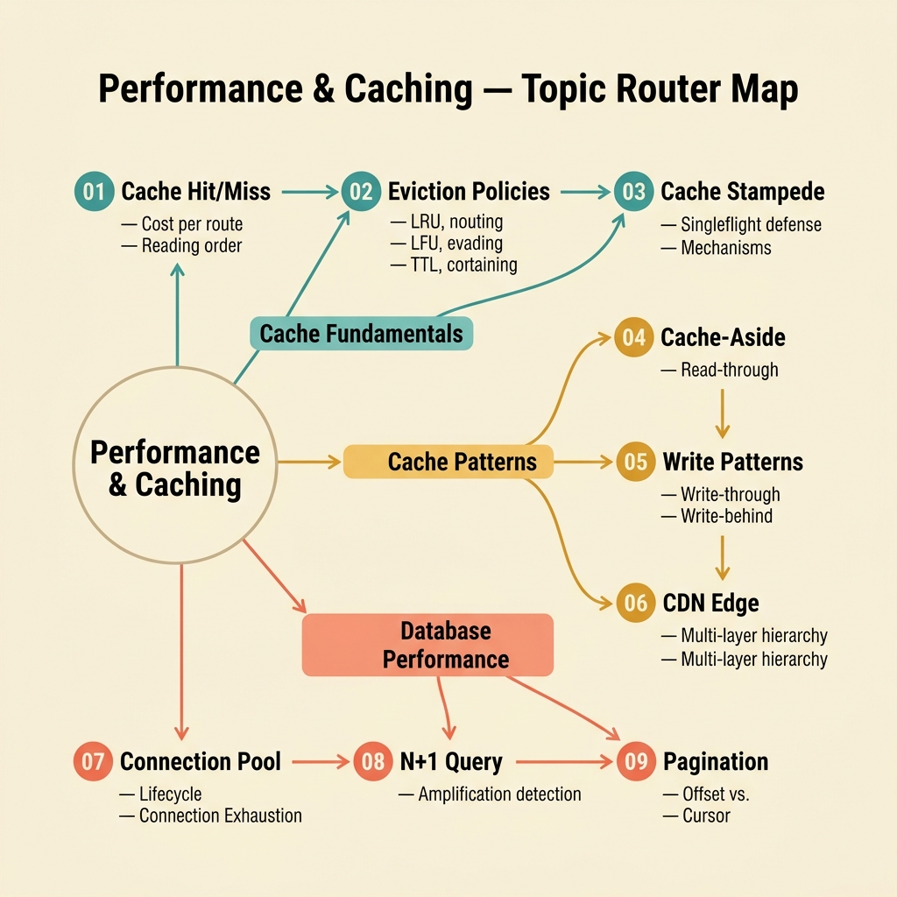

<!-- tags: glossary, hub, performance-caching -->
# Performance & Caching

> A topic hub covering the caching strategies, connection management, query optimization, and data retrieval patterns that keep systems fast under real-world load.

| Aspect | Detail |
| --- | --- |
| **Domain** | Performance & Caching |
| **Audience** | Backend engineer, SRE, DBA, system designer |
| **Primary style** | Topic hub (glossary index) |
| **Purpose** | Route the reader from a performance symptom to the right concept and fix strategy |

📅 Created: 2026-03-30 · 🔄 Updated: 2026-04-18 · ⏱️ 5 min read

---

## Why this topic matters

A system can have perfect business logic and still fail under load. Latency spikes, connection exhaustion, unbounded responses, and cache misses are the failure modes that appear only when real traffic arrives. This domain covers the engineering patterns that prevent those failures — caching, pooling, query optimization, and pagination.

The articles in this hub are ordered as a learning path: start with the fundamentals of caching (hit/miss), progress through caching strategies (eviction, stampede, pattern selection), then move to database connection management, query optimization, and data retrieval.

---

## Symptom Router

Use this table to route a symptom to the right article.

*Figure: Symptom-to-article routing map for the Performance & Caching domain.*

| Symptom | Likely cause | Start here |
| --- | --- | --- |
| Same endpoint sometimes fast, sometimes slow | Cache miss on cold or evicted keys | [Cache Hit / Miss](./01-cache-hit-miss.md) |
| Hit rate fine but cache keeps churning | Wrong eviction policy for the access pattern | [Cache Eviction](./02-cache-eviction.md) |
| Database overwhelmed after popular key expires | Concurrent miss stampede | [Cache Stampede](./03-cache-stampede.md) |
| Updates not visible after save | Missing cache invalidation on write path | [Cache-Aside](./04-cache-aside.md) |
| Write latency too high for throughput needs | Write-through overhead too expensive | [Write-Through / Write-Behind](./05-write-through-write-behind.md) |
| Users in remote regions experience high latency | No edge caching for geographic distribution | [CDN](./06-cdn.md) |
| "Too many connections" under load | Pool exhaustion or missing pooler | [Connection Pooling](./07-connection-pooling.md) |
| Endpoint slows linearly with data growth | N+1 query pattern in ORM loop | [N+1 Problem](./08-n-plus-one-problem.md) |
| Response too large, client overwhelmed | Missing pagination or unbounded query | [Pagination](./09-pagination.md) |

---

## Learning path

### Layer 1: Caching Fundamentals

| # | Article | One-liner | Prerequisite |
| --- | --- | --- | --- |
| 01 | [Cache Hit / Miss](./01-cache-hit-miss.md) | The binary outcome of every cache lookup | — |
| 02 | [Cache Eviction](./02-cache-eviction.md) | What gets dropped when the cache is full | 01 |
| 03 | [Cache Stampede](./03-cache-stampede.md) | When concurrent misses overwhelm the origin | 01, 02 |

### Layer 2: Caching Strategies

| # | Article | One-liner | Prerequisite |
| --- | --- | --- | --- |
| 04 | [Cache-Aside](./04-cache-aside.md) | Application-managed cache reads | 01 |
| 05 | [Write-Through / Write-Behind](./05-write-through-write-behind.md) | Cache consistency on the write path | 04 |
| 06 | [CDN](./06-cdn.md) | Caching at the geographic edge | 01 |

### Layer 3: Database & Query Performance

| # | Article | One-liner | Prerequisite |
| --- | --- | --- | --- |
| 07 | [Connection Pooling](./07-connection-pooling.md) | Reusing database connections efficiently | — |
| 08 | [N+1 Problem](./08-n-plus-one-problem.md) | Query count growing linearly with result size | 07 |
| 09 | [Pagination](./09-pagination.md) | Bounded data retrieval for large result sets | 08 |

---

## How to read this hub

1. **I have a symptom** → use the Symptom Router table above.
2. **I want to learn in order** → follow the Learning Path from 01 to 09.
3. **I need a specific concept** → jump directly to the article.

Each article follows the Glossary profile: `DEFINE → CONTEXT → EXAMPLES → COMPARE → REF → RECOMMEND`.

---

## Cross-domain connections

| Related domain | When to visit | Link |
| --- | --- | --- |
| Concurrency & Async | When the performance problem is about goroutine coordination, not caching | [Concurrency & Async](../concurrency-async/README.md) |
| Data & Database | When the problem is schema, indexing, or transaction design | [Data & Database](../data-database/README.md) |
| Observability & Operations | When you need SLOs, monitoring, or alerting for performance metrics | [Observability & Operations](../observability-operations/README.md) |
