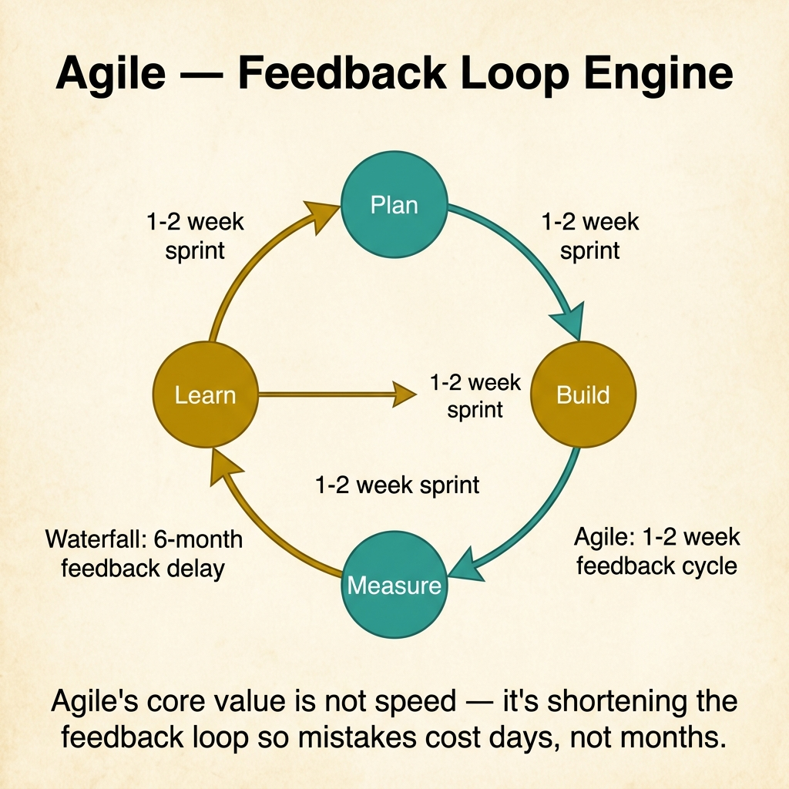
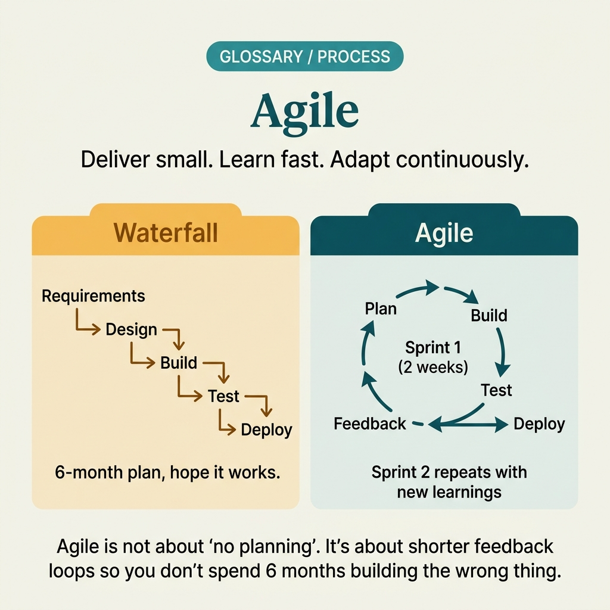

<!-- tags: glossary, reference, process-delivery, agile -->
# Agile

> A set of values and principles for software development that emphasizes iterative delivery, continuous feedback, and adaptive planning over rigid process and exhaustive documentation.

| Aspect | Detail |
| --- | --- |
| **Concept** | A set of values and principles for software development that emphasizes iterative delivery, continuous feedback, and adaptive planning over rigid process and exhaustive documentation. |
| **Audience** | Developer, tech lead, product manager, engineering manager |
| **Primary style** | Glossary term |
| **Entry point** | Use when the question is "how should our team organize work to deliver value iteratively instead of in big-bang releases?" |

📅 Created: 2026-03-23 · 🔄 Updated: 2026-04-18 · ⏱️ 8 min read

---

## 1. DEFINE

The team spent 6 months writing a specification, 4 months building, and then discovered at demo day that the product no longer matched what the customer needed. The requirements drifted, the market shifted, and the plan was obsolete before the first line shipped. The proposal to fix this — shorter cycles, continuous feedback, adapt as you learn — is the boundary of **Agile**.

**Agile** is a set of values and principles (formalized in the Agile Manifesto, 2001) that prioritizes: individuals and interactions over processes and tools, working software over comprehensive documentation, customer collaboration over contract negotiation, and responding to change over following a plan.

Agile is not a methodology — it is a philosophy. Scrum, Kanban, XP, and SAFe are methodologies that implement Agile principles. Calling a team "Agile" because they use Jira is like calling a team "healthy" because they have a gym membership.

| Variant | Description |
| --- | --- |
| Scrum | Time-boxed sprints with defined roles (Product Owner, Scrum Master, Dev Team). |
| Kanban | Flow-based, no sprints, WIP limits, continuous delivery. |
| XP (Extreme Programming) | Technical practices: TDD, pair programming, continuous integration. |
| SAFe (Scaled Agile) | Enterprise framework for scaling Agile across teams. |

| Approach | Cycle length | Best for | Risk |
| --- | --- | --- | --- |
| Scrum | 1-4 week sprints | Teams needing structure and regular cadence | Ceremony overhead if sprints are too short. |
| Kanban | Continuous | Teams with variable demand and flow-based work | Lack of deadlines if WIP limits are not enforced. |
| XP | 1-2 week iterations | Teams prioritizing code quality and engineering practices | High discipline required for TDD and pairing. |

Core insight:

> Agile is about shortening the feedback loop between building something and learning whether it was the right thing to build. Everything else — sprints, standups, retrospectives — is mechanism, not goal.

### 1.1 Invariants & Failure Modes

- Agile requires working software delivered frequently, not just shorter planning documents.
- Every iteration must include real feedback from real users, not just internal review.
- Agile does not mean no planning — it means planning at the right granularity and replanning as you learn.

Failure mode: the team does 2-week sprints but does not demo to users, does not incorporate feedback, and does not change scope. This is mini-waterfall with Agile terminology.

---

## 2. CONTEXT

**Who uses it**: Developer, tech lead, product manager, engineering manager

**When**: When the question is "how should our team organize work to deliver value iteratively instead of in big-bang releases?"

**Purpose**: Agile is about shortening the feedback loop between building something and learning whether it was the right thing to build. It replaces big-plan-then-execute with build-learn-adapt.

**In the ecosystem**:
Agile is the umbrella. Scrum, Kanban, and XP are methodologies under it. CI/CD is the engineering practice that enables Agile delivery. DevOps is the operational philosophy that extends Agile feedback loops into deployment and monitoring.

---

The philosophy is clear. But how do you tell if your team is actually Agile, what goes wrong when Agile is done badly, and when is Agile the wrong fit?

## 3. EXAMPLES

Agile surfaces most clearly when the team ships every 2 weeks and incorporates user feedback between sprints, when a team calls itself Agile but still plans 6 months ahead without revision, or when leadership demands "be Agile" without changing how success is measured. The examples below place the philosophy into exactly those situations.

### Example 1: Basic — Distinguish real Agile from Agile-in-name-only

> **Goal**: Help the team self-assess whether they are practicing Agile or performing Agile rituals.
> **Approach**: Score against the four Agile values using observable signals.
> **Example**: A team that does standups and sprints but ships quarterly.
> **Complexity**: Basic — routing the symptom to the right gap.

```yaml
agile_health_check:
  signals:
    working_software:
      question: "do we ship working features to users every sprint?"
      team_answer: "no — we demo internally but deploy quarterly"
      score: "❌ not Agile on this axis"
    customer_collaboration:
      question: "do real users see our work before the next sprint starts?"
      team_answer: "no — PM translates feedback; devs never see users"
      score: "❌ not Agile on this axis"
    responding_to_change:
      question: "do we change scope mid-sprint based on new learning?"
      team_answer: "scope is locked 2 sprints ahead"
      score: "⚠️ partially Agile — scope lock is fine per sprint, but 2-sprint lock is rigid"
    individuals_and_interactions:
      question: "do we solve problems in conversation or in tickets?"
      team_answer: "mostly tickets and async"
      score: "⚠️ partially Agile"
  diagnosis: "team performs Agile rituals but delivers on a waterfall cadence"
```



*Figure: Agile's core value is not speed — it's shortening the feedback loop. Plan → Build → Measure → Learn in 1-2 week sprints means mistakes cost days, not the 6 months a waterfall cycle would take.*

**Why?** The rituals (standups, sprints, retros) are visible. The values (feedback, adaptation, working software) are invisible unless measured. Teams can do all the rituals and still be waterfall.

**Takeaway**: Agile health is measured by feedback frequency and scope adaptation, not by the number of ceremonies on the calendar.

### Example 2: Intermediate — Design the feedback loop that makes Agile work

> **Goal**: Build the mechanism that turns each sprint into a learning cycle.
> **Approach**: Map the feedback loop from deploy → measure → learn → plan.
> **Example**: A product team building a lending feature who needs to know if borrowers actually complete the flow.
> **Complexity**: Intermediate — from ceremony to mechanism.

```yaml
agile_feedback_loop:
  sprint_end:
    deploy: "feature shipped to 10% of users (canary)"
    measure:
      - "completion rate of lending application flow"
      - "drop-off point in the funnel"
      - "support tickets related to the new flow"
    learn:
      - "60% drop off at income verification step"
      - "users confused by document upload UX"
    plan_next_sprint:
      - "simplify document upload (priority 1)"
      - "add progress indicator (priority 2)"
      - "deprioritize: admin dashboard polish (moved to backlog)"
  cycle_time: "2 weeks from insight to fix deployed"
```

**Why?** Without the feedback loop, Agile is just faster waterfall. The loop — deploy → measure → learn → replan — is what makes iteration meaningful instead of merely frequent.

**Takeaway**: Intermediate Agile means the sprint backlog is shaped by the previous sprint's data, not by a 6-month roadmap.

### Example 3: Advanced — Know when Agile is the wrong fit and what to use instead

> **Goal**: Recognize contexts where Agile principles create more overhead than value.
> **Approach**: Evaluate the project against the Cynefin framework: simple, complicated, complex, chaotic.
> **Example**: A compliance migration with fixed regulatory deadlines and no user feedback.
> **Complexity**: Advanced — from Agile advocacy to fit analysis.

```yaml
agile_fit_analysis:
  project: "migrate payment system to new regulatory standard"
  characteristics:
    requirements: "fixed by regulation — no scope change"
    deadline: "hard deadline — regulatory cutoff"
    feedback: "no user feedback cycle — compliance is binary"
    uncertainty: "low — requirements are exhaustive"
  agile_fit: "low — iterative discovery adds no value when requirements are fixed"
  better_approach: "plan-driven with milestones (waterfall-ish) for the migration, Agile for the surrounding product work"
  nuance: "even in plan-driven work, CI/CD and automated testing are still valuable — Agile engineering practices decoupled from Agile planning"
```

**Why?** Agile is not universally superior. When requirements are fixed, deadlines are immovable, and feedback is irrelevant, plan-driven approaches are more efficient. The advanced insight is knowing when to use Agile planning vs. Agile engineering practices.

**Takeaway**: Advanced Agile thinking means applying the philosophy where it adds value and plan-driven methods where uncertainty is low.

---

## 4. COMPARE



*Figure: Agile positioned among Waterfall, Scrum, Kanban, and hybrid approaches.*

Agile sounds like "just iterate." But iteration without feedback is just faster waterfall. Agile sounds like "no planning." But Agile planning happens at the right granularity — just-in-time, not just-in-case.

### Level 1

```text
Waterfall: Plan all → Build all → Test all → Ship once
Agile:     Plan some → Build some → Ship → Learn → Repeat
```
*Figure: Level 1 — Agile compresses the build-learn cycle from months to weeks.*

### Level 2

```text
Dimension          Waterfall        Agile (Scrum)    Agile (Kanban)
──────────────     ──────────────   ──────────────   ──────────────
Feedback cycle     Months           2 weeks          Continuous
Scope change       Expensive        Sprint boundary  Any time
Planning horizon   Full project     Sprint + backlog Continuous
Best for           Fixed scope      Regular cadence  Variable flow
```
*Figure: Level 2 — Agile's variants differ in cadence and scope flexibility.*

### Easily confused or boundary-slipping

| # | Severity | Mistake | Consequence | Fix |
| --- | --- | --- | --- | --- |
| 1 | 🔴 Fatal | Labeling mini-waterfall as Agile | Team has overhead of both approaches with benefits of neither | Measure feedback frequency and scope adaptation. |
| 2 | 🟡 Common | Equating Agile with no documentation | Critical decisions are undocumented | Agile values working software over docs, not zero docs. |
| 3 | 🟡 Common | Using Agile for a fixed-requirement project | Iteration overhead without discovery benefit | Use plan-driven for fixed scope; Agile engineering for quality. |
| 4 | 🔵 Minor | Skipping retrospectives | Team never improves the process itself | Retros are the Agile mechanism for process adaptation. |

### Quick scan

| If you face | Action |
| --- | --- |
| Team does sprints but ships quarterly | Feedback loop is broken — measure and fix the deploy cadence |
| Requirements change every week | Agile is the right fit — use shorter sprints or Kanban |
| Fixed scope, fixed deadline, no user feedback | Use plan-driven; keep CI/CD from Agile engineering |

---

## 5. REF

| Resource | Type | Link | Note |
| --- | --- | --- | --- |
| Agile Manifesto | Official | https://agilemanifesto.org/ | The original 4 values and 12 principles. |
| Scrum Guide | Official | https://scrumguides.org/ | Canonical reference for the most popular Agile framework. |
| Shape Up (Basecamp) | Reference | https://basecamp.com/shapeup | An alternative Agile approach focused on appetite and betting. |

---

## 6. RECOMMEND

Agile answers "how should we organize work for iterative delivery?" The next question: what is the specific framework that implements Agile with sprints and roles?

| Expand to | When | Reason | File/Link |
| --- | --- | --- | --- |
| Topic hub | When Agile needs broader context | Return to the process overview | [Process & Delivery](./README.md) |
| Scrum | When you need the specific framework with sprints and roles | Scrum is the most common Agile methodology | [Scrum](./Scrum.md) |
| CI/CD | When the engineering pipeline needs to support Agile delivery | CI/CD enables frequent, reliable shipping | [CI/CD](./CICD.md) |

Back to the 6-month plan that was obsolete at demo day — the market shifted, the requirements drifted, and the spec was dead on arrival. Now you know: shorten the cycle, ship frequently, measure what users actually do, and replan based on evidence.

**Links**: [← Previous](./README.md) · [→ Next](./Scrum.md)
