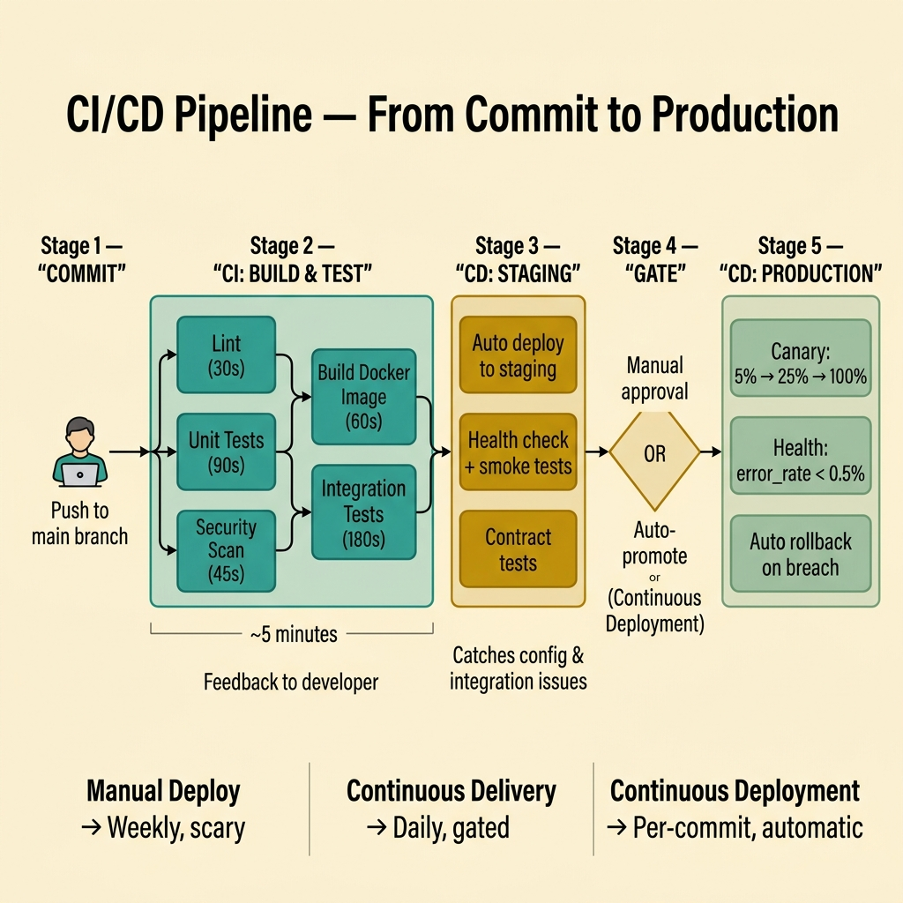

<!-- tags: glossary, reference, process-delivery, ci-cd -->
# CI/CD (Continuous Integration / Continuous Delivery)

> An engineering practice that automates the build, test, and deployment pipeline so that every code change is validated continuously and can be delivered to production at any time.

| Aspect | Detail |
| --- | --- |
| **Concept** | An engineering practice that automates the build, test, and deployment pipeline so that every code change is validated continuously and can be delivered to production at any time. |
| **Audience** | Developer, DevOps engineer, SRE, tech lead |
| **Primary style** | Glossary term |
| **Entry point** | Use when the question is "how do we ship code safely and frequently without manual gates that slow delivery?" |

📅 Created: 2026-03-23 · 🔄 Updated: 2026-04-18 · ⏱️ 8 min read

---

## 1. DEFINE

The developer merges a feature at 2 PM. QA receives it next Tuesday. Staging is updated Thursday. Production ships the following Monday — 9 days after the code was ready. The fix is not "hire more QA" or "deploy faster." The fix is removing the human gates between merge and production. That automation pipeline is the boundary of **CI/CD**.

**Continuous Integration (CI)** is the practice of merging code into the main branch frequently (multiple times a day), with each merge triggering an automated build and test suite that gives immediate feedback on whether the change is safe.

**Continuous Delivery (CD)** is the practice of keeping the main branch in a deployable state at all times, so that any commit can be released to production through an automated pipeline with a manual approval step.

**Continuous Deployment** extends CD by removing the manual approval — every passing commit is automatically deployed to production.

| Variant | Description |
| --- | --- |
| CI only | Automated build and test on every merge. Deployment is manual. |
| CI + Continuous Delivery | Automated pipeline to staging. Production deploy requires manual approval. |
| CI + Continuous Deployment | Automated pipeline end-to-end. Production deploy is automatic on green pipeline. |

| Approach | Deploy frequency | Safety mechanism | When to choose |
| --- | --- | --- | --- |
| Manual deployment | Weekly/monthly | Manual testing, change boards | Regulated environments with audit requirements. |
| Continuous Delivery | Daily/on-demand | Automated tests + manual approval | When confidence is high but regulatory/business gates exist. |
| Continuous Deployment | Per-commit | Automated tests + canary + rollback | When the test suite is comprehensive and rollback is instant. |

Core insight:

> CI/CD is not about tools — it is about feedback speed. The pipeline's purpose is to tell the developer within minutes whether their change is safe to ship. Every manual step that slows this feedback is a candidate for automation.

### 1.1 Invariants & Failure Modes

- Every merge must trigger the pipeline — no exceptions, no "quick fixes" that bypass tests.
- The pipeline must be fast enough (<15 min) that developers wait for results instead of moving on.
- Flaky tests must be quarantined immediately — a pipeline that cries wolf is ignored.

Failure mode: the team has CI but the suite takes 45 minutes and flakes 20% of the time. Developers merge without waiting, and broken code reaches production because the pipeline is treated as noise.

---

## 2. CONTEXT

**Who uses it**: Developer, DevOps engineer, SRE, tech lead

**When**: When the question is "how do we ship code safely and frequently without manual gates that slow delivery?"

**Purpose**: CI/CD is about feedback speed. The pipeline tells the developer within minutes whether their change is safe. Every minute of pipeline latency is a minute of context-switching cost.

**In the ecosystem**:
CI/CD is the engineering pipeline that makes Agile and Scrum delivery cadences possible. Without CI/CD, "ship every sprint" means a manual deploy day. With CI/CD, shipping is a non-event. DevOps extends CI/CD into infrastructure-as-code, monitoring, and operational feedback loops.

---

The pipeline is automated. But what stages does it need, how do you keep it fast, and when do flaky tests undermine the whole system?

## 3. EXAMPLES

CI/CD surfaces most clearly when a bug is caught in staging instead of production, when a deploy takes 5 minutes instead of 5 hours, or when a flaky test suite causes the team to ignore pipeline failures entirely. The examples below place the practice into exactly those situations.

### Example 1: Basic — Design a CI pipeline that gives feedback in under 10 minutes

> **Goal**: Build a pipeline that validates every PR before merge with fast feedback.
> **Approach**: Parallelize stages and fail fast on critical checks.
> **Example**: A Go microservice with unit tests, linting, and security scanning.
> **Complexity**: Basic — the foundational CI pipeline.



*Figure: The full CI/CD pipeline from commit through parallel CI stages (~5 min), staging validation, approval gate, and canary production deploy with auto-rollback. Manual deploys are weekly and scary; Continuous Deployment is per-commit and automatic.*

```yaml
ci_pipeline:
  trigger: "on pull_request to main"
  stages:
    lint:
      parallel: true
      tools: ["golangci-lint", "staticcheck"]
      time: "30s"
    unit_tests:
      parallel: true
      command: "go test ./... -race -count=1"
      time: "90s"
    security_scan:
      parallel: true
      tools: ["gosec", "trivy"]
      time: "45s"
    build:
      sequential: true  # after lint + test + scan pass
      command: "docker build -t app:$SHA ."
      time: "60s"
    integration_tests:
      sequential: true  # after build
      command: "docker-compose up -d && go test ./e2e/..."
      time: "180s"
  total_time: "~5 minutes (parallel first stage + sequential build + integration)"
  fail_fast: true  # cancel all stages if any fails
```

**Why?** A 5-minute pipeline is fast enough that developers wait for the result. Parallelizing independent stages (lint, test, scan) cuts wall-clock time in half. Fail-fast prevents wasting resources after a known failure.

**Takeaway**: CI pipeline speed is a product feature. If the pipeline is slower than the developer's attention span (~10 min), it is too slow.

### Example 2: Intermediate — Build a CD pipeline with staging validation and rollback

> **Goal**: Automate deployment to staging with health checks, then gate production with manual approval.
> **Approach**: Deploy to staging automatically, run smoke tests, wait for approval, deploy to production.
> **Example**: A lending service deployed via ArgoCD with health probes.
> **Complexity**: Intermediate — from CI to delivery pipeline.

```yaml
cd_pipeline:
  trigger: "on merge to main (CI passed)"
  stages:
    deploy_staging:
      tool: "ArgoCD sync"
      target: "staging cluster"
      health_check: "HTTP 200 on /health within 60s"
      smoke_tests: "API contract tests against staging"
      time: "3 minutes"
    approval_gate:
      type: "manual"
      approvers: ["tech-lead", "product-owner"]
      auto_expire: "24 hours"
    deploy_production:
      tool: "ArgoCD sync with canary"
      strategy: "5% → 25% → 100% over 15 minutes"
      health_check: "error_rate < 0.5%, latency_p99 < 200ms"
      rollback:
        trigger: "error_rate > 1% OR health_check fail"
        action: "automatic rollback to previous revision"
        time: "< 30s"
```

**Why?** Staging catches configuration errors and integration issues that CI cannot detect. The canary in production catches load-dependent failures. Automatic rollback contains blast radius.

**Takeaway**: Intermediate CD means automated staging deploy + health validation + manual production gate + automatic rollback.

### Example 3: Advanced — Tame flaky tests to preserve pipeline trust

> **Goal**: Prevent flaky tests from eroding team trust in the CI pipeline.
> **Approach**: Quarantine, track, and fix flaky tests with SLO-like governance.
> **Example**: A team whose CI passes 80% of the time due to flakes, causing developers to merge without waiting.
> **Complexity**: Advanced — from pipeline mechanics to pipeline reliability.

```yaml
flaky_test_governance:
  detection:
    strategy: "re-run failed tests 2x before marking as flaky"
    tracking: "label flaky tests in CI dashboard with first-flake date"
  quarantine:
    action: "move flaky test to quarantine suite (runs nightly, not on PR)"
    rule: "flaky test has 7 days to be fixed before permanent removal"
  SLO:
    pipeline_pass_rate: "target 98% — measured weekly"
    current: "80%"
    gap: "18% — primarily from 12 flaky integration tests"
  fix_priority:
    - "flaky test blocking most PRs gets fixed first"
    - "each sprint reserves 10% capacity for flaky test cleanup"
  monitoring:
    - "flaky_test_count — trend over time"
    - "pipeline_pass_rate — weekly SLO check"
    - "developer_wait_time — time from PR to pipeline result"
```

**Why?** A pipeline that flakes 20% of the time is a pipeline that developers ignore. Flaky tests are not "just annoying" — they destroy the entire CI/CD value proposition. Governance treats pipeline reliability as seriously as production reliability.

**Takeaway**: Advanced CI/CD treats pipeline reliability as an SLO. A flaky pipeline is a broken pipeline.

---

## 4. COMPARE


*Figure: CI/CD pipeline stages from commit to production, positioned among manual, delivery, and deployment approaches.*

CI/CD sounds like "just automate the deploy." It is, but the value is in what happens before the deploy — automated build, test, scan, and validation. The deploy is the last 5% of the pipeline.

### Level 1

```text
Manual:    Code → [days] → Manual test → [days] → Manual deploy
CI/CD:     Code → [minutes] → Auto test → [minutes] → Auto deploy
```
*Figure: Level 1 — CI/CD compresses the feedback loop from days to minutes.*

### Level 2

```text
Stage              CI          CD (Delivery)     CD (Deployment)
──────────────     ──────      ──────────────    ────────────────
Build              Auto        Auto              Auto
Unit tests         Auto        Auto              Auto
Integration tests  Auto        Auto              Auto
Deploy staging     Manual      Auto              Auto
Deploy production  Manual      Manual approval   Auto
Rollback           Manual      Auto              Auto
```
*Figure: Level 2 — each level of CI/CD automation removes one manual gate.*

### Easily confused or boundary-slipping

| # | Severity | Mistake | Consequence | Fix |
| --- | --- | --- | --- | --- |
| 1 | 🔴 Fatal | CI pipeline takes >30 minutes | Developers merge without waiting; broken code ships | Parallelize stages, fail fast, cache dependencies. |
| 2 | 🟡 Common | CD without rollback strategy | Failed deploy requires manual recovery at 3 AM | Automate rollback triggered by health check failure. |
| 3 | 🟡 Common | Flaky tests tolerated for months | Pipeline trust eroded; CI becomes noise | Quarantine flakes, track SLO, fix within 7 days. |
| 4 | 🔵 Minor | Confusing Continuous Delivery with Continuous Deployment | Team expects auto-deploy but has manual approval | Clarify terminology — Delivery has a gate, Deployment does not. |

### Quick scan

| If you face | Action |
| --- | --- |
| Deploys are scary and infrequent | Start with CI; add CD with staging + approval gate |
| Pipeline too slow | Parallelize, cache, fail fast, consider splitting suites |
| Developers ignore CI results | Fix flaky tests and pipeline speed first |

---

## 5. REF

| Resource | Type | Link | Note |
| --- | --- | --- | --- |
| Martin Fowler — CI | Reference | https://martinfowler.com/articles/continuousIntegration.html | Foundational article on Continuous Integration. |
| DORA Metrics | Research | https://dora.dev/ | Research on CI/CD impact: deploy frequency, lead time, MTTR, change failure rate. |
| GitHub Actions Documentation | Official | https://docs.github.com/en/actions | Practical CI/CD pipeline implementation. |

---

## 6. RECOMMEND

CI/CD answers "how do we automate the path from code to production?" The next question: what is the operational philosophy that extends automation beyond deployment into infrastructure and monitoring?

| Expand to | When | Reason | File/Link |
| --- | --- | --- | --- |
| Topic hub | When CI/CD needs broader context | Return to the process overview | [Process & Delivery](./README.md) |
| Previous concept | When the question is team cadence, not pipeline automation | Scrum structures the delivery cadence | [Scrum](./Scrum.md) |
| Next concept | When automation must extend into infrastructure and operations | DevOps extends CI/CD into the operational domain | [DevOps](./DevOps.md) |

Back to the 9-day path from merge to production — manual QA, manual staging, manual deploy. Now you know: automate the build (CI), automate the validation (CD), and the deploy becomes a non-event. The pipeline is not a tool — it is the team's safety net.

**Links**: [← Previous](./Scrum.md) · [→ Next](./DevOps.md)
