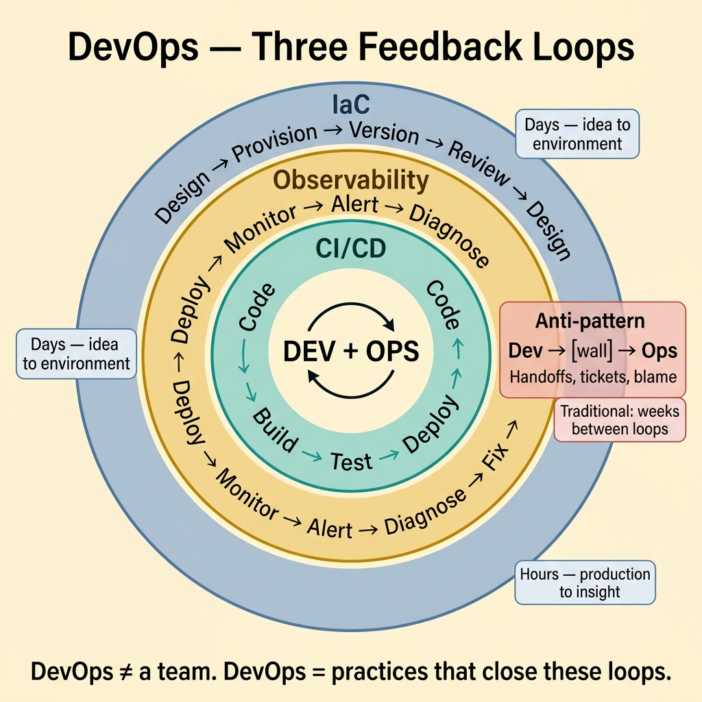

<!-- tags: glossary, reference, process-delivery, devops -->
# DevOps

> A cultural and engineering philosophy that unifies software development (Dev) and IT operations (Ops) to shorten the systems development lifecycle while delivering features, fixes, and updates continuously and reliably.

| Aspect | Detail |
| --- | --- |
| **Concept** | A cultural and engineering philosophy that unifies software development (Dev) and IT operations (Ops) to shorten the systems development lifecycle while delivering features, fixes, and updates continuously and reliably. |
| **Audience** | Developer, SRE, platform engineer, engineering manager |
| **Primary style** | Glossary term |
| **Entry point** | Use when the question is "why do our developers and operations teams work as antagonists instead of collaborators?" |

📅 Created: 2026-03-23 · 🔄 Updated: 2026-04-18 · ⏱️ 8 min read

---

## 1. DEFINE

The developer ships a feature. Operations rejects it: "this won't scale." The developer fires back: "it works on my machine." Three weeks of back-and-forth. The feature ships late, under-monitored, and the first production incident triggers finger-pointing. The wall between Dev and Ops is not a technical problem — it is an organizational one. Tearing down that wall is the boundary of **DevOps**.

**DevOps** is a cultural and engineering philosophy that unifies development and operations through shared ownership, automated pipelines, infrastructure-as-code, and continuous feedback loops from production back to development.

DevOps is not a role, a tool, or a team. It is a set of practices that blur the boundary between "building software" and "running software." When done well, the developers who build the system also bear responsibility for how it runs in production.

| Variant | Description |
| --- | --- |
| DevOps as culture | Shared ownership between Dev and Ops. "You build it, you run it." |
| DevOps as toolchain | CI/CD, IaC, monitoring, containerization — the enabling technologies. |
| Platform Engineering | A team that builds internal developer platforms to abstract DevOps complexity. |

| Approach | Ownership model | When to choose |
| --- | --- | --- |
| Traditional Dev + Ops | Separate teams, handoff-driven | Legacy organizations not ready for shared ownership. |
| DevOps (embedded) | Developers own deployment and monitoring | Teams with full-stack ownership and CI/CD maturity. |
| Platform Engineering | Platform team abstracts infra; devs self-serve | Large orgs where every team re-implementing DevOps is wasteful. |

Core insight:

> DevOps is ultimately about feedback loops. CI/CD shortens the loop from code to deploy. Monitoring shortens the loop from deploy to insight. Infrastructure-as-code shortens the loop from idea to environment. The faster all three loops close, the faster the team learns.

### 1.1 Invariants & Failure Modes

- "You build it, you run it" only works if developers have the tools, training, and time for operational responsibilities.
- Infrastructure-as-code must be versioned, reviewed, and tested like application code.
- DevOps without monitoring is blind — shipping fast with no feedback creates cascading failures.

Failure mode: the team adopts DevOps terminology but keeps the same organizational boundaries. Developers "own" production but have no access to logs, no alerting, and no on-call rotation. Operations still does all the actual work.

---

## 2. CONTEXT

**Who uses it**: Developer, SRE, platform engineer, engineering manager

**When**: When the question is "why do our developers and operations teams work as antagonists instead of collaborators?"

**Purpose**: DevOps closes the feedback loop between building software and running it. The practices — CI/CD, IaC, monitoring, shared ownership — are mechanisms for faster learning.

**In the ecosystem**:
DevOps extends Agile and CI/CD. Agile says "iterate fast." CI/CD says "ship fast." DevOps says "learn fast from production." SRE (Site Reliability Engineering) is Google's implementation of DevOps, adding error budgets and SLOs as governance mechanisms.

---

The philosophy is clear. But how do you implement "you build it, you run it" without burning out developers, and where does Platform Engineering fit?

## 3. EXAMPLES

DevOps surfaces most clearly when a developer deploys with one command and monitors the result in real-time, when an operations team gates all deploys behind a change board and creates a 2-week bottleneck, or when a "DevOps team" becomes the new Ops team with a trendier name. The examples below place the philosophy into exactly those situations.

### Example 1: Basic — Define the three pillars of a DevOps practice

> **Goal**: Establish the minimum viable DevOps practice for a software team.
> **Approach**: Implement CI/CD, Infrastructure-as-Code, and observability as the foundational pillars.
> **Example**: A lending service team transitioning from manual deployments.
> **Complexity**: Basic — the starting point before cultural change.



*Figure: DevOps as three concentric feedback loops — CI/CD (minutes), Observability (hours), and IaC (days). The anti-pattern is Dev → wall → Ops with weeks between loops.*

```yaml
devops_pillars:
  pillar_1_cicd:
    status: "partially done — CI exists, CD is manual"
    action: "automate staging deploy, add production canary"
    outcome: "deploy frequency: weekly → daily"
  pillar_2_iac:
    status: "infrastructure managed via console clicks"
    action: "terraform for all infra, versioned in Git"
    outcome: "environment creation: 3 days → 15 minutes"
  pillar_3_observability:
    status: "logs only, no metrics, no traces"
    action: "add Prometheus metrics, Grafana dashboards, distributed tracing"
    outcome: "MTTR: 4 hours → 30 minutes"
  combined_impact:
    before: "deploy once a week, 4-hour incident recovery, 3-day environment setup"
    after: "deploy daily, 30-minute recovery, 15-minute environment setup"
```

**Why?** DevOps without all three pillars is incomplete. CI/CD without observability ships fast but blind. Observability without CI/CD detects problems but cannot fix them quickly. IaC without CI/CD creates environments that drift from the code.

**Takeaway**: The three pillars reinforce each other. Start with CI/CD (fastest ROI), add IaC (reproducibility), then observability (feedback).

### Example 2: Intermediate — Implement "you build it, you run it" without burnout

> **Goal**: Give developers production ownership without overwhelming them with operational toil.
> **Approach**: Define clear operational responsibilities, automate toil, and provide self-service tooling.
> **Example**: A team of 6 developers who previously relied on a separate Ops team.
> **Complexity**: Intermediate — balancing ownership with developer experience.

```yaml
you_build_it_you_run_it:
  responsibilities:
    developer:
      - "deploy via CI/CD pipeline"
      - "monitor service dashboards during business hours"
      - "respond to P1 alerts during on-call rotation"
      - "write runbooks for known failure modes"
    platform_team:
      - "maintain CI/CD infrastructure"
      - "provide Terraform modules for common resources"
      - "manage monitoring stack (Prometheus, Grafana, PagerDuty)"
      - "handle infrastructure security and compliance"
  on_call:
    rotation: "weekly, 1 developer at a time"
    escalation: "platform team for infrastructure issues"
    compensation: "on-call stipend + time-off after incident"
  toil_reduction:
    - "auto-scaling replaces manual capacity management"
    - "self-healing pods replace manual restart"
    - "ChatOps deploys replace SSH-to-server"
  guardrails:
    - "no developer handles more than 2 incidents per on-call week"
    - "toil budget: <30% of on-call time spent on repetitive tasks"
```

**Why?** "You build it, you run it" fails when it means "you build it, and now you also do operations without training, tools, or time." The intermediate approach automates toil, provides self-service tools, and protects developer time with clear boundaries.

**Takeaway**: DevOps ownership works when the platform team handles the undifferentiated infrastructure and developers handle the application-specific operations.

### Example 3: Advanced — Measure DevOps maturity with DORA metrics

> **Goal**: Quantify DevOps effectiveness and identify the highest-leverage improvement.
> **Approach**: Track the four DORA metrics: deploy frequency, lead time, change failure rate, MTTR.
> **Example**: A team assessing whether their DevOps investment is paying off.
> **Complexity**: Advanced — from practice to measurement.

```yaml
dora_metrics:
  deploy_frequency:
    current: "3 per week"
    elite_benchmark: "multiple per day"
    gap: "pipeline speed and test confidence limit frequency"
    improvement: "parallelize CI, add canary auto-promotion"
  lead_time_for_changes:
    current: "4 days (commit to production)"
    elite_benchmark: "<1 hour"
    gap: "manual approval gate adds 2 days"
    improvement: "move to auto-promotion with SLO-based gates"
  change_failure_rate:
    current: "8%"
    elite_benchmark: "<5%"
    gap: "integration tests cover 60% of critical paths"
    improvement: "add contract tests for service boundaries"
  mean_time_to_recovery:
    current: "2 hours"
    elite_benchmark: "<1 hour"
    gap: "rollback is manual, incident detection is slow"
    improvement: "automate rollback on SLO breach, add anomaly detection"
  priority: "MTTR is the highest-leverage improvement — fast recovery > preventing all failures"
```

**Why?** Without measurement, DevOps improvements are faith-based. DORA metrics provide an objective, industry-benchmarked framework for identifying where the team is elite and where the biggest gap exists.

**Takeaway**: Advanced DevOps measures outcomes, not activity. Deploy frequency and MTTR are the two metrics that most directly correlate with team performance.

---

## 4. COMPARE


*Figure: DevOps as three feedback loops — CI/CD, observability, and IaC — closing the gap between development and production.*

DevOps sounds like "just automate everything." It is more: DevOps changes who is responsible for what. Automation is the mechanism; shared ownership is the goal.

### Level 1

```text
Traditional: Dev → [wall] → Ops → [wall] → Production
DevOps:      Dev + Ops → [automated pipeline] → Production → [feedback] → Dev + Ops
```
*Figure: Level 1 — DevOps removes the wall and adds a feedback loop.*

### Level 2

```text
Practice              Traditional Ops     DevOps (embedded)     Platform Engineering
──────────────        ──────────────      ──────────────        ────────────────────
Deploy                Ops team            Developer (CI/CD)     Developer (self-serve)
Infra provisioning    Ops ticket (days)   IaC in code review    Platform API (minutes)
Monitoring            Ops dashboard       Developer dashboard   Platform observability
On-call               Ops 24/7            Developer rotation    Shared (app + infra)
Improvement metric    Uptime              DORA metrics          Developer experience
```
*Figure: Level 2 — three ownership models with different trade-offs.*

### Easily confused or boundary-slipping

| # | Severity | Mistake | Consequence | Fix |
| --- | --- | --- | --- | --- |
| 1 | 🔴 Fatal | Creating a "DevOps team" that becomes the new Ops team | Dev still throws code over the wall; nothing changed | DevOps is a practice, not a team. Embed the practices in dev teams. |
| 2 | 🟡 Common | DevOps without observability | Ship fast but blind; incidents take hours to diagnose | Observability is a pillar, not an optional add-on. |
| 3 | 🟡 Common | "You build it, you run it" without training or tools | Developers burn out; operational quality drops | Provide platform, training, and protect on-call time. |
| 4 | 🔵 Minor | Equating DevOps with CI/CD | Misses IaC, monitoring, and cultural practices | CI/CD is one pillar of three. |

### Quick scan

| If you face | Action |
| --- | --- |
| Dev and Ops blame each other after incidents | Start with shared ownership and blameless retros |
| Deploys are risky and infrequent | Implement CI/CD with automated rollback |
| Infrastructure changes are manual and error-prone | Adopt Infrastructure-as-Code (Terraform, Pulumi) |

---

## 5. REF

| Resource | Type | Link | Note |
| --- | --- | --- | --- |
| The Phoenix Project | Book | https://itrevolution.com/the-phoenix-project/ | The narrative that introduced DevOps principles to a broad audience. |
| DORA State of DevOps | Research | https://dora.dev/ | Annual research on DevOps metrics and team performance. |
| Google SRE Book | Free Book | https://sre.google/sre-book/table-of-contents/ | Google's implementation of DevOps through SRE practices. |

---

## 6. RECOMMEND

DevOps answers "how do we unify development and operations?" The next question: what happens when reliability needs its own engineering discipline?

| Expand to | When | Reason | File/Link |
| --- | --- | --- | --- |
| Topic hub | When DevOps needs broader context | Return to the process overview | [Process & Delivery](./README.md) |
| Previous concept | When the question is pipeline automation, not operational philosophy | CI/CD is the engineering backbone of DevOps | [CI/CD](./CICD.md) |
| Next concept | When reliability needs its own discipline with SLOs and error budgets | SRE is Google's implementation of DevOps for reliability | [SRE](./SRE.md) |

Back to the developer-vs-operations standoff — "it works on my machine" meets "this won't scale." Now you know: shared ownership, automated pipelines, infrastructure-as-code, and production feedback loops. The wall is down. The question is whether both sides walk through.

**Links**: [← Previous](./CICD.md) · [→ Next](./SRE.md)
