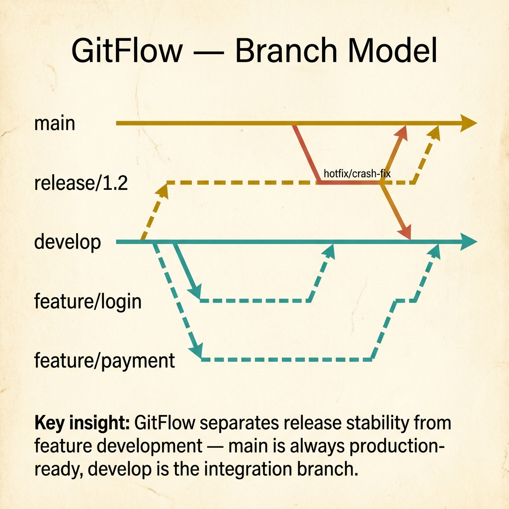
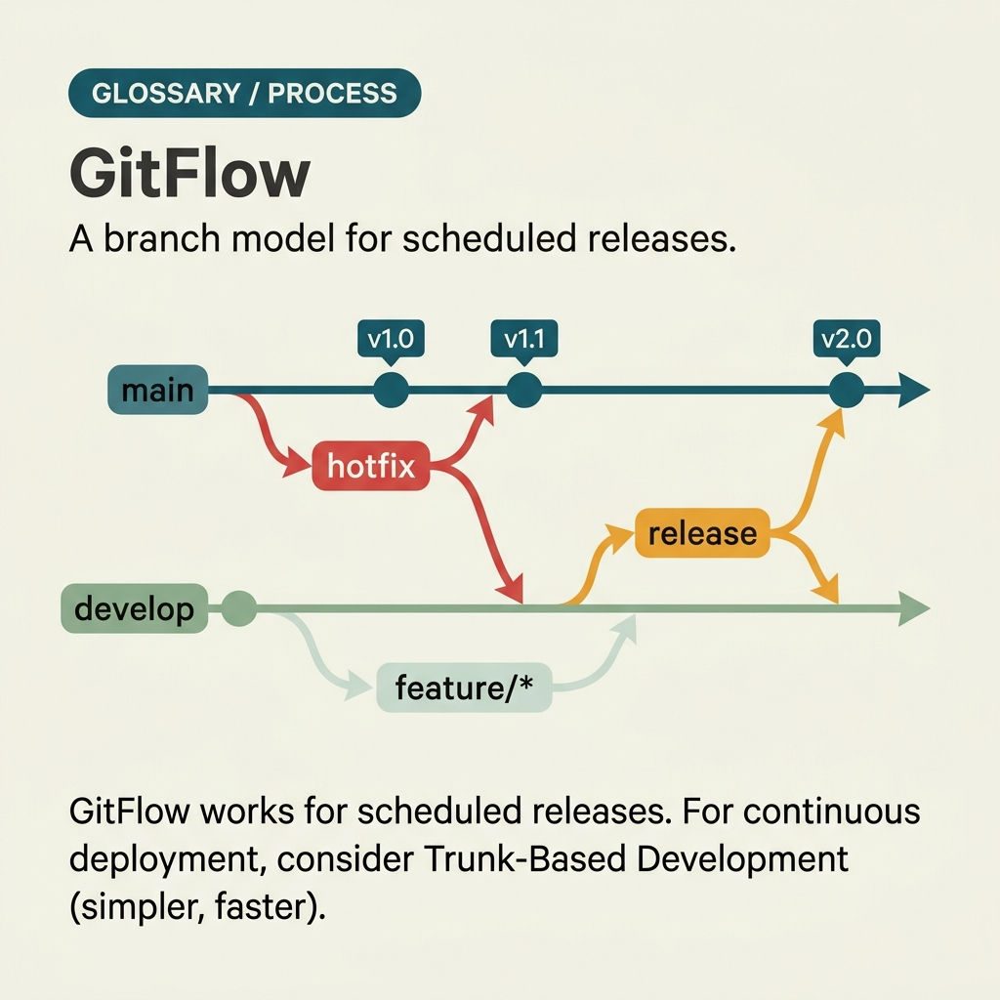

<!-- tags: glossary, reference, process-delivery, gitflow -->

# GitFlow — Git Branching Strategy

> A branch organization and release flow strategy for teams with a clear release cadence that need to separate feature, release, and hotfix lifecycles.

| Aspect            | Detail                                                                                                                                                |
| ----------------- | ----------------------------------------------------------------------------------------------------------------------------------------------------- |
| **Concept**       | A branch organization and release flow strategy for teams with a clear release cadence that need to separate feature, release, and hotfix lifecycles. |
| **Audience**      | Developer, tech lead, release manager, platform engineer                                                                                              |
| **Primary style** | Glossary term                                                                                                                                         |
| **Entry point**   | Use when the question is "how should branches live, where should they merge, and how are releases and hotfixes managed?"                              |

📅 Created: 2026-03-23 · 🔄 Updated: 2026-04-17 · ⏱️ 10 min read

---

## 1. DEFINE

The team suffers heavy merge pain every time a release is being prepared. One person says stronger CI is needed; another says just ban direct pushes to main. But if the real question is "how should branches be organized to support our release cadence?", then the discussion is about **branching strategy**, and **GitFlow** is one specific answer for that category of need.

**GitFlow** is a branch organization and release flow strategy for teams with a clear release cadence that need to separate feature, release, and hotfix lifecycles.

GitFlow differs from trunk-based development in that it accepts multiple long-lived branches with dedicated roles, particularly `develop`, `release/*`, and `hotfix/*`. It fits release-based delivery better than high-velocity continuous deployment.

| Variant                 | Description                                                                                |
| ----------------------- | ------------------------------------------------------------------------------------------ |
| Classic GitFlow         | Uses `main`, `develop`, `feature/*`, `release/*`, `hotfix/*`.                              |
| GitFlow-lite            | Keeps the release/hotfix branch idea but reduces ceremony or drops minor branches.         |
| Release-branch strategy | Uses release branches as a stabilization buffer for teams that need a clear freeze window. |

| Approach                      | Time                    | Space              | When to choose                                                              |
| ----------------------------- | ----------------------- | ------------------ | --------------------------------------------------------------------------- |
| Release branch isolation      | Per release cycle       | O(active branches) | When you need to stabilize a release without blocking all development.      |
| Hotfix back-merge discipline  | O(1) per hotfix         | O(1)               | When a production fix must flow back into the standard development path.    |
| Long-lived integration branch | Per integration cadence | O(1)               | When the team is not ready for trunk-based or has a clear release schedule. |

Core insight:

> GitFlow has value when release cadence and stabilization cost are large enough to justify the extra branch lifecycle. If the team deploys continuously many times a day, GitFlow usually creates more overhead than benefit.

### 1.1 Failure Modes

Common failure modes:

- feature branches live too long, turning `develop` into a conflict accumulation zone;
- release branch drags on, drifting from develop;
- hotfix merge-back is incomplete, causing bugs to reappear in the next release;
- team does continuous deployment but still uses GitFlow because it "sounds more enterprise."

---

## 2. CONTEXT

**Who uses it**: Developer, tech lead, release manager, platform engineer

**When**: Use when the question is "how should branches live, where should they merge, and how are releases and hotfixes managed?"

**Purpose**: GitFlow has value when release cadence and stabilization cost are large enough to justify extra branch lifecycle. Continuous deployment teams usually find GitFlow creates more overhead than benefit.

**In the ecosystem**:
GitFlow usually makes sense when:

- releases have a clear schedule and need hardening time before going live;
- multiple features must continue development while a release is being stabilized;
- production hotfixes must flow back into both main and develop clearly.

GitFlow does not solve:

- CI quality or weak test automation;
- release policy like canary or feature flags;
- ownership between dev and ops.

---

Branching strategy is clear. But GitFlow or trunk-based, when is a release branch needed, and is GitFlow too complex for small teams?

## 3. EXAMPLES

GitFlow surfaces most clearly when a team of 3 devs has 8 active branches, when merge conflicts from long-lived feature branches take half a day, or when a hotfix branch diverges from both main and the release branch simultaneously. The examples below place the pattern into exactly those situations.

### Example 1: Basic — Route the right branch type to the right kind of change

```text
  Branch intent map:

  ┌─ Feature ──────────────────────────────────┐
  │  Branch from: develop                       │
  │  Merge back to: develop                     │
  │  Purpose: new functionality                 │
  └─────────────────────────────────────────────┘

  ┌─ Release ──────────────────────────────────┐
  │  Branch from: develop                       │
  │  Merge back to: main + develop              │
  │  Purpose: stabilization and hardening       │
  └─────────────────────────────────────────────┘

  ┌─ Hotfix ───────────────────────────────────┐
  │  Branch from: main                          │
  │  Merge back to: main + develop              │
  │  Purpose: production emergency fix          │
  └─────────────────────────────────────────────┘

  GitFlow fails at the basic level if the team
  cannot distingush the lane for feature,
  release, and hotfix. Without intent, branches
  are "just for convenience," not lifecycle
  strategy.
```

_Figure: GitFlow fails at the basic level if the team cannot distinguish the lane for feature, release, and hotfix. Without clear intent, every branch is just "for convenience" — no lifecycle strategy._

```yaml
gitflow_rules:
    feature:
        branch_from: develop
        merge_back: develop
    release:
        branch_from: develop
        merge_back:
            - main
            - develop
    hotfix:
        branch_from: main
        merge_back:
            - main
            - develop
```



*Figure: GitFlow separates release stability from feature development. Main is always production-ready, develop is the integration branch. Feature branches fork from develop, release branches stabilize, hotfixes patch main directly.*

**Why?** GitFlow fails at the basic level if the team cannot distinguish the lane of feature, release, and hotfix. Without that, every branch is "just for convenience" — no lifecycle strategy.

**Conclusion**: Basic GitFlow is branch intent first, even before creating the branch.

### Example 2: Intermediate — Stabilize a release without freezing all development

```text
  Release branch discipline:

  ┌─ Allowed on release branch ────────────────┐
  │  ✅ bug fixes                               │
  │  ✅ config adjustments for release           │
  │  ✅ release notes / version bump             │
  └─────────────────────────────────────────────┘

  ┌─ Forbidden on release branch ──────────────┐
  │  ❌ new feature scope                       │
  │  ❌ large refactor unrelated to release risk│
  └─────────────────────────────────────────────┘

  ┌─ Exit condition ───────────────────────────┐
  │  • all release blockers closed              │
  │  • merge back to main AND develop completed │
  └─────────────────────────────────────────────┘

  Release branch is only useful as a
  stabilization buffer. If scope is not
  locked, drift grows fast and merge-back
  becomes much more painful.
```

_Figure: Release branch is only useful as a stabilization buffer. If scope is not locked here, drift grows fast and merge-back becomes much more painful._

```yaml
release_branch_policy:
    allowed_changes:
        - 'bug fixes'
        - 'config adjustments needed for release'
        - 'release notes / version bump'
    forbidden_changes:
        - 'new feature scope'
        - 'large refactor unrelated to release risk'
    exit_condition:
        - 'all release blockers closed'
        - 'merge back to main and develop completed'
```

**Why?** Release branch is only useful as a stabilization buffer, not a place to continue developing features. If scope is not locked here, drift increases rapidly and merge-back becomes much more painful.

**Conclusion**: Intermediate GitFlow is the discipline of keeping the release branch narrow and short-lived.

### Example 3: Advanced — Control hotfix to prevent double-fix debt

```text
  Hotfix merge-back checklist:

  ┌─ Start from: main ────────────────────────┐
  │                                             │
  │  Before closing:                            │
  │    ✅ patch verified in production-like env │
  │    ✅ merged back into main                 │
  │    ✅ merged back into develop              │
  │    ✅ release notes / incident note updated │
  │                                             │
  │  Risk if skipped:                           │
  │    • bug reappears in the next version      │
  │    • main and develop silently diverge      │
  │                                             │
  │  The most dangerous part of GitFlow is not  │
  │  creating many branches. It is forgetting   │
  │  to synchronize state between long-lived    │
  │  branches.                                  │
  └─────────────────────────────────────────────┘
```

_Figure: The most dangerous part of GitFlow is not creating many branches. It is forgetting to synchronize state between long-lived branches. A missed hotfix merge-back creates process debt invisible until the next release._

```yaml
hotfix_checklist:
    start_from: main
    before_close:
        - 'patch verified in production-like environment'
        - 'merged back into main'
        - 'merged back into develop'
        - 'release notes / incident note updated'
    risk_if_skipped:
        - 'bug reappears in next version'
        - 'main and develop silently diverge'
```

**Why?** The most dangerous part of GitFlow is not creating many branches. It is forgetting to synchronize state between long-lived branches. A missed hotfix merge-back creates a kind of process debt that is invisible until the next release.

**Conclusion**: At the advanced level, GitFlow is only durable when merge-back discipline is treated as mandatory as code review.

---

## 4. COMPARE



_Figure: Position of GitFlow among trunk-based, GitHub Flow, and release management._

GitFlow sounds like "the right way to git." Not quite: GitFlow fits when you need multiple versions in production. Trunk-based development (single main branch + feature flags) is simpler for CI/CD. Choose based on release cadence.

### Level 1

```text
feature/* -> develop -> release/* -> main
                     \-> hotfix/* ->/
```

_Figure: Level 1 shows GitFlow clearly separating the paths of feature, release, and hotfix instead of merging everything directly into main._

### Level 2

```text
main      ----o-------------------o------> production tags
            \                   /
release/*    o----stabilize----o
              \               /
develop        o---o---o---o--o-------> ongoing integration
                \   \   \
feature/*        o   o   o

hotfix/* starts from main and must merge back to both main + develop
```

_Figure: Level 2 highlights the two most fragile points of GitFlow: release branch drift and hotfix merge-back discipline._

### Easily confused or boundary-slipping

| #   | Severity  | Mistake                                                               | Consequence                                      | Fix                                                       |
| --- | --------- | --------------------------------------------------------------------- | ------------------------------------------------ | --------------------------------------------------------- |
| 1   | 🔴 Fatal  | Using GitFlow for a team doing continuous deployment many times a day | Branch overhead exceeds value                    | Re-evaluate trunk-based or a simpler flow.                |
| 2   | 🟡 Common | Release branch lives too long                                         | High drift, painful merge-back                   | Keep release window short and stabilization scope narrow. |
| 3   | 🟡 Common | Forgetting to merge hotfix back into develop                          | Bug reappears in the next release                | Make merge-back checklist mandatory.                      |
| 4   | 🔵 Minor  | Equating GitFlow with CI/CD                                           | Team applies the wrong tool to the wrong problem | Compare branch strategy with pipeline automation clearly. |

### Quick scan

| If you face                                              | Action                                          |
| -------------------------------------------------------- | ----------------------------------------------- |
| Release needs hardening but features must continue       | GitFlow may be a good fit.                      |
| Team deploys very frequently and branches all live short | Consider trunk-based instead of GitFlow.        |
| Production bug just fixed                                | Check merge-back to main + develop immediately. |

---

## 5. REF

| Resource                         | Type               | Link                                                     | Note                                                              |
| -------------------------------- | ------------------ | -------------------------------------------------------- | ----------------------------------------------------------------- |
| A successful Git branching model | Official/Reference | https://nvie.com/posts/a-successful-git-branching-model/ | Original GitFlow article.                                         |
| Trunk Based Development          | Reference          | https://trunkbaseddevelopment.com/                       | Use to compare when GitFlow starts feeling too heavy.             |
| Continuous Delivery              | Reference          | https://continuousdelivery.com/                          | Useful for placing branching strategy next to release automation. |

---

## 6. RECOMMEND

GitFlow solves "managing complex releases and hotfixes." Next questions: how does Scrum sprint delivery work, and what are the underlying Agile principles?

| Expand to                  | When                                                            | Reason                                                     | File/Link                         |
| -------------------------- | --------------------------------------------------------------- | ---------------------------------------------------------- | --------------------------------- |
| Delivery pipeline          | When the question shifts to build/test/promote/deploy           | Branch strategy does not replace pipeline strategy.        | [CI/CD](./CICD.md)                |
| Reliability & release risk | When release safety is tightly coupled with production behavior | Connect release flow with operating discipline.            | [SRE](./SRE.md)                   |
| Topic hub                  | When you need to return to the larger process picture           | Compare GitFlow with Agile/Scrum/DevOps in the same topic. | [Process & Delivery](./README.md) |

Back to the 8 branches at the start — 3 devs, continuous merge conflicts. Now you know: GitFlow for slow release cadence (mobile apps, packaged software), trunk-based for frequent deploys (SaaS, web). Choose by cadence, not by popularity.

**Links**: [← Previous](./DevOps.md) · [→ Next](./SRE.md)
