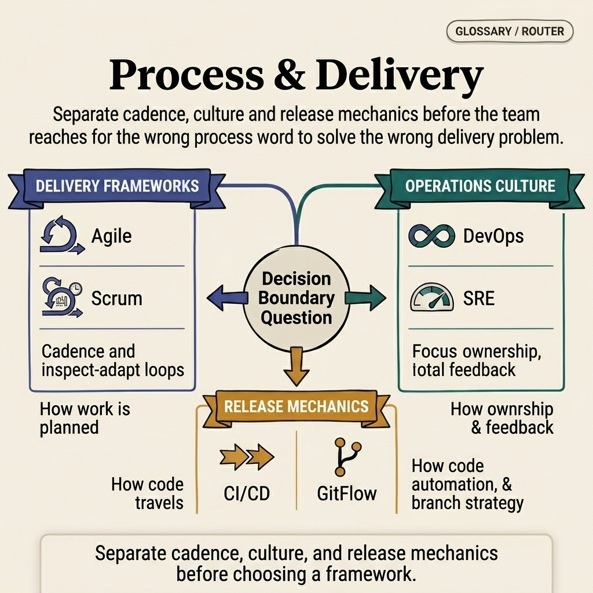

<!-- tags: glossary, reference, process-delivery, overview -->

# Process & Delivery

> A cluster of terms about delivery frameworks, operational culture, and branching/release discipline in software development teams.

| Aspect            | Detail                                                                                                                             |
| ----------------- | ---------------------------------------------------------------------------------------------------------------------------------- |
| **Concept**       | A cluster of terms about delivery frameworks, operational culture, and branching/release discipline in software development teams. |
| **Audience**      | Engineering manager, tech lead, developer, delivery lead                                                                           |
| **Primary style** | Glossary hub router                                                                                                                |
| **Entry point**   | Open when the team is debating delivery frameworks, release methods, and operational language at the organizational level.         |

📅 Created: 2026-03-30 · 🔄 Updated: 2026-04-17 · ⏱️ 6 min read

---

## 1. DEFINE

A team can write solid code and still release slowly, run vague on-call, and argue endlessly about process. At that point, the problem is in the language of delivery rather than implementation. This README routes those conversations into the right term: Agile, Scrum, DevOps, SRE, CI/CD, and GitFlow.

**Process & Delivery** is a cluster of terms about delivery frameworks, operational culture, and branching/release discipline in software development teams.

| Variant             | Description                                                              |
| ------------------- | ------------------------------------------------------------------------ |
| Delivery frameworks | Agile and Scrum name how the team plans and cadences delivery.           |
| Operations culture  | DevOps and SRE name the philosophy connecting delivery with reliability. |
| Release mechanics   | CI/CD and GitFlow describe how code moves from branch to production.     |

| Approach                             | Time       | Space | When to choose                                                           |
| ------------------------------------ | ---------- | ----- | ------------------------------------------------------------------------ |
| Route by organizational conversation | O(1) route | O(1)  | When the team is arguing about process more than code.                   |
| Route by release pipeline            | O(1) route | O(1)  | When the issue is in branch, build, ship, or on-call practice.           |
| Learn from framework to mechanics    | O(1) route | O(1)  | When you want to go from delivery philosophy to actual operational flow. |

Core insight:

> Process is only useful when the team uses it to make better decisions. If every term is used as a slogan, delivery gets worse faster.

### 1.1 Signals & Boundaries

- Agile/Scrum belong to the planning cadence layer, distinct from DevOps/SRE as operations culture.
- CI/CD and GitFlow belong to the mechanics layer of code movement and release.
- SRE appears when reliability becomes part of the decision loop, not just a separate team.

### Coverage Map

| Entry                                                           | Role           | Note                         |
| --------------------------------------------------------------- | -------------- | ---------------------------- |
| [Agile — Agile Software Development](Agile.md)                  | Canonical term | Primary entry for this lane. |
| [CI/CD — Continuous Integration / Continuous Delivery](CICD.md) | Canonical term | Primary entry for this lane. |
| [DevOps — Development + Operations](DevOps.md)                  | Canonical term | Primary entry for this lane. |
| [GitFlow — Git Branching Strategy](GitFlow.md)                  | Canonical term | Primary entry for this lane. |
| [SRE — Site Reliability Engineering](SRE.md)                    | Canonical term | Primary entry for this lane. |
| [Scrum — Scrum Framework](Scrum.md)                             | Canonical term | Primary entry for this lane. |

---

## 2. VISUAL



_Figure: Router map separating framework cadence, operations culture, and release mechanics so process discussions do not collapse into a pile of delivery slogans._

A hub is only valuable when it points to which lane is actually broken: cadence, ownership, or mechanics. The visual below pulls all three layers onto the same plane so the team routes the right discussion before choosing a framework or tool.

### Level 1

```text
Delivery frameworks
Operations culture
Release mechanics
```

_Figure: Level 1 splits this hub into the main decision lanes so the reader does not have to wander through a flat list of terms._

### Level 2

```text
If the issue is...                                    Open this file first
---------------------------------------------------   ------------------------------------------
Need language for planning cadence and sprint rituals  Scrum — Scrum Framework
Want to talk about culture bridging dev and ops        DevOps — Development + Operations
Need to name a release pipeline from commit to deploy  CI/CD — Continuous Integration / Delivery
Debating branch strategy and release branches          GitFlow — Git Branching Strategy
```

_Figure: Level 2 turns the hub into a symptom router: start from the real question, then branch to the specific term._

---

## 3. CODE

The diagram showed this cluster organized by workflow, ownership, and feedback loops. From here, use the hub as a router to find which coordination mechanism the team is missing.

### Problem 1: Basic — Route the right symptom to the right glossary entry

Do not let every question about **Process & Delivery** be thrown into the same bucket.

```text
  Symptom router:

  ┌─ Symptom ──────────────────────────────────┐
  │  Need planning cadence and sprint rituals   │
  │  → open Scrum.md                            │
  │                                             │
  │  Want to bridge gap between dev and ops     │
  │  → open DevOps.md                           │
  │                                             │
  │  Need to name a release pipeline            │
  │  → open CICD.md                             │
  │                                             │
  │  Debating branch strategy vs release flow   │
  │  → open GitFlow.md                          │
  │                                             │
  │  Start from the delivery symptom,           │
  │  not from the process slogan.               │
  └─────────────────────────────────────────────┘
```

_Figure: In process/delivery, many terms get used as cultural labels rather than execution mechanisms. This router forces the reader to start from a real delivery symptom, not a process slogan._

```yaml
router:
    - symptom: Need language for planning cadence and sprint rituals
      open_first: ./Scrum.md
    - symptom: Want to talk about culture bridging dev and ops
      open_first: ./DevOps.md
    - symptom: Need to name a release pipeline from commit to deploy
      open_first: ./CICD.md
    - symptom: Debating branch strategy and release branches
      open_first: ./GitFlow.md
```

**Why?** In process/delivery, many terms get used as cultural labels rather than execution mechanisms. This router forces the reader to start from a real delivery symptom, not a process slogan.

**Conclusion**: The first value of this hub is pulling the conversation to the right kind of workflow that needs fixing or designing.

### Problem 2: Intermediate — Use the hub as a learning path with intent

Read **Process & Delivery** in logical clusters rather than jumping randomly between files.

```text
  Learning path:

  ┌─ Step 1: Frameworks ──────────────────────┐
  │  Agile.md → Scrum.md                       │
  │  Start from mindset, then cadence.          │
  └─────────────────────────────────────────────┘

  ┌─ Step 2: Culture ──────────────────────────┐
  │  DevOps.md → SRE.md                        │
  │  From ownership model to reliability.       │
  └─────────────────────────────────────────────┘

  ┌─ Step 3: Mechanics ────────────────────────┐
  │  CICD.md → GitFlow.md                      │
  │  From pipeline to branch discipline.        │
  └─────────────────────────────────────────────┘
```

_Figure: The terms in this cluster are linked through feedback loops and delivery cadence. The learning path helps the reader see why Agile, Scrum, DevOps, and SRE are not isolated stickers._

```yaml
learning_path:
    frameworks:
        - Agile.md
        - Scrum.md
    culture:
        - DevOps.md
        - SRE.md
    mechanics:
        - CICD.md
        - GitFlow.md
```

**Why?** The terms in this cluster are connected through feedback loops and delivery cadence. A learning path helps the reader see why Agile, Scrum, DevOps, and SRE are not isolated stickers.

**Conclusion**: At the intermediate level, this hub gives the reader a path following delivery flow and feedback loops, not just method names.

### Problem 3: Advanced — Use the hub as a governance map for shared vocabulary

```text
  Governance vocabulary map:

  ┌─ Delivery frameworks ─────────────────────┐
  │  Agile.md, Scrum.md                        │
  │  → "how we plan and cadence"               │
  └─────────────────────────────────────────────┘

  ┌─ Operations culture ──────────────────────┐
  │  DevOps.md, SRE.md                         │
  │  → "how we own and measure reliability"    │
  └─────────────────────────────────────────────┘

  ┌─ Release mechanics ───────────────────────┐
  │  CICD.md, GitFlow.md                       │
  │  → "how code moves from branch to prod"   │
  └─────────────────────────────────────────────┘

  When two people use the same word but argue
  at two different layers — this map resolves it.
```

_Figure: Shared vocabulary in process/delivery directly affects how the team sets expectations and measures results. A governance map prevents mixing operating model with rituals or toolchains._

```yaml
governance_map:
    delivery_frameworks:
        - Agile.md
        - Scrum.md
    operations_culture:
        - DevOps.md
        - SRE.md
    release_mechanics:
        - CICD.md
        - GitFlow.md
```

**Why?** Shared vocabulary in process/delivery directly affects how the team sets expectations and measures results. A governance map keeps the organization from mixing operating model with rituals or toolchains.

**Conclusion**: At the advanced level, this hub is a governance map for speaking accurately about delivery flow and coordination responsibilities.

---

## 4. PITFALLS

The taxonomy is clear, but routing correctly is not enough to avoid the most common slips when using or interpreting this concept cluster.

| #   | Severity  | Mistake                                              | Consequence                                                              | Fix                                                                  |
| --- | --------- | ---------------------------------------------------- | ------------------------------------------------------------------------ | -------------------------------------------------------------------- |
| 1   | 🔴 Fatal  | Mixing multiple concept layers in one discussion     | Team fixes the wrong layer, arguments go off track                       | Re-route through this README's lanes before opening a specific term. |
| 2   | 🟡 Common | Choosing a term by familiar name instead of symptom  | Deep-link the right file but wrong boundary                              | Ask the symptom question first, then choose the entry point.         |
| 3   | 🟡 Common | Reading terms in isolation without the learning path | Understanding stays fragmented, missing adjacent concepts for comparison | Follow the suggested reading clusters in CODE/RECOMMEND.             |
| 4   | 🔵 Minor  | Not linking back to the parent hub or root hub       | Reader gets lost and cannot return to the taxonomy                       | Keep hub as a router; do not turn files into islands.                |

---

## 5. REF

| Resource            | Type      | Link                                           | Note                                          |
| ------------------- | --------- | ---------------------------------------------- | --------------------------------------------- |
| Agile Manifesto     | Official  | https://agilemanifesto.org/                    | Source of truth for Agile.                    |
| Google SRE Book     | Reference | https://sre.google/sre-book/table-of-contents/ | Foundation for SRE.                           |
| Continuous Delivery | Book      | https://continuousdelivery.com/                | Well suited for CI/CD and release discipline. |

---

## 6. RECOMMEND

You have identified the right process layer. Continue to the nearest delivery mechanism to the actual bottleneck, rather than choosing a framework by fame.

| Expand to                                | When                                                          | Reason                                                   | File/Link                                                         |
| ---------------------------------------- | ------------------------------------------------------------- | -------------------------------------------------------- | ----------------------------------------------------------------- |
| Agile/Scrum first                        | When the team is arguing about planning cadence again         | Start from cadence before moving to mechanics.           | [Scrum — Scrum Framework](./Scrum.md)                             |
| DevOps/SRE next                          | When reliability and ownership have become a major concern    | Good delivery cannot separate from operations.           | [SRE — Site Reliability Engineering](./SRE.md)                    |
| CI/CD when pipeline specifics are needed | When the debate needs to shift from philosophy to actual flow | Now the term needs to attach to pipeline and automation. | [CI/CD — Continuous Integration / Continuous Delivery](./CICD.md) |

---

## 7. QUICK REF

| If you face                                           | Open                                                              |
| ----------------------------------------------------- | ----------------------------------------------------------------- |
| Need language for planning cadence and sprint rituals | [Scrum — Scrum Framework](./Scrum.md)                             |
| Want to talk about culture bridging dev and ops       | [DevOps — Development + Operations](./DevOps.md)                  |
| Need to name a release pipeline from commit to deploy | [CI/CD — Continuous Integration / Continuous Delivery](./CICD.md) |
| Debating branch strategy and release branches         | [GitFlow — Git Branching Strategy](./GitFlow.md)                  |
