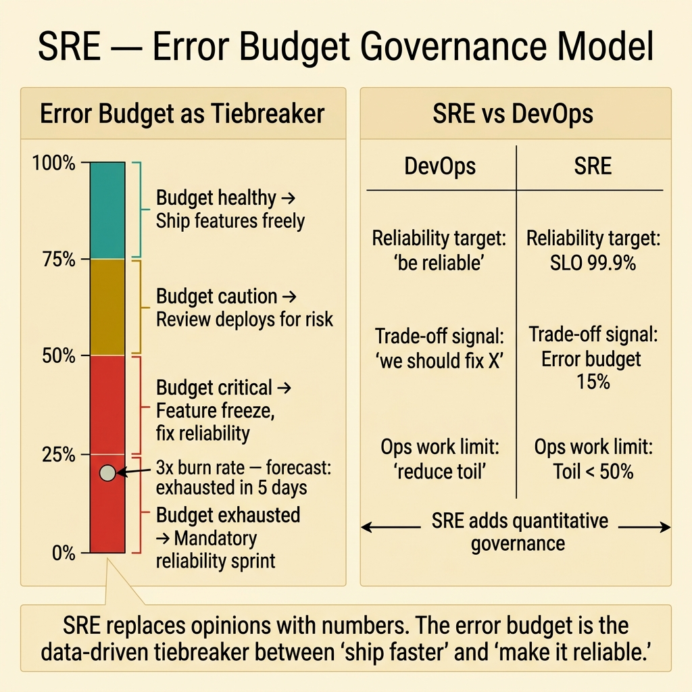

<!-- tags: glossary, reference, process-delivery, sre -->
# SRE (Site Reliability Engineering)

> An engineering discipline that applies software engineering approaches to operations problems, using SLOs, error budgets, and toil reduction to balance reliability with feature velocity.

| Aspect | Detail |
| --- | --- |
| **Concept** | An engineering discipline that applies software engineering approaches to operations problems, using SLOs, error budgets, and toil reduction to balance reliability with feature velocity. |
| **Audience** | SRE, backend engineer, engineering manager, platform engineer |
| **Primary style** | Glossary term |
| **Entry point** | Use when the question is "how do we balance shipping fast with keeping the system reliable?" |

📅 Created: 2026-03-23 · 🔄 Updated: 2026-04-18 · ⏱️ 8 min read

---

## 1. DEFINE

The team ships features every day. Users love the new functionality. But the service has been down 3 times this month. The PM wants more features. The on-call engineer wants a reliability sprint. Both are right, and neither can win a moral argument. The solution is a framework that makes the trade-off explicit and measurable. That framework is the boundary of **SRE**.

**SRE** (Site Reliability Engineering) is a discipline, pioneered at Google, that treats operations as a software engineering problem. SRE defines reliability targets (SLOs), measures the gap between target and actual (error budgets), and uses the error budget as a governance mechanism: when the budget is healthy, ship features fast; when the budget is exhausted, prioritize reliability.

SRE is not "DevOps with a different name." SRE provides specific governance mechanisms (SLOs, error budgets, toil budgets) that DevOps does not prescribe. DevOps is the philosophy; SRE is one implementation with explicit quantitative guardrails.

| Variant | Description |
| --- | --- |
| Embedded SRE | SRE engineers embedded in product teams with shared on-call. |
| Centralized SRE | A dedicated SRE team serving multiple product teams. |
| SRE as practice | No dedicated SRE role; product teams adopt SRE practices (SLOs, toil tracking). |

| Approach | Governance | When to choose |
| --- | --- | --- |
| DevOps (no SRE) | Cultural norms | Small teams with natural dev-ops overlap. |
| SRE as practice | SLOs + error budgets adopted by dev teams | Mid-size teams that need structure without dedicated roles. |
| Dedicated SRE team | Full SRE discipline with staffing | Large orgs where reliability is a dedicated concern. |

Core insight:

> SRE replaces the endless argument between "ship faster" and "make it more reliable" with a quantitative framework: the error budget. When the budget is healthy, reliability is sufficient — ship features. When the budget is spent, reliability is insufficient — fix reliability. The framework removes the opinion from the decision.

### 1.1 Invariants & Failure Modes

- SLOs must be set based on user expectations, not engineering ambition (99.99% is not always needed).
- Error budgets must have real consequences — if the budget is spent, feature freezes must happen.
- Toil must be measured and reduced to <50% of SRE time; otherwise SRE becomes traditional Ops.

Failure mode: the team defines SLOs but never enforces error budget consequences. The budget is a dashboard number, not a governance mechanism. Feature velocity never slows, reliability never improves.

---

## 2. CONTEXT

**Who uses it**: SRE, backend engineer, engineering manager, platform engineer

**When**: When the question is "how do we balance shipping fast with keeping the system reliable?"

**Purpose**: SRE replaces opinion-based arguments about reliability with data-based governance. The error budget makes the trade-off explicit: when the budget is healthy, ship fast; when it is spent, fix reliability.

**In the ecosystem**:
SRE extends DevOps by adding quantitative governance (SLOs, error budgets, toil budgets). It connects to the Observability domain (SLIs measure what SLOs target) and to the CI/CD pipeline (error budgets gate feature deploys).

---

The philosophy is clear. But how do you set SLOs that matter, how do you enforce error budgets politically, and how do you keep SRE from becoming the renamed Ops team?

## 3. EXAMPLES

SRE surfaces most clearly when the PM asks "why can't we ship this week?" and the SRE shows the exhausted error budget, when toil consumes 80% of an engineer's week and they are too busy firefighting to automate anything, or when the SLO is set so aggressively that the team spends all time on reliability and ships no features. The examples below place the discipline into exactly those situations.

### Example 1: Basic — Set SLOs and error budgets for a lending service

> **Goal**: Define measurable reliability targets that balance user experience with feature velocity.
> **Approach**: Start with user-facing SLIs, set SLOs based on user tolerance, then calculate error budgets.
> **Example**: A lending application API with availability and latency requirements.
> **Complexity**: Basic — the foundational SRE setup.



*Figure: The error budget gauge shows four zones from healthy (ship freely) to exhausted (mandatory reliability sprint). SRE adds quantitative governance — SLOs, error budgets, toil limits — where DevOps provides only cultural guidance.*

```yaml
sre_foundation:
  service: "lending-api"
  slis:
    availability: "proportion of successful HTTP responses (non-5xx)"
    latency: "proportion of requests completing under 500ms"
  slos:
    availability: "99.9% over 30-day rolling window"
    latency: "95% of requests under 500ms"
  error_budget:
    availability: "0.1% of requests can fail = ~43 minutes of downtime per month"
    latency: "5% of requests can exceed 500ms"
  governance:
    budget_healthy: "ship features normally"
    budget_at_50: "review upcoming deploys for risk"
    budget_exhausted: "feature freeze until budget recovers"
```

**Why?** 99.9% availability means 43 minutes of downtime per month is acceptable. This number is not negotiable without data — it is based on user tolerance. Setting a tighter SLO (99.99%) gives only 4.3 minutes per month and dramatically limits feature velocity.

**Takeaway**: SLOs should be as loose as users will tolerate, not as tight as engineers can achieve. The looser the SLO, the more feature velocity the team retains.

### Example 2: Intermediate — Track and reduce toil below 50%

> **Goal**: Ensure SRE engineers spend more time on engineering than on manual, repetitive tasks.
> **Approach**: Classify all operational work as toil vs. engineering, then systematically automate the highest-toil tasks.
> **Example**: An SRE spending 70% of time on manual certificate rotation, log analysis, and capacity planning.
> **Complexity**: Intermediate — from firefighting to engineering.

```yaml
toil_reduction:
  current_breakdown:
    toil: "70%"
    engineering: "30%"
  top_toil_items:
    - task: "manual certificate rotation"
      hours_per_week: 8
      automation: "cert-manager auto-renewal"
      hours_after: 0
    - task: "manual log analysis for debugging"
      hours_per_week: 6
      automation: "structured logging + Loki alerts"
      hours_after: 1
    - task: "manual capacity planning"
      hours_per_week: 4
      automation: "HPA + predictive autoscaling"
      hours_after: 0.5
  after_automation:
    toil: "35%"
    engineering: "65%"
  rule: "if toil exceeds 50%, stop feature work and automate the top toil item"
```

**Why?** An SRE whose week is 70% toil is an operations engineer with a new title. The 50% toil budget is a governance mechanism: when exceeded, the team's priority shifts from features to automation. This prevents the SRE function from degrading into traditional Ops.

**Takeaway**: Intermediate SRE means measuring toil weekly and treating the 50% threshold as seriously as the error budget.

### Example 3: Advanced — Use error budgets to resolve the feature-vs-reliability conflict

> **Goal**: Turn the "ship vs. stabilize" argument from an opinion war into a data-driven decision.
> **Approach**: Make error budget burn rate visible and tie it to deployment policy.
> **Example**: The PM wants to ship a risky migration; the SRE wants a reliability sprint.
> **Complexity**: Advanced — governance that both sides accept.

```yaml
error_budget_governance:
  scenario: "PM requests database migration deploy this sprint"
  error_budget_state:
    budget_remaining: "15% (was 100% at start of month)"
    burn_rate: "3x normal (caused by last week's config incident)"
    forecast: "budget exhausted in 5 days at current rate"
  decision_framework:
    option_a:
      action: "deploy migration (adds risk)"
      risk: "if migration causes issues, budget exhausts → 3-week feature freeze"
      proponent: "PM — business urgency"
    option_b:
      action: "reliability sprint (reduce burn rate)"
      risk: "migration delayed 2 weeks"
      proponent: "SRE — budget protection"
    resolution: "data-driven — at 15% budget and 3x burn rate, deploy is too risky"
    compromise: "reliability sprint this week, migration next week with budget recovered to 40%"
  escalation:
    rule: "if PM and SRE disagree, error budget state is the tiebreaker"
    override: "VP can override, but must accept personal accountability for SLO breach"
```

**Why?** Without error budgets, the decision is political: whoever argues louder wins. With error budgets, the decision is quantitative: if the budget is exhausted, reliability takes priority. This depersonalizes the conflict and makes the trade-off visible to leadership.

**Takeaway**: Advanced SRE uses error budgets as a governance mechanism that removes opinion from the reliability-vs-velocity trade-off.

---

## 4. COMPARE


*Figure: SRE governance model — SLOs, error budgets, and toil budgets creating feedback loops between feature velocity and reliability.*

SRE sounds like "DevOps plus monitoring." Close, but SRE adds governance mechanisms — SLOs, error budgets, toil budgets — that DevOps does not prescribe. DevOps is cultural; SRE is cultural plus quantitative.

### Level 1

```text
DevOps:  "Dev and Ops should collaborate"
SRE:     "Dev and Ops should collaborate, and here are the measurable constraints"
```
*Figure: Level 1 — SRE adds quantitative governance to DevOps philosophy.*

### Level 2

```text
Mechanism           DevOps              SRE
──────────────      ──────────────      ──────────────
Reliability target  "be reliable"       SLO: 99.9%
Trade-off signal    "we should fix X"   Error budget: 15% remaining
Ops work limit      "reduce toil"       Toil budget: <50%
Deployment gate     "CI/CD pipeline"    Error budget gate + CI/CD
Incident response   Blameless retro     Blameless retro + SLO impact analysis
```
*Figure: Level 2 — SRE replaces DevOps heuristics with quantitative mechanisms.*

### Easily confused or boundary-slipping

| # | Severity | Mistake | Consequence | Fix |
| --- | --- | --- | --- | --- |
| 1 | 🔴 Fatal | SLOs with no error budget enforcement | Reliability targets are aspirational, not operational | Error budgets must have real consequences (feature freeze). |
| 2 | 🟡 Common | SRE team doing >50% toil | SRE becomes the old Ops team with a new name | Track toil weekly; automate when >50%. |
| 3 | 🟡 Common | SLOs set by engineering without user input | Target is too tight (99.99%) or too loose (99%) | SLOs must reflect user expectations, not engineering ambition. |
| 4 | 🔵 Minor | Using SRE title without SRE practices | Title inflation with no governance improvement | Adopt SLOs and error budgets before adopting the SRE title. |

### Quick scan

| If you face | Action |
| --- | --- |
| PM and engineers argue about reliability vs. features | Implement error budgets as the quantitative tiebreaker |
| On-call engineers are burned out | Measure toil; enforce <50% threshold; automate top items |
| SLOs exist but nobody acts on them | Add error budget consequences to the deployment policy |

---

## 5. REF

| Resource | Type | Link | Note |
| --- | --- | --- | --- |
| Google SRE Book | Free Book | https://sre.google/sre-book/table-of-contents/ | The definitive reference for SRE practices. |
| SRE Workbook | Free Book | https://sre.google/workbook/table-of-contents/ | Practical application of SRE principles. |
| DORA Metrics | Research | https://dora.dev/ | Research connecting SRE practices to team performance. |

---

## 6. RECOMMEND

SRE answers "how do we govern the balance between features and reliability?" You have now completed the Process & Delivery domain.

| Expand to | When | Reason | File/Link |
| --- | --- | --- | --- |
| Topic hub | When SRE needs broader context | Return to the process overview | [Process & Delivery](./README.md) |
| Previous concept | When the question is culture, not governance | DevOps provides the philosophy; SRE adds the numbers | [DevOps](./DevOps.md) |
| SLO deep dive | When the SRE foundations need deeper technical treatment | SLOs are the operational contract between service and users | [SLO](../observability-operations/01-slo.md) |

Back to the PM-vs-SRE standoff — "ship faster" versus "make it more reliable." Now you know: the error budget is the tiebreaker. At 15% remaining with 3x burn rate, the data says stabilize first. No opinions needed.

**Links**: [← Previous](./DevOps.md) · [→ Next](./README.md)
