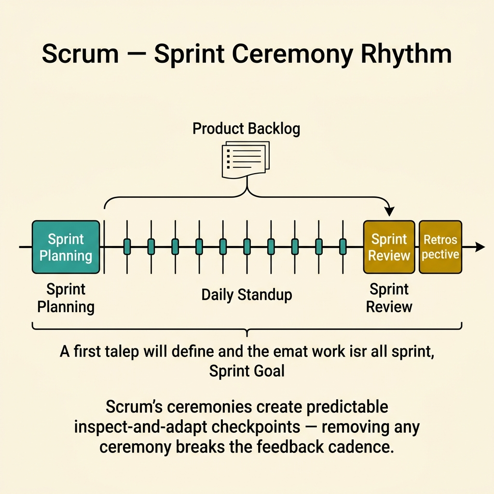
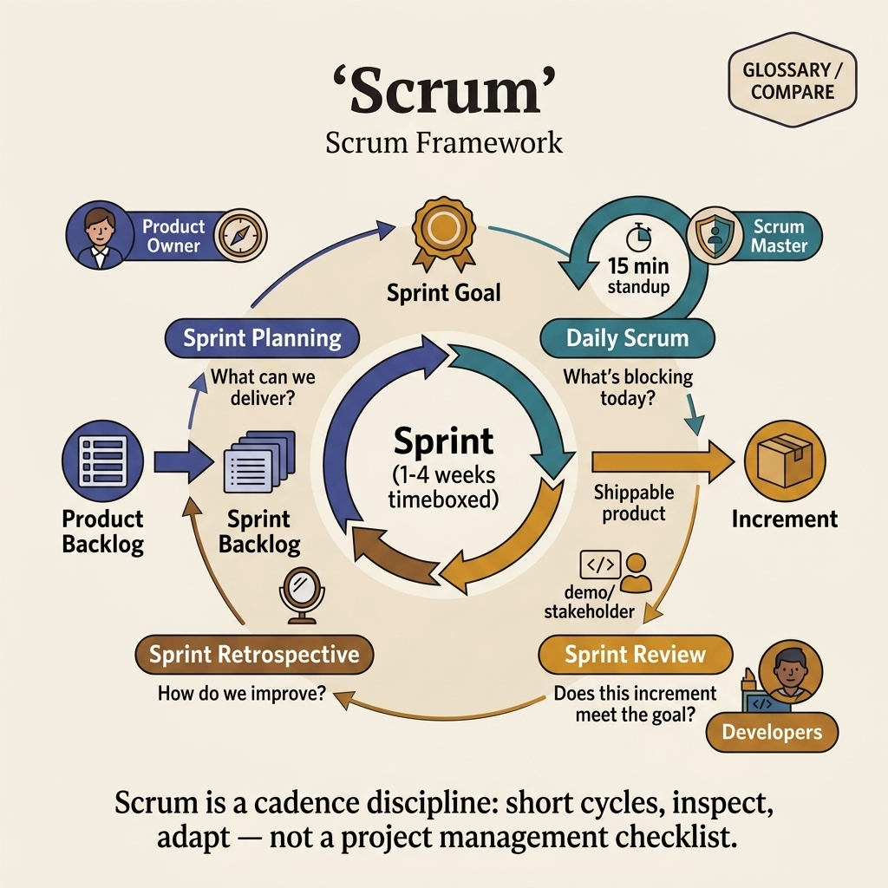

<!-- tags: glossary, reference, process-delivery, scrum -->
# Scrum

> A lightweight Agile framework that organizes work into fixed-length sprints with defined roles, events, and artifacts to deliver value incrementally through inspection and adaptation.

| Aspect | Detail |
| --- | --- |
| **Concept** | A lightweight Agile framework that organizes work into fixed-length sprints with defined roles, events, and artifacts to deliver value incrementally through inspection and adaptation. |
| **Audience** | Developer, Scrum Master, Product Owner, engineering manager |
| **Primary style** | Glossary term |
| **Entry point** | Use when the team needs a structured cadence for iterative delivery with clear roles and ceremonies |

📅 Created: 2026-03-23 · 🔄 Updated: 2026-04-18 · ⏱️ 8 min read

---

## 1. DEFINE

The team agrees that iterative delivery is better than waterfall. But how long is each iteration? Who decides what goes in? How do we measure whether we are improving? These structural questions are where Agile philosophy meets operational practice. That structure is the boundary of **Scrum**.

**Scrum** is a framework that implements Agile principles through fixed-length sprints (1-4 weeks), three roles (Product Owner, Scrum Master, Development Team), five events (Sprint Planning, Daily Standup, Sprint Review, Sprint Retrospective, Sprint itself), and three artifacts (Product Backlog, Sprint Backlog, Increment).

Scrum is not Agile — it is one implementation of Agile. Kanban is another. XP is another. Scrum adds structure where Agile provides principles. The question is whether that structure helps or constrains your team.

| Variant | Description |
| --- | --- |
| Standard Scrum | 2-week sprints, full ceremonies, all three roles. |
| Scrumban | Scrum cadence + Kanban WIP limits for flow optimization. |
| Large-Scale Scrum (LeSS) | Multiple teams working on a single product with shared backlog. |

| Approach | Sprint length | Ceremony overhead | When to choose |
| --- | --- | --- | --- |
| 1-week sprints | 1 week | High (ceremonies are a larger % of the sprint) | When feedback must be extremely rapid. |
| 2-week sprints | 2 weeks | Moderate (most common balance) | Default for most teams. |
| 4-week sprints | 4 weeks | Low per sprint, but feedback is slower | When work items are naturally larger. |

Core insight:

> Scrum works when the team treats sprints as learning cycles: each sprint ends with "what did we learn?" If the retro is skipped or superficial, the team loses the mechanism that makes Scrum better than mini-waterfall.

### 1.1 Invariants & Failure Modes

- A sprint must produce a potentially shippable increment.
- The Product Owner owns the "what"; the team owns the "how."
- Retrospectives must produce at least one actionable improvement per sprint.

Failure mode: the team does 2-week sprints but never deploys, never gets user feedback, and treats retros as a complaint session. The sprint becomes a deadline without a learning loop.

---

## 2. CONTEXT

**Who uses it**: Developer, Scrum Master, Product Owner, engineering manager

**When**: When the team needs a structured cadence for iterative delivery with clear roles and ceremonies.

**Purpose**: Scrum works when the team treats sprints as learning cycles. Each sprint ends with "what did we learn?" and the next sprint begins with "what will we change?"

**In the ecosystem**:
Scrum sits between Agile (philosophy) and CI/CD (engineering pipeline). Agile tells you to iterate. Scrum tells you how to structure the iteration. CI/CD tells you how to ship what each iteration produces.

---

The framework is clear. But when do sprints become ceilings instead of cadences, how do you run effective ceremonies, and when should you leave Scrum for Kanban?

## 3. EXAMPLES

Scrum surfaces most clearly when the team finishes a sprint with nothing deployable, when sprint planning takes half a day and still misses the mark, or when the team uses velocity as a commitment metric instead of a forecasting tool. The examples below place the framework into exactly those situations.

### Example 1: Basic — Define what a done sprint looks like

> **Goal**: Establish a clear Definition of Done that prevents "80% complete" stories from carrying over.
> **Approach**: Make the DoD explicit, visible, and enforced before sprint review.
> **Example**: A lending feature team that routinely carries 40% of stories to the next sprint.
> **Complexity**: Basic — the foundational Scrum discipline.

```yaml
definition_of_done:
  code:
    - "PR merged to main"
    - "all tests pass (unit + integration)"
    - "no critical lint warnings"
  review:
    - "code reviewed by at least 1 peer"
    - "product owner has seen a demo"
  deploy:
    - "deployed to staging"
    - "smoke test passed in staging"
  documentation:
    - "API docs updated if endpoint changed"
    - "release notes entry added"
  enforcement: "story not counted toward velocity unless all DoD items checked"
```



*Figure: A 2-week sprint rhythm: Planning → Daily Standups → Review → Retrospective. Product Backlog feeds the sprint; Sprint Goal keeps focus. Removing any ceremony breaks the inspect-and-adapt cadence.*

**Why?** Without a DoD, "done" means "code compiles." Stories are marked complete but carry hidden work into the next sprint. The DoD makes completeness binary and visible.

**Takeaway**: A sprint that produces untested, undeployed, undocumented code has not delivered an increment. The DoD prevents this.

### Example 2: Intermediate — Run sprint planning that produces realistic commitments

> **Goal**: Size the sprint backlog to match the team's actual capacity.
> **Approach**: Use historical velocity and story point estimation with buffer.
> **Example**: Team historically completes 20 story points per sprint but commits to 30.
> **Complexity**: Intermediate — calibrating commitment to reality.

```yaml
sprint_planning:
  historical_velocity:
    last_3_sprints: [18, 22, 20]
    average: 20
    std_dev: 2
  capacity_check:
    team_size: 5
    out_of_office: 1  # one dev on leave
    adjusted_capacity: "80% of normal → target 16 points"
  commitment:
    selected_stories: 16  # points
    buffer: "2 points of stretch goals (clearly labeled)"
  guardrails:
    - "never commit more than average velocity"
    - "adjust for team size and holidays"
    - "stretch goals are optional and clearly separated"
```

**Why?** Over-commitment creates a sprint that fails by design. Under-commitment wastes capacity. Velocity is a forecasting tool, not a performance target. Planning must use it honestly.

**Takeaway**: Sprint planning succeeds when the commitment matches historical velocity adjusted for current capacity.

### Example 3: Advanced — Use retrospectives to compound team improvement

> **Goal**: Turn retrospectives from complaint sessions into measurable improvement cycles.
> **Approach**: Each retro produces one experiment; next retro measures the result.
> **Example**: Team retro identifies that context-switching between 3 projects kills velocity.
> **Complexity**: Advanced — making the process-improvement loop continuous.

```yaml
retro_experiment:
  observation: "team velocity dropped 30% when assigned to 3 projects simultaneously"
  hypothesis: "reducing to 2 projects will recover 20% of velocity"
  experiment:
    change: "team works on max 2 projects per sprint"
    duration: "2 sprints"
    metric: "story points completed per sprint"
  result:
    sprint_1: "velocity: 24 (up from 14)"
    sprint_2: "velocity: 22"
    conclusion: "hypothesis confirmed — context switching was the primary drag"
  next_retro:
    action: "make 2-project limit a permanent team policy"
    new_experiment: "try pair programming on complex stories — measure review cycle time"
```

**Why?** A retro that produces "we need to communicate better" changes nothing. A retro that produces a measurable experiment with a defined metric and a review date creates compounding improvement.

**Takeaway**: Advanced Scrum treats retrospectives as the team's R&D process — hypothesize, experiment, measure, decide.

---

## 4. COMPARE



*Figure: Scrum positioned among Kanban, XP, and waterfall approaches.*

Scrum sounds like "Agile with sprints." Close, but Scrum adds specific roles, events, and artifacts that Agile does not prescribe. The structure helps teams that need guardrails; it constrains teams that need flexibility.

### Level 1

```text
Sprint: [ Plan → Build → Review → Retro ] → Ship → Repeat
```
*Figure: Level 1 — Scrum is a repeating 2-week cycle of plan, build, review, and adapt.*

### Level 2

```text
Component       Scrum              Kanban              XP
──────────────  ──────────────     ──────────────      ──────────────
Cadence         Fixed sprints      Continuous flow     Short iterations
Roles           PO, SM, Team       No prescribed       Coach, Team
Planning        Sprint planning    Continuous backlog  Iteration planning
Key metric      Velocity           Lead time           Test coverage
Best for        Regular cadence    Variable workload   Code quality focus
```
*Figure: Level 2 — each framework trades structure for flexibility in a different dimension.*

### Easily confused or boundary-slipping

| # | Severity | Mistake | Consequence | Fix |
| --- | --- | --- | --- | --- |
| 1 | 🔴 Fatal | Using velocity as a performance metric | Team inflates points to look productive | Velocity is for forecasting; capacity is for management. |
| 2 | 🟡 Common | Skipping retrospectives | Team never improves the process | Retro is the only Scrum event that improves Scrum itself. |
| 3 | 🟡 Common | Sprint scope changes mid-sprint | Team cannot plan reliably; morale drops | Protect sprint scope; defer new work to next sprint. |
| 4 | 🔵 Minor | Treating standup as a status report to management | Developers disengage; valuable signals lost | Standup is for the team, not for management oversight. |

### Quick scan

| If you face | Action |
| --- | --- |
| Sprint never finishes on time | Reduce commitment to match historical velocity |
| Retros produce no change | Require one measurable experiment per retro |
| Team feels constrained by sprints | Evaluate Kanban as an alternative |

---

## 5. REF

| Resource | Type | Link | Note |
| --- | --- | --- | --- |
| The Scrum Guide | Official | https://scrumguides.org/ | The definitive reference for Scrum. |
| Agile Manifesto | Official | https://agilemanifesto.org/ | The philosophy underlying Scrum. |
| Scrum.org | Reference | https://www.scrum.org/ | Community, certifications, and learning paths. |

---

## 6. RECOMMEND

Scrum answers "how do we structure iterative delivery with clear roles and ceremonies?" The next question: what is the engineering pipeline that makes shipping every sprint possible?

| Expand to | When | Reason | File/Link |
| --- | --- | --- | --- |
| Topic hub | When Scrum needs broader process context | Return to the overview | [Process & Delivery](./README.md) |
| Previous concept | When the question is philosophy, not framework | Agile provides the values; Scrum implements them | [Agile](./Agile.md) |
| Next concept | When the build/test/deploy pipeline needs automation | CI/CD enables the frequent shipping Scrum demands | [CI/CD](./CICD.md) |

Back to the team that agrees on iteration but disagrees on structure — who decides what, how long is a cycle, how do we improve? Now you know: Scrum gives you the cadence (sprint), the roles (PO, SM, Team), and the improvement mechanism (retro). Use it when structure helps; drop it when it constrains.

**Links**: [← Previous](./Agile.md) · [→ Next](./CICD.md)
