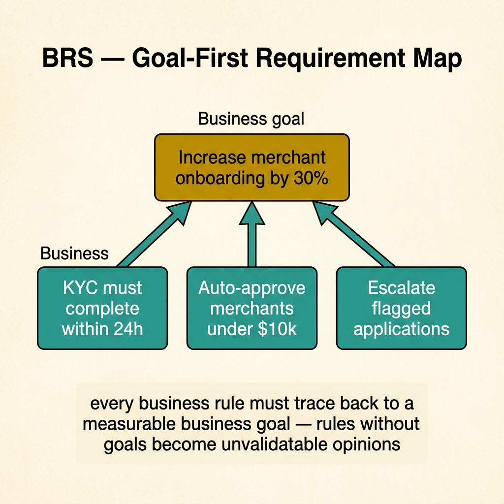
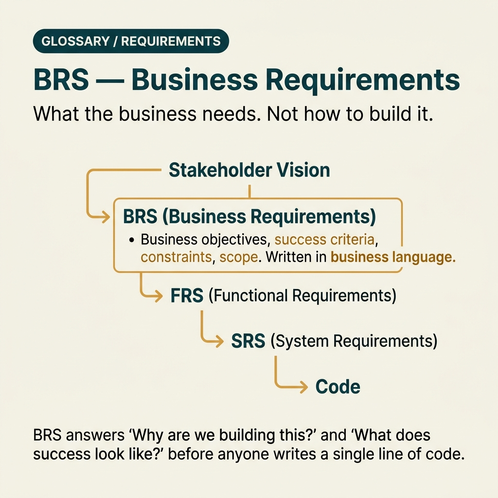

<!-- tags: glossary, reference, requirements-product, brs -->
# BRS — Business Requirements Specification

> A document describing business objectives, expected benefits, and business-level scope that a project must achieve before diving into system specifications.

| Aspect | Detail |
| --- | --- |
| **Concept** | A document describing business objectives, expected benefits, and business-level scope that a project must achieve before diving into system specifications. |
| **Audience** | Product owner, BA, PM, stakeholder, tech lead who needs to lock the right requirements layer |
| **Primary style** | Glossary term |
| **Entry point** | Use when you need to distinguish business objectives from system specifications and delivery backlogs. |

📅 Created: 2026-03-20 · 🔄 Updated: 2026-04-17 · ⏱️ 15 min read

---

## 1. DEFINE

A project is about to kick off. The whole room is already discussing databases, APIs, and deploy timelines, but nobody has answered the most basic questions: which business metric does this project exist to improve, for which stakeholder, and what signal marks success? At that point, the team is not short on technical design — the team is short on a **BRS**.

**BRS (Business Requirements Specification)** is a document describing business objectives, expected benefits, and business-level scope that the project must achieve. It answers the question: **"Why must we build this, and what does the business expect to change after delivery?"**

BRS differs from SRS, FRS, and PRD in that it stands at the business outcome layer. It does not decide API shapes or specific validation rules; it locks business goals, stakeholder expectations, and success criteria first.

| Variant | Description |
| --- | --- |
| Strategic BRS | Used for large initiatives, transformation programs, or portfolio-level roadmaps. |
| Project BRS | Used for a specific project or delivery stream with a clear sponsor. |
| Feature-level Business Brief | A lighter version of BRS for a significant capability that still needs clear business rationale. |

| Approach | Time | Space | When to choose |
| --- | --- | --- | --- |
| Goal-first mapping | O(1) | O(1) | When you need to lock the business objective first, then trace backward to requirements. |
| KPI traceability | Per objective count | O(1) | When stakeholders require success measured by specific indicators. |
| Scope boundary statement | O(1) | O(1) | When the project easily drifts from a business problem into a technical wishlist. |

Core insight:

> BRS has value when it turns "we should build this" into a reviewable business contract: what objective, for whom, measured by what, and what is out of scope. If those four things are not locked, every downstream specification will be pulled off course.

### 1.1 Invariants & Failure Modes

A good BRS holds three invariants:
- every business requirement must trace to a specific business objective;
- every objective must be measurable by a KPI or clear business signal;
- every scope statement must help the team know what is **not** being done, not just what will be done.

The most common failure mode is calling every system-level requirement a "business requirement." When that happens, the BRS balloons into a hybrid SRS, stakeholders approve something they cannot actually read closely, and developers then lack a trustworthy business anchor.

---

## 2. CONTEXT

**Who uses it**: Product owner, BA, PM, stakeholder, tech lead who needs to lock the right requirements layer

**When**: Use when you need to distinguish business objectives from system specifications and delivery backlogs.

**Purpose**: BRS turns "we should build this" into a reviewable business contract: what objective, for whom, measured by what, and what is out of scope. Without those four things locked, every downstream specification will be pulled off course.

**In the ecosystem**:
BRS should only contain:
- business objectives;
- related stakeholders and user groups;
- scope/out-of-scope at the business level;
- success metrics, assumptions, constraints, and risks.

BRS should not contain:
- detailed UI screens;
- API endpoints;
- database schemas;
- framework, cloud vendor, or detailed implementation plans.

---

Business requirements are clear. But how does BRS differ from PRD, who writes BRS, and how detailed should BRS be?

## 3. EXAMPLES

BRS surfaces most clearly when a stakeholder says "I want a sales system" without any spec, when dev finishes building but business says critical features are missing, or when BRS is written too technically for the business audience to read. The examples below place the pattern into exactly those situations.

### Example 1: Basic — Write a business objective that is not vague

```text
  Business objective brief:

  ┌─ Initiative ───────────────────────────────┐
  │  FoodApp Ordering Platform                  │
  │  Sponsor: VP Growth                         │
  └─────────────────────────────────────────────┘

  ┌─ Business problem ─────────────────────────┐
  │  Online revenue currently represents only   │
  │  8% of total revenue.                       │
  │  Ordering via hotline does not scale and    │
  │  cannot measure conversion.                 │
  └─────────────────────────────────────────────┘

  ┌─ Business objective ───────────────────────┐
  │  Increase online revenue share from 8%      │
  │  to 20% within 2 quarters.                  │
  └─────────────────────────────────────────────┘

  ┌─ Success metrics ──────────────────────────┐
  │  • Online GMV >= 2.5B VND / month           │
  │  • Order conversion rate >= 75%             │
  └─────────────────────────────────────────────┘

  ┌─ Out of scope ─────────────────────────────┐
  │  • No inter-province logistics in Phase 1   │
  └─────────────────────────────────────────────┘
```

*Figure: This artifact forces the team to speak in business outcomes instead of solutions. When the objective and metrics are clear, debates like "should we add feature X?" return to the right question: does it move this objective forward or not?*

```yaml
document: BRS
initiative: "FoodApp Ordering Platform"
sponsor: "VP Growth"
business_problem: >
  Online revenue currently represents only 8% of total revenue.
  Ordering via hotline does not scale and cannot measure conversion.
business_objective:
  - "Increase online revenue share from 8% to 20% within 2 quarters"
success_metrics:
  - "Online GMV >= 2.5B VND / month"
  - "Order conversion rate >= 75%"
out_of_scope:
  - "No inter-province logistics optimization in Phase 1"
```



*Figure: Every business rule must trace back to a measurable business goal. Rules without goals become unvalidatable opinions — the team argues features instead of measuring outcomes.*

**Why?** This artifact forces the team to speak in business outcomes instead of solutions. When the objective and metric are clear, debates like "should we add feature X?" return to the right question: does it move this objective forward?

**Conclusion**: A basic BRS does not need to be long; it needs to be clear enough so everyone knows which metric the project exists for.

### Example 2: Intermediate — Trace business requirements down the requirements chain

```text
  Traceability from BRS to downstream:

  ┌─ BR-001 ───────────────────────────────────┐
  │  Objective: Increase online revenue share   │
  │  Requirement: Customer must be able to      │
  │    complete ordering and payment online      │
  │  Owner: Product Manager                     │
  │                                             │
  │  Downstream:                                │
  │    → FRS: checkout flow                     │
  │    → NFRS: payment latency & availability   │
  └─────────────────────────────────────────────┘

  ┌─ BR-002 ───────────────────────────────────┐
  │  Objective: Reduce order confirmation time  │
  │  Requirement: Restaurant must receive new   │
  │    order notification within 30 seconds     │
  │  Owner: BA                                  │
  │                                             │
  │  Downstream:                                │
  │    → FRS: notification dispatch             │
  │    → SRS: integration contracts             │
  └─────────────────────────────────────────────┘

  Without traceability from BRS downward, the
  team easily ships many "reasonable" requirements
  that do not actually serve the committed KPIs.
```

*Figure: Without tracing from BRS to the rest of the chain, the team easily ships many "reasonable" requirements that do not serve committed KPIs. Traceability keeps backlog and design anchored to the original business outcomes.*

```yaml
traceability:
  - br_id: "BR-001"
    objective: "Increase online revenue share"
    business_requirement: "Customer must be able to complete ordering and payment online"
    downstream_docs:
      - "FRS: checkout flow"
      - "NFRS: payment latency and availability"
    owner: "Product Manager"
  - br_id: "BR-002"
    objective: "Reduce order confirmation time"
    business_requirement: "Restaurant must receive new order notification within 30 seconds"
    downstream_docs:
      - "FRS: notification dispatch"
      - "SRS: integration contracts"
    owner: "BA"
```

**Why?** Without tracing from BRS down the chain, the team easily ships many "reasonable" requirements that do not serve committed KPIs. Traceability keeps backlog and design anchored to the original business outcomes.

**Conclusion**: An intermediate BRS does not just state objectives; it keeps those objectives alive throughout the entire requirements lifecycle.

### Example 3: Advanced — Use BRS to block scope creep before it becomes roadmap debt

```text
  BRS governance rules:

  ┌─ Change gate ──────────────────────────────┐
  │  • If new request cannot trace to an        │
  │    existing objective → start a separate    │
  │    initiative or re-approve the BRS.        │
  │                                             │
  │  • If KPIs change → update sponsor          │
  │    sign-off before modifying downstream.    │
  └─────────────────────────────────────────────┘

  ┌─ Assumptions ──────────────────────────────┐
  │  • Phase 1 serves Ho Chi Minh City only     │
  │  • Team has 5 developers and 1 QA           │
  └─────────────────────────────────────────────┘

  ┌─ Risk register ────────────────────────────┐
  │  Risk: Competitor discount war              │
  │  Mitigation: Focus healthy-food niche       │
  │                                             │
  │  Risk: Payment provider approval delay      │
  │  Mitigation: Fallback COD in MVP            │
  └─────────────────────────────────────────────┘

  Scope creep usually does not start at the
  sprint board. It starts from a BRS that is
  not sharp enough to reject requests outside
  the business objective.
```

*Figure: Scope creep usually does not start at the sprint board. It starts from a BRS that is not sharp enough to reject requests outside the business objective. A BRS with clear change gates lets the team say "not now" with data, not gut feelings.*

```yaml
governance_rule:
  document: BRS
  change_gate:
    - "If new request cannot trace to existing objective -> separate initiative or re-approve BRS"
    - "If KPIs change -> update sponsor sign-off before modifying downstream docs"
  assumptions:
    - "Phase 1 serves Ho Chi Minh City only"
    - "Team has 5 developers and 1 QA"
  risk_register:
    - risk: "Competitor discount war"
      mitigation: "Focus healthy-food niche"
    - risk: "Payment provider approval delay"
      mitigation: "Fallback COD in MVP"
```

**Why?** Scope creep usually does not start at the sprint board; it starts from a BRS that is not sharp enough to reject requests outside the business objective. A BRS with clear change gates lets the team say "not now" with data, not gut feelings.

**Conclusion**: At the advanced level, BRS is a boundary document that protects the roadmap from drift caused by stakeholder pressure.

---

## 4. COMPARE




*Figure: Position of BRS among PRD, SRS, and stakeholder communication.*

BRS sounds like PRD. The difference: BRS captures business needs ("why" and "what" from a business perspective), PRD defines the product solution ("build what" from a product perspective). BRS = problem space, PRD = solution space.

### Level 1

```text
Business problem -> Business objective -> Success metric -> Scope boundary -> Hand-off to FRS/SRS
```

*Figure: Level 1 shows BRS at the head of the requirements chain, where the team locks "why" and "how to measure" before discussing "what to build."*

### Level 2

```text
If the document focuses on...             It is most likely...
---------------------------------------   ------------------------------------------
Revenue, growth, compliance, sponsor       BRS
Feature behavior, user flow                FRS / PRD
Latency, security, uptime                  NFRS
API, DB, component detail                  SRS / design docs

Good BRS = clear objective + clear KPI + clear scope + clear sponsor.
```

*Figure: Level 2 helps distinguish BRS from adjacent documents in the same requirements chain, preventing business language from mixing with system specification.*

### Easily confused or boundary-slipping

| # | Severity | Mistake | Consequence | Fix |
| --- | --- | --- | --- | --- |
| 1 | 🔴 Fatal | Mixing BRS with solution/design detail | Stakeholder approves a document they cannot actually read closely | Keep BRS at the business objective, scope, and KPI layer. |
| 2 | 🟡 Common | Objectives are not measurable | Team does not know when the initiative truly succeeds | Every objective must have a metric and target. |
| 3 | 🟡 Common | No out-of-scope section | Scope creep happens naturally sprint by sprint | Explicitly state what is not being done in the current phase. |
| 4 | 🔵 Minor | BRS written once then forgotten | Backlog and design gradually lose their business anchor | Review BRS when KPIs, sponsors, or assumptions change. |

### Quick scan

| If you face | Action |
| --- | --- |
| Nobody has clearly answered "why must we build this?" | Write or open the BRS before discussing design. |
| Document is full of KPIs, sponsors, objectives | It is most likely a BRS, not an SRS. |
| Scope is starting to drift during delivery | Go back to BRS to check whether new requests trace to an objective. |

---

## 5. REF

| Resource | Type | Link | Note |
| --- | --- | --- | --- |
| IIBA BABOK Guide | Official | https://www.iiba.org/business-analysis-body-of-knowledge/ | Strong foundation for business analysis and requirement framing. |
| IEEE 29148 | Standard | https://www.iso.org/standard/72089.html | Good reference for software requirement documentation. |
| Atlassian BRD Template | Reference | https://www.atlassian.com/work-management/project-management/business-requirements-document | Practical template for business requirement docs. |

---

## 6. RECOMMEND

BRS solves "business needs are not documented clearly." Next questions: how does PRD define the solution, and how detailed is FRS?

| Expand to | When | Reason | File/Link |
| --- | --- | --- | --- |
| Functional view | When business goal is locked and you need to describe what the system must do | Move from "why" to "what." | [FRS](./FRS.md) |
| Product-led view | When the initiative is led by PM and user problems | Compare BRS with the product discovery mindset. | [PRD](./PRD.md) |
| Topic hub | When you need to see the full requirements taxonomy | Keep the learning path among BRS, FRS, NFRS, SRS, PRD. | [Requirements & Product](./README.md) |

Back to the "I want a sales system" at the start — no spec, dev guesses. Now you know: BRS captures why (business justification), what (functional scope), constraints (budget, timeline, compliance). Business writes, tech reviews.

**Links**: [← Previous](./README.md) · [→ Next](./FRS.md)
