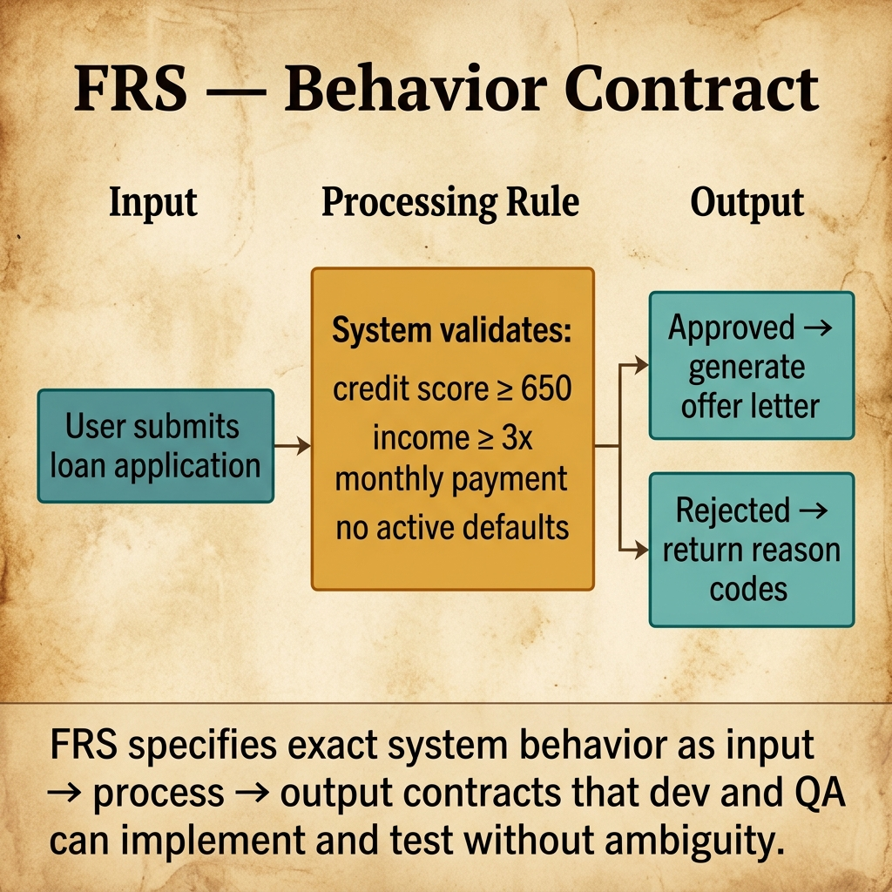
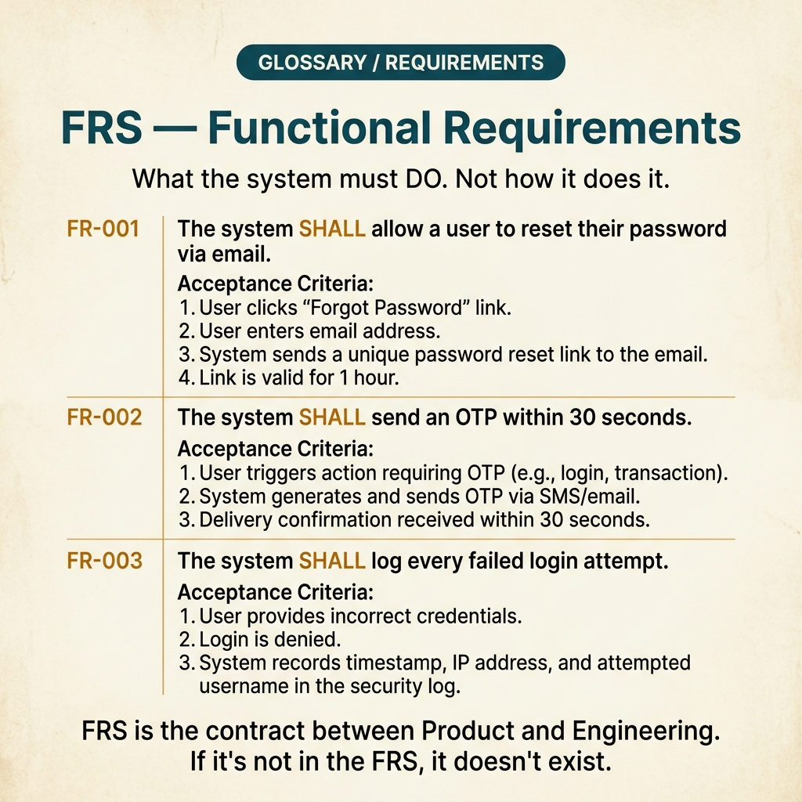

<!-- tags: glossary, reference, requirements-product, frs -->
# FRS — Functional Requirements Specification

> A document describing the functions a system must perform, detailed enough for dev, QA, and analysts to share the same understanding of behavior.

| Aspect | Detail |
| --- | --- |
| **Concept** | A document describing the functions a system must perform, detailed enough for dev, QA, and analysts to share the same understanding of behavior. |
| **Audience** | BA, system analyst, developer, QA, tech lead |
| **Primary style** | Glossary term |
| **Entry point** | Use when you need to clearly state what the system must do per flow, input, output, and business rule. |

📅 Created: 2026-03-20 · 🔄 Updated: 2026-04-17 · ⏱️ 15 min read

---

## 1. DEFINE

Stakeholders have agreed on the business objective. Now the team starts asking: what will the user input, how will the system process it, which error cases must return what, and which acceptance criteria can QA test? If BRS answers "why build it," then **FRS** begins to answer **"what must the system do."**

**FRS (Functional Requirements Specification)** is a document specifying in detail the functions and behaviors of the system regarding specific inputs, processes, outputs, and business rules. FRS stands between business intent and implementation.

FRS differs from NFRS in that FRS describes **behavior**, while NFRS describes the **quality bar** of that behavior. FRS is also narrower than SRS: it focuses on functions, without yet covering the full system interface and constraint context.

| Variant | Description |
| --- | --- |
| Use-case driven FRS | Organizes requirements around actors and end-to-end use case flows. |
| Module-based FRS | Organizes requirements by module or bounded capability like Auth, Checkout, Notification. |
| Story-backed FRS | Used in agile/product teams, connecting user stories with more formal requirements for QA/dev to implement. |

| Approach | Time | Space | When to choose |
| --- | --- | --- | --- |
| Input-process-output template | O(1) | O(1) | When requirements need to be readable and easily convertible to test cases. |
| Acceptance-criteria first | Per flow count | O(1) | When QA and product need to see the same behavior contract. |
| Error-path explicit modeling | Per edge case count | O(1) | When flows have validation, permissions, or external dependencies likely to fail. |

Core insight:

> FRS is strong when it is specific enough that dev and QA do not have to guess behavior, but has not yet fallen into implementation detail. If the document starts talking about controllers, databases, or framework APIs, it has slipped out of FRS territory.

### 1.1 Invariants & Failure Modes

A good FRS holds three invariants:
- every functional requirement has a clear ID and scope;
- every requirement describes at least the happy path and main error cases;
- every requirement is specific enough to write a test case without asking the document author again.

The most common failure mode is an FRS that looks "complete" but only describes the happy path. At implementation or test time, all the important behavior lives in guesswork: invalid input, retry, fallback, duplicate action, permission denial.

---

## 2. CONTEXT

**Who uses it**: BA, system analyst, developer, QA, tech lead

**When**: Use when you need to clearly state what the system must do per flow, input, output, and business rule.

**Purpose**: FRS is strong when specific enough that dev and QA do not guess behavior, but has not yet fallen to implementation detail. If it mentions controllers, databases, or framework APIs, it has slipped out of FRS.

**In the ecosystem**:
FRS should describe:
- which actor triggers the flow;
- which inputs the system accepts;
- the main process/business rules;
- successful output and error outputs;
- validation rules and acceptance criteria.

FRS should not describe:
- p95 latency, uptime, or encryption standards at the system level;
- framework, ORM, message broker, or specific schema implementation;
- roadmap strategy or high-level business KPIs.

---

Detailed functional requirements are clear. But how does FRS differ from SRS, how are acceptance criteria attached, and who reads a long FRS?

## 3. EXAMPLES

FRS surfaces most clearly when dev asks "what happens when this button is clicked" and nobody can answer, when a 200-page FRS exists but nobody reads it, or when FRS and code drift after 3 sprints. The examples below place the pattern into exactly those situations.

### Example 1: Basic — Write a functional requirement that can be tested

```text
  Functional requirement block:

  ┌─ FR-001: User Registration ────────────────┐
  │  Actor: Guest user                          │
  │                                             │
  │  Input:                                     │
  │    • email                                  │
  │    • password                               │
  │    • phone                                  │
  │                                             │
  │  Process:                                   │
  │    1. validate email format                 │
  │    2. check duplicated email                │
  │    3. hash password                         │
  │    4. persist user record                   │
  │                                             │
  │  Output:                                    │
  │    Success: 201 Created + user_id           │
  │    Error:                                   │
  │      • 400 Invalid input                    │
  │      • 409 Email already exists             │
  │                                             │
  │  Four parts — actor, input, process,        │
  │  output — are the minimum for dev and QA    │
  │  to understand the same thing.              │
  └─────────────────────────────────────────────┘
```

*Figure: A requirement only becomes useful to the delivery team when it moves from slogan to behavior contract. Actor, input, process, and output are the minimum for dev and QA to understand the same thing.*

```yaml
requirement:
  id: "FR-001"
  name: "User Registration"
  actor: "Guest user"
  input:
    - "email"
    - "password"
    - "phone"
  process:
    - "validate email format"
    - "check duplicated email"
    - "hash password"
    - "persist user record"
  output:
    success: "201 Created + user_id"
    error:
      - "400 Invalid input"
      - "409 Email already exists"
```



*Figure: FRS specifies exact system behavior as input → process → output contracts. Dev implements the processing rule; QA verifies the output. No ambiguity remains.*

**Why?** A requirement only becomes useful to the delivery team when it moves from slogan to behavior contract. Actor, input, process, and output are the minimum for dev and QA to understand the same thing.

**Conclusion**: A basic FRS does not need to be long; it needs to be specific enough to reduce behavior guesswork.

### Example 2: Intermediate — Describe error paths and validation instead of just the happy path

```text
  Error path and validation:

  ┌─ FR-002: Verify OTP ───────────────────────┐
  │  Actor: Registered but unverified user       │
  │                                             │
  │  Acceptance criteria:                       │
  │    ✅ OTP is 6 digits                       │
  │    ✅ OTP expires after 90 seconds          │
  │    ✅ Max 5 resends per day per phone       │
  │                                             │
  │  Error cases:                               │
  │    OTP expired                              │
  │      → 400 + message=OTP expired            │
  │                                             │
  │    Too many resend attempts                 │
  │      → 429 + cooldown information           │
  │                                             │
  │    Wrong OTP                                │
  │      → 400 + remaining_attempts             │
  │                                             │
  │  Most functional bugs do not come from the  │
  │  happy path. They come from where the       │
  │  documentation left error cases blank.      │
  └─────────────────────────────────────────────┘
```

*Figure: Most functional bugs do not come from the happy path. They come from where the documentation left error paths blank. When error cases are written directly in the FRS, dev and QA no longer invent behavior independently.*

```yaml
requirement:
  id: "FR-002"
  name: "Verify OTP"
  actor: "Registered but unverified user"
  acceptance_criteria:
    - "OTP is 6 digits"
    - "OTP expires after 90 seconds"
    - "Max 5 resends per day per phone number"
  error_cases:
    - condition: "OTP expired"
      response: "400 + message=OTP expired"
    - condition: "Too many resend attempts"
      response: "429 + cooldown information"
    - condition: "Wrong OTP"
      response: "400 + remaining_attempts"
```

**Why?** Most functional bugs do not come from the happy path — they come from where the documentation left error paths blank. When error cases are written directly in the FRS, dev and QA no longer invent behavior independently.

**Conclusion**: An intermediate FRS should read like a behavior contract, not a feature wishlist.

### Example 3: Advanced — Connect functional requirements with downstream design and test

```text
  FRS traceability:

  ┌─ FR-010: Create Order ─────────────────────┐
  │                                             │
  │  Traces to:                                 │
  │    Business requirement: BR-002             │
  │    Product goal: Reduce ordering time       │
  │                                             │
  │  Downstream:                                │
  │    Design component: Checkout Module        │
  │    Interfaces:                              │
  │      • Payment API                          │
  │      • Restaurant Notification Service      │
  │    Test cases:                              │
  │      • TC-010 happy path                    │
  │      • TC-011 invalid payment               │
  │      • TC-012 restaurant unavailable        │
  │                                             │
  │  FRS typically dies mid-analysis when it    │
  │  only serves the analysis phase. Trace-     │
  │  ability keeps requirements alive through   │
  │  design, code, and test.                    │
  └─────────────────────────────────────────────┘
```

*Figure: FRS typically dies mid-analysis when it only serves that phase. Traceability turns requirements into a thread running through design, code, and test, instead of a dead document after sprints begin.*

```yaml
traceability:
  requirement_id: "FR-010"
  feature: "Create Order"
  traces_to:
    business_requirement: "BR-002"
    product_goal: "Reduce ordering completion time"
  downstream:
    design_component: "Checkout Module"
    interfaces:
      - "Payment API"
      - "Restaurant Notification Service"
    test_cases:
      - "TC-010 happy path"
      - "TC-011 invalid payment"
      - "TC-012 restaurant unavailable"
```

**Why?** FRS typically dies mid-analysis when it only serves that phase. Traceability turns requirements into a thread running through design, code, and test, instead of a dead document after sprints begin.

**Conclusion**: At the advanced level, FRS does not just describe functions; it helps the entire delivery chain follow the same behavior contract.

---

## 4. COMPARE




*Figure: Position of FRS among SRS, BRS, and user story.*

FRS sounds like SRS. Close, but FRS focuses on functional behavior ("what the system must do"), while SRS includes functional + non-functional + constraints. FRS is a subset of SRS.

### Level 1

```text
Actor action -> Input validation -> Business process -> Success/Failure output
```

*Figure: Level 1 shows FRS describing system behavior by flow, not by business KPIs and not by implementation detail.*

### Level 2

```text
If the document focuses on...            It is most likely...
--------------------------------------   ------------------------------------------
Objective, KPI, sponsor                  BRS / PRD
Behavior, input, output, validation      FRS
Latency, security, uptime                NFRS
Protocol, interface, full system spec    SRS

Good FRS = clear actor + clear flow + clear rules + clear error paths.
```

*Figure: Level 2 helps distinguish FRS from adjacent documents so the team knows when to write a functional flow and when to switch to a different document.*

### Easily confused or boundary-slipping

| # | Severity | Mistake | Consequence | Fix |
| --- | --- | --- | --- | --- |
| 1 | 🔴 Fatal | Only writing the happy path | Dev and QA patch errors independently in different ways | Always add error cases and validation rules. |
| 2 | 🟡 Common | Requirements without clear actor/input/output | Behavior is understood vaguely, test cases are hard to write | Use input-process-output template as minimum. |
| 3 | 🟡 Common | Mixing NFR into FRS | Document loses layer clarity, ownership gets muddy | Separate performance/security/availability into NFRS. |
| 4 | 🔵 Minor | Not tracing requirements to feature or BR | Flow exists but nobody knows why it is needed | Add traceability ID and downstream mapping. |

### Quick scan

| If you face | Action |
| --- | --- |
| Feature statement exists but cannot be implemented/tested | Rewrite as FRS with actor, input, process, output. |
| Flow only has the happy path | Add error cases before handing off to dev/QA. |
| Team confuses FRS with NFRS or SRS | Go back to DEFINE and Level 2 visual for layer clarity. |

---

## 5. REF

| Resource | Type | Link | Note |
| --- | --- | --- | --- |
| IEEE 29148 | Standard | https://www.iso.org/standard/72089.html | General framework for software requirements. |
| Writing Effective Use Cases | Book/Reference | https://alistair.cockburn.us/writing-effective-use-cases/ | Useful when writing flows by actor/use case. |
| User Story Mapping | Reference | https://www.jpattonassociates.com/user-story-mapping/ | Product perspective for connecting feature flows to requirement detail. |

---

## 6. RECOMMEND

FRS solves "dev does not know how the system must behave." Next questions: how does full SRS look, and what are quality requirements like?

| Expand to | When | Reason | File/Link |
| --- | --- | --- | --- |
| Business layer | When you need to return to "why build it" before locking behavior | Anchor functional flow to business objectives. | [BRS](./BRS.md) |
| Quality constraints | When behavior is clear but you need to lock "how well" | Separate functional from non-functional cleanly. | [NFRS](./NFRS.md) |
| Full system spec | When you need to combine functional, non-functional, and interface into one standard | Move from function spec to full software spec. | [SRS](./SRS.md) |

Back to the "what happens when I click?" at the start — nobody answers. Now you know: FRS = input → process → output for each function. Acceptance criteria testable. Not ambiguous, not "the system should," only "the system must."

**Links**: [← Previous](./BRS.md) · [→ Next](./NFRS.md)
