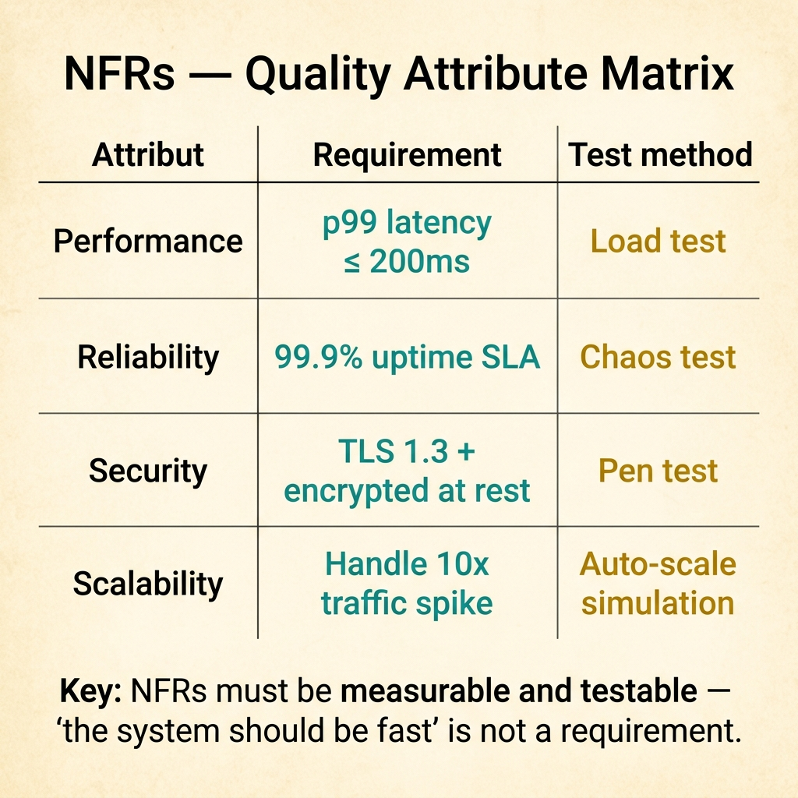
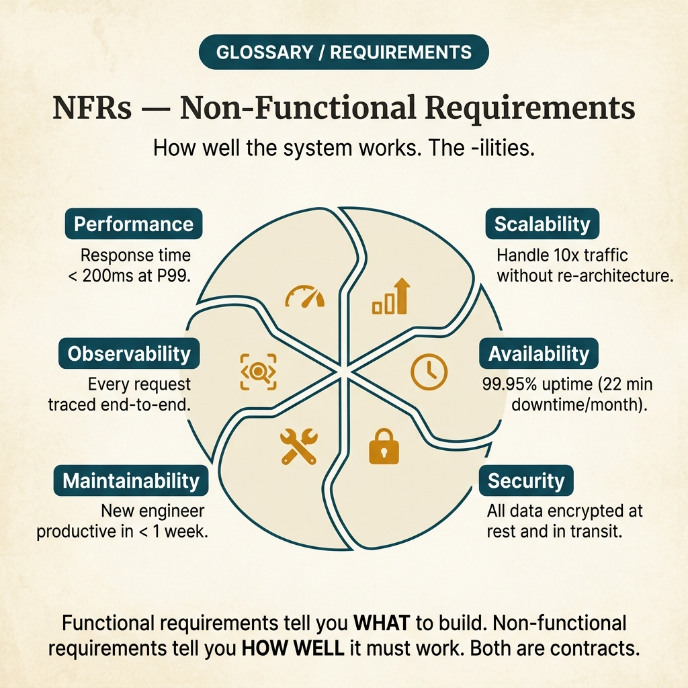

<!-- tags: glossary, reference, requirements-product, nfrs -->
# NFRS — Non-Functional Requirements Specification

> A document specifying the quality constraints of a system: how fast it must be, how secure, how fault-tolerant, and how operable.

| Aspect | Detail |
| --- | --- |
| **Concept** | A document specifying the quality constraints of a system: how fast it must be, how secure, how fault-tolerant, and how operable. |
| **Audience** | Architect, tech lead, QA, SRE, security reviewer, developer |
| **Primary style** | Glossary term |
| **Entry point** | Use when you need to lock the quality bar of the system instead of just describing feature behavior. |

📅 Created: 2026-03-20 · 🔄 Updated: 2026-04-17 · ⏱️ 15 min read

---

## 1. DEFINE

The feature is built. The flow is clear. But the hardest questions remain: how fast is fast enough, what uptime can the business tolerate, which security level is mandatory, and what maintainability bar must hold so the team does not burn out after 6 months? That space is **NFRS**.

**NFRS (Non-Functional Requirements Specification)** is a document specifying the quality constraints the system must meet: performance, security, availability, scalability, maintainability, reliability, and other quality attributes.

FRS answers "what the system does," while NFRS answers "**how well** the system must do it." NFRS is not a pretty appendix; it is what determines architecture, operational cost, and risk profile of the entire system.

| Variant | Description |
| --- | --- |
| Performance NFR | Specifies latency, throughput, concurrency, batch time, and cost under load. |
| Reliability / Availability NFR | Specifies uptime, MTTR, failover, recovery objectives, and fault tolerance. |
| Security / Compliance NFR | Specifies auth, encryption, auditability, retention, and compliance boundaries. |

| Approach | Time | Space | When to choose |
| --- | --- | --- | --- |
| Metric-first specification | O(1) | O(1) | When quality requirements need to be measured and verified against clear thresholds. |
| SLO-backed NFR | Per service count | O(1) | When the system has a production runtime and needs to link requirements with ops contracts. |
| Risk-based prioritization | Per risk class | O(1) | When you cannot optimize all quality attributes at the same level and must trade off explicitly. |

Core insight:

> NFRS only has value when it turns phrases like "must be fast," "must be secure," "must be stable" into measurable thresholds with acceptable decision costs. If you cannot measure it, you cannot verify it either.

### 1.1 Invariants & Failure Modes

A good NFRS holds three invariants:
- every requirement must be measurable;
- every threshold must be attached to a load context or risk;
- every NFR must have someone responsible for verifying or observing it.

The most common failure mode is writing NFRs as marketing slogans: "high performance," "enterprise security," "five nines." These phrases sound powerful but create no contract for dev, QA, or SRE.

---

## 2. CONTEXT

**Who uses it**: Architect, tech lead, QA, SRE, security reviewer, developer

**When**: Use when you need to lock the quality bar of the system instead of just describing feature behavior.

**Purpose**: NFRS turns phrases like "must be fast," "must be secure," "must be stable" into measurable thresholds with acceptable decision costs. If you cannot measure it, you cannot verify it.

**In the ecosystem**:
NFRS should describe:
- metric, threshold, and measurement method;
- load condition or operating assumption;
- security/compliance rules and applicable boundaries;
- failure tolerance, recovery expectations, and operational guardrails.

NFRS should not describe:
- high-level business objectives that belong in BRS/PRD;
- specific screen flows that belong in FRS;
- implementation details like "use Redis cluster X, library Y" unless they are mandatory constraints.

---

Non-functional requirements are clear. But which NFRs are measurable, what happens when NFRs conflict, and which NFRs are most commonly forgotten?

## 3. EXAMPLES

NFRS surfaces most clearly when the system is functionally correct but takes 10 seconds to respond, when security requirements are ignored until audit, or when "the system must be fast" is stated without anyone defining what "fast" means. The examples below place the pattern into exactly those situations.

### Example 1: Basic — Write an NFR that can actually be measured

```text
  Measurable NFR:

  ┌─ NFR-P01: Performance ─────────────────────┐
  │                                             │
  │  Description: Login API must respond fast    │
  │                                             │
  │  Metric: p95 latency                        │
  │  Threshold: <= 2000ms                       │
  │  Load condition: 10,000 concurrent users    │
  │  Measurement: k6 load test on staging       │
  │                                             │
  │  Without all four parts — metric,           │
  │  threshold, load condition, measurement —   │
  │  everyone keeps interpreting "fast" their    │
  │  own way.                                   │
  └─────────────────────────────────────────────┘
```

*Figure: If any of the four parts — metric, threshold, load condition, measurement — is missing, the requirement becomes useless the moment the team needs to verify it. Everyone keeps interpreting "fast" their own way.*

```yaml
nfr:
  id: "NFR-P01"
  category: "Performance"
  description: "Login API must respond fast"
  metric: "p95 latency"
  threshold: "<= 2000ms"
  load_condition: "10,000 concurrent users"
  measurement: "k6 load test on staging"
```



*Figure: Each quality attribute maps to a specific measurable requirement and a test method. "The system should be fast" is not a requirement — "p99 ≤ 200ms under load test" is.*

**Why?** If any of the four parts — metric, threshold, load condition, or measurement — is missing, the requirement becomes useless the moment the team needs to verify it. Everyone keeps interpreting "fast" in their own way.

**Conclusion**: A basic NFR must be measurable; if it is not measurable, it should not be called a requirement yet.

### Example 2: Intermediate — Separate quality attributes to avoid optimizing the wrong thing

```text
  Quality attribute groups with trade-offs:

  ┌─ Performance ──────────────────────────────┐
  │  Metric: p95 API latency                    │
  │  Target: <= 500ms                           │
  └─────────────────────────────────────────────┘

  ┌─ Availability ─────────────────────────────┐
  │  Metric: monthly uptime                     │
  │  Target: >= 99.9%                           │
  └─────────────────────────────────────────────┘

  ┌─ Security ─────────────────────────────────┐
  │  Metric: critical vulnerability count       │
  │  Target: = 0 in production                  │
  └─────────────────────────────────────────────┘

  ┌─ Maintainability ──────────────────────────┐
  │  Metric: deployment lead time               │
  │  Target: <= 15 minutes                      │
  └─────────────────────────────────────────────┘

  ┌─ Trade-off note ───────────────────────────┐
  │  Security controls may increase latency.    │
  │  High availability targets may increase     │
  │  infrastructure cost.                       │
  └─────────────────────────────────────────────┘
```

*Figure: Lumping all quality concerns into one general line makes the team optimize by gut feeling. Separating groups reveals how each quality attribute pulls the architecture in a different direction and where the cost lies.*

```yaml
nfr_groups:
  performance:
    metric: "p95 API latency"
    target: "<= 500ms"
  availability:
    metric: "monthly uptime"
    target: ">= 99.9%"
  security:
    metric: "critical vulnerability count"
    target: "= 0 in production"
  maintainability:
    metric: "deployment lead time"
    target: "<= 15 minutes"
trade_off_note: >
  Security controls may increase latency; high availability targets may increase infrastructure cost.
```

**Why?** Lumping all quality concerns into one general line makes the team optimize by gut feeling. Separating groups reveals how each quality attribute pulls the architecture in a different direction and where the cost lies.

**Conclusion**: An intermediate NFRS is not just measurable; it must also expose trade-offs so tech leads and product make conscious choices.

### Example 3: Advanced — Connect NFR with ops contracts and runtime verification

```text
  Runtime contract:

  ┌─ NFR-A01: Availability ────────────────────┐
  │                                             │
  │  SLI: successful_request_rate               │
  │  SLO: >= 99.9% over 30 days                │
  │  Owner: SRE + service team                  │
  │                                             │
  │  Alerting:                                  │
  │    page when error budget burn > 10%        │
  │    in 24 hours                              │
  │                                             │
  │  Verification cadence:                      │
  │    • weekly dashboard review                │
  │    • post-incident recalibration if target  │
  │      is unrealistic                         │
  │                                             │
  │  NFR without owner and runtime              │
  │  instrumentation is just hope written       │
  │  down. Connecting NFR with SLI/SLO and      │
  │  review cadence turns quality requirements  │
  │  into part of the real operating system.    │
  └─────────────────────────────────────────────┘
```

*Figure: NFR without owner and runtime instrumentation is just hope written down. Connecting NFR with SLI/SLO and review cadence turns quality requirements into part of the real operating system.*

```yaml
runtime_contract:
  nfr_id: "NFR-A01"
  category: "Availability"
  sli: "successful_request_rate"
  slo: ">= 99.9% over 30 days"
  owner: "SRE + service team"
  alerting:
    - "page when error budget burn > 10% in 24h"
  verification_cadence:
    - "weekly dashboard review"
    - "post-incident recalibration if target unrealistic"
```

**Why?** NFR without an owner and runtime instrumentation is just hope written down. When NFR is connected to SLI/SLO and review cadence, quality requirements become a part of the real operating system.

**Conclusion**: At the advanced level, NFRS must touch observability and ops governance, not just the test suite.

---

## 4. COMPARE




*Figure: Position of NFRS among FRS, SRS, and quality attributes.*

NFRS sounds like "nice to have." Wrong: NFR is constraints on how the system operates (performance, security, scalability). Functional requirements say "what the system must do," NFR says "how well the system must do it."

### Level 1

```text
Feature behavior -> Quality bar -> Measure -> Decide pass/fail -> Influence architecture/runtime
```

*Figure: Level 1 shows NFRS does not describe new features, but sets the quality bar for how features must operate in practice.*

### Level 2

```text
If the document focuses on...            It is most likely...
--------------------------------------   ------------------------------------------
Use case, input/output behavior          FRS
Latency, uptime, encryption, recoveries  NFRS
Business KPI, sponsor                    BRS / PRD
Interface contracts + total spec         SRS

Good NFRS = clear metric + clear threshold + clear load context + clear verification.
```

*Figure: Level 2 helps the team know when to talk about quality attributes and when they are mixing them with business goals or feature behavior.*

### Easily confused or boundary-slipping

| # | Severity | Mistake | Consequence | Fix |
| --- | --- | --- | --- | --- |
| 1 | 🔴 Fatal | Writing NFR that is not measurable | Team cannot prove pass/fail, architecture optimizes in the wrong direction | Always write metric, threshold, context, and measurement method. |
| 2 | 🟡 Common | Setting targets too idealistic without business value | System is too expensive or fails against an unrealistic target | Prioritize by risk and cost, not slogans. |
| 3 | 🟡 Common | Not attaching NFR to load/runtime context | Threshold looks nice but is meaningless when real traffic grows | Specify concurrent users, dataset size, region, duty cycle. |
| 4 | 🔵 Minor | No verification owner | Requirement exists on paper but nobody observes it | Attach NFR to a team/role and specific review cadence. |

### Quick scan

| If you face | Action |
| --- | --- |
| Requirements like "must be fast / must be secure" | Rewrite as metric + threshold + load condition + measurement. |
| Team debating trade-offs: performance vs security vs cost | Switch to NFRS instead of continuing discussion in FRS. |
| NFR nobody monitors after go-live | Attach that requirement to SLI/SLO, owner, and review cadence. |

---

## 5. REF

| Resource | Type | Link | Note |
| --- | --- | --- | --- |
| ISO/IEC 25010 | Standard | https://www.iso.org/standard/35733.html | Quality model very suitable for grouping NFRs. |
| OWASP Top 10 | Official | https://owasp.org/www-project-top-ten/ | Good baseline for security NFR grouping. |
| Google SRE Book | Reference | https://sre.google/sre-book/table-of-contents/ | Useful when connecting NFR with SLI/SLO, error budgets, and runtime governance. |

---

## 6. RECOMMEND

NFRS solves "system works correctly but is slow, insecure, and does not scale." Next questions: how does full SRS look, and how does PRD define the product?

| Expand to | When | Reason | File/Link |
| --- | --- | --- | --- |
| Functional behavior | When quality bar is clear and you need to return to feature flows | Separate "what to do" from "how well to do it." | [FRS](./FRS.md) |
| Full system specification | When you need to combine FR + NFR + interfaces into one standard | Move from quality slice to full software spec. | [SRS](./SRS.md) |
| Product/business anchor | When quality targets need justification by business impact | Connect technical targets to product or revenue goals. | [PRD](./PRD.md) |

Back to the 10-second response at the start — functionally correct but unusable. Now you know: NFR must be measurable. Not "fast" but "p99 < 200ms." Not "secure" but "OWASP Top 10 compliant." Measurable = testable = enforceable.

**Links**: [← Previous](./FRS.md) · [→ Next](./PRD.md)
