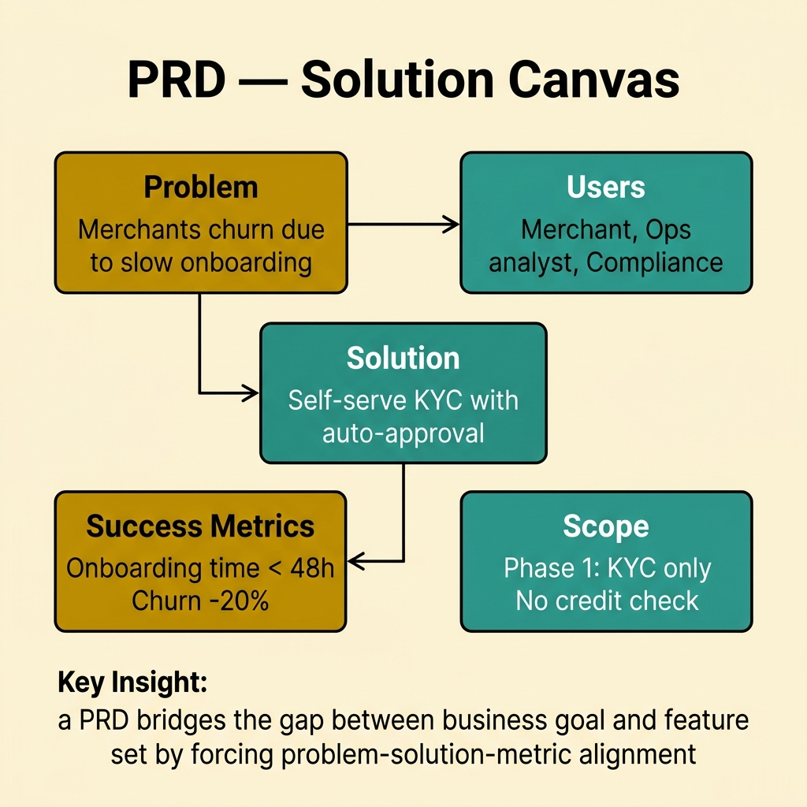
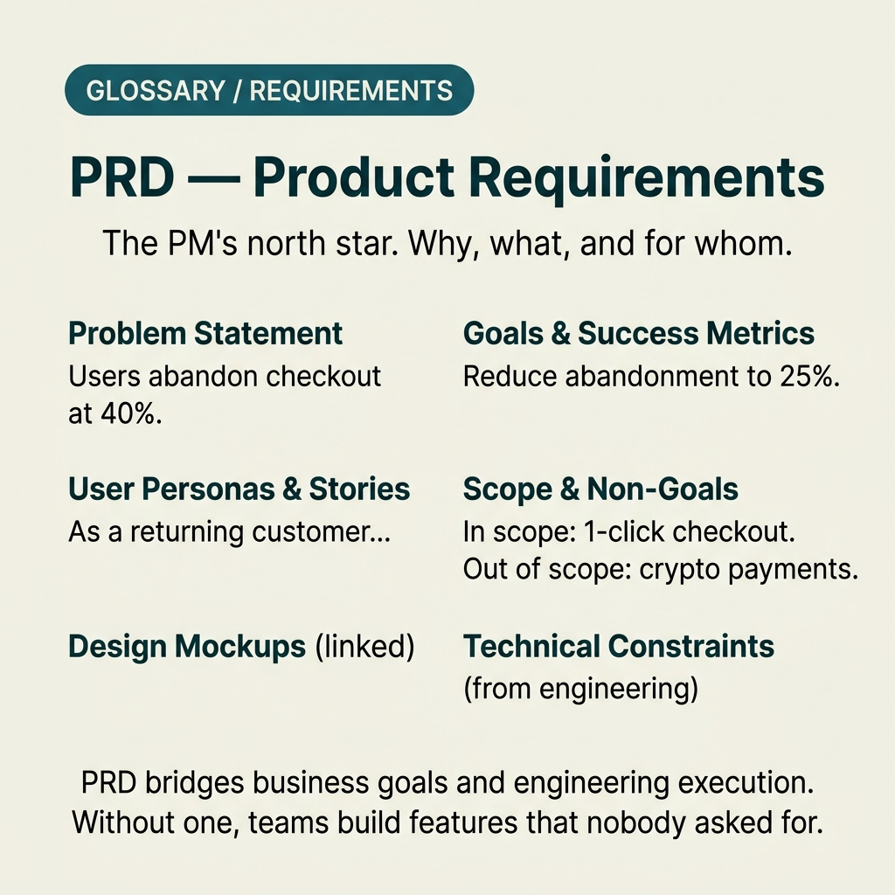

<!-- tags: glossary, reference, requirements-product, prd -->
# PRD — Product Requirements Document

> A document describing the user problem, product goals, prioritized scope, and success metrics of a feature or initiative from the product management perspective.

| Aspect | Detail |
| --- | --- |
| **Concept** | A document describing the user problem, product goals, prioritized scope, and success metrics of a feature or initiative from the product management perspective. |
| **Audience** | Product manager, designer, tech lead, stakeholder, growth team |
| **Primary style** | Glossary term |
| **Entry point** | Use when you need to lock the problem statement and product scope before the team goes deeper into specific requirements or specs. |

📅 Created: 2026-03-20 · 🔄 Updated: 2026-04-17 · ⏱️ 15 min read

---

## 1. DEFINE

The team is debating feature solutions passionately: should we add a "re-order" button, do we need AI recommendations, should we build a native app? But nobody has locked a simple answer: where does the user hurt, which metric do we expect to change, and what does the first version **not** do? That is when a **PRD** must appear.

**PRD (Product Requirements Document)** is a document describing the user problem, product goals, prioritized scope, success metrics, and key assumptions of a feature or initiative from the product management perspective.

PRD differs from BRS in that it is closer to the user and product delivery than a business sponsor view. It also differs from FRS/SRS because it does not go deep into behavior contracts or system specifications; it focuses on problem framing, scope, and desired impact.

| Variant | Description |
| --- | --- |
| Feature PRD | Focuses on a single clear feature or capability in the roadmap. |
| Initiative PRD | Used for a large problem space spanning multiple epics or sprints. |
| Lean PRD | A short version for small agile teams, still keeping problem, goals, scope, and metrics. |

| Approach | Time | Space | When to choose |
| --- | --- | --- | --- |
| Problem-first framing | O(1) | O(1) | When the team tends to jump straight to solutions before understanding user pain. |
| Metric-driven scope | Per goal count | O(1) | When success criteria need to be locked before prioritizing the backlog. |
| Out-of-scope guardrail | O(1) | O(1) | When features easily expand through multiple stakeholder requests. |

Core insight:

> PRD has value when it keeps the entire team talking about the same user problem and the same success signal. If the document has become just a list of feature ideas, it is no longer a PRD.

### 1.1 Invariants & Failure Modes

A good PRD holds three invariants:
- always starts from a problem statement, never from a solution statement;
- every feature proposal must connect to user value or a business metric;
- always has an out-of-scope section to fight scope creep from the start.

The most common failure mode is turning PRD into a document "everyone adds their ideas to." Without problem hierarchy and metric gating, the document balloons into a wishlist that looks collaborative but is very hard to ship.

---

## 2. CONTEXT

**Who uses it**: Product manager, designer, tech lead, stakeholder, growth team

**When**: Use when you need to lock the problem statement and product scope before the team goes deeper into specific requirements or specs.

**Purpose**: PRD keeps the entire team talking about the same user problem and the same success signal. If the document becomes a feature idea list, it is no longer a PRD.

**In the ecosystem**:
PRD should describe:
- user problem and target persona;
- product goals and success metrics;
- scope / out-of-scope;
- assumptions, dependencies, risks, and rollout thinking.

PRD should not become:
- a backlog detailed down to task level;
- an FRS/SRS disguised with validation rules, schemas, or detailed APIs;
- a vague roadmap without user pain or metrics.

---

Product spec is clear. But how does PRD differ from BRS, who owns PRD, and when does PRD get updated?

## 3. EXAMPLES

PRD surfaces most clearly when the PM describes the product verbally and each dev understands differently, when PRD is written before MVP but nobody updates it afterwards, or when PRD is too vague — "make the system better" — with no metrics. The examples below place the pattern into exactly those situations.

### Example 1: Basic — Write a problem statement instead of a feature statement

```text
  From feature idea to problem statement:

  ┌─ Feature statement (too vague) ────────────┐
  │  "We need a Quick Reorder button"           │
  │                                             │
  │  → Sounds reasonable. Easy to agree on.     │
  │  → But: does not prove the problem exists.  │
  └─────────────────────────────────────────────┘

           ↓ reframe as problem

  ┌─ Problem statement (useful) ───────────────┐
  │  Target persona: Busy office worker         │
  │                                             │
  │  User problem:                              │
  │    40% of returning users abandon cart      │
  │    because they must repeat the entire      │
  │    flow: address, items, payment method.    │
  │                                             │
  │  Current behavior:                          │
  │    Average reorder time: 120 seconds        │
  │                                             │
  │  Desired outcome:                           │
  │    Reduce reorder completion to <= 30s      │
  └─────────────────────────────────────────────┘

  A feature statement is easy to agree with
  because it sounds reasonable. A problem
  statement reveals whether the feature is
  actually worth building.
```

*Figure: A feature statement like "add a reorder button" is easy to agree with because it sounds reasonable. A problem statement is what reveals whether the feature is actually worth building — because it ties to real pain and expected metrics.*

```yaml
prd:
  feature_name: "Quick Reorder"
  target_persona: "Busy office worker"
  user_problem: >
    40% of returning users abandon cart because they must repeat
    the entire flow: address, items, and payment method.
  current_behavior:
    - "Average reorder time: 120s"
  desired_outcome:
    - "Reduce reorder completion time to <= 30s"
```



*Figure: A PRD bridges the gap between business goal and feature set by forcing problem-solution-metric alignment. Problem defines why, users define who, solution defines what, metrics define how we measure success.*

**Why?** A feature statement like "need a reorder button" is easy to agree with because it sounds reasonable. A problem statement reveals whether the feature is worth building, because it ties to real pain and expected metrics.

**Conclusion**: A basic PRD must start from problem framing; starting from a solution means the team is doing discovery in reverse.

### Example 2: Intermediate — Attach scope to success metrics for proper prioritization

```text
  Metric-driven scope:

  ┌─ Goal ─────────────────────────────────────┐
  │  G-01: reorder conversion rate >= 80%       │
  └─────────────────────────────────────────────┘

  ┌─ Must have ────────────────────────────────┐
  │  • one-tap reorder from last 3 orders       │
  │  • reuse default address and payment        │
  └─────────────────────────────────────────────┘

  ┌─ Should have ──────────────────────────────┐
  │  • favorite saved carts                     │
  └─────────────────────────────────────────────┘

  ┌─ Out of scope ─────────────────────────────┐
  │  • AI recommendations                       │
  │  • voice ordering                           │
  └─────────────────────────────────────────────┘

  ┌─ Priority rule ────────────────────────────┐
  │  If an item does not clearly impact G-01    │
  │  in this phase, it does not enter MVP.      │
  └─────────────────────────────────────────────┘
```

*Figure: Product scope is only truly protected when the team has a standard for rejecting items. Metrics and priority rules are the two tools that help PMs say "not doing this now" with data, not gut feelings about how cool an idea is.*

```yaml
goals:
  - id: "G-01"
    metric: "reorder conversion rate"
    target: ">= 80%"
scope:
  must_have:
    - "one-tap reorder from last 3 orders"
    - "reuse default address and payment"
  should_have:
    - "favorite saved carts"
  out_of_scope:
    - "AI recommendations"
    - "voice ordering"
priority_rule: >
  If an item does not clearly impact G-01 in this phase, it does not enter MVP.
```

**Why?** Product scope is only truly protected when the team has a standard for rejecting items. Metrics and a priority rule are the two tools that help PMs say "not doing this now" with data, not gut feelings about how cool an idea is.

**Conclusion**: An intermediate PRD must help the team cut scope, not just list more scope.

### Example 3: Advanced — Keep PRD alive through ship-measure-iterate

```text
  Post-launch plan:

  ┌─ Rollout ──────────────────────────────────┐
  │  Week 1: 10% of returning users             │
  │  Week 2: 50% if no major regression         │
  └─────────────────────────────────────────────┘

  ┌─ Success review ───────────────────────────┐
  │  Cadence: weekly                            │
  │  Metrics:                                   │
  │    • reorder completion time                │
  │    • conversion uplift                      │
  │    • support tickets (accidental reorder)   │
  └─────────────────────────────────────────────┘

  ┌─ Follow-up decisions ──────────────────────┐
  │  • Expand to favorites flow                 │
  │  • Drop or rework if metric uplift < 5%     │
  └─────────────────────────────────────────────┘

  PRD has long-term value when it becomes a
  hypothesis document: ship, then go back to
  measure, learn, and adjust.
```

*Figure: PRD has long-term value when it becomes a hypothesis document: ship, then go back to measure, learn, and adjust. Without this loop, PRD is just a nice essay for the kickoff phase.*

```yaml
post_launch_plan:
  rollout:
    - "10% returning users in week 1"
    - "50% in week 2 if no major regression"
  success_review:
    cadence: "weekly"
    metrics:
      - "reorder completion time"
      - "conversion uplift"
      - "support tickets related to accidental reorder"
  follow_up_decisions:
    - "expand to favorites flow"
    - "drop or rework if metric uplift < 5%"
```

**Why?** PRD has long-term value when it becomes a hypothesis document: ship, then go back to measure, learn, and adjust. Without this loop, PRD is just a nice essay for the kickoff phase.

**Conclusion**: At the advanced level, PRD is a product learning tool, not just an approval document.

---

## 4. COMPARE




*Figure: Position of PRD among BRS, user story, and product backlog.*

PRD sounds like BRS. The difference: BRS captures business needs (why), PRD defines the product solution (what + how). BRS comes from the business stakeholder, PRD comes from the product manager. BRS = problem, PRD = proposed solution.

### Level 1

```text
User problem -> Product goal -> Success metric -> Scoped solution -> Ship -> Measure
```

*Figure: Level 1 shows PRD as the bridge between discovery and delivery, not a detailed technical spec.*

### Level 2

```text
If the document focuses on...            It is most likely...
--------------------------------------   ------------------------------------------
User pain, persona, metric, scope        PRD
Business sponsor, revenue objective      BRS
Detailed feature behavior                FRS
System-wide requirement contract         SRS

Good PRD = clear problem + clear persona + clear metric + clear out-of-scope.
```

*Figure: Level 2 helps the team distinguish PRD from business requirements and functional/system specs to prevent each document from carrying too many roles.*

### Easily confused or boundary-slipping

| # | Severity | Mistake | Consequence | Fix |
| --- | --- | --- | --- | --- |
| 1 | 🔴 Fatal | Starting from solution, not user problem | Team ships what they think is cool, not what users need | Open PRD with pain point, evidence, and target persona. |
| 2 | 🟡 Common | No success metrics | After shipping, nobody knows if the feature is worth keeping | Every goal must have a metric and target. |
| 3 | 🟡 Common | No out-of-scope section | Scope creep stretches MVP, dilutes focus | Explicitly write what is not being built in this version. |
| 4 | 🔵 Minor | Not updating PRD after rollout | Document loses learning value after shipping | Use PRD as a living document tied to review cadence. |

### Quick scan

| If you face | Action |
| --- | --- |
| Document is all feature ideas but no pain points | Not a PRD yet; go back to problem statement first. |
| Scope keeps growing after every meeting | Use goal + out-of-scope to cut according to PRD. |
| Feature shipped but nobody knows whether to expand | Go back to PRD and review success metrics / rollout plan. |

---

## 5. REF

| Resource | Type | Link | Note |
| --- | --- | --- | --- |
| Inspired | Book/Reference | https://www.svpg.com/inspired-how-to-create-products-customers-love/ | Product-led perspective very aligned with PRD. |
| Shape Up | Reference | https://basecamp.com/shapeup | Useful for scope appetite and betting table. |
| Notion PRD Template | Reference | https://www.notion.so/templates/product-requirements-document | Practical template for a concise PRD. |

---

## 6. RECOMMEND

PRD solves "the team does not have a shared vision of the product." Next questions: how does user story breakdown work, and what do specific scenarios look like?

| Expand to | When | Reason | File/Link |
| --- | --- | --- | --- |
| Business objective layer | When you need to return to sponsor view and business rationale | Compare product framing with business framing. | [BRS](./BRS.md) |
| Functional detail | When PRD scope is locked and you need to move into behavior spec | From product intent to functional contract. | [FRS](./FRS.md) |
| Full requirements package | When the project needs more formal documentation for multiple teams | Combine product and system requirement views. | [SRS](./SRS.md) |

Back to the "each dev understands differently" at the start — PM describes verbally, no doc. Now you know: PRD = problem, solution, success metrics, scope, timeline. PM owns, team reviews. Living document, updated each iteration.

**Links**: [← Previous](./NFRS.md) · [→ Next](./SRS.md)
