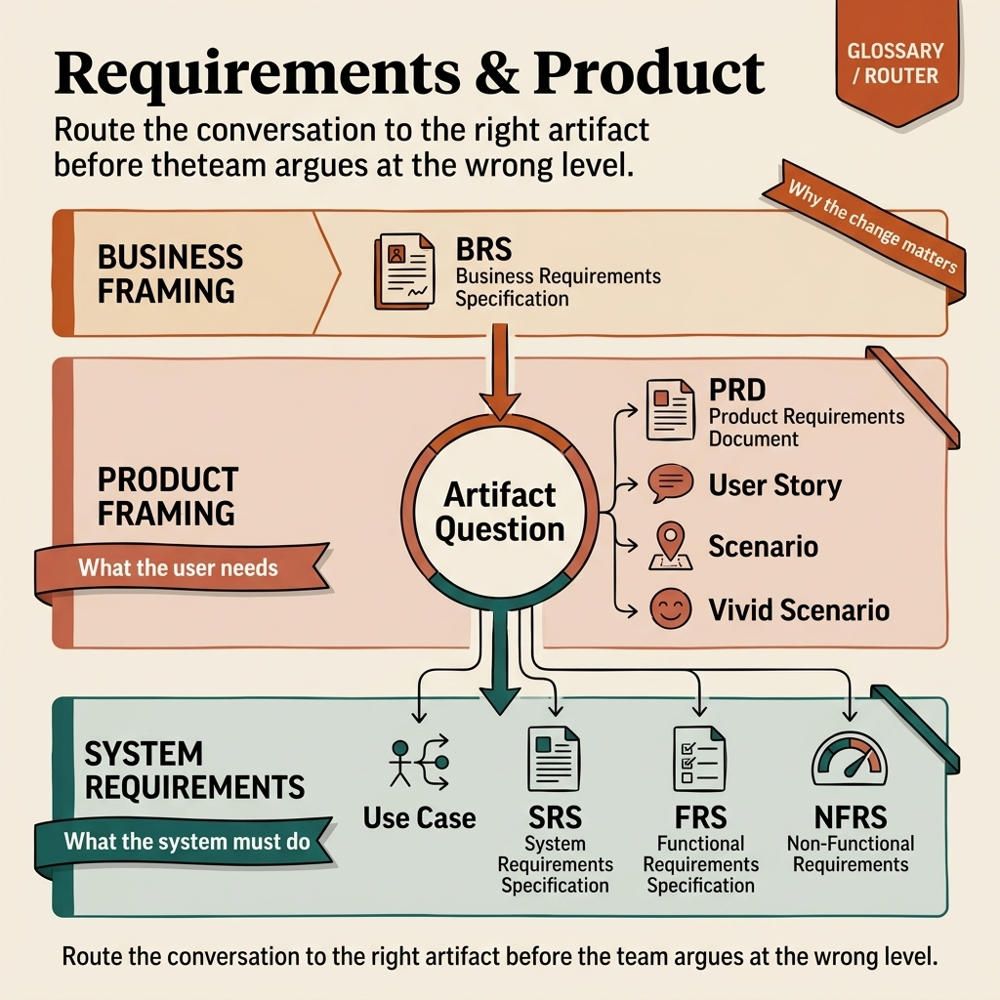

<!-- tags: glossary, reference, requirements-product, overview -->
# Requirements & Product

> A cluster of terms about artifacts describing requirements, scope, and expectations between business, product, and engineering.

| Aspect | Detail |
| --- | --- |
| **Concept** | A cluster of terms about artifacts describing requirements, scope, and expectations between business, product, and engineering. |
| **Audience** | Product manager, BA, tech lead, reviewer, engineer who needs to read requirements at the right boundary |
| **Primary style** | Glossary hub router |
| **Entry point** | Open when the team needs to distinguish which type of requirement document is being discussed and which artifact actually answers the current question. |

📅 Created: 2026-03-30 · 🔄 Updated: 2026-04-17 · ⏱️ 7 min read

---

## 1. DEFINE

Many teams call all requirements documents "spec," then product, BA, and engineering each understand something different. This README routes requirements conversations into the right artifact: PRD, BRS, SRS, FRS, or NFRS — to prevent reading one file while expecting it to solve a different problem.

**Requirements & Product** is a cluster of terms about artifacts describing requirements, scope, and expectations between business, product, and engineering.

| Variant | Description |
| --- | --- |
| Business framing | BRS holds the problem/business need at a high level. |
| Product framing | PRD, User Story, and Scenario hold the product problem closer to the user. |
| System requirements | Use Case, SRS, FRS, and NFRS separate flow, behavior contract, and quality constraints. |

| Approach | Time | Space | When to choose |
| --- | --- | --- | --- |
| Route by stakeholder question | O(1) route | O(1) | When you need to know which audience needs which answer from a document. |
| Route by artifact scope | O(1) route | O(1) | When you need to separate business ask, product intent, and system contract. |
| Learn from problem to constraints | O(1) route | O(1) | When you want to go from business goal down to technical requirements. |

Core insight:

> Much confusion during discovery does not come from missing information. It comes from forcing one artifact to answer the questions of another.

### 1.1 Signals & Boundaries

- PRD does not replace SRS; one describes the product problem, the other the system contract.
- User Story locks user need concisely; Use Case locks the interaction flow more explicitly.
- Scenario is the hypothetical situation layer; Vivid Scenario is a more evocative variant to increase empathy.
- FRS/NFRS help separate functional requirements from quality constraints.
- BRS is only effective when the team needs to lock business need before debating implementation.

### Coverage Map

| Entry | Role | Note |
| --- | --- | --- |
| [BRS — Business Requirements Specification](BRS.md) | Canonical term | Primary entry for this lane. |
| [FRS — Functional Requirements Specification](FRS.md) | Canonical term | Primary entry for this lane. |
| [NFRS — Non-Functional Requirements Specification](NFRS.md) | Canonical term | Primary entry for this lane. |
| [PRD — Product Requirements Document](PRD.md) | Canonical term | Primary entry for this lane. |
| [Scenario](Scenario.md) | Canonical term | Hypothetical situation for requirements, testing, planning. |
| [SRS — Software Requirements Specification](SRS.md) | Canonical term | Primary entry for this lane. |
| [Use Case](Use-Case.md) | Canonical term | Actor + flow + alternate path. |
| [User Story](User-Story.md) | Canonical term | Backlog statement by user need. |
| [Vivid Scenario](Vivid-Scenario.md) | Canonical term | Scenario written more vividly to increase empathy. |

---

## 2. VISUAL




*Figure: Router map separating business framing, product framing, and system requirements so the team picks the right artifact before expectations get mixed.*

The cluster name is clear; the slippery spot is when one artifact is forced to answer questions from another lane. The visual below keeps boundaries between business intent, product framing, and delivery contract from the start.

### Level 1

```text
Business framing
Product framing
System requirements
```

*Figure: Level 1 splits this hub into the main decision lanes so the reader does not wander through a flat list of acronyms.*

### Level 2

```text
If the situation is...                                         Open first
-----------------------------------------------------------   ------------------------------------------
Need to lock business problem and business-level expectations  BRS — Business Requirements Specification
Need to describe product problem, user, and release scope      PRD — Product Requirements Document
Need to write detailed system requirements for engineering     SRS — Software Requirements Specification
Debating functional vs non-functional requirements             NFRS — Non-Functional Requirements Specification
Need a short backlog phrase by user value                      User Story
Need a clear actor flow for interaction                        Use Case
```

*Figure: Level 2 turns the hub into a symptom router: start from the real question, then branch to the specific term.*

---

## 3. CODE

The diagram showed this cluster organized by target document, requirement scope, and quality constraints. From here, use the hub as a document selector so you do not write the right template for the wrong purpose.

### Problem 1: Basic — Route the right symptom to the right glossary entry

```text
  Symptom router:

  ┌─ Symptom ──────────────────────────────────┐
  │  Need to lock business problem and          │
  │  business-level expectations                │
  │  → open BRS.md                              │
  │                                             │
  │  Need to describe product problem,          │
  │  user, and release scope                    │
  │  → open PRD.md                              │
  │                                             │
  │  Need a short backlog phrase by user value  │
  │  → open User-Story.md                       │
  │                                             │
  │  Need detailed system requirements for eng  │
  │  → open SRS.md                              │
  │                                             │
  │  Debating functional vs non-functional      │
  │  → open NFRS.md                             │
  │                                             │
  │  Start from the delivery symptom, not from  │
  │  the document acronym.                      │
  └─────────────────────────────────────────────┘
```

*Figure: In requirements/product, confusing PRD with SRS or FRS means confusing the audience and the decision that needs to be locked. This router helps open the right type of document from the start.*

```yaml
router:
  - symptom: Need to lock business problem and business-level expectations
    open_first: ./BRS.md
  - symptom: Need to describe product problem, user, and release scope
    open_first: ./PRD.md
  - symptom: Need a short backlog phrase by user value
    open_first: ./User-Story.md
  - symptom: Need detailed system requirements for engineering
    open_first: ./SRS.md
  - symptom: Debating functional vs non-functional requirements
    open_first: ./NFRS.md
```

**Why?** In requirements/product, confusing PRD with SRS or FRS means confusing the audience and the decision that needs locking. This router helps open the right type of document from the start.

**Conclusion**: The first value of this hub is helping the writer choose the right artifact before starting specification or debating scope.

### Problem 2: Intermediate — Use the hub as a learning path with intent

```text
  Learning path:

  ┌─ Problem and product ──────────────────────┐
  │  BRS.md → PRD.md → User-Story.md           │
  │  → Scenario.md → Vivid-Scenario.md          │
  │  From business goal to user-level framing.  │
  └─────────────────────────────────────────────┘

  ┌─ System requirements ──────────────────────┐
  │  Use-Case.md → SRS.md → FRS.md → NFRS.md  │
  │  From interaction flow to system contract.  │
  └─────────────────────────────────────────────┘
```

*Figure: The files in this cluster make more sense when the reader sees the handoff relationship between them. The learning path turns a basket of acronyms into a delivery chain from product intent to implementation spec.*

```yaml
learning_path:
  problem_and_product:
    - BRS.md
    - PRD.md
    - User-Story.md
    - Scenario.md
    - Vivid-Scenario.md
  system_requirements:
    - Use-Case.md
    - SRS.md
    - FRS.md
    - NFRS.md
```

**Why?** The files in this cluster only stop being dry when the reader sees the handoff relationship between them. The learning path turns a basket of acronyms into a delivery chain from product intent to implementation spec.

**Conclusion**: At the intermediate level, this hub gives the reader a path following the delivery handoff chain, not just method names.

### Problem 3: Advanced — Use the hub as a governance map for shared vocabulary

```text
  Governance vocabulary map:

  ┌─ Business framing ────────────────────────┐
  │  BRS.md, PRD.md, User-Story.md,            │
  │  Scenario.md                                │
  │  → "how we frame the problem and intent"   │
  └─────────────────────────────────────────────┘

  ┌─ Product framing ─────────────────────────┐
  │  Vivid-Scenario.md, Use-Case.md             │
  │  → "how we feel and formalize interaction" │
  └─────────────────────────────────────────────┘

  ┌─ System requirements ─────────────────────┐
  │  SRS.md, FRS.md, NFRS.md                   │
  │  → "how we specify and constrain"          │
  └─────────────────────────────────────────────┘
```

*Figure: Shared vocabulary in requirements is the guardrail for scope control. A governance map keeps the team from mixing business objectives with rituals or toolchains.*

```yaml
governance_map:
  business_framing:
    - BRS.md
    - PRD.md
    - User-Story.md
    - Scenario.md
  product_framing:
    - Vivid-Scenario.md
    - Use-Case.md
  system_requirements:
    - SRS.md
    - FRS.md
    - NFRS.md
```

**Why?** Shared vocabulary in requirements is the guardrail for scope control. A governance map keeps the team from mixing business objectives, interaction formalization, and system constraints.

**Conclusion**: At the advanced level, this hub is a language contract between product, business analyst, and engineering.

---

## 4. PITFALLS

The taxonomy is clear, but routing correctly alone is not enough to avoid the most common slips when using or interpreting this concept cluster.

| # | Severity | Mistake | Consequence | Fix |
| --- | --- | --- | --- | --- |
| 1 | 🔴 Fatal | Mixing multiple concept layers in one discussion | Team fixes the wrong layer, arguments go off track | Re-route through this README's lanes before opening a specific term. |
| 2 | 🟡 Common | Choosing a term by familiar name instead of symptom | Deep-linking the right file but wrong boundary | Ask the symptom question first, then choose the entry point. |
| 3 | 🟡 Common | Reading terms in isolation without the learning path | Understanding stays fragmented, missing adjacent concepts for comparison | Follow the suggested reading clusters in CODE/RECOMMEND. |
| 4 | 🔵 Minor | Not linking back to the parent hub or root hub | Reader gets lost and cannot return to the taxonomy | Keep hub as a router; do not turn files into islands. |

---

## 5. REF

| Resource | Type | Link | Note |
| --- | --- | --- | --- |
| IEEE 29148 | Reference | https://standards.ieee.org/standard/29148-2018.html | Foundation for systems and software requirements. |
| Writing Effective Use Cases | Book | https://alistair.cockburn.us/writing-effective-use-cases/ | Useful for requirement framing. |
| Product Management Standards | Reference | https://www.pmi.org/ | Adds the product/business artifact perspective. |

---

## 6. RECOMMEND

You have identified the right type of document. Continue to the nearest artifact to the decision that needs locking, so requirements do not slip in audience or scope.

| Expand to | When | Reason | File/Link |
| --- | --- | --- | --- |
| PRD first | When the team needs to agree on the product problem | If product intent is vague, requirement detail will be weak. | [PRD — Product Requirements Document](./PRD.md) |
| SRS after that | When engineering needs a specific contract to build the system | This is the step from intent to implementation boundary. | [SRS — Software Requirements Specification](./SRS.md) |
| NFRS when quality attributes become a major concern | When scale, reliability, or security influence the solution | Time for constraints to have their own name. | [NFRS — Non-Functional Requirements Specification](./NFRS.md) |

---

## 7. QUICK REF

| If you face | Open |
| --- | --- |
| Need to lock business problem and business-level expectations | [BRS — Business Requirements Specification](./BRS.md) |
| Need to describe product problem, user, and release scope | [PRD — Product Requirements Document](./PRD.md) |
| Need a short backlog sentence by user value | [User Story](./User-Story.md) |
| Need a concrete hypothetical situation for test/planning | [Scenario](./Scenario.md) |
| Need a clear actor flow for interaction | [Use Case](./Use-Case.md) |
| Need detailed system requirements for engineering | [SRS — Software Requirements Specification](./SRS.md) |
| Debating functional vs non-functional requirements | [NFRS — Non-Functional Requirements Specification](./NFRS.md) |
