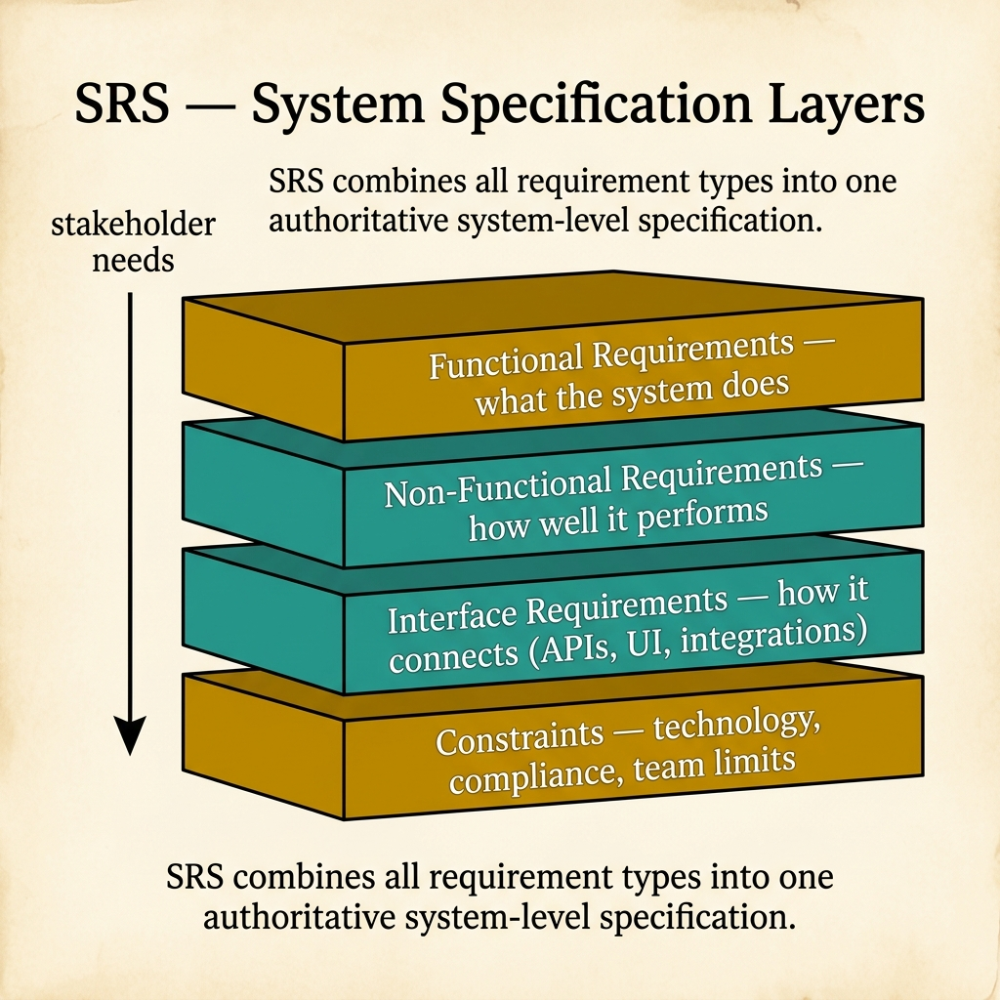
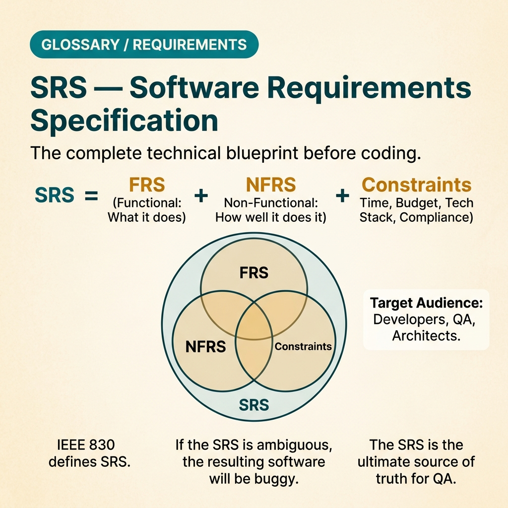

<!-- tags: glossary, reference, requirements-product, srs -->
# SRS — Software Requirements Specification

> A document specifying the full software requirements at the system level, including functional requirements, non-functional requirements, interfaces, and constraints sufficient for synchronized design, implementation, and testing.

| Aspect | Detail |
| --- | --- |
| **Concept** | A document specifying the full software requirements at the system level, including functional requirements, non-functional requirements, interfaces, and constraints sufficient for synchronized design, implementation, and testing. |
| **Audience** | BA, architect, developer, QA, vendor, stakeholder review board |
| **Primary style** | Glossary term |
| **Entry point** | Use when you need a reasonably complete software requirements contract before design/implementation. |

📅 Created: 2026-03-20 · 🔄 Updated: 2026-04-17 · ⏱️ 15 min read

---

## 1. DEFINE

A large project has passed discovery. Now it is not just product and BA who need to share understanding — architect, dev, QA, vendor, and stakeholders also need a unified reference for what the system must do, how well, what it interfaces with, and which assumptions remain unresolved. That is when **SRS** becomes necessary.

**SRS (Software Requirements Specification)** is a document specifying in detail the software requirements at the system level, including functional requirements, non-functional requirements, external interfaces, constraints, assumptions, and the traceability needed for delivery.

SRS is broader than FRS and NFRS because it combines both along with system context. It is also more technical than BRS/PRD because its primary audience is the delivery organization, not just business or product.

| Variant | Description |
| --- | --- |
| Full-system SRS | Used for new systems, vendor handoffs, or projects with high compliance needs. |
| Module SRS | Used for a bounded subsystem that still needs full FR/NFR/interface/constraint coverage. |
| Addendum SRS | A supplemental version when a large feature is added to an existing system without rewriting the entire SRS. |

| Approach | Time | Space | When to choose |
| --- | --- | --- | --- |
| IEEE-style structured SRS | Per section count | Per requirement count | When you need a formal, reviewable, and traceable document. |
| Modular SRS | Per module count | Per module count | When the system is large and cannot keep all requirements in a monolith file. |
| Traceability-driven SRS | Per requirement link count | O(1) | When you need to map from business goal to design component and test case. |

Core insight:

> SRS is the "software contract" between multiple delivery groups. Its value does not lie in page count, but in requirements being clear enough for design, code, and test to all follow the same meaning.

### 1.1 Invariants & Failure Modes

A good SRS holds three invariants:
- every requirement has an ID, priority, and meaning clear enough to verify;
- the document structure helps readers know where behavior is, where quality is, and where interface is;
- requirement changes are governed like contract changes, not like freeform comments.

The most common failure mode is an SRS that is both too long and too vague: many sections, many words, but lacking metrics, priorities, and traceability. Everyone thinks "we have a spec," but rework still happens as if no spec exists.

---

## 2. CONTEXT

**Who uses it**: BA, architect, developer, QA, vendor, stakeholder review board

**When**: Use when you need a reasonably complete software requirements contract before design/implementation.

**Purpose**: SRS is the "software contract" between multiple delivery groups. Its value is not in page count, but in requirements clear enough for design, code, and test to follow the same meaning.

**In the ecosystem**:
SRS should describe:
- system scope;
- FR and NFR;
- interface requirements;
- constraints, assumptions, dependencies;
- traceability to business goals, design components, and test cases.

SRS should not become:
- source code disguised as documentation;
- a roadmap or product strategy document;
- a dump of every meeting without distinguishing requirements from design choices.

---

Comprehensive spec is clear. But what does SRS contain, who reads a long SRS, and SRS in agile?

## 3. EXAMPLES

SRS surfaces most clearly when the system is built but 30% of requirements are missing because they were not documented, when a 300-page SRS is outdated after sprint 2, or when an agile team says "we don't need SRS" then misses critical requirements. The examples below place the pattern into exactly those situations.

### Example 1: Basic — Write a software requirement that is specific and measurable

```text
  Software requirement block:

  ┌─ REQ-001: Login API Response ──────────────┐
  │                                             │
  │  Type: Non-Functional / Performance         │
  │  Priority: Must-Have                        │
  │                                             │
  │  Description:                               │
  │    System must return login API response    │
  │    in <= 2 seconds for 95% of requests      │
  │    under 10,000 concurrent users.           │
  │                                             │
  │  Acceptance criteria:                       │
  │    • p95 latency <= 2000ms                  │
  │    • error rate < 0.1%                      │
  │                                             │
  │  Traces to:                                 │
  │    Business goal: Improve first-session UX  │
  │    Component: Auth Service                  │
  │                                             │
  │  A requirement only deserves the name       │
  │  "software requirement" when it can be      │
  │  verified. ID, threshold, and minimum       │
  │  traceability cut ambiguity at the writing  │
  │  point.                                     │
  └─────────────────────────────────────────────┘
```

*Figure: A requirement only deserves the name "software requirement" when it can be verified. ID, threshold, and minimum traceability cut ambiguity right at the spec writing point.*

```yaml
requirement:
  id: "REQ-001"
  title: "Login API response"
  type: "Non-Functional / Performance"
  priority: "Must-Have"
  description: >
    System must return login API response in <= 2 seconds
    for 95% of requests under 10,000 concurrent users.
  acceptance_criteria:
    - "p95 latency <= 2000ms"
    - "error rate < 0.1%"
  trace_to:
    business_goal: "Improve first-session user experience"
    component: "Auth Service"
```



*Figure: SRS combines all requirement types — functional, non-functional, interface, and constraints — into one authoritative system-level specification that flows from stakeholder needs.*

**Why?** A requirement only deserves the name "software requirement" when it can be verified. ID, threshold, and minimum traceability cut ambiguity right at the spec writing point.

**Conclusion**: A basic SRS block must make the question "has this requirement been met?" have an objective answer.

### Example 2: Intermediate — Combine FR and NFR of the same feature into a structured contract

```text
  Structured module requirement:

  ┌─ F-001: Authentication ────────────────────┐
  │                                             │
  │  Functional requirements:                   │
  │    • User can register with email + pass    │
  │    • User can log in with valid creds       │
  │    • Account locked after 5 failed attempts │
  │                                             │
  │  Non-functional requirements:               │
  │    • Login API p95 <= 2s                    │
  │    • Passwords stored with bcrypt >= 12     │
  │                                             │
  │  Interfaces:                                │
  │    • Email service for verification         │
  │    • Identity provider for social login     │
  │                                             │
  │  Assumptions:                               │
  │    • Email provider SLA >= 99.9%            │
  │                                             │
  │  Placing FR, NFR, and interfaces in the    │
  │  same frame helps the team see the real     │
  │  dependencies of a feature.                 │
  └─────────────────────────────────────────────┘
```

*Figure: One core value of SRS is placing FR, NFR, and interfaces in the same frame so the team sees the real dependencies of a feature. When these three are scattered, design and test spend more time backtracking through documents than necessary.*

```yaml
feature:
  id: "F-001"
  name: "Authentication"
  functional_requirements:
    - "User can register with email + password"
    - "User can log in with valid credentials"
    - "Account is temporarily locked after 5 failed attempts"
  non_functional_requirements:
    - "Login API p95 <= 2s"
    - "Passwords stored with bcrypt cost >= 12"
  interfaces:
    - "Email service for verification"
    - "Identity provider for social login"
  assumptions:
    - "Email provider SLA >= 99.9%"
```

**Why?** One core value of SRS is placing FR, NFR, and interfaces in the same frame so the team sees the real dependencies of a feature. When these three are scattered, design and test spend far more time backtracking through documents than necessary.

**Conclusion**: An intermediate SRS turns a feature into a more complete delivery contract, not just a behavior description.

### Example 3: Advanced — Use a traceability matrix to govern change and test impact

```text
  Traceability matrix:

  ┌─ REQ-010 ──────────────────────────────────┐
  │  Business goal: BG-02 Faster checkout       │
  │  Design component: Checkout Module          │
  │  Test cases: TC-010, TC-011                 │
  │  Change impact:                             │
  │    • Payment gateway adapter                │
  │    • Checkout UI validation                 │
  └─────────────────────────────────────────────┘

  ┌─ REQ-020 ──────────────────────────────────┐
  │  Business goal: BG-03 Better reliability    │
  │  Design component: Notification Service     │
  │  Test cases: TC-020                         │
  └─────────────────────────────────────────────┘

  Without traceability, a change request looks
  smaller than it really is. This matrix helps
  the team see which requirement pulls which
  design/test impact before agreeing to change
  the contract.
```

*Figure: Without traceability, a change request looks smaller than it actually is. This simple matrix helps the team see which requirement pulls which design/test impact before agreeing to change the contract.*

```yaml
traceability_matrix:
  - req_id: "REQ-010"
    business_goal: "BG-02 Faster checkout"
    design_component: "Checkout Module"
    test_cases:
      - "TC-010"
      - "TC-011"
    change_impact:
      - "Payment gateway adapter"
      - "Checkout UI validation"
  - req_id: "REQ-020"
    business_goal: "BG-03 Better reliability"
    design_component: "Notification Service"
    test_cases:
      - "TC-020"
```

**Why?** Without traceability, change requests look smaller than they actually are. This simple matrix helps the team see which requirements pull which design/test impact before agreeing to change the contract.

**Conclusion**: At the advanced level, SRS must help govern change, not just describe the current state.

---

## 4. COMPARE




*Figure: Position of SRS among BRS, FRS, NFRS, and system design.*

SRS sounds like a comprehensive FRS. Partly true: SRS = functional + non-functional + constraints + interfaces + assumptions. FRS only covers functional. SRS is the comprehensive spec; FRS is a subset.

### Level 1

```text
Business/Product intent -> SRS -> Design (HLD/LLD) -> Code/Test -> Runtime verification
```

*Figure: Level 1 shows SRS as the intermediate contract between discovery and execution, where multiple groups follow one source of truth for software requirements.*

### Level 2

```text
If the document focuses on...            It is most likely...
--------------------------------------   ------------------------------------------
Business goals, sponsor, KPI            BRS / PRD
Functional behavior only                FRS
Quality bar and thresholds              NFRS
FR + NFR + interfaces + assumptions     SRS

Good SRS = requirements with ID + measurable + traceable + reviewable.
```

*Figure: Level 2 helps the team layer documents in the requirements stack and see clearly why SRS should neither absorb business strategy nor be just an enlarged FRS.*

### Easily confused or boundary-slipping

| # | Severity | Mistake | Consequence | Fix |
| --- | --- | --- | --- | --- |
| 1 | 🔴 Fatal | Requirements are vague and not measurable | Dev and QA misunderstand the contract, rework spikes | Write requirements with threshold, rule, and acceptance criteria. |
| 2 | 🟡 Common | Mixing design choices into SRS | Spec becomes locked to one implementation too early | Keep SRS at "what/constraint," push "how" to design docs. |
| 3 | 🟡 Common | No traceability | Change requests hard to estimate, test impact hard to identify | Add requirement ID, source goal, and downstream mapping. |
| 4 | 🔵 Minor | One SRS file cramming too many modules without organization | Reader does not know where to find a requirement | Split into modular sections or structured addenda. |

### Quick scan

| If you face | Action |
| --- | --- |
| Need one requirements contract sufficient for design + dev + QA | Write/read SRS instead of FRS or NFRS alone. |
| Requirement change looks "very small" | Check the traceability matrix first to see real blast radius. |
| Requirements document contains specific framework/schema details | Pause and move that content to design docs. |

---

## 5. REF

| Resource | Type | Link | Note |
| --- | --- | --- | --- |
| IEEE 29148 | Standard | https://www.iso.org/standard/72089.html | Popular standard for software requirement specification. |
| ISO/IEC/IEEE 29148 overview | Standard | https://www.iso.org/standard/72089.html | General reference for requirement structure and traceability. |
| Atlassian Requirements Docs Guide | Reference | https://www.atlassian.com/work-management/project-management/requirements-management | Useful for splitting requirements docs in modern teams. |

---

## 6. RECOMMEND

SRS solves "need a comprehensive spec for the entire system." Next questions: how does BRS capture business context, and how lightweight is a user story?

| Expand to | When | Reason | File/Link |
| --- | --- | --- | --- |
| Functional slice | When you need to zoom into each flow's behavior | Separate function detail from system-wide contract. | [FRS](./FRS.md) |
| Quality slice | When you need to zoom into latency, security, availability | Separate quality bar from behavior detail. | [NFRS](./NFRS.md) |
| Product/business context | When you need to return to "why" or "for whom" | Keep software requirements connected to product intent. | [PRD](./PRD.md) |

Back to the missing 30% of requirements at the start — not documented. Now you know: SRS is not a waterfall artifact. Lightweight SRS in agile = living document, updated each sprint. Detailed enough to not miss, lean enough to maintain.

**Links**: [← Previous](./PRD.md) · [→ Next](./README.md)
