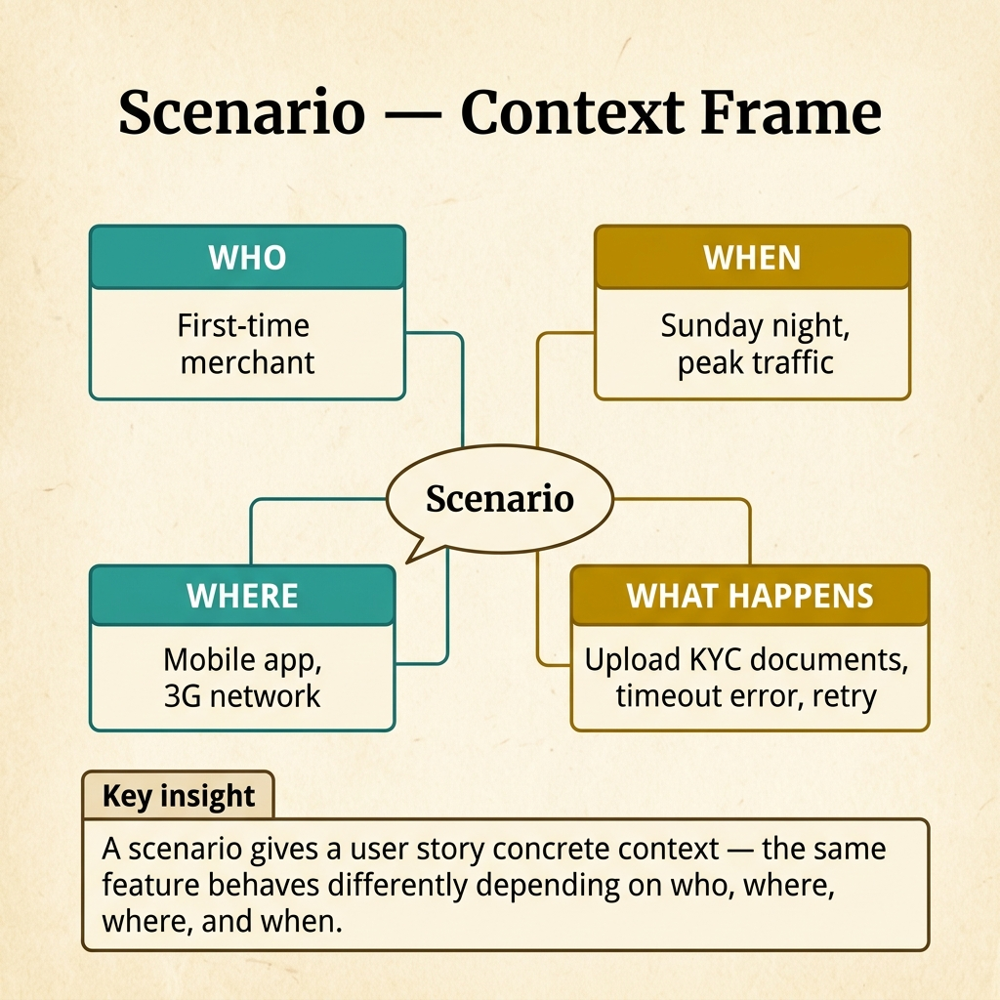
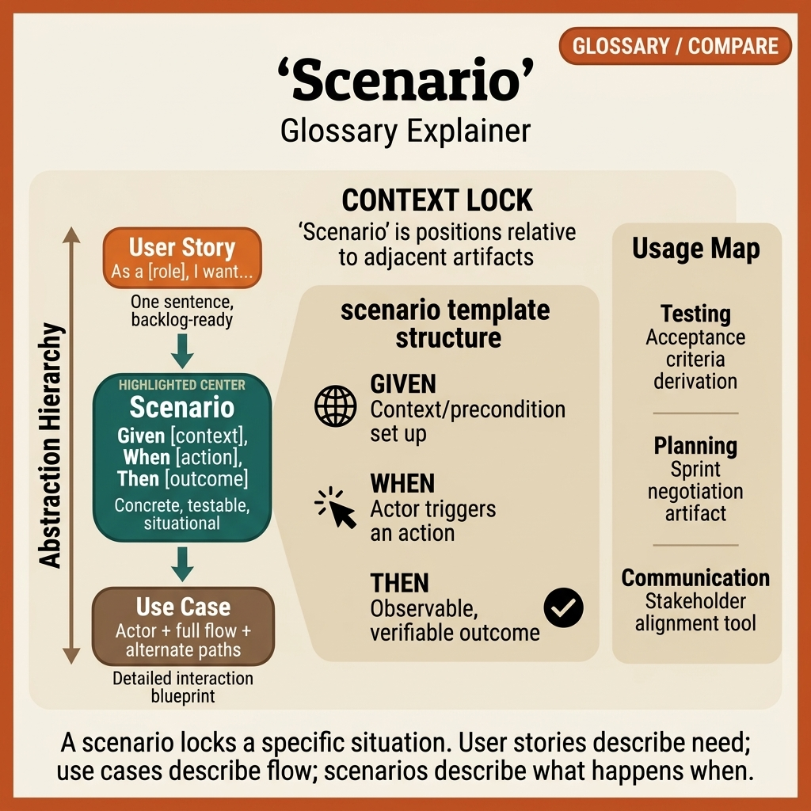

<!-- tags: glossary, reference, requirements-product, scenario -->
# Scenario

> A hypothetical situation used to place a requirement, a test case, or a planning session into a more concrete context.

| Aspect | Detail |
| --- | --- |
| **Concept** | A hypothetical situation used to place a requirement, a test case, or a planning session into a more concrete context. |
| **Audience** | Product manager, BA, QA, designer, facilitator, developer |
| **Primary style** | Glossary term |
| **Entry point** | Use when an idea or requirement is still too abstract and the team needs a situation concrete enough to reason about together. |

📅 Created: 2026-04-05 · 🔄 Updated: 2026-04-17 · ⏱️ 10 min read

---

## 1. DEFINE

Sprint planning is stuck because everyone talks about "checkout failure" but each person imagines a different scene: PM thinks about weak mobile signal, QA thinks about expired coupons, dev thinks about a payment gateway timeout. A **scenario** appears to pull the entire group into the same hypothetical situation, concrete enough to reason about.

**Scenario** is a hypothetical situation used to clarify how a problem, a feature, or a behavior might play out. It typically has context, actor, trigger, and expected outcome, but does not need to be as vivid as a vivid scenario or as formal as a use case.

| Variant | Description |
| --- | --- |
| Product scenario | A short user situation to discuss scope or priority. |
| Test scenario | A situation to help QA or the team verify behavior. |
| Planning scenario | A hypothetical condition in a workshop, tabletop exercise, or decision review. |

| Approach | Time | Space | When to choose |
| --- | --- | --- | --- |
| One-paragraph scenario | O(1) | O(1) | When you need to lock context very quickly for a discussion. |
| Scenario matrix | Per variant count | O(variants) | When you need to compare multiple outcomes or edge cases. |
| Scenario pack | Per stakeholder count | O(pack) | When used for workshops, UAT, or training. |

Core insight:

> Scenario has value because it makes conversation less abstract. It does not automatically become a requirement contract or a vivid narrative; those are two different things.

### 1.1 Invariants & Failure Modes

A useful scenario usually has context, trigger, and expected outcome. The most common failure mode is a scenario so short it is still vague, or so long it starts blending into detailed specification.

---

## 2. CONTEXT

**Who uses it**: Product manager, BA, QA, designer, facilitator, developer

**When**: Use when an idea or requirement is still too abstract and the team needs a situation concrete enough to reason about together.

**Purpose**: Scenario makes conversation less abstract. It does not automatically become a requirement contract or vivid narrative; those are two different things.

**In the ecosystem**:
- Scenario answers "which situation are we discussing," not fully "how will the system handle every branch."
- If the goal is to tell a very vivid story so the reader feels the user's emotion, open **Vivid Scenario**.
- If the goal is clear actor, main flow, alternate flow, and system response, open **Use Case**.

---

Usage scenarios are clear. But how does scenario differ from use case, how many scenarios to write, and the scenario-test relationship?

## 3. EXAMPLES

Scenario surfaces most clearly when QA tests only the happy path and misses edge cases, when a user story lacks context that scenario fills, or when a scenario becomes too detailed and turns into pseudo-code. The examples below place the pattern into exactly those situations.

### Example 1: Basic — Use a scenario to lock context for a discussion

```text
  Context-locking scenario:

  ┌─ Title ────────────────────────────────────┐
  │  Payment failure on flaky mobile network    │
  └─────────────────────────────────────────────┘

  ┌─ Actor ────────────────────────────────────┐
  │  Mobile buyer                               │
  └─────────────────────────────────────────────┘

  ┌─ Trigger ──────────────────────────────────┐
  │  Taps "Pay" while signal is weak            │
  └─────────────────────────────────────────────┘

  ┌─ Expected outcome ─────────────────────────┐
  │  • No duplicate order created               │
  │  • Clear retry status displayed             │
  └─────────────────────────────────────────────┘

  Just locking the right situation changes the
  quality of questions in the entire meeting.
  The team starts discussing behavior that fits,
  instead of arguing on different imaginations.
```

*Figure: Just locking the right situation changes the quality of questions in the entire meeting. The team discusses behavior that fits instead of arguing from different imaginations.*

```yaml
scenario:
  title: "Payment failure on flaky mobile network"
  actor: "Mobile buyer"
  trigger: "Taps Pay while signal is weak"
  expected_outcome:
    - "No duplicate order created"
    - "Clear retry status displayed"
```



*Figure: A scenario gives a user story concrete context — who (first-time merchant), where (mobile, 3G), when (Sunday peak), and what happens (upload, timeout, retry). The same feature behaves differently depending on context.*

**Why?** Just locking the right situation changes the quality of questions in the entire meeting. The team discusses behavior that fits instead of arguing from different imaginations.

**Conclusion**: Scenario is the cheapest way to pull everyone into the same context before digging deeper.

### Example 2: Intermediate — Use a scenario matrix for test or planning

```text
  Scenario matrix:

  ┌─ Happy path ───────────────────────────────┐
  │  Trigger: user exports < 10,000 rows        │
  │  Expected: file downloads directly          │
  └─────────────────────────────────────────────┘

  ┌─ Large export ─────────────────────────────┐
  │  Trigger: user exports 200,000 rows         │
  │  Expected: switches to async job            │
  └─────────────────────────────────────────────┘

  ┌─ Permission denied ────────────────────────┐
  │  Trigger: user lacks export permission      │
  │  Expected: 403 + clear guidance             │
  └─────────────────────────────────────────────┘

  Scenario matrix helps the team discuss across
  a set of situations instead of a single
  imagined sample. Especially useful in testing
  and planning, where new variants reveal the
  real decisions.
```

*Figure: Scenario matrix helps the team discuss across a set of situations instead of a single imagined sample. Especially useful in testing and planning, where new variants reveal the real decisions.*

```yaml
scenario_matrix:
  - name: "Happy path"
    trigger: "User exports under 10,000 rows"
    expected: "File downloads directly"
  - name: "Large export"
    trigger: "User exports 200,000 rows"
    expected: "Switches to async job"
  - name: "Permission denied"
    trigger: "User lacks export permission"
    expected: "403 + clear guidance"
```

**Why?** Scenario matrix helps the team discuss across a set of situations instead of a single imagined sample. Especially useful in testing and planning, where new variants reveal the real decisions.

**Conclusion**: When a feature has multiple significant outcomes, scenario matrix is the logical step before formalizing further.

### Example 3: Advanced — Use a scenario pack as a bridge between requirements, UX, and training

```text
  Scenario pack:

  ┌─ Release theme: Refund and Retry ──────────┐
  │                                             │
  │  Included scenarios:                        │
  │    • user retries after timeout             │
  │    • duplicate callback arrives late        │
  │    • support agent checks order status      │
  │                                             │
  │  Consumers:                                 │
  │    • product                                │
  │    • QA                                     │
  │    • support                                │
  │                                             │
  │  Scenario pack keeps the same context for   │
  │  multiple roles without forcing everything  │
  │  into heavy formality. Alignment first,     │
  │  formalization second.                      │
  └─────────────────────────────────────────────┘
```

*Figure: Scenario pack keeps the same context for multiple roles without forcing everything into heavy formality. Alignment first, formalization second.*

```yaml
scenario_pack:
  release_theme: "Refund and retry"
  include:
    - "user retries after timeout"
    - "duplicate callback arrives late"
    - "support agent checks order status"
  consumers:
    - product
    - qa
    - support
```

**Why?** Scenario pack keeps the same context for multiple roles without forcing everything into heavy formality. Alignment first, formalization second.

**Conclusion**: At the advanced level, scenario becomes the soft bridge between discovery, validation, and readiness.

---

## 4. COMPARE




*Figure: Position of scenario among backlog phrase, richer empathy narrative, and formal interaction flow.*

### Level 1

```text
abstract -> user story -> scenario -> use case -> frs
                                                  detailed
```

*Figure: Level 1 shows scenario as the intermediate layer helping to anchor context before conversation moves to flows or contracts.*

### Level 2

```text
Artifact            Strong at
-----------------   ------------------------------------------------
User Story          Concise user need
Scenario            A concrete situation to reason about together
Vivid Scenario      A situation told vividly to create empathy
Use Case            Actor + interaction flow + alternate paths
```

*Figure: Level 2 emphasizes scenario as an umbrella concept just concrete enough, but not yet formal and not yet richly evocative like its neighbors.*

### Easily confused or boundary-slipping

| # | Severity | Mistake | Consequence | Fix |
| --- | --- | --- | --- | --- |
| 1 | 🔴 Fatal | Scenario too vague — no trigger or outcome | Everyone still imagines a different scene | Write context, trigger, and expected outcome. |
| 2 | 🟡 Common | Turning scenario into detailed specification of every branch | Document bloats but is still not formally correct | Switch to Use Case or FRS when needed. |
| 3 | 🟡 Common | Confusing scenario with vivid scenario | Team thinks the goal is "tell a great story" instead of "lock context" | Choose the right level of vividness for the purpose. |
| 4 | 🔵 Minor | Only writing the happy path | Edge cases discovered too late | Use scenario matrix for significant variants. |

### Quick scan

| If you face | Action |
| --- | --- |
| Everyone discusses the same problem but imagines different situations | Write a scenario first. |
| Want to tell a situation very vividly to increase empathy | Switch to vivid scenario. |
| Need to formalize the flow between actor and system | Switch to use case. |

---

## 5. REF

| Resource | Type | Link | Note |
| --- | --- | --- | --- |
| IIBA BABOK - Use Cases and Scenarios | Standard | https://www.iiba.org/knowledgehub/business-analysis-body-of-knowledge-babok-guide/10-techniques/10-47-use-cases-and-scenarios/ | Foundation technique for scenario and use case in business analysis. |
| Interaction Design Foundation - Scenario-Based Design | Reference | https://www.interaction-design.org/literature/topics/scenario-based-design | Explains how scenario is used to clarify context and design decisions. |
| Alistair Cockburn - User Stories, Use Cases, Story Maps | Reference | https://alistaircockburn.com/User-stories-use-cases-story-maps | Useful for distinguishing scenario from user story and use case. |

---

## 6. RECOMMEND

Scenario is a great entry point for the whole team to reason about the same situation. From there, move to the right adjacent artifact depending on whether the goal is empathy, flow, or contract.

| Expand to | When | Reason | File/Link |
| --- | --- | --- | --- |
| Vivid Scenario | When you need to increase evocativeness for writing, UX, or training | A more vivid variant of scenario. | [Vivid Scenario](./Vivid-Scenario.md) |
| User Story | When you want to compress the situation into a backlog sentence based on user value | Story keeps intent with less detail cost. | [User Story](./User-Story.md) |
| Use Case | When you need clear actor flow and alternate paths | The more formal step when interaction grows complex. | [Use Case](./Use-Case.md) |
