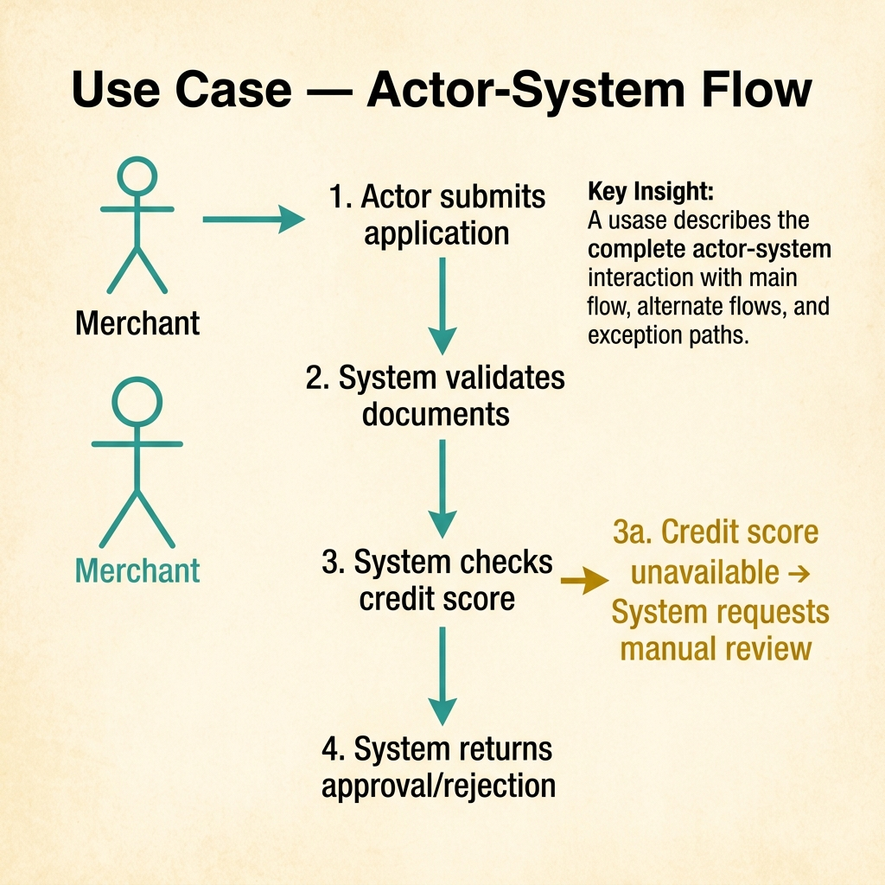
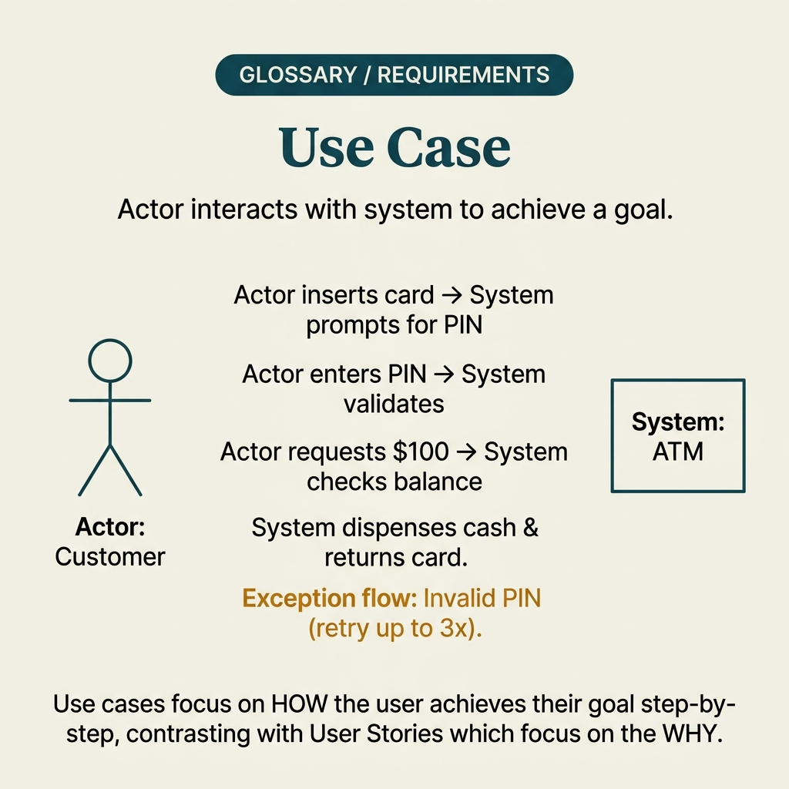

<!-- tags: glossary, reference, requirements-product, use-case -->
# Use Case

> A way to describe system functionality through actors, goals, and interaction flows, typically including main flow, alternate flow, and exception flow.

| Aspect | Detail |
| --- | --- |
| **Concept** | A way to describe system functionality through actors, goals, and interaction flows, typically including main flow, alternate flow, and exception flow. |
| **Audience** | BA, system analyst, architect, QA, developer |
| **Primary style** | Glossary term |
| **Entry point** | Use when the team has moved past backlog intent and needs to describe clearly how the actor interacts with the system flow by flow. |

📅 Created: 2026-04-05 · 🔄 Updated: 2026-04-17 · ⏱️ 11 min read

---

## 1. DEFINE

The team agrees "the user wants to reset their password," but at implementation time everyone asks different questions: does the system send OTP first or email first, what happens if the user enters the wrong code three times, can an admin reset on behalf? User story is no longer sufficient; the team now needs a **use case** to see the interaction as flows.

**Use Case** is a way to describe system functionality through **actor + goal + interaction flow**. It typically includes **main flow**, **alternate flow**, and **exception flow**, making it useful when software engineering needs to see clearly how the system reacts at each step.

| Variant | Description |
| --- | --- |
| Brief use case | Summarizes actor, goal, and main steps only. |
| Fully dressed use case | Includes preconditions, postconditions, main flow, alternate flow, and exception flow. |
| System use case | Focuses on actor interaction with the system boundary, without going deep into UI layout. |

| Approach | Time | Space | When to choose |
| --- | --- | --- | --- |
| Brief flow | O(steps) | O(1) | When interaction is not yet too complex but already beyond user story. |
| Fully dressed | O(main + alternate paths) | O(flow set) | When many branches and business rules matter. |
| Use-case pack | Per actor/goals count | O(pack) | When you need coverage for many interactions in the same domain. |

Core insight:

> Use case is strong because it illuminates the flow between actor and system. It is not a short backlog phrase like user story, nor a detailed implementation spec like FRS/SRS.

### 1.1 Invariants & Failure Modes

A useful use case must keep actor, goal, and flow consistent. The most common failure mode is a use case with only a beautiful main flow, while alternate and exception paths vanish at exactly the points where the system is most likely to fail.

---

## 2. CONTEXT

**Who uses it**: BA, system analyst, architect, QA, developer

**When**: Use when the team has moved past backlog intent and needs to describe clearly how the actor interacts with the system flow by flow.

**Purpose**: Use case illuminates the flow between actor and system. Not a short backlog phrase like user story, nor a detailed implementation spec like FRS/SRS.

**In the ecosystem**:
- Use a use case when the interaction flow and exception paths are the parts that most need clarification.
- If the goal is only to lock user need and value, **User Story** is lighter.
- If the goal is a detailed behavior contract for the delivery chain, **FRS** usually goes further than a use case.

---

Actor interacting with the system is clear. But how does use case differ from user story, what abstraction level, and include/extend relationships?

## 3. EXAMPLES

Use case surfaces most clearly when system boundaries are unclear and the team over-builds features, when use case diagrams have 50 ovals but nobody understands the flow, or when include/extend relationships create spaghetti diagrams. The examples below place the pattern into exactly those situations.

### Example 1: Basic — Write a brief use case for a main interaction

```text
  Brief use case:

  ┌─ Reset password by OTP ────────────────────┐
  │                                             │
  │  Primary actor: Registered user             │
  │  Goal: Regain account access                │
  │                                             │
  │  Main flow:                                 │
  │    1. User enters email or phone number     │
  │    2. System sends OTP                      │
  │    3. User enters valid OTP                 │
  │    4. System allows setting new password    │
  │                                             │
  │  With just actor and main flow clear, the   │
  │  team escapes the blind zone of "everyone   │
  │  probably understands the same thing."      │
  └─────────────────────────────────────────────┘
```

*Figure: With just actor and main flow clear, the team escapes the blind zone of "everyone probably understands the same thing." Use case pulls discussion toward actual interaction instead of feature names.*

```yaml
use_case:
  name: "Reset password by OTP"
  primary_actor: "Registered user"
  goal: "Regain account access"
  main_flow:
    - "User enters email or phone number"
    - "System sends OTP"
    - "User enters valid OTP"
    - "System allows setting new password"
```



*Figure: A use case describes the complete actor-system interaction with main flow, alternate flows, and exception paths. The merchant submits → system validates → system returns result, with branching for edge cases.*

**Why?** With just actor and main flow clear, the team already escapes the blind zone of "everyone probably understands the same thing." Use case pulls discussion toward actual interaction instead of feature names.

**Conclusion**: At the basic level, use case works as the backbone of flow conversation.

### Example 2: Intermediate — Add alternate and exception flows

```text
  Alternate and exception flows:

  ┌─ Alternate flows ─────────────────────────┐
  │                                             │
  │  OTP entered wrong:                         │
  │    → system shows remaining attempts        │
  │                                             │
  │  OTP expired:                               │
  │    → system allows resend                   │
  └─────────────────────────────────────────────┘

  ┌─ Exception flows ─────────────────────────┐
  │                                             │
  │  Account is locked:                         │
  │    → block reset, guide user to support     │
  └─────────────────────────────────────────────┘

  Most delivery arguments do not live in the
  main flow. They live in alternate and
  exception paths. Use case surfaces them
  early before code invents behavior per dev.
```

*Figure: Most delivery arguments do not live in the main flow — they live in alternate and exception paths. Use case surfaces them early, before code invents behavior differently per developer.*

```yaml
use_case:
  name: "Reset password by OTP"
  alternate_flows:
    - condition: "OTP entered wrong"
      system_response: "Show remaining attempts"
    - condition: "OTP expired"
      system_response: "Allow resend"
  exception_flows:
    - condition: "Account is locked"
      system_response: "Block reset and guide to support"
```

**Why?** Most delivery arguments do not live in the main flow — they live in alternate and exception paths. Use case surfaces them early, before code invents behavior differently per developer.

**Conclusion**: Alternate and exception flows are what make use cases genuinely valuable in software engineering.

### Example 3: Advanced — Use the use case as a bridge to FRS and test design

```text
  Use case traceability:

  ┌─ Cancel order after payment timeout ───────┐
  │                                             │
  │  Maps to:                                   │
  │    Functional requirements:                 │
  │      • FR-023                               │
  │      • FR-024                               │
  │    Test cases:                              │
  │      • TC-cancel-01                         │
  │      • TC-cancel-02                         │
  │    Adjacent scenarios:                      │
  │      • duplicate callback arrives late      │
  │                                             │
  │  Use case easily dies at the analysis       │
  │  layer if not linked onward to requirements │
  │  and tests. Traceability keeps the flow     │
  │  alive through implementation.              │
  └─────────────────────────────────────────────┘
```

*Figure: Use case easily dies at the analysis layer if not linked onward to requirements and tests. Traceability keeps the flow alive through implementation instead of being a "read to understand" document.*

```yaml
traceability:
  use_case: "Cancel order after payment timeout"
  maps_to:
    functional_requirements:
      - "FR-023"
      - "FR-024"
    test_cases:
      - "TC-cancel-01"
      - "TC-cancel-02"
    adjacent_scenarios:
      - "duplicate callback arrives late"
```

**Why?** Use case easily dies at the analysis layer if not linked onward to requirements and tests. Traceability keeps the flow alive through implementation instead of being just a "read to understand" document.

**Conclusion**: At the advanced level, use case is the soft transition from analysis to delivery artifacts.

---

## 4. COMPARE




*Figure: Position of use case among user story, scenario, and system requirements.*

### Level 1

```text
user need -> user story -> use case -> frs / srs
```

*Figure: Level 1 shows use case as the formalized interaction layer, after user story but before heavier system contract documents.*

### Level 2

```text
Artifact         Primary answer
--------------   -----------------------------------------------
Scenario         Which situation is being discussed
User Story       Who wants what and why
Use Case         Which flow does the actor follow with the system
FRS              What must the system do, clearly enough to implement/test
```

*Figure: Level 2 helps the team not force use case to do the job of scenario, story, or FRS.*

### Easily confused or boundary-slipping

| # | Severity | Mistake | Consequence | Fix |
| --- | --- | --- | --- | --- |
| 1 | 🔴 Fatal | Only writing the main flow | Error paths explode at code/test time | Add alternate and exception flows. |
| 2 | 🟡 Common | Using use case for detailed UI or DB schema | Document loses boundary clarity | Keep focus on actor-system interaction. |
| 3 | 🟡 Common | Confusing use case with user story | Backlog item becomes too heavy, or use case too short | Separate intent from formal flow. |
| 4 | 🔵 Minor | Not tracing use case to requirements/tests | Document struggles to survive past delivery | Attach ID and basic test coverage. |

### Quick scan

| If you face | Action |
| --- | --- |
| Story has clear intent but flow is still vague | Write a use case. |
| Team only sees the happy path | Add alternate and exception flows. |
| Flows exist but cannot proceed to delivery | Trace to FRS and test cases. |

---

## 5. REF

| Resource | Type | Link | Note |
| --- | --- | --- | --- |
| IIBA BABOK - Use Cases and Scenarios | Standard | https://www.iiba.org/knowledgehub/business-analysis-body-of-knowledge-babok-guide/10-techniques/10-47-use-cases-and-scenarios/ | Foundation for actor, goal, primary flow, and alternative flow. |
| Alistair Cockburn - User Stories, Use Cases, Story Maps | Reference | https://alistaircockburn.com/User-stories-use-cases-story-maps | Helps lock boundary between story, scenario, and use case. |
| IIBA Scenarios - Describe User System Interactions | Reference | https://www.iiba.org/knowledgehub/scenarios/describe-user-system-interactions/ | Practical examples at the actor-system interaction layer. |

---

## 6. RECOMMEND

When use case has illuminated the interaction flow, the next step should be chosen based on whether you need to deepen requirements or go back to lighter context discussion.

| Expand to | When | Reason | File/Link |
| --- | --- | --- | --- |
| Scenario | When the team is still debating context, not yet locking flow | Scenario is lighter and opens discussion faster. | [Scenario](./Scenario.md) |
| FRS | When flow is clear and you now need a behavior contract for delivery | FRS is the more formal step to implement/test. | [FRS](./FRS.md) |
| SRS | When requirements touch system interfaces and constraints | Time for a broader system-level document. | [SRS](./SRS.md) |
