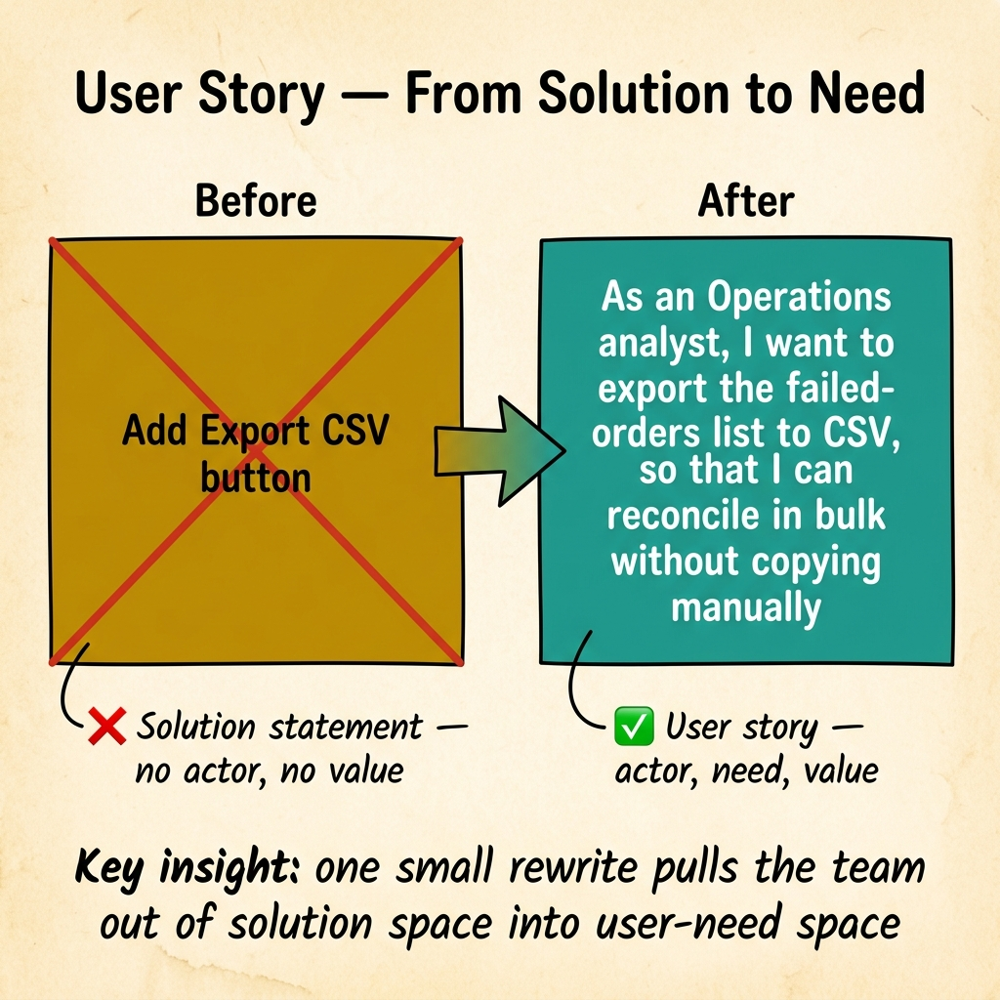
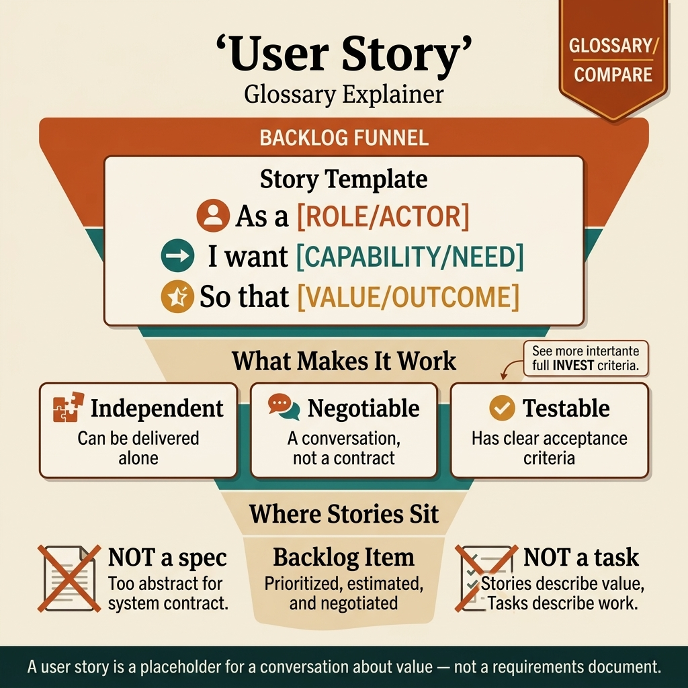

<!-- tags: glossary, reference, requirements-product, user-story -->
# User Story

> A concise user need description in the form "As a..., I want..., so that..." so product, dev, and QA share the same understanding of a backlog item's purpose.

| Aspect | Detail |
| --- | --- |
| **Concept** | A concise user need description in the form "As a..., I want..., so that..." so product, dev, and QA share the same understanding of a backlog item's purpose. |
| **Audience** | Product manager, BA, scrum master, developer, QA |
| **Primary style** | Glossary term |
| **Entry point** | Use when a backlog item is described too vaguely and the team needs a short statement to lock user, need, and value received. |

📅 Created: 2026-04-05 · 🔄 Updated: 2026-04-17 · ⏱️ 10 min read

---

## 1. DEFINE

Backlog refinement is moving quickly: one person says "we need a filter," another says "just a UI tweak," QA asks "what is the user actually trying to do?" User story appears at exactly that moment to force the team back to the user, their need, and the value — before diving into screens or APIs.

**User Story** is a way to describe a need at a concise level, usually following the template **"As a ___, I want ___, so that ___."** It is not a complete specification; it is an anchor for conversation around user intent.

| Variant | Description |
| --- | --- |
| Canonical story | Uses the exact "As a / I want / so that" frame to lock actor, need, and value. |
| Story + acceptance criteria | Keeps the story short but adds pass/fail conditions right below. |
| Story card in story mapping | Uses the story as a small slice within a larger user journey. |

| Approach | Time | Space | When to choose |
| --- | --- | --- | --- |
| Story-first backlog grooming | O(1) per item | O(1) | When tickets are described by solution instead of need. |
| Story + criteria | Per rule count | O(1) | When dev and QA need clearer behavior but do not yet need FRS. |
| Story mapping | Per journey step count | O(journey) | When you need to group many stories by user flow. |

Core insight:

> User story is strong because it keeps the backlog speaking in user-need language. It becomes weak the moment it is forced to do the job of a use case, FRS, or UI spec.

### 1.1 Invariants & Failure Modes

A useful user story usually holds three invariants: clear actor, clear need, and clear value. The most common failure mode is writing stories in implementation language, making the backlog look agile but still not helping the team understand the user problem.

---

## 2. CONTEXT

**Who uses it**: Product manager, BA, scrum master, developer, QA

**When**: Use when a backlog item is described too vaguely and the team needs a short statement to lock user, need, and value received.

**Purpose**: User story is strong because it keeps the backlog in user-need language. It becomes weak when forced to do the job of use case, FRS, or UI spec.

**In the ecosystem**:
- User story answers "who needs what and why," not fully "how will the system handle it."
- If the team starts debating main flow, alternate flow, and exception paths, it is time to open a **Use Case** or **FRS**.
- If the story has become "As a user, I want a button," the backlog is slipping toward solution statements.

---

As a... I want... So that... is clear. But what if the story is too large, how do acceptance criteria work, and story vs task?

## 3. EXAMPLES

User story surfaces most clearly when "As a user, I want a good system" leaves nobody knowing what to build, when a story is too large to fit one sprint, or when acceptance criteria are vague and QA does not know pass vs fail. The examples below place the pattern into exactly those situations.

### Example 1: Basic — Write a user story that does not slip into solution language

```text
  From solution to user need:

  ┌─ Solution statement (slippery) ────────────┐
  │  "Need to add Export CSV button"            │
  │                                             │
  │  → Sounds like a task, not a need.          │
  │  → No actor, no value, no boundary.         │
  └─────────────────────────────────────────────┘

           ↓ rewrite as user story

  ┌─ User story (anchored) ────────────────────┐
  │  As an Operations analyst,                  │
  │  I want to export the failed-orders list    │
  │    to CSV,                                  │
  │  so that I can reconcile in bulk without    │
  │    copying manually.                        │
  │                                             │
  │  One small rewrite already pulls the team   │
  │  out of solution space. When actor and      │
  │  value are visible, everyone asks better    │
  │  questions about scope.                     │
  └─────────────────────────────────────────────┘
```

*Figure: One small rewrite already pulls the team out of solution space. When actor and value become visible, everyone starts asking better questions about scope.*

```yaml
user_story:
  as_a: "Operations analyst"
  i_want: "to export the failed-orders list to CSV"
  so_that: "I can reconcile in bulk without copying manually"
```



*Figure: One small rewrite transforms "Add Export CSV button" (solution, no actor, no value) into "As an Operations analyst, I want to export failed-orders to CSV, so that I can reconcile in bulk" (actor + need + value).*

**Why?** Just one small change in how the item is written pulls the entire team out of solution thinking. When actor and value are visible, everyone begins asking better questions about scope.

**Conclusion**: A good user story does not need to be long; it needs to illuminate user intent quickly enough to keep the backlog from going wrong from minute one.

### Example 2: Intermediate — Attach acceptance criteria so the story is usable for delivery

```text
  Story + acceptance criteria:

  ┌─ Story ────────────────────────────────────┐
  │  As an Operations analyst,                  │
  │  I want to export failed orders to CSV,     │
  │  so that I can reconcile in bulk.           │
  └─────────────────────────────────────────────┘

  ┌─ Acceptance criteria ──────────────────────┐
  │  ✅ Only export orders matching the         │
  │     current filter                          │
  │  ✅ File contains order_id, error_code,     │
  │     created_at                              │
  │  ✅ If rows exceed 50,000, system signals   │
  │     async export                            │
  │                                             │
  │  Story opens the right conversation.        │
  │  Acceptance criteria keep that conversation │
  │  from drifting into guesswork.              │
  └─────────────────────────────────────────────┘
```

*Figure: Story opens the right conversation; acceptance criteria keep that conversation from drifting into guesswork. This is the natural pivot point between backlog and testing.*

```yaml
story_card:
  story:
    as_a: "Operations analyst"
    i_want: "to export the failed-orders list to CSV"
    so_that: "reconcile in bulk faster"
  acceptance_criteria:
    - "Only export orders matching the current filter"
    - "File contains order_id, error_code, created_at"
    - "If rows exceed 50,000, system signals async export"
```

**Why?** Story opens the right conversation; acceptance criteria keep that conversation from drifting into guesswork. This is the natural pivot point between backlog and testing.

**Conclusion**: When product intent is clear, criteria are what keep the user story alive all the way to delivery instead of dying at refinement.

### Example 3: Advanced — Use user stories correctly within story mapping

```text
  Story mapping:

  ┌─ Activity: Checkout ───────────────────────┐
  │                                             │
  │  Steps in user journey:                     │
  │    1. Select products                       │
  │    2. Confirm cart                           │
  │    3. Pay                                   │
  │    4. Track order status                    │
  │                                             │
  │  Stories under this journey:                │
  │    • "As a buyer, I want to save my         │
  │       delivery address..."                  │
  │    • "As a buyer, I want to retry           │
  │       payment..."                           │
  │                                             │
  │  User story is strongest when it is a       │
  │  slice of a real journey. Standing alone    │
  │  too long, it easily becomes opaque or      │
  │  gets stuffed with detail that does not     │
  │  belong.                                    │
  └─────────────────────────────────────────────┘
```

*Figure: User story is strongest when it is a slice of a real journey. Standing alone too long, it easily becomes opaque or gets stuffed with detail that does not belong to it.*

```yaml
story_map:
  activity: "Checkout"
  steps:
    - "Select products"
    - "Confirm cart"
    - "Pay"
    - "Track order status"
  stories:
    - "As a buyer, I want to save my delivery address..."
    - "As a buyer, I want to retry payment..."
```

**Why?** User story is strongest when it is a slice of a real journey. Standing alone too long, it easily becomes opaque or gets stuffed with detail that does not belong.

**Conclusion**: At the advanced level, user story is a scope-cutting unit within a larger map of the user's journey.

---

## 4. COMPARE




*Figure: Position of user story among user need, richer context artifacts, and formal requirement contracts.*

### Level 1

```text
user problem -> user story -> acceptance criteria / deeper requirement -> implementation
```

*Figure: Level 1 shows user story as the entry to conversation, not the end of specification.*

### Level 2

```text
Artifact           Primary answer
-----------------  ------------------------------------------
User Story         Who needs what, and what is the value
Scenario           Which situation is being discussed
Use Case           Which flow does the actor follow with the system
FRS                What must the system do, clearly enough to implement/test
```

*Figure: Level 2 helps distinguish user story from scenario, use case, and FRS so the backlog is not assigned the wrong role.*

### Easily confused or boundary-slipping

| # | Severity | Mistake | Consequence | Fix |
| --- | --- | --- | --- | --- |
| 1 | 🔴 Fatal | Writing a story using solution instead of need | Team optimizes for UI/API, not sure it solves the actual pain | Rewrite with actor, need, and value. |
| 2 | 🟡 Common | Using user story as a full specification | Dev/QA still guess flow and error paths | Hand off to Use Case or FRS when needed. |
| 3 | 🟡 Common | Actor is too generic, like "user" for everything | Story loses prioritization power and boundary | Name the specific user type or business role. |
| 4 | 🔵 Minor | Not connecting story to a larger journey | Backlog becomes a disconnected list | Use story mapping or scenario grouping. |

### Quick scan

| If you face | Action |
| --- | --- |
| Ticket talks about screens or buttons too early | Rewrite as user story first. |
| Story sounds right but QA still cannot tell pass vs fail | Add acceptance criteria or open FRS. |
| Many disconnected stories but no visible user journey | Group using scenario or story map. |

---

## 5. REF

| Resource | Type | Link | Note |
| --- | --- | --- | --- |
| IIBA BABOK - User Stories | Standard | https://www.iiba.org/knowledgehub/business-analysis-body-of-knowledge-babok-guide/10-techniques/10-48-user-stories/ | Foundation technique for user stories in business analysis. |
| Atlassian - User Stories | Official | https://www.atlassian.com/agile/project-management/user-stories | Practical framework for backlog and delivery. |
| Agile Alliance - User Stories | Official | https://www.agilealliance.org/glossary/user-stories/ | Common boundary of user story in Agile. |

---

## 6. RECOMMEND

When user story has locked the right user intent, the next step is opening the correct adjacent artifact to avoid forcing one backlog sentence to do the job of the entire delivery chain.

| Expand to | When | Reason | File/Link |
| --- | --- | --- | --- |
| Scenario | When the team needs a concrete hypothetical situation to discuss flow or test | Scenario holds context for conversation better than a lone story. | [Scenario](./Scenario.md) |
| Use Case | When you need to describe actor, main flow, and alternate flow more clearly | Natural next step after story when interaction is complex. | [Use Case](./Use-Case.md) |
| FRS | When the team is ready to lock behavior contract for delivery | FRS separates from backlog to specify input/process/output clearly. | [FRS](./FRS.md) |
