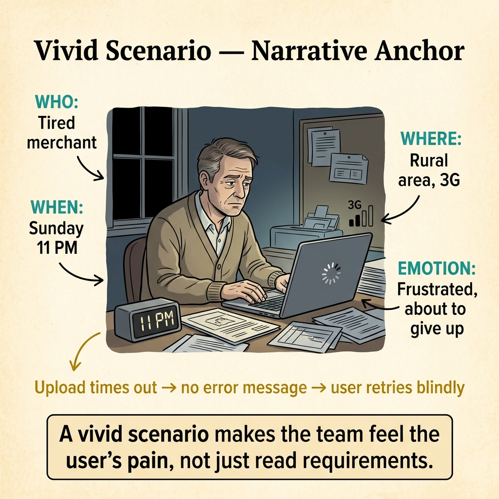
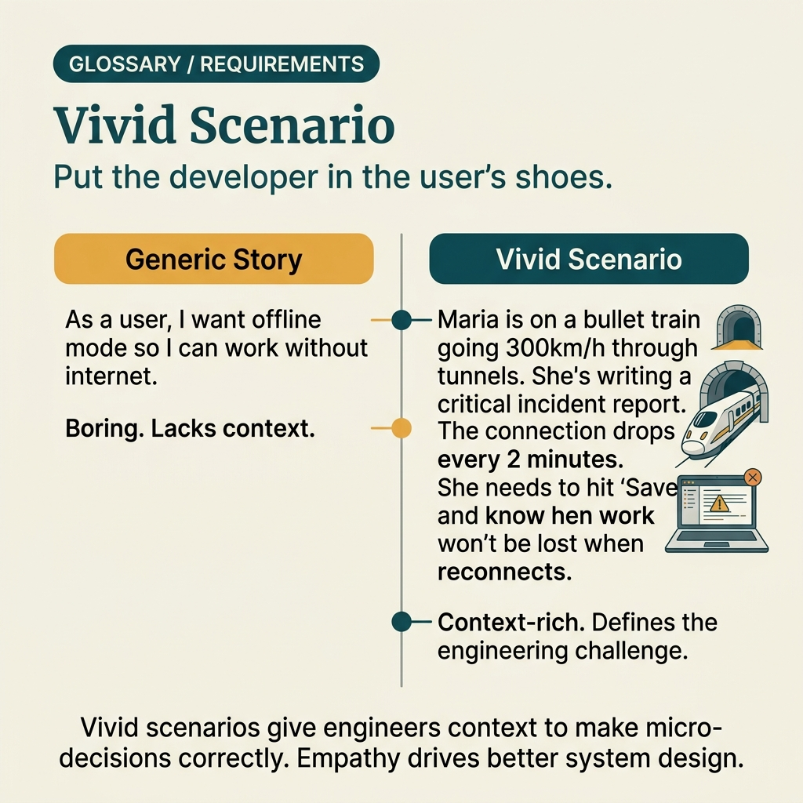

<!-- tags: glossary, reference, requirements-product, vivid-scenario -->
# Vivid Scenario

> A variant of scenario written more vividly, rich in sensory detail and circumstance so the reader sees "a moment unfolding" rather than just reading a summarized situation.

| Aspect | Detail |
| --- | --- |
| **Concept** | A variant of scenario written more vividly, rich in sensory detail and circumstance so the reader sees "a moment unfolding" rather than just reading a summarized situation. |
| **Audience** | UX writer, product designer, facilitator, trainer, technical doc writer |
| **Primary style** | Glossary term |
| **Entry point** | Use when the team needs to increase empathy, a sense of reality, and help the reader clearly picture the circumstance before making a decision. |

📅 Created: 2026-04-05 · 🔄 Updated: 2026-04-17 · ⏱️ 10 min read

---

## 1. DEFINE

You do not just want to say "user checks out on a weak network." You want the reader to actually see the scene: spinner on screen, phone battery low, user standing at the checkout counter unsure whether the order was created. That is when a **vivid scenario** has value — it pulls the reader from an abstract requirement into a moment rich with feeling.

**Vivid Scenario** is a scenario written or described very vividly, with many details about circumstance, feeling, time pressure, or the character's stakes. It is especially useful for **user stories, writing, UX design, training**, and exercises requiring high empathy.

| Variant | Description |
| --- | --- |
| UX empathy vignette | A short scene to help designers or writers feel the user's real friction. |
| Training vignette | A detail-rich simulation scene for learners to role-play and react. |
| Narrative opening | A vivid opening for an article or workshop that provides pull from the first sentence. |

| Approach | Time | Space | When to choose |
| --- | --- | --- | --- |
| 1-paragraph vivid opening | O(1) | O(1) | When you need to pull the reader into context very quickly. |
| Multi-moment vignette | Per beat count | O(scene) | When you need to show pressure building over time. |
| Empathy pack | Per persona count | O(pack) | When a workshop or training needs multiple perspectives. |

Core insight:

> Vivid scenario is not strong because it is "flowery." It is strong because it helps the reader feel the stakes, timing, and friction that a summarized scenario often fails to transmit.

### 1.1 Invariants & Failure Modes

A good vivid scenario must still keep context, actor, and tension clear. The biggest failure mode is adding too many decorative details that do not illuminate anything for design, testing, or training.

---

## 2. CONTEXT

**Who uses it**: UX writer, product designer, facilitator, trainer, technical doc writer

**When**: Use when the team needs to increase empathy, a sense of reality, and help the reader clearly picture the circumstance before making a decision.

**Purpose**: Vivid scenario helps the reader feel the stakes, timing, and friction that a summarized scenario often fails to transmit.

**In the ecosystem**:
- Vivid scenario is **a way of telling**, not a formal requirements format.
- It differs from use case in that it prioritizes feeling and circumstance over listing standardized flows.
- If written too much without serving a specific decision or insight, vivid scenario slips into beautiful but useless prose.

---

Vivid scenario is clear. But how does it differ from a regular scenario, when to use it, and who is it written for?

## 3. EXAMPLES

Vivid scenario surfaces most clearly when a dry requirement like "system must respond in 200ms" fails to convey urgency, when stakeholders need to feel the pain point before approving budget, or when the team needs a shared mental model of user context. The examples below place the pattern into exactly those situations.

### Example 1: Basic — Write an opening vivid enough to pull the reader into the right friction

```text
  Vivid opening:

  ┌─ Scene ────────────────────────────────────┐
  │  Actor: Mobile buyer                        │
  │  Place: standing at checkout counter,       │
  │         flaky network                       │
  │                                             │
  │  Tension:                                   │
  │    not sure if tapping again will create    │
  │    a duplicate order                        │
  │                                             │
  │  Purpose:                                   │
  │    clarify why idempotency and retry UX     │
  │    matter                                   │
  │                                             │
  │  When stakes appear in a concrete enough    │
  │  image, the reader understands faster why   │
  │  the term or design decision is worth       │
  │  discussing. That is the biggest payoff     │
  │  of vivid scenario in technical docs.       │
  └─────────────────────────────────────────────┘
```

*Figure: When stakes appear in a concrete enough image, the reader understands faster why the term or design decision is worth discussing. That is the biggest payoff of vivid scenario in technical docs.*

```yaml
vivid_opening:
  actor: "Mobile buyer"
  scene: "standing at checkout counter, flaky network"
  tension: "not sure if tapping again will create a duplicate order"
  purpose: "clarify why idempotency and retry UX matter"
```



*Figure: A vivid scenario makes the team feel the user's pain — a tired merchant on 3G at 11 PM, uploading KYC documents, hitting timeout with no error message. The same feature behaves differently when context is concrete.*

**Why?** When stakes appear in a concrete enough image, the reader understands faster why the term or design decision is worth discussing. That is the biggest payoff of vivid scenario in technical documentation.

**Conclusion**: A good vivid opening clarifies the problem, not the author's writing style.

### Example 2: Intermediate — Use vivid scenario for UX workshop or training

```text
  Training scene:

  ┌─ Persona ──────────────────────────────────┐
  │  New support agent on evening shift         │
  └─────────────────────────────────────────────┘

  ┌─ Moment ───────────────────────────────────┐
  │  Three similar tickets arrive within        │
  │  5 minutes                                  │
  └─────────────────────────────────────────────┘

  ┌─ Constraints ──────────────────────────────┐
  │  • doesn't remember the full runbook yet    │
  │  • customer is impatient                    │
  │  • dashboard shows stale error info         │
  └─────────────────────────────────────────────┘

  ┌─ Decision focus ───────────────────────────┐
  │  Which information must surface first?      │
  └─────────────────────────────────────────────┘

  Good design often emerges when the team
  feels the real pressure of the user or
  operator. Vivid scenario brings the workshop
  closer to that experience without needing
  a production replay.
```

*Figure: Good design often emerges when the team feels the real pressure of the user or operator. Vivid scenario brings the workshop closer to that experience without needing a production replay.*

```yaml
training_scene:
  persona: "New support agent on evening shift"
  moment: "three similar tickets arrive within 5 minutes"
  constraints:
    - "doesn't remember the full runbook yet"
    - "customer is impatient"
    - "dashboard shows stale error info"
  decision_focus: "which information must surface first?"
```

**Why?** Good design often emerges when the team feels the real pressure of the user or operator. Vivid scenario brings the workshop closer to that experience without needing a production replay.

**Conclusion**: At the intermediate level, vivid scenario is an empathy and alignment tool, not just a pretty opening paragraph.

### Example 3: Advanced — Use vivid scenario at the right dosage in technical docs

```text
  Doc rule for vivid scenes:

  ┌─ Required elements ────────────────────────┐
  │  • actor                                    │
  │  • tension                                  │
  │  • concrete moment                          │
  └─────────────────────────────────────────────┘

  ┌─ Must lead to ─────────────────────────────┐
  │  • concept boundary                         │
  │  • mechanism                                │
  │  • decision or trade-off                    │
  └─────────────────────────────────────────────┘

  ┌─ Anti-pattern ─────────────────────────────┐
  │  Opening is beautiful but does not lead     │
  │  to any insight.                            │
  └─────────────────────────────────────────────┘

  Vivid scenario only belongs in technical
  docs when it opens the right door for the
  explanation behind it. Otherwise it just
  adds length and dilutes reader trust.
```

*Figure: Vivid scenario only belongs in technical docs when it opens the right door for the explanation behind it. Otherwise it just adds length and dilutes reader trust.*

```yaml
doc_rule:
  vivid_scene:
    required:
      - actor
      - tension
      - concrete moment
    must_lead_to:
      - concept_boundary
      - mechanism
      - decision_or_tradeoff
  anti_pattern:
    - "opening is beautiful but does not lead to insight"
```

**Why?** Vivid scenario only belongs in technical docs when it opens the right door for the explanation behind it. Otherwise it just adds length and dilutes reader trust.

**Conclusion**: At the advanced level, vivid scenario is a purposeful opening beat, not a decorative layer for weak content.

---

## 4. COMPARE




*Figure: Position of vivid scenario among scenario, user story, and problem framing.*

### Level 1

```text
scenario -> add stakes, feeling, timing -> vivid scenario
```

*Figure: Level 1 shows vivid scenario is not a completely different concept, but a richer experiential level of writing within scenario.*

### Level 2

```text
Artifact type        Focus
------------------   -----------------------------------------------
Scenario             Lock a hypothetical situation
Vivid Scenario       Make the reader feel that situation
Use Case             Formalize actor and interaction flow
User Story           Compress user need into a backlog sentence
```

*Figure: Level 2 keeps vivid scenario at the right boundary: increase empathy, do not replace flow specs or backlog statements.*

### Easily confused or boundary-slipping

| # | Severity | Mistake | Consequence | Fix |
| --- | --- | --- | --- | --- |
| 1 | 🔴 Fatal | Writing vividly but not leading to any insight | Reader finds it pleasant but learns nothing | Force opening to connect immediately to concept or decision. |
| 2 | 🟡 Common | Confusing vivid scenario with use case | Workshop or doc misses formal flow when needed | Separate empathy artifact from interaction spec. |
| 3 | 🟡 Common | Using the same scene template for every article | Content starts smelling copy/paste immediately | Pull the specific tension of each topic to the front. |
| 4 | 🔵 Minor | Stuffing too many sensory details | Reading rhythm breaks, focus dilutes | Keep one scene, one main tension. |

### Quick scan

| If you face | Action |
| --- | --- |
| Technical opening is too dry, reader does not feel the stakes | Use vivid scenario. |
| Already have empathy but still missing clear flow | Switch to use case. |
| Scene is engaging but does not lead to any decision | Trim the prose, anchor back to a concept. |

---

## 5. REF

| Resource | Type | Link | Note |
| --- | --- | --- | --- |
| Interaction Design Foundation - Scenario-Based Design | Reference | https://www.interaction-design.org/literature/topics/scenario-based-design | Foundation for scenario used in design and UX. |
| Interaction Design Foundation - Storytelling | Reference | https://www.interaction-design.org/literature/topics/storytelling | Useful for understanding why vivid openings increase empathy and retention. |
| Alistair Cockburn - User Stories, Use Cases, Story Maps | Reference | https://alistaircockburn.com/User-stories-use-cases-story-maps | Helps keep boundary with scenario, use case, and backlog artifacts. |

---

## 6. RECOMMEND

Vivid scenario is most useful when it leads the reader to the right next artifact instead of trying to replace everything.

| Expand to | When | Reason | File/Link |
| --- | --- | --- | --- |
| Scenario | When you need to lower the vividness to keep conversation more concise | Scenario is broader and easier to use in quick planning. | [Scenario](./Scenario.md) |
| Use Case | When empathy is sufficient and you now need formal flow | Natural next step when the team prepares to implement. | [Use Case](./Use-Case.md) |
| PRD | When the scene is actually illuminating a larger product problem | PRD pulls from a single moment back to the overall problem statement. | [PRD](./PRD.md) |
