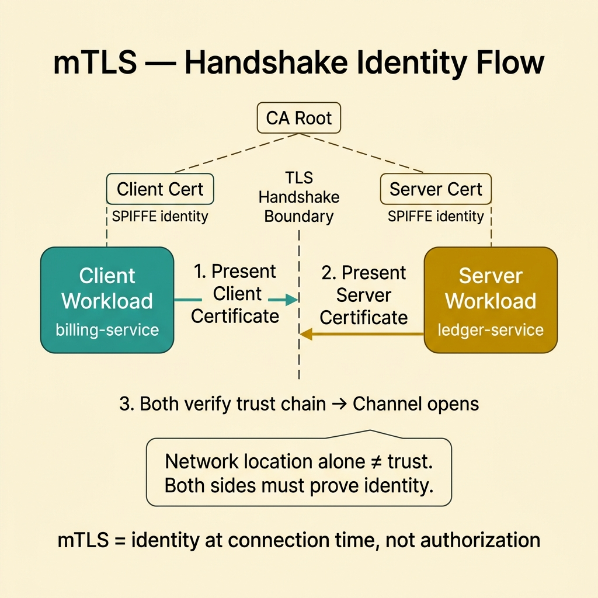
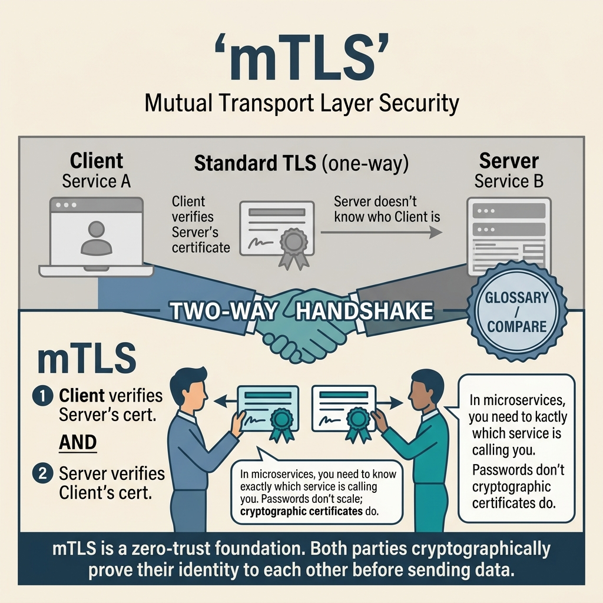

<!-- tags: glossary, reference, security-access-control, mtls -->
# mTLS

> Mutual TLS forces both client and server to present valid certificates, establishing identity at connection time rather than trusting network location.

| Aspect | Detail |
| --- | --- |
| **Concept** | Mutual TLS forces both client and server to present valid certificates, establishing identity at connection time rather than trusting network location. |
| **Audience** | Platform engineer, security engineer, backend engineer |
| **Primary style** | Glossary term |
| **Entry point** | Use when machine-to-machine authentication must happen at the network boundary instead of relying on subnet, cluster, or ingress path alone. |

📅 Created: 2026-03-30 · 🔄 Updated: 2026-04-11 · ⏱️ 8 min read

---

## 1. DEFINE

Picture this: you have already enabled TLS for east-west traffic, so packets cannot be read in transit. But a compromised workload can still call sensitive services if the system defaults to "internal means trusted." At this point, wire encryption is no longer the real question. The real question is: is the other side actually a workload that is allowed to open a channel here? That is the boundary of **mTLS**.

**mTLS** forces both client and server to prove identity via certificates during the TLS handshake. The channel opens only when both sides belong to a valid trust chain.

| Variant | Description |
| --- | --- |
| Service-to-service mTLS | Each workload has its own certificate and is authenticated bidirectionally. |
| Ingress mTLS | The gateway only accepts traffic from clients carrying a valid certificate. |
| Mesh-managed mTLS | A service mesh or control plane issues and rotates identity for workloads. |

| Approach | Time | Space | When to choose |
| --- | --- | --- | --- |
| Static cert deployment | O(handshake) | O(cert chain) | When the environment is small and rotation is infrequent. |
| SPIFFE/SPIRE identity | O(handshake + issuance) | O(identity metadata) | When workload identity needs discipline and automation. |
| Mesh-enforced mTLS | O(handshake + policy check) | O(sidecar/control-plane state) | When consistent policy across many services is required. |

Core insight:

> mTLS does not grant permissions. mTLS adds proof of identity at connection time.

### 1.1 Invariants & Failure Modes

Workload identity must have a clear source of truth, the trust chain must be distributed with discipline, and certificates must be rotated with overlap. The most common failure mode is enabling `require client cert` without a certificate lifecycle — leading to trust drift or outages when the chain changes.

---

## 2. CONTEXT

**Who uses it**: Platform engineer, security engineer, backend engineer

**When**: Use when machine-to-machine authentication must happen at the network boundary instead of relying on subnet, cluster, or ingress path alone.

**Purpose**: mTLS does not grant permissions. mTLS adds proof of identity at connection time.

**In the ecosystem**:
- mTLS differs from one-way TLS: not only does the server prove who it is, the client must do the same.
- mTLS differs from JWT or OAuth/OIDC: it solves identity at the connection layer, not at login or app authorization.
- A successful handshake does not mean the request can do anything it wants; RBAC/ABAC may still be needed after mTLS.

---

Both client and server verifying certificates — that much is clear. But how does certificate rotation work, what does mTLS look like inside a service mesh, and what is the performance overhead?

## 3. EXAMPLES

mTLS surfaces most clearly when zero-trust demands service-to-service authentication, when an expired certificate causes all service communication to fail, or when mTLS overhead adds 5ms per handshake. The examples below place the pattern in exactly those moments.

### Example 1: Basic — Drop the assumption that "same network means same team"

> **Goal**: Force callers to carry a clear machine identity before the service accepts a connection.
> **Approach**: Require a client certificate and map it to a workload identity.
> **Example**: `ledger` only accepts connections from `billing-service` within the production trust domain.
> **Complexity**: Basic



*Figure: Both sides present certificates during the TLS handshake. The channel opens only when trust chains validate bidirectionally — network location alone is never sufficient.*

```yaml
connection_policy:
  tls: required
  client_certificate: required
  accepted_identities:
    - spiffe://prod.internal/ns/billing/sa/billing-service
```

**Takeaway**: The basic level of mTLS is shifting trust from network location to workload identity.

### Example 2: Intermediate — Separate the identity channel from authorization

> **Goal**: Prevent teams from concluding "handshake passed, so any route is allowed."
> **Approach**: Use mTLS to authenticate the caller, then map the peer identity to an upper-layer policy.
> **Example**: `billing-service` is allowed `POST /ledger/entries` but denied `DELETE /ledger/*`.
> **Complexity**: Intermediate

```yaml
peer_identity_mapping:
  peer: spiffe://prod.internal/ns/billing/sa/billing-service
  allow:
    - POST /ledger/entries
  deny:
    - DELETE /ledger/*
```

> **Why?** mTLS only answers "who are you." Authorization answers "what can you do." Mixing both into cert management makes the policy coarse and hard to change.

**Takeaway**: At the intermediate level, mTLS is the identity substrate for policy — not the policy model itself.

### Example 3: Advanced — Operate certificates as a real lifecycle

> **Goal**: Prevent certificate rotation from becoming the next source of outages.
> **Approach**: Short-lived certs, overlapping trust bundle rollouts, and monitoring handshake failures.
> **Example**: The mesh rotates certs every 6 hours and rolls out CA bundles with an overlap window.
> **Complexity**: Advanced

```yaml
certificate_lifecycle:
  ttl: 6h
  rotate_before_expiry: 30m
  trust_bundle_rollout: overlap_window
  monitor:
    - handshake_failure_rate
    - peer_identity_mismatch
```

> **Why?** The most dangerous part of mTLS is operations: who issues certs, who rotates them, who distributes trust roots. If the lifecycle is weak, this control will cause outages before it stops any attacker.

**Takeaway**: At the advanced level, mTLS is only trustworthy when the certificate lifecycle is also trustworthy.

---

## 4. COMPARE




*Figure: mTLS positioned within the wire-layer trust question: who can open a channel, which trust chain backs it, and why a successful handshake never implies business-level authorization.*

If Zero Trust is the principle, then mTLS is a very specific identity-proving mechanism at connection time. The visual locks onto that exact point to avoid confusing mTLS with upper-layer policy authorization.

### Level 1

```text
client workload
  -> presents client certificate
  -> server checks trust chain
  -> server also presents its own certificate
  -> channel opens only when both sides are valid
```

*Figure: Level 1 shows identity is established during the handshake — before app code handles any request.*

### Level 2

```text
need machine identity on the wire?
  -> yes => mTLS
after channel opens
  -> app/gateway still needs to evaluate permissions
```

*Figure: Level 2 reminds that mTLS locks who can open the channel — business policy still lives at the upper layer.*

### Easy to confuse or cross the boundary

| # | Severity | Mistake | Consequence | Fix |
| --- | --- | --- | --- | --- |
| 1 | 🔴 Fatal | Trusting private network as sufficient and skipping mutual auth | Unknown workloads can still open internal connections | Require client cert on sensitive paths |
| 2 | 🟡 Common | Using mTLS as a substitute for authorization | Policy is too coarse, cannot express specific actions | Separate peer identity from RBAC/ABAC |
| 3 | 🟡 Common | Rotating certs manually without overlap | Mass handshake failures when the chain changes | Automate issuance and trust bundle rollout |
| 4 | 🔵 Minor | Not including peer identity in log/trace | Audit and caller investigation become vague | Attach workload identity to telemetry |

### Quick scan

| If you encounter | What to do |
| --- | --- |
| Need machine identity at connection time | Think mTLS |
| Handshake passed but still need detailed permissions | Add upper-layer policy |
| Worried about cert rotation causing outages | Design the lifecycle before rollout |

---

## 5. REF

| Resource | Type | Link | Notes |
| --- | --- | --- | --- |
| SPIFFE / SPIRE Docs | Official | https://spiffe.io/docs/latest/spiffe-about/overview/ | Foundation for workload identity and automation |
| NIST SP 800-207 | Official | https://csrc.nist.gov/pubs/sp/800/207/final | Places mTLS in the context of zero-trust architecture |
| OWASP TLS Cheat Sheet | Reference | https://cheatsheetseries.owasp.org/cheatsheets/Transport_Layer_Security_Cheat_Sheet.html | Practical checklist for TLS and client auth |

---

## 6. RECOMMEND

After locking down mTLS, the next question is usually: what broader philosophy does this trust sit within, and what logic grants permissions after the handshake?

| Expand to | When | Why | File/Link |
| --- | --- | --- | --- |
| Zero Trust | When you want to place mTLS within the broader "inside is no longer sufficient" principle | mTLS is a primitive; Zero Trust is the principle | [Zero Trust](./02-zero-trust.md) |
| RBAC | When peer identity exists but structured app-layer policy is needed | Permissions do not emerge from a handshake | [RBAC](./03-rbac.md) |
| Topic hub | When you need to return to the cluster map | Keep the big picture of trust and access | [Security & Access Control](./README.md) |

Back to that expired certificate at the beginning — all service communication failed. Now you know: auto-rotation (cert-manager), short-lived certs, and a service mesh handling mTLS transparently. Infrastructure manages certificates; the app manages business logic.

**Links**: [← Previous](./README.md) · [→ Next](./02-zero-trust.md)
