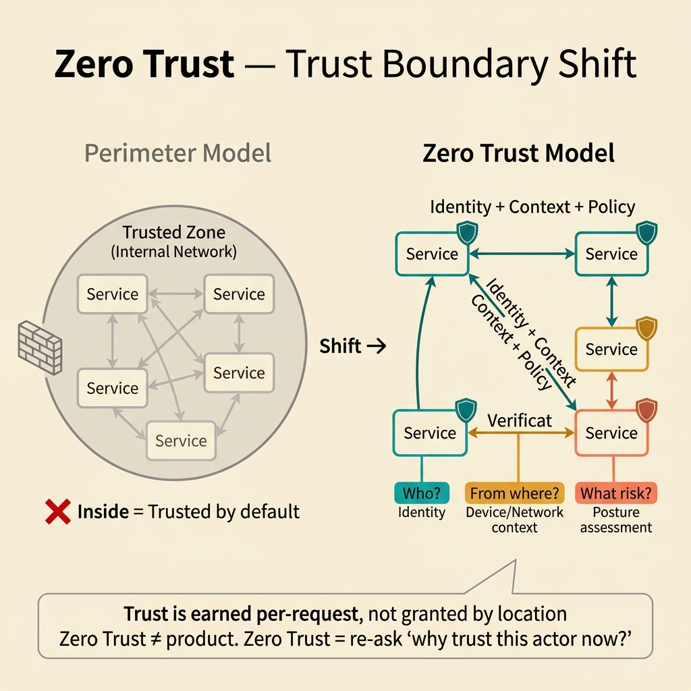
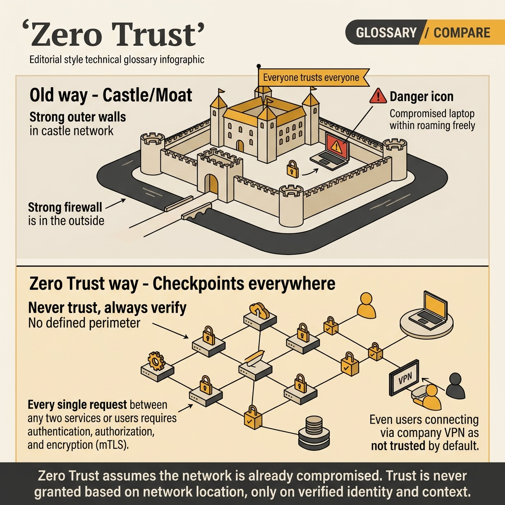

<!-- tags: glossary, reference, security-access-control, zero-trust -->
# Zero Trust

> A security design principle where no actor, device, network zone, or workload is trusted by default just because it is "inside."

| Aspect | Detail |
| --- | --- |
| **Concept** | A security design principle where no actor, device, network zone, or workload is trusted by default just because it is "inside." |
| **Audience** | Security engineer, platform engineer, architect |
| **Primary style** | Glossary term |
| **Entry point** | Use when the team needs a trust model that spans identity, network, device, and policy — instead of acquiring yet another perimeter tool. |

📅 Created: 2026-03-30 · 🔄 Updated: 2026-04-11 · ⏱️ 8 min read

---

## 1. DEFINE

Picture this: the VPN is running, the firewall is full of rules, and everything sounds "internal." Then a laptop gets compromised or a workload is hijacked, and from that inside foothold the attacker moves laterally across the system with ease. That moment exposes an old assumption: inside means safe. **Zero Trust** begins by cutting that assumption entirely.

**Zero Trust** is a security design principle where every access must be proven and evaluated against current context, rather than being allowed simply because the actor is inside a trusted zone.

| Variant | Description |
| --- | --- |
| Network-centric zero trust | Reduces the role of network location in access decisions. |
| Identity-centric zero trust | Identity and posture become the primary inputs for access. |
| Continuous verification | Trust is granted conditionally and can be revoked when context changes. |

| Approach | Time | Space | When to choose |
| --- | --- | --- | --- |
| Per-request verification | O(policy eval/request) | O(context state) | When access paths are sensitive and current context matters. |
| Device and identity posture | O(identity + posture checks) | O(posture metadata) | When user/device is the primary actor. |
| Service-to-service trust minimization | O(connection + policy checks) | O(identity graph) | When the system is microservices or a large mesh. |

Core insight:

> Zero Trust is not a product. It is a way of re-asking the question: why is this actor being trusted right now?

### 1.1 Invariants & Failure Modes

Access decisions must be based on current evidence, must be re-evaluable, and blast radius must be limited. The most common failure mode is rebranding a perimeter model as zero trust while still allowing inside traffic to be trusted by default.

---

## 2. CONTEXT

**Who uses it**: Security engineer, platform engineer, architect

**When**: Use when the team needs a trust model that spans identity, network, device, and policy — instead of acquiring yet another perimeter tool.

**Purpose**: Zero Trust is not a product. It is a way of re-asking the question: why is this actor being trusted right now?

**In the ecosystem**:
- Zero Trust differs from mTLS: mTLS is a technical primitive that can be used to implement part of this philosophy.
- Zero Trust does not eliminate firewalls or network segmentation; it simply refuses to treat them as sufficient proof.
- Zero Trust applies to both user access and service-to-service — not just employee login.

---

Never trust, always verify — that much is clear. But how do you implement zero trust, what is the overhead, and what does zero trust look like in microservices?

## 3. EXAMPLES

Zero trust surfaces most clearly when an internal service is compromised due to the "trusted network" fallacy, when lateral movement after a breach goes unchecked because internal traffic is not verified, or when a team enables mTLS but skips authorization. The examples below place the pattern in exactly those moments.

### Example 1: Basic — Drop the default that inside = safe

> **Goal**: Do not let network position be the sole evidence for access.
> **Approach**: Every sensitive entry point must require identity and a policy check.
> **Example**: An internal admin API still requires strong identity and explicit authorization.
> **Complexity**: Basic



*Figure: Zero Trust removes the implicit trust granted by network location. Every request must carry evidence — identity, device posture, context — regardless of where it originates.*

```yaml
access_gate:
  trust_private_network_alone: false
  require_identity: true
  require_policy_check: true
```

**Takeaway**: The basic level of Zero Trust is dropping the assumption that zone equals trust.

### Example 2: Intermediate — Bring context into access decisions

> **Goal**: Do not let the same identity always have the same trust level in every context.
> **Approach**: Combine identity, device posture, network context, and resource sensitivity.
> **Example**: The same employee can read a dashboard but is blocked from exporting when the device is non-compliant.
> **Complexity**: Intermediate

```yaml
policy_context:
  identity: analyst@corp
  device_posture: non_compliant
  action: export_sensitive_report
  decision: deny_or_step_up
```

> **Why?** Access based solely on username/role misses half the problem: the risk of the current context. Zero Trust adds a context layer to the decision instead of compressing it into a single static rule.

**Takeaway**: At the intermediate level, Zero Trust is context-aware access — not just stronger authentication.

### Example 3: Advanced — Treat trust as a continuous control loop

> **Goal**: Do not let a single successful login create overly long permissions for an actor whose risk state has changed.
> **Approach**: Re-evaluate when posture changes, when privilege escalation is requested, or when network context is anomalous.
> **Example**: A session is still valid but gets revoked because the device just lost compliance.
> **Complexity**: Advanced

```yaml
continuous_verification:
  recheck_on:
    - device_posture_change
    - privilege_escalation_request
    - suspicious_network_context
  action_if_risk_high:
    - step_up_auth
    - revoke_session
```

> **Why?** Risk moves over time. If trust does not move with it, zero trust becomes just a new name for an old login.

**Takeaway**: At the advanced level, Zero Trust is a continuous control loop over access.

---

## 4. COMPARE




*Figure: Zero Trust positioned correctly: revoking the privilege of "being trusted by default," distinguishing from a perimeter rebrand, and showing when context must actually change the access decision.*

Zero Trust does not start with any specific technology. The visual pulls focus to the right trust model: inside is no longer evidence, and current context must be strong enough to influence allow, deny, or step-up.

### Level 1

```text
request comes in
  -> verify identity
  -> evaluate current context
  -> grant the minimum access necessary
```

*Figure: Level 1 shows trust is granted after evidence — not granted beforehand with a check later.*

### Level 2

```text
actor is inside the network?
  -> must still prove identity
context changes?
  -> trust can be reduced, stepped up, or revoked
```

*Figure: Level 2 reminds that trust in zero trust is a temporary state — not a one-time reward for the whole day.*

### Easy to confuse or cross the boundary

| # | Severity | Mistake | Consequence | Fix |
| --- | --- | --- | --- | --- |
| 1 | 🔴 Fatal | Calling the old perimeter model zero trust without changing access logic | False sense of security; blast radius remains wide | Enforce identity and policy checks at critical entry points |
| 2 | 🟡 Common | Applying zero trust only to users, ignoring service-to-service | East-west traffic is still blindly trusted | Extend the principle to workload identity |
| 3 | 🟡 Common | Collecting context but not letting it affect the actual decision | Policy is complex but useless | Tie context directly to allow, deny, or step-up |
| 4 | 🔵 Minor | Describing zero trust as a tool | Team buys a product but does not change the model | Clearly state which trust assumptions need to be removed |

### Quick scan

| If you encounter | What to do |
| --- | --- |
| Someone says the internal network is safe enough | Think Zero Trust |
| Identity is valid but context has worsened | Re-evaluate access |
| Want to deploy a specific primitive | Check mTLS, RBAC/ABAC, and token semantics |

---

## 5. REF

| Resource | Type | Link | Notes |
| --- | --- | --- | --- |
| NIST SP 800-207 | Official | https://csrc.nist.gov/pubs/sp/800/207/final | The standard reference for zero-trust architecture |
| Google BeyondCorp | Reference | https://cloud.google.com/beyondcorp | The well-known case study for access models not based on perimeters |
| OWASP Zero Trust Architecture Cheat Sheet | Reference | https://cheatsheetseries.owasp.org/cheatsheets/Zero_Trust_Architecture_Cheat_Sheet.html | Practical checklist |

---

## 6. RECOMMEND

After accepting that "inside" is no longer sufficient evidence, the next step is deciding which techniques will prove identity and grant permissions.

| Expand to | When | Why | File/Link |
| --- | --- | --- | --- |
| mTLS | When machine identity for service-to-service is needed | This is the most concrete trust primitive | [mTLS](./01-mtls.md) |
| RBAC | When baseline authorization needs to be attached to an authenticated actor | Zero Trust requires a concrete policy model | [RBAC](./03-rbac.md) |
| Topic hub | When you need to return to the overall taxonomy | Keep the big picture of the cluster | [Security & Access Control](./README.md) |

Back to that lateral movement at the beginning — one service breached, free movement because "internal is trusted." Now you know: verify every request, encrypt every channel, authorize every action. Zero trust is not a product — it is an architecture principle.

**Links**: [← Previous](./01-mtls.md) · [→ Next](./03-rbac.md)
